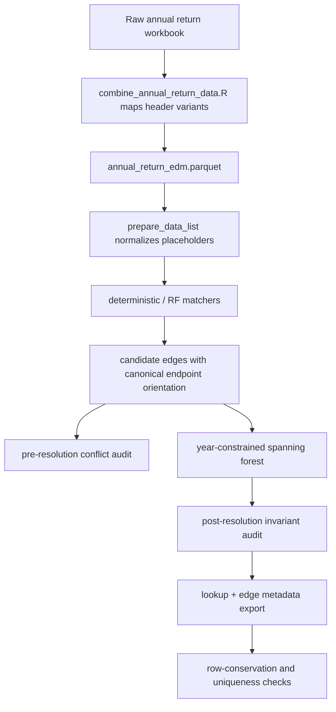

# fix: Resolve annual return lookup review findings

## Summary

This plan fixes the remaining annual-return lookup review findings by cleaning placeholder identifiers before deterministic matching, restoring a missing 2021 header mapping, hardening conflict-audit exports, preserving edge-resolution provenance, and adding invariant checks around lookup construction. It also refreshes the generated annual-return outputs so the on-disk lookup and audit files match the corrected code.

---

## Problem Frame

`scripts/R/03_data_enrichment/create_annual_return_lookup.R` now has the core year-constrained spanning-forest logic needed to avoid same-year component conflicts, but the surrounding data-quality and audit contracts are still leaky. Deterministic matching can treat placeholder strings as real identifiers, upstream 2021 data loses a valid WaSC site-name column, audit files can go stale across runs, and exported edge metadata omits the columns needed to explain why an edge survived resolution.

The work should preserve the existing canonical Annual-Return Lookup contract: every Annual-Return Site appears exactly once in its reporting-year column, no reporting-year ID is duplicated in the final lookup, and any ambiguous Record-Linkage Component is either resolved by the constrained forest or surfaced through audit outputs.

---

## Requirements

**Input Cleaning**

- R1. Deterministic and RF matching must see the same normalized identifier fields, with placeholder values such as `TBC` and `N/A` treated as missing rather than matchable strings.
- R2. The 2021 Annual Return EDM combiner must map both observed WaSC site-name header variants into `site_name_wa_sc`.

**Audit and Provenance**

- R3. Conflict-audit outputs on disk must reflect the current run, including conflict-free runs.
- R4. A post-resolution conflict failure must write or clear post-resolution diagnostics that correspond to the failing post-resolution graph.
- R5. The exported edge metadata must retain the fields that determine edge priority and resolution order.
- R6. Edge endpoint labels and audit reconciliation must be interpretable: `from`/`year_from` should follow a documented convention, and redundant cycle-closing edges should be accounted for.

**Lookup Invariants**

- R7. Lookup construction helpers must derive the active years from their inputs when called with partial `data_list` objects.
- R8. The final lookup refresh must assert row conservation and uniqueness for every reporting year before export.
- R9. Generated outputs and documentation must be refreshed so downstream readers see the corrected schema, audit files, and lookup data.

---

## Key Technical Decisions

- KTD1. **Clean placeholders in shared preparation rather than per matcher:** `prepare_data_list()` is the common boundary before deterministic and RF matching, so normalization belongs there. RF-specific cleaners should either call the same helper or be removed when redundant.
- KTD2. **Overwrite empty audit artifacts instead of deleting them:** stable zero-row parquet files and empty Excel sheets keep the output contract discoverable while preventing stale nonzero diagnostics from surviving clean runs.
- KTD3. **Use distinct post-resolution audit paths:** pre-resolution conflict audit files should continue to describe the unconstrained diagnostic graph; post-resolution safety failures need separate `_post_resolution_` outputs so diagnostics are not confused.
- KTD4. **Canonicalize edge orientation at edge construction:** edge labels should not depend on match dataframe column order. Building `from` from the earlier reporting year and `to` from the later reporting year keeps final and audit edge tables readable without changing graph connectivity.
- KTD5. **Treat generated data refresh as part of the fix:** code changes alone leave the project in a confusing state if `data/processed/annual_return_edm.parquet`, lookup outputs, or conflict-audit files still reflect the old pipeline.

---

## High-Level Technical Design

---

## Issue Resolution Matrix

| Issue | Proposed Solution | Verification |
|---|---|---|
| Placeholder strings match as real identifiers | Add a shared placeholder-normalization helper and apply it in `prepare_data_list()` to all evidence fields before any matcher sees the data. Reuse the helper in RF paths or remove now-redundant RF-only cleaning. | Unit tests show `TBC`, `N/A`, whitespace variants, and lowercase variants become `NA` in prepared yearly data. A deterministic matching fixture with only placeholder evidence must produce no edge. Full refreshed outputs should not contain placeholder-driven match evidence. |
| 2021 `site_name_wa_sc` header variant is unmapped | Add `"site_name_wa_sc_operational_name_optional" = "site_name_wa_sc"` to the combiner mapping. | A combiner contract test using the 2021 workbook or a synthetic header fixture maps both variants to `site_name_wa_sc`. Reprocessed 2021 data should recover the 2,577 nonmissing values from the affected DCWW, Severn Trent, and United Utilities sheets. |
| Conflict-audit files go stale after a clean run | Make `export_conflict_audit()` always write all configured audit outputs, using empty-schema tables when the summary has zero rows. | A conflict-free audit fixture first writes nonzero files, then writes a zero-row audit and confirms all parquet sheets are zero-row with the expected schema. The Excel output should be overwritten with empty sheets rather than left stale. |
| Post-resolution stop message points at stale diagnostics | Add post-resolution audit paths and export the post-resolution audit before calling the final stop, including zero-row clearing on successful runs. Update the stop message to name the matching audit label. | A synthetic post-resolution conflict fixture writes `_post_resolution_` files and the stop message references them. A normal full lookup run clears or leaves absent stale post-resolution conflict files and logs zero post-resolution conflicts. |
| Final edge parquet drops resolution provenance | Include `edge_priority`, `evidence_field_count`, `field_priority_score`, and `resolution_order` in `annual_return_lookup_edges.parquet` and in `empty_edge_metadata()`. | Edge schema tests confirm final nonempty and empty exports have the provenance columns. Refreshed final edges should have nonmissing `resolution_order` and values matching the kept-edge audit for surviving edges. |
| Empty edge schema and public edge schemas disagree | Set one public schema for final, conflict, kept, and dropped edge tables; make empty tables conform to that schema instead of inheriting ad hoc internal types. | Schema tests compare zero-row and nonzero tables for column names and endpoint types. Arrow can read freshly written empty and nonempty audit tables without schema surprises. |
| `first(site_id)` still looks like unsafe collapse | Replace the summarise collapse with a helper or assertion that there is exactly one site ID per `(component, year)` after the post-resolution audit. | A direct unit test passes valid one-site component-years and fails on duplicate same-year memberships. The full lookup still has zero duplicated yearly IDs. |
| `build_annual_identifier_lookup()` indexes missing years | Derive years from `names(data_list)` as `append_singleton_sites()` does, and fail clearly when names do not follow `dfYYYY`. | A partial `data_list` fixture with only 2021-2022 returns those years without indexing missing 2023-2024 elements. A malformed name fixture produces a clear validation error. |
| Edge endpoint labels are reversed | Canonicalize endpoints by reporting year when constructing edges so `year_from` is earlier than `year_to`; document that convention. | Tests cover both windfall and RF-shaped match dataframes where site columns arrive in later-year-first order. Refreshed final edges should satisfy `year_from < year_to` for all cross-year edges. |
| Cycle-closing edges are skipped silently | Record `root_from == root_to` edges in the dropped-edge audit with `drop_reason = "redundant_within_component"` and no duplicate years. | A graph fixture with a redundant cycle edge reports one redundant dropped edge. Candidate edge count reconciles to kept plus duplicate-year dropped plus redundant dropped edges. |
| Matching-level comment is stale | Update the comment above matching-level generation to describe evidence-field count and priority-score ordering. | Static review confirms the comment describes the current sort keys. No behavioral test is needed. |
| Row conservation and uniqueness safeguards are missing | Add final assertions after singleton append and canonical ID assignment, before export. | A full refreshed lookup verifies each yearly nonmissing count equals that year's input row count and each `site_id_<year>` has no duplicates. Synthetic duplicate or missing-row fixtures fail before export. |
| Documentation and todo bookkeeping are stale | Update the annual-return solution note, enrichment output inventory, and archived todo metadata so they describe current defaults and generated audit files. | Documentation review confirms production default is `year_constrained_forest`, fail-closed behavior is labeled as `fail` mode only, and the conflict-audit output list includes current pre- and post-resolution artifacts. |

---

## Implementation Units

### U1. Normalize Placeholder Identifiers Before Matching

- **Goal:** Ensure placeholder identifiers cannot create deterministic or RF matches.
- **Requirements:** R1.
- **Dependencies:** None.
- **Files:** `scripts/R/03_data_enrichment/create_annual_return_lookup.R`; `scripts/R/testing/test_annual_return_lookup_contracts.R`.
- **Approach:** Add a small helper for Annual Return EDM identifier normalization and call it from `prepare_data_list()` after selecting the canonical identifier columns. The helper should trim and case-normalize string values before replacing known placeholders with `NA`. RF preparation should reuse the same helper or drop duplicate placeholder-cleaning logic once the prepared data is already normalized.
- **Patterns to follow:** Existing tidyverse-style helpers in `create_annual_return_lookup.R`; project test style in `scripts/R/testing/test_edm_api_pipeline_contracts.R`.
- **Test scenarios:** Prepare a temporary annual-return parquet with `TBC`, `N/A`, ` tbc `, and ordinary identifiers across evidence fields; expect only placeholders to become `NA`. Run deterministic matching on two rows where the only shared evidence is `TBC`; expect no 1:1 match. Run an RF-shaped preparation fixture and verify the same normalized values are used.
- **Verification:** Prepared yearly data has zero literal placeholder values in `CONFIG$evidence_field_priority`; deterministic match outputs contain no edge whose non-water-company evidence is only a placeholder; existing full-run lookup invariants still pass.

### U2. Restore the 2021 WaSC Site-Name Header Mapping

- **Goal:** Recover 2021 `site_name_wa_sc` values lost because one observed header variant is unmapped.
- **Requirements:** R2, R9.
- **Dependencies:** None.
- **Files:** `scripts/R/02_data_cleaning/combine_annual_return_data.R`; `scripts/R/testing/test_combine_annual_return_data_contracts.R`; `data/processed/annual_return_edm.parquet`; `data/processed/annual_return_edm.rds`.
- **Approach:** Extend `CONFIG$column_name_mapping` with `site_name_wa_sc_operational_name_optional = site_name_wa_sc`. Add coverage that exercises both 2021 variants through `clean_data()` rather than only checking column names after import.
- **Patterns to follow:** The existing variant mappings for `activity_reference`, spill-hour fields, and other annual-return header variants in the combiner.
- **Test scenarios:** Use a synthetic tibble with `site_name_wa_sc_operational_optional` and expect the canonical column to be populated. Use a synthetic tibble with `site_name_wa_sc_operational_name_optional` and expect the same canonical column. Run a workbook-level characterization check on the 2021 annual return and confirm the three affected sheets contribute their nonmissing WaSC names.
- **Verification:** Reprocessed `annual_return_edm.parquet` shows the recovered 2021 `site_name_wa_sc` values from DCWW, Severn Trent, and United Utilities. The processed-row count remains unchanged for each year.

### U3. Make Conflict-Audit Exports Idempotent

- **Goal:** Prevent stale conflict diagnostics from surviving when a later run has no conflicts.
- **Requirements:** R3.
- **Dependencies:** None.
- **Files:** `scripts/R/03_data_enrichment/create_annual_return_lookup.R`; `scripts/R/testing/test_annual_return_lookup_contracts.R`; `data/processed/annual_return_lookup_conflict_summary.parquet`; `data/processed/annual_return_lookup_conflict_records.parquet`; `data/processed/annual_return_lookup_conflict_edges.parquet`; `data/processed/annual_return_lookup_resolution_kept_edges.parquet`; `data/processed/annual_return_lookup_resolution_dropped_edges.parquet`; `data/processed/annual_return_lookup_conflicts.xlsx`.
- **Approach:** Change `export_conflict_audit()` so the zero-summary path writes all configured outputs with empty schemas. Keep the return value useful by distinguishing nonzero audit writes from zero-row clearing through logs rather than by skipping file writes.
- **Patterns to follow:** `build_lookup_conflict_audit()` already constructs empty summary, records, and edge tables; reuse those schemas rather than hand-building a second schema in the exporter.
- **Test scenarios:** Write a nonzero conflict audit to temporary paths, then export a zero-row audit to the same paths and confirm every parquet file is overwritten with zero rows. Export a zero-row audit when no previous files exist and confirm all expected files are created. Confirm the Excel workbook is replaced with empty sheets for all audit tabs.
- **Verification:** A conflict-free run cannot leave older nonzero conflict files beside a fresh lookup. File modification times and row counts reflect the latest run.

### U4. Add Post-Resolution Diagnostic Outputs

- **Goal:** Make the final conflict safety net diagnostically honest if the constrained forest invariant is broken in the future.
- **Requirements:** R4.
- **Dependencies:** U3.
- **Files:** `scripts/R/03_data_enrichment/create_annual_return_lookup.R`; `scripts/R/testing/test_annual_return_lookup_contracts.R`; `data/processed/annual_return_lookup_post_resolution_conflict_summary.parquet`; `data/processed/annual_return_lookup_post_resolution_conflict_records.parquet`; `data/processed/annual_return_lookup_post_resolution_conflict_edges.parquet`; `data/processed/annual_return_lookup_post_resolution_kept_edges.parquet`; `data/processed/annual_return_lookup_post_resolution_dropped_edges.parquet`; `data/processed/annual_return_lookup_post_resolution_conflicts.xlsx`.
- **Approach:** Add a post-resolution audit path set in `CONFIG` or through a helper that derives paths from the existing audit names. Build the post-resolution audit with the constrained forest membership, final edge metadata, and the kept/dropped resolution tables. Export it before the final `stop_if_lookup_conflicts()` call and update the stop message to identify whether the failing audit is pre- or post-resolution.
- **Patterns to follow:** The pre-resolution audit flow in `build_lookup_from_matches()` and the solution note in `docs/solutions/logic-errors/annual-return-lookup-same-year-component-conflicts.md`.
- **Test scenarios:** Construct a post-resolution conflict audit fixture with duplicate same-year membership and confirm distinct post-resolution files are written. Construct a normal zero-conflict post-resolution audit and confirm post-resolution files are zero-row or cleared. Confirm the stop message references the post-resolution files only for post-resolution failures.
- **Verification:** Normal full lookup runs report zero post-resolution conflicts and do not leave stale nonzero post-resolution diagnostics. Artificial post-resolution failures produce useful diagnostic files.

### U5. Preserve Edge Resolution Provenance

- **Goal:** Make the final edge export explain why each surviving edge won.
- **Requirements:** R5, R6.
- **Dependencies:** U3.
- **Files:** `scripts/R/03_data_enrichment/create_annual_return_lookup.R`; `scripts/R/testing/test_annual_return_lookup_contracts.R`; `data/processed/annual_return_lookup_edges.parquet`; `data/processed/annual_return_lookup.xlsx`.
- **Approach:** Expand `empty_edge_metadata()` and the constrained kept-edge select to include `n_keys`, `evidence_field_count`, `field_priority_score`, `raw_score`, `edge_priority`, and `resolution_order`. At minimum the four reviewed columns must be present; keeping `n_keys` and `raw_score` alongside them makes the scoring chain auditable.
- **Patterns to follow:** The existing kept-edge audit table already carries these fields; the final edge export should be a stable subset of that richer table, not a separate lossy schema.
- **Test scenarios:** Build a small match graph where two candidate edges compete and confirm the surviving final edge carries the priority and resolution fields. Build an empty edge result and confirm the zero-row schema has the same provenance columns. Compare final edges to kept-edge audit rows on endpoints and resolution order.
- **Verification:** Refreshed `annual_return_lookup_edges.parquet` includes the provenance columns, and nonempty rows have populated `resolution_order`, `edge_priority`, `evidence_field_count`, and `field_priority_score`.

### U6. Standardize Edge Schemas, Orientation, and Redundant-Edge Accounting

- **Goal:** Make all edge-related outputs readable and internally reconcilable.
- **Requirements:** R6.
- **Dependencies:** U5.
- **Files:** `scripts/R/03_data_enrichment/create_annual_return_lookup.R`; `scripts/R/testing/test_annual_return_lookup_contracts.R`; all annual-return lookup edge and conflict-edge parquet outputs under `data/processed/`.
- **Approach:** Decide one public endpoint type convention for edge outputs and enforce it for final, conflict, kept, dropped, empty, and nonempty tables. Canonicalize `from`/`to` when building edge rows so `from` is the earlier reporting year and `to` is the later reporting year. Track `root_from == root_to` cycle edges in the dropped-edge audit with `drop_reason = "redundant_within_component"` and `duplicate_years = NA`.
- **Patterns to follow:** The constrained forest already orders candidate edges deterministically; keep that ordering intact and adjust only endpoint presentation and audit capture.
- **Test scenarios:** Feed a windfall-shaped match dataframe with later-year site ID first and confirm the edge output uses earlier-year `from`. Feed an RF-shaped match dataframe with the same reversed column order and expect the same convention. Use a triangle/cycle fixture and confirm kept plus dropped edge counts reconcile to total candidate edges by drop reason. Check zero-row and nonzero edge tables share the same public schema.
- **Verification:** Refreshed final edge outputs satisfy `year_from < year_to` for all cross-year edges. Dropped-edge audits include both `duplicate_year_component` and `redundant_within_component` where applicable, and candidate-edge reconciliation is possible from exported tables.

### U7. Strengthen Lookup Invariants and Helper Contracts

- **Goal:** Make the lookup collapse and helper functions fail clearly when their invariants are violated.
- **Requirements:** R7, R8.
- **Dependencies:** U1, U5.
- **Files:** `scripts/R/03_data_enrichment/create_annual_return_lookup.R`; `scripts/R/testing/test_annual_return_lookup_contracts.R`.
- **Approach:** Derive years in `build_annual_identifier_lookup()` from `names(data_list)` and validate the `dfYYYY` naming contract. Replace or wrap `summarise(site_id = first(site_id))` with an assertion that each `(component, year)` has exactly one site ID after the post-resolution audit. Add final row-conservation and uniqueness assertions after singleton appending and canonical site ID assignment, before exports.
- **Patterns to follow:** `append_singleton_sites()` already derives years from `data_list`; mirror that behavior and add explicit validation where missing names would otherwise produce cryptic errors.
- **Test scenarios:** Call `build_annual_identifier_lookup()` with only `df2021` and `df2022`; expect a two-year result. Call it with malformed names and expect a clear error. Pass a valid constrained membership table through the lookup collapse and expect success. Pass duplicate same-year membership and expect a failure before pivoting. Build a final lookup fixture missing one annual-return ID and expect row-conservation failure; build one with a duplicated yearly ID and expect uniqueness failure.
- **Verification:** Full refreshed lookup has per-year nonmissing counts equal to the processed annual-return input row counts and zero duplicate yearly IDs. Partial helper tests no longer fail by indexing absent years.

### U8. Update Comments and Documentation

- **Goal:** Keep source comments, solution notes, README inventory, and todo state aligned with the corrected behavior.
- **Requirements:** R6, R9.
- **Dependencies:** U3, U4, U5, U6, U7.
- **Files:** `scripts/R/03_data_enrichment/create_annual_return_lookup.R`; `README.md`; `docs/solutions/logic-errors/annual-return-lookup-same-year-component-conflicts.md`; `todos/_archive/008-pending-p1-fix-annual-return-lookup-rf-and-conflict-bugs.md`; `todos/010-pending-p2-fix-annual-return-lookup-review-findings.md`.
- **Approach:** Update the matching-level comment to describe evidence-field count and field-priority ordering. Update the solution note to state that production defaults to `year_constrained_forest` and that fail-closed behavior is only used in `fail` mode. Add the audit outputs to the enrichment-layer output inventory following the README convention. Correct archived todo 008 so items that were never previously applied are not recorded as done without qualification, and update todo 010 when the work is complete.
- **Patterns to follow:** `docs/solutions/best-practices/data-enrichment-readme-standardisation-20260310.md` for output inventory discipline.
- **Test scenarios:** Test expectation: none for prose-only documentation edits, beyond review of rendered markdown and consistency with generated file names.
- **Verification:** Documentation names the current pre-resolution and post-resolution audit outputs, describes the default conflict-resolution mode correctly, and no longer implies unapplied fixes were already done.

### U9. Refresh Generated Annual-Return Outputs

- **Goal:** Regenerate processed data and lookup artifacts so files under `data/processed/` match the fixed code.
- **Requirements:** R1, R2, R3, R4, R5, R6, R8, R9.
- **Dependencies:** U1, U2, U3, U4, U5, U6, U7.
- **Files:** `data/processed/annual_return_edm.parquet`; `data/processed/annual_return_edm.rds`; `data/processed/annual_return_lookup.parquet`; `data/processed/annual_return_lookup.xlsx`; `data/processed/annual_return_lookup_edges.parquet`; `data/processed/annual_return_lookup_conflict_summary.parquet`; `data/processed/annual_return_lookup_conflict_records.parquet`; `data/processed/annual_return_lookup_conflict_edges.parquet`; `data/processed/annual_return_lookup_resolution_kept_edges.parquet`; `data/processed/annual_return_lookup_resolution_dropped_edges.parquet`; `data/processed/annual_return_lookup_conflicts.xlsx`; post-resolution audit outputs added in U4.
- **Approach:** Re-run the annual-return combiner before the lookup builder so the restored 2021 header mapping feeds matching. Then rebuild the annual-return lookup with default `year_constrained_forest` resolution and RF disabled unless explicitly needed for a separate follow-up.
- **Patterns to follow:** Numeric pipeline order: `02_data_cleaning` outputs feed `03_data_enrichment` lookup construction; do not overwrite `data/raw`.
- **Test scenarios:** Treat this as integration verification rather than a unit test: the generated data should satisfy all final invariants and expected schema changes.
- **Verification:** The refreshed processed annual-return data has the recovered 2021 `site_name_wa_sc` values. The refreshed lookup has exact row conservation and zero duplicated yearly IDs. Final edges include provenance columns and chronological endpoint labels. Pre-resolution conflict files reflect the current run, and post-resolution conflict files are zero-row or absent according to the finalized export contract.

---

## Scope Boundaries

- The plan does not change the core year-constrained spanning-forest algorithm except to improve audit accounting and invariant checks.
- The plan does not enable RF matching by default; RF cleanup here is limited to sharing placeholder normalization if the optional path is used.
- The plan does not manually adjudicate ambiguous site identities. It preserves automatic deterministic resolution plus audit outputs.

### Deferred to Follow-Up Work

- Revisit whether sites that lose all edges during conflict resolution should be eligible for RF rescue. That changes the matching strategy beyond these review findings.
- Revisit `unique_id` comparability for 2025 data once the new annual return arrives.
- Consider a broader script bootstrap modernization for `create_annual_return_lookup.R` if future work touches package loading and logging style.

---

## Risks & Dependencies

- **Generated data churn:** Restoring 2021 WaSC names and cleaning placeholders can change deterministic edge sets and canonical site IDs. Mitigation: run the full row-conservation, uniqueness, edge-schema, and audit-row checks before accepting refreshed outputs.
- **Audit schema compatibility:** Downstream scripts may read the existing edge parquet with the current 10-column schema. Mitigation: search downstream consumers before finalizing the widened edge schema and document the added columns.
- **Post-resolution output naming:** New post-resolution files could clutter `data/processed/` if the naming convention is unclear. Mitigation: use a consistent `_post_resolution_` infix and list the files in documentation.
- **Excel export fragility:** Empty workbook sheets can behave differently across exporters. Mitigation: verify both parquet and Excel outputs in the zero-conflict audit fixture.

---

## Sources & Research

- `todos/010-pending-p2-fix-annual-return-lookup-review-findings.md` is the issue source for the P2/P3 fixes and acceptance criteria.
- `todos/_archive/008-pending-p1-fix-annual-return-lookup-rf-and-conflict-bugs.md` records the earlier review items that remained partially unapplied.
- `docs/solutions/logic-errors/annual-return-lookup-same-year-component-conflicts.md` documents the constrained-forest invariant and expected conflict-audit behavior.
- `CONCEPTS.md` defines Annual Return EDM, Annual-Return Site, Canonical Spill Site, Annual-Return Lookup, Record-Linkage Component, and Same-Year Component Conflict.
- `scripts/R/testing/test_edm_api_pipeline_contracts.R` provides the nearest local pattern for script-level R contract tests.
