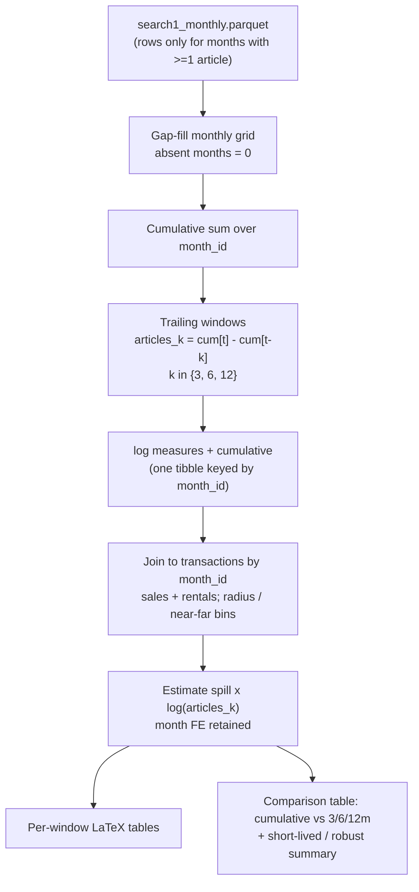

# feat: Windowed article-count salience measures for public-attention regressions

## Summary

Add trailing **3-, 6-, and 12-month** article-count measures of public attention alongside the existing cumulative measure, re-run the article-based public-attention price/rent specifications with them, and produce a side-by-side comparison so we can read whether the salience effect is short-lived (shrinks as the window shortens) or robust (holds across windows). The work is additive to `scripts/R/09_analysis/05_news/`: the existing cumulative and lag-4 scripts, their tables, and the upstream data pipeline are untouched.

---

## Problem Frame

The current public-attention regressions use **cumulative** LexisNexis article counts (`cumsum` from Jan 2021 to the transaction month), interacted with spill exposure. Cumulative coverage rises mechanically over time, so the interaction risks tracking a secular trend rather than contemporaneous salience, and evidence from other settings suggests salience effects fade. Windowed measures — coverage over the trailing 3/6/12 months — fluctuate instead of trending, letting us test whether capitalization responds to *recent* attention and compare against the cumulative result. This implements GitHub issue [#16](https://github.com/sticerd-eee/sewage/issues/16), minus the sales-lag item, which is deferred to a later, separate point.

The construction has one non-obvious wrinkle: the monthly article file stores **only months with at least one article** (`aggregate_monthly()` aggregates with `summarise(article_count = n())`), so absent months are genuine zeros. A trailing window must therefore be computed on a gap-filled calendar grid, not over stored rows. The data extends back to 1989, so trailing windows for early-2021 transactions can be fed from real pre-2021 coverage without dropping any transactions.

---

## Requirements

**Measure construction**

- R1. Construct trailing windowed article-count measures (3, 6, 12 months, inclusive of the transaction month) for every transaction month 1–36, built on a gap-filled complete monthly grid (absent months = 0 articles) and fed by the pre-2021 series so no transaction is dropped for want of window history.
- R2. Expose the windowed measures and their logs alongside the existing cumulative measure from a single shared loader in the news utilities, so the intensive- and extensive-margin scripts consume one definition.

**Specifications**

- R3. Re-run the article-based public-attention specifications — intensive margin and extensive margin, sales and rentals — substituting each windowed log-measure for the log-cumulative measure, retaining month fixed effects and the existing control/FE battery.

**Comparison and wiring**

- R4. Produce a comparison artifact placing the spill×salience interaction coefficient side by side across the cumulative and 3/6/12-month measures for the preferred specifications (sales and rentals), with a concise summary of whether the effect shrinks toward shorter windows or holds.
- R5. Leave the existing cumulative and lag-4 scripts, their tables, and the upstream pipeline unchanged, and wire the new scripts into `scripts/R/09_analysis/run_all_analysis.sh`.

---

## Key Technical Decisions

- KTD1. **Gap-fill the monthly grid before windowing.** `aggregate_monthly()` writes one row per month with ≥1 article, so absent months are zero-coverage, not missing data. Build a complete `month_id` grid spanning `1 - max(WINDOWS)` to `36` and fill absent months with `article_count = 0`. A row-based rolling window would otherwise span the wrong calendar months wherever a month is absent (e.g. Dec 2020 / `month_id = 0` is absent in the source).
- KTD2. **Feed trailing windows from the pre-2021 series.** `month_id` runs back to 1989, so each transaction month 1–36 gets a complete trailing window from real coverage and none are dropped — unlike `did_articles_lag4_prior.R`, which excludes the first months of 2021. The grid only needs to reach back `max(WINDOWS)` months before month 1.
- KTD3. **Trailing window inclusive of the transaction month**, `articles_k[t] = Σ article_count over [t−k+1, t]`, matching the cumulative measure's "up to the transaction month" convention. Compute as a cumulative-sum difference (`cum[t] − cum[t−k]`) on the ordered complete grid — dependency-free, no rolling-window package.
- KTD4. **Retain month fixed effects only; add no extra time FE.** The article series varies only by calendar month, so its level is absorbed by month FE and only the spill×salience interaction is identified — identical to the existing cumulative spec. This resolves the issue's "additional time fixed effects" item: none beyond the month FE already in place.
- KTD5. **One parametrised script swept over windows.** Mirror the radius loop in `did_articles_prior.R`: a `WINDOWS <- c(3L, 6L, 12L)` config vector driving `purrr::walk`, with each output filename, LaTeX label, and note stamped with the window. Hold the radius at the headline 250m (configurable), following the established config-vector convention in `docs/solutions/design-patterns/parameterize-analysis-scripts-over-a-config-vector.md`.
- KTD6. **Log-transform the windowed counts with plain `log(articles_k)` — no `+1` offset.** Verified safe: over the transaction months (`month_id` 1–36) the smallest trailing window is the 3-month window in Feb 2021 (= 3 articles), so every window is ≥ 3 and `log` is finite for every transaction — no rows are dropped and no offset is needed. The zero-coverage months only occur in 2020 and earlier, which feed the early windows but never collapse a full window to zero. The existing `is.finite` guard is retained as a defensive no-op, matching the cumulative scripts.

---

## High-Level Technical Design

The construction and estimation flow, from the raw monthly file to the comparison output:

The shared loader produces E once (KTD1–KTD3); intensive and extensive scripts each take it from F onward, selecting the measure column for the window being swept.

---

## Implementation Units

### U1. Windowed article-count construction helper

- **Goal:** Add a shared loader that returns the cumulative measure and the trailing 3/6/12-month measures (counts and logs) in one tibble keyed by `month_id`, built on a gap-filled grid.
- **Requirements:** R1, R2
- **Dependencies:** none
- **Files:**
  - `scripts/R/09_analysis/05_news/extensive_margin_news_utils.R` (add `load_windowed_articles_data()` plus internal grid/window helpers; leave `load_articles_data()` untouched for backward compatibility)
  - `scripts/R/testing/test_windowed_articles.R` (new validation script)
- **Approach:** Read the full parquet (no `month_id >= 1` filter). Build a complete `month_id` grid from `1 - max(windows)` to `end_month_id` (default 36) with `tidyr::complete()` (or a `seq()` left-join), filling absent `article_count` with 0. Arrange by `month_id`, take `cum <- cumsum(article_count)`, and for each window `k` set `articles_k <- cum - dplyr::lag(cum, k)` and `log_articles_k <- log(articles_k)`. Also recompute `cumulative_articles` / `log_cumulative_articles` over months 1–36 so the comparison (U4) can read every measure from one object. Return rows for `month_id` 1–36. Express the validation in `scripts/R/testing/test_windowed_articles.R` as base-R `stopifnot()` / `cat()` checks run via `Rscript` — there is no `testthat` harness under `scripts/R/`, so match the plain-script style used elsewhere in the pipeline.
- **Patterns to follow:** the roxygen-commented helper style and `.data$`-pronoun dplyr already in `extensive_margin_news_utils.R` (`load_articles_data()`).
- **Test scenarios** (in `scripts/R/testing/test_windowed_articles.R`):
  - Covers R1. Grid completeness — after gap-fill, every `month_id` in `[1 - max(windows), 36]` is present exactly once, no gaps.
  - Covers R1. Zero-fill — `month_id = 0` (Dec 2020, absent in source) is present with `article_count = 0`.
  - Covers R1. Trailing-sum correctness against hand-computed values: `articles_3m` at `month_id = 1` equals 6 (months −1,0,1 = 4 + 0 + 2); `articles_3m` at `month_id = 3` equals 7 (months 1,2,3 = 2 + 1 + 4).
  - Nested-window monotonicity — for every transaction month, `articles_12m >= articles_6m >= articles_3m`.
  - Covers R1. Log finiteness — `log_articles_k` is finite for all `month_id` 1–36 (no `-Inf`).
  - Backward compatibility — `load_articles_data()` output for months 1–36 is byte-for-byte unchanged (cumulative columns identical).
- **Verification:** the validation script runs clean and all checks pass; `load_windowed_articles_data()` returns 36 rows with the expected columns.

### U2. Intensive-margin windowed specification script

- **Goal:** Re-run the intensive-margin article specs (`did_articles_prior.R`'s model battery) with the windowed measure, swept over `WINDOWS`, one table per window.
- **Requirements:** R3
- **Dependencies:** U1
- **Files:** `scripts/R/09_analysis/05_news/did_articles_windowed_prior.R` (new)
- **Approach:** Copy the structure of `did_articles_prior.R`. Replace the inline cumulative computation with `load_windowed_articles_data()`. Set `WINDOWS <- c(3L, 6L, 12L)` and `RAD <- 250L` (single headline radius; keep it a top-of-file constant so the radius set is a one-line edit). Wrap the per-window body in `run_for_window(WIN)` and drive with `purrr::walk`. Inside, select `log_articles_<WIN>m` as the salience variable, build the same sales and rentals model battery (no-FE, MSOA+month, LSOA+month, with/without property controls) via `fixest::feols`, retaining `month_id` fixed effects; construct the formula so the swept measure name is interpolated (e.g. `fixest::xpd` or `as.formula(paste(...))`). Stamp `WIN` into the output filename (`did_articles_windowed_prior_<WIN>m.tex`), the LaTeX `\label{}`, the caption, and the note prose. Reuse the existing tabularray patching (`[H]`, `colsep`, `X[c]` auto-fit) or `patch_modelsummary_latex()` from the utils.
- **Patterns to follow:** `did_articles_prior.R` (model battery, panels, table export); `parameterize-analysis-scripts-over-a-config-vector.md` (config vector + `walk` + value-stamped outputs, invariant prep hoisted out of the loop).
- **Test scenarios:**
  - Covers R3. One table per window is written with a window-stamped filename and `\label{}`; running all three windows does not clobber.
  - Coefficient labels, caption, and notes name the correct window (e.g. "log 6-month article count") — prose matches the swept value.
  - Model battery matches `did_articles_prior.R`: same FE/control structure with month FE retained, for both sales and rentals panels.
  - Sample-size parity — at a given window and 250m, the estimation N within the transaction period equals the cumulative spec's N (windows are positive, so no rows drop relative to cumulative).
  - Smoke — the script runs end-to-end under `Rscript`, exits 0, and writes the expected `.tex` files.
- **Verification:** three windowed tables exist under `output/tables/` with correct window-stamped labels and notes; coefficients are finite and SEs present.

### U3. Extensive-margin windowed specification script

- **Goal:** Apply the windowed measure to the extensive-margin (near-vs-far) article specs, mirroring `did_articles_prior_extensive.R`.
- **Requirements:** R3
- **Dependencies:** U1
- **Files:** `scripts/R/09_analysis/05_news/did_articles_windowed_prior_extensive.R` (new)
- **Approach:** Copy `did_articles_prior_extensive.R`. Swap `load_articles_data()` for `load_windowed_articles_data()` and select the windowed log-measure in the `near_bin` interaction (`near_bin:log_articles_<WIN>m`). Sweep `WINDOWS` the same way as U2, preserving the existing `CONFIG` comparison-band machinery, `validate_comparison_config()`, `build_extensive_margin_sample()`, month FE, and `patch_modelsummary_latex()`. Stamp the window into outputs.
- **Patterns to follow:** `did_articles_prior_extensive.R`; the U2 windowed-sweep structure (keep the two scripts parallel).
- **Test scenarios:**
  - Covers R3. One extensive table per window, window-stamped, no clobbering.
  - Comparison-band config (`near`/`far` bins) and labels are preserved unchanged from the cumulative extensive script.
  - `near_bin × log_articles_k` interaction is present with month FE retained, sales and rentals.
  - Smoke — runs end-to-end under `Rscript`, exits 0.
- **Verification:** windowed extensive tables exist with correct band labels and window-stamped `\label{}`s.

### U4. Windowed-vs-cumulative comparison table and summary

- **Goal:** Tabulate the spill×salience interaction across {cumulative, 3m, 6m, 12m} for the preferred specs and print a short read on whether the effect is short-lived or robust.
- **Requirements:** R4
- **Dependencies:** U1, U2
- **Files:** `scripts/R/09_analysis/05_news/did_articles_windowed_prior.R` (post-loop comparison section, mirroring the cross-radius robustness step at the end of `did_articles_prior.R`)
- **Approach:** After the window sweep, estimate the preferred specification (property controls + MSOA and LSOA + month FE) at 250m for each measure column — `log_cumulative_articles`, `log_articles_3m`, `log_articles_6m`, `log_articles_12m` — for sales and rentals, holding the sample fixed across measures. Collect the interaction coefficient, SE, and stars into one table with a column per measure. Note that the four measures produce four *different* interaction term names (`spill_count_daily_avg:log_cumulative_articles`, `:log_articles_3m`, `:log_articles_6m`, `:log_articles_12m`), so `write_radius_robustness_table()`'s single shared `coef_map` would populate only the cumulative column and blank the windowed ones; rename each model's interaction coefficient to a common label (e.g. `spill_x_salience`) before tabulating, or write a measure-parametrised sibling that accepts a per-model coefficient name. Emit a `cat()` summary printing the interaction estimate and significance per measure and a one-line read: a coefficient that shrinks/loses significance toward shorter windows reads as short-lived; one stable across windows reads as robust.
- **Patterns to follow:** the cross-radius robustness summary block and `write_radius_robustness_table()` call at the end of `did_articles_prior.R`.
- **Test scenarios:**
  - Covers R4. The comparison table has one column per measure {cumulative, 3m, 6m, 12m} for sales and rentals preferred specs; each cell carries the interaction estimate with SE and stars.
  - Consistency — the cumulative column reproduces the 250m interaction coefficient from `did_articles_prior.R` (same sample, same spec).
  - The console summary prints one line per measure plus the short-lived/robust read.
- **Verification:** `did_articles_windowed_prior_comparison.tex` is written and the console summary prints the per-window interaction pattern.

### U5. Wire new scripts into the run-all harness

- **Goal:** Register the new windowed scripts in the controlled run order.
- **Requirements:** R5
- **Dependencies:** U2, U3
- **Files:** `scripts/R/09_analysis/run_all_analysis.sh`
- **Approach:** Add `did_articles_windowed_prior.R` and `did_articles_windowed_prior_extensive.R` to the `05_news` block of `SCRIPT_LIST`, after their cumulative counterparts.
- **Patterns to follow:** the existing `# 05_news` list entries.
- **Test expectation: none — wiring only.** Verify via `scripts/R/09_analysis/run_all_analysis.sh --dry-run` that both new scripts appear in the printed run order.
- **Verification:** dry-run lists the two new scripts under `05_news`; a full run reaches them without "Missing script" errors.

---

## Scope Boundaries

**In scope**
- Windowed (3/6/12-month) article-count measure construction with gap-filled grid (R1, R2).
- Re-running the article-based intensive- and extensive-margin specs with the windowed measures, month FE retained (R3).
- Windowed-vs-cumulative comparison table and short-lived/robust summary (R4); run-all wiring (R5).

**Deferred to follow-up work**
- Lags of the public-attention measure for sales outcomes — a separate issue point to tackle later (a 4-month-lag cumulative version already exists in `did_articles_lag4_prior.R`).
- Windowed measures for the Google Trends specifications (`did_trends_*`) — issue #16 is scoped to article counts.
- A full window × radius robustness grid for the windowed measure — the windowed analysis runs at the headline 250m; extending to {500m, 1000m} is a one-line edit to the radius constant if wanted.

**Out of scope**
- Re-extracting or re-cleaning the LexisNexis source data.
- The hedonic, repeat-sales, and long-difference analysis families.
- Manuscript / Overleaf text; the comparison table and summary feed the write-up but are not written here.

---

## Risks & Dependencies

- **Zero-valued windows — ruled out.** Plain `log(articles_k)` would break on a zero window, but verification across `month_id` 1–36 shows the smallest window is 3 (3-month, Feb 2021), so no transaction hits `log(0)` and none are dropped. No `+1` offset is used; the `is.finite` guard is retained defensively only.
- **Gap-fill assumption.** Treating absent months as zero relies on `aggregate_monthly()` storing one row per non-empty month — confirmed in `clean_lexis_nexis_search1.R`. If the source ever changes to emit explicit zeros or NAs, the grid step must not double-count; keep the fill idempotent (fill only where absent).
- **Cross-measure comparability.** Cumulative and windowed measures differ in scale and variance, so the comparison reads the sign/significance *pattern* across windows, not raw magnitude differences. State this in the summary so the table isn't over-read.
- **Identification unchanged.** The article measure varies only by month and is absorbed by month FE; the interaction is identified off cross-sectional spill variation. The implementer should not reintroduce a windowed main effect in the FE specifications (it would be collinear and dropped), matching the cumulative scripts.
- **Dependencies:** existing parquet inputs (`search1_monthly.parquet`, cross-section sales/rentals, `house_price.parquet`, `zoopla_rentals.parquet`) and the already-used packages (`arrow`, `tidyverse`/`tidyr`/`dplyr`, `purrr`, `fixest`, `modelsummary`). No new packages — the cumulative-sum-difference window avoids a rolling-sum dependency.

---

## Sources & Research

- `scripts/R/09_analysis/05_news/did_articles_prior.R` — intensive cumulative template: radius loop, sales/rentals model battery, tabularray patching, cross-radius robustness summary.
- `scripts/R/09_analysis/05_news/did_articles_prior_extensive.R` — extensive template: `CONFIG`, `near_bin` interaction, helper usage, month FE.
- `scripts/R/09_analysis/05_news/did_articles_lag4_prior.R` — lag mechanism (`month_id - LAG_MONTHS`); referenced for the deferred sales-lag work, not implemented here.
- `scripts/R/09_analysis/05_news/extensive_margin_news_utils.R` — `load_articles_data()` to extend; `patch_modelsummary_latex()` and sample/standardise helpers.
- `scripts/R/09_analysis/utils_radius_robustness_table.R` — `write_radius_robustness_table()`, the pattern for the U4 comparison table.
- `scripts/R/02_data_cleaning/clean_lexis_nexis_search1.R` (git `HEAD`) — `aggregate_monthly()` uses `summarise(article_count = n())`, confirming absent months are zero-coverage (KTD1).
- `data/processed/lexis_nexis/search1_monthly.parquet` — columns `year, month, month_id, qtr_id, article_count`; `month_id` spans −381 to 55 (Mar 1989 – Jul 2025); within the window-feeding grid (`month_id ≥ 1 − max(WINDOWS) = −11`), months −7, −6, −4, and 0 are absent — zero-coverage rows the gap-fill must restore.
- `docs/solutions/design-patterns/parameterize-analysis-scripts-over-a-config-vector.md` — config-vector sweep convention adopted in KTD5/U2.
- GitHub issue [#16](https://github.com/sticerd-eee/sewage/issues/16) — motivating task (sales-lag item deferred).
