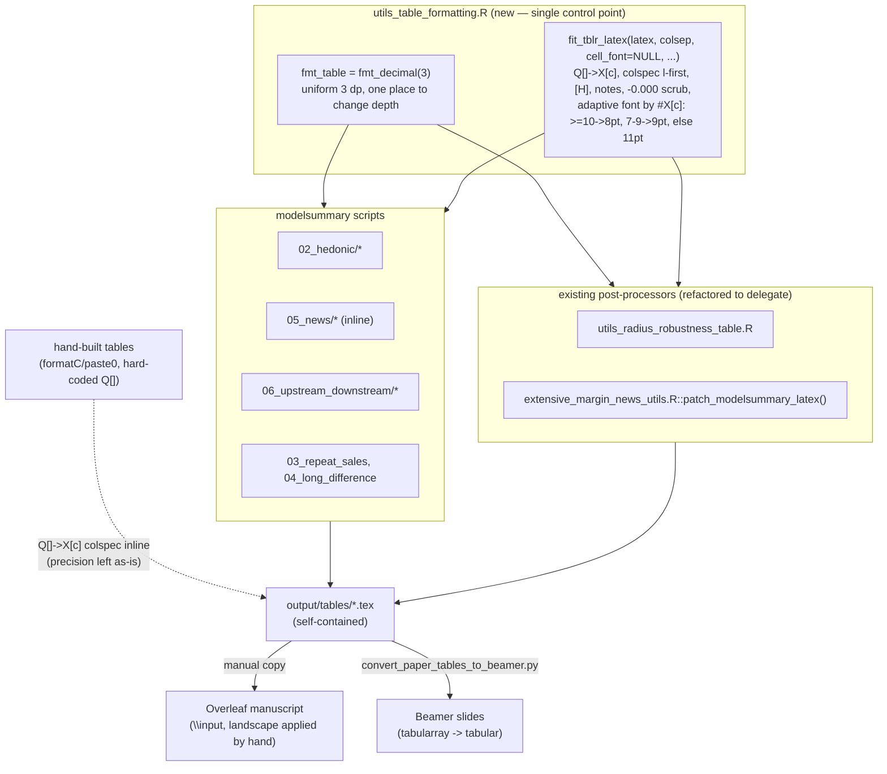

# feat: Auto-fitting regression tables and uniform coefficient precision

## Summary

The manuscript's regression tables are generated by R (`modelsummary` →
tabularray/tinytable) into `output/tables/*.tex`, then copied by hand into the
Overleaf project. Two problems compound on the `jo/rescale-spill-effect` branch:

1. **Width.** `modelsummary` (via tinytable) emits natural-width `Q[]` columns, so
   wide tables (12–13 columns) overflow the page. The fix — converting `Q[]` to
   flexible `X[c]` columns that fit `\linewidth` — already exists in ~45 generated
   tables, but it is applied inconsistently and the conversion code is duplicated
   inline across scripts.
2. **Precision.** Rescaling spill exposure to weekly units divides every spill
   coefficient and SE by 7, pushing them into the third decimal (a daily `-0.04` /
   SE `0.01` becomes `-0.006` / `0.001`). At the current 2-decimal formatting those
   cells collapse to `-0.01` / `0.00`, and `fmt` settings are inconsistent across
   scripts (`fmt_decimal(2)`, `fmt = 2`, `fmt = 3`, mixed).

This plan centralizes both concerns:

- **Width** is handled by a single tabularray post-processor, `fit_tblr_latex()`
  (`Q[]`→`X[c]`, spacing/font splice, float/notes patching), hoisted from the
  duplicated inline blocks and from the two existing post-processors.
- **Precision** is standardized to a single uniform depth — **3 dp** — applied to
  every `modelsummary` table via the built-in `fmt_decimal(3)`, replacing the
  heterogeneous `fmt_decimal(2)` / `fmt = 2` / `fmt = 3`. 3 dp is the minimal depth
  that keeps the rescaled spill terms visible (≈`-0.006` / `0.001`) without
  collapsing, and applying it uniformly keeps every cell — estimate and SE alike —
  on the same decimals.

**Scope:** the R table-generation layer under `scripts/R/09_analysis/` and the two
shared util modules. All changes are R-source only; tables regenerate into
`output/tables/` and are copied to Overleaf as today. This is presentation-layer
work, independent of the rescaling logic itself (see the related
`docs/plans/2026-06-24-002-feat-rescale-spill-effect-plan.md`), but it lands on the
same branch because the precision need follows directly from the rescaling.

---

## Problem Frame

The table pipeline has three builder shapes:

- **`modelsummary` + inline post-processing** — most scripts. Each repeats the same
  `sub()`/`gsub()` blocks: `[H]` float fix, caption/label, `%% tabularray inner
  open` colsep/font injection, custom notes, and (sometimes) the `Q[]`→`X[c]`
  conversion.
- **`modelsummary` via a shared post-processor** — `05_news/*_extensive.R` route
  through `extensive_margin_news_utils.R::patch_modelsummary_latex()` (lines
  428–520); all `*_radius_robustness.tex` route through
  `utils_radius_robustness_table.R::write_radius_robustness_table()` (patch block
  lines 79–92). Both already contain the full patch idiom (including `X[c]`). They
  differ in ways the hoist must reconcile:
  - **Notes splice:** the radius util — and every inline script — inserts notes via
    `sub()`, whose replacement engine un-doubles backslashes for free.
    `patch_modelsummary_latex()` instead inserts literally (`regexpr`+`substr`) and
    calls `collapse_doubled_backslashes()` to do the same un-doubling by hand. Both
    author notes identically at the R-source level (`\\\\` before LaTeX commands);
    only the mechanism differs, so standardizing on `sub()` (KTD1) needs no
    note-string edits.
  - **Validation:** `patch_modelsummary_latex()` has three `stop()` guards; the
    radius util has none.
  - **Output mode:** the radius util calls `modelsummary(..., output =
    "tinytable")` + `save_tt()`; the `patch_*` callers use `output = "latex"`.

  Both nonetheless emit the same anchors (`%% tabularray inner open`, `note{}={ },`,
  `Q[]`) that the patch idiom keys on, so one helper can serve both.
- **Hand-built LaTeX** — ~5 tables (`07_dry_spills/*`, the comparison block in
  `did_articles_windowed_prior.R`, and the two descriptive tables) build strings
  with `formatC`/`paste0` and hard-code `colspec={Q[]...}`. They bypass both
  `modelsummary`'s `fmt` and the tabularray post-processing, and do their own number
  formatting (including their own negative-zero handling).

The width fix and the precision change touch the same `modelsummary` call sites, so
the sweep is organized by area: each script gets the `fmt` swap and the
`fit_tblr_latex()` swap in one pass, on top of a shared-helper foundation.

The generated `.tex` files also feed the Beamer slide converter
(`scripts/python/convert_paper_tables_to_beamer.py`), so they must stay
**self-contained** — styling lives in the `.tex`, not only in a manuscript
preamble. (Verified: the converter never reads `colspec`/`colsep`/font; it derives
column count from `&`-cell counts and synthesizes its own `l/c/r` `tabular`
preamble. It already processes the 45 `X[c]` tables in the repo today, so
`Q[]`→`X[c]` and the spacing splice are invisible to it — see U7.)

---

## Requirements

- **R1.** Every generated regression table auto-fits `\linewidth` via `X[c]`
  columns (label column stays `l`), with no per-table width tuning. Whether the
  manuscript additionally wraps a 12–13-column table in `\begin{landscape}` is a
  manuscript-side decision applied by hand; `\begin{landscape}` appears in no R
  script and no generated `.tex`, so it is out of this R-only scope.
- **R2.** Coefficient and SE cells render at a single uniform depth of **3 dp**
  across all `modelsummary` tables, via the built-in `fmt_decimal(3)` standardized
  through one named setting (`fmt_table`) so the depth is changeable in one place.
- **R3.** The `Q[]`→`X[c]` conversion, spacing, cell font, float placement, notes
  patching, and negative-zero suppression are defined **once** in
  `fit_tblr_latex()` and reused by every `modelsummary` script and by the two
  existing util modules. Cell font follows **the adaptive font rule** (KTD3) — a
  column-count-adaptive default the helper computes — overridable per table by
  passing an explicit `cell_font`. Both the mechanism and the font rule are
  centralized; only deliberate exceptions pass an explicit value.
- **R4.** The change is applied to **every** `modelsummary` table-generating script,
  including the hard-coded `Q[]` colspec tables. Hand-built tables get the
  `Q[]`→`X[c]` width fix only; their precision is left as their authors set it.
- **R5.** All changes are R-source only. Generated `.tex` files remain
  self-contained so the manual copy-to-Overleaf and the Beamer converter both keep
  working.
- **R6.** Negative-zero artifacts (`-0.000`) are suppressed. Stars, N, and R² rows
  are governed by `gof_map`, not `fmt`, so the `fmt` change never touches them.
  Every active call site passes a `gof_map` pinning `nobs → fmt=0` and
  `adj.r.squared → fmt=3`. **Invariant: do not set `fmt` at any call site lacking a
  `gof_map`** (none exist today).
- **R7.** Regenerated tables change only in the intended ways: (a) `Q[]`→`X[c]`
  colspec on tables not yet converted; (b) uniform 3 dp on all coefficient/SE cells
  (currently-2 dp tables deepen every cell, e.g. `0.21`→`0.210`; currently-3 dp
  tables are unchanged in depth); (c) cell font set by the adaptive font rule.
  Significance stars, observation counts, R², and fixed-effect rows are unchanged.
  The full expected diff is enumerated in [Validation & Expected
  Invariants](#validation--expected-invariants).

---

## Key Technical Decisions

### KTD1. One shared helper centralizes the tabularray fit mechanism

**Decision:** Create `scripts/R/09_analysis/utils_table_formatting.R` exporting:

- `fit_tblr_latex()` — the tabularray post-processor: `[H]` float fix, `%%
  tabularray inner open` colsep/font injection, `Q[]`→`X[c]` + `colspec={l ...}`
  conversion, notes/caption/label splice, and the `-0.000`→`0.000` scrub. Spacing
  and font are **parameters** (per-table), not constants.
- `fmt_table` — the single precision setting, `modelsummary::fmt_decimal(3)`, passed
  as `fmt = fmt_table` at every `modelsummary` call so depth changes in one place.

Refactor the two existing post-processors
(`utils_radius_robustness_table.R::write_radius_robustness_table()` and
`extensive_margin_news_utils.R::patch_modelsummary_latex()`) to delegate their patch
block to `fit_tblr_latex()`, so there is exactly one implementation of the idiom.

**Why:** The width/spacing splice is copy-pasted across ~16 scripts and
re-implemented in 2 utils; centralizing it makes a future fit change one edit.
`patch_modelsummary_latex()` already proves the shape (it even validates the patch),
so the mechanism hoist is straightforward.

**Caveat — the hoist folds two utils that currently differ on two points** (see
Problem Frame). The helper handles each so output stays stable:

1. **Notes splice — standardize, don't branch.** `fit_tblr_latex()` splices notes
   via `sub()`-replacement, the convention the radius util and every inline script
   already use. The lone outlier, `patch_modelsummary_latex()`, splices literally and
   calls `collapse_doubled_backslashes()` — but because its note strings are already
   authored in the same `\\\\` form as everyone else's, routing them through `sub()`
   yields identical single-backslash output. So `collapse_doubled_backslashes` is
   **deleted**, there is **no per-caller flag**, and no note string changes.
2. **Validation.** The radius util has no `stop()` guards today. After delegating,
   it inherits the helper's validation and will now **error loudly** on a missing
   anchor where it previously silently no-op'd. This is a deliberate improvement,
   not a refactor regression — the "content-identical" check (U1) covers identical
   output on valid input; the new fail-loud path is tested separately.

The hoist also moves the **font rule** into the helper (KTD3): `fit_tblr_latex()`
both splices the layout and chooses the cell font from column count by default.

### KTD2. Precision is uniform 3 dp, via the built-in formatter

**Decision:** Standardize every `modelsummary` call on `fmt = fmt_table`
(`= fmt_decimal(3)`). One depth, applied to estimates and SEs alike, across all
tables.

**Why:** The rescaled spill coefficient (≈`-0.006`) and its SE (≈`0.001`) need 3 dp
or they collapse; the constant (≈`12.26`) and large controls render fine at 3 dp
(`12.260`). Since *every* spill-bearing table contains a sub-0.1 term, 3 dp is the
minimal depth that serves all of them, and applying it **uniformly** has three
concrete advantages:

- **Estimate and SE always match.** `modelsummary` formats `{estimate}` and
  `{std.error}` through the same `fmt`, but any *magnitude-conditional* rule judges
  each value independently, so an estimate and its own SE could land on different
  decimals (e.g. `12.84` over `(0.004)`). Uniform depth eliminates that mismatch.
- **No ragged columns.** With centered `X[c]` columns, mixed decimal counts within a
  column produce uneven cell widths; uniform depth keeps them even.
- **Robust and trivial.** `fmt_decimal` already blanks `NA`/non-finite cells, so
  there is no custom-vectorization hazard; the swap is a one-token change per call
  site.

**Alternatives considered (rejected):**

- *Per-cell magnitude-adaptive* (2 dp for |x|≥0.1, 3 dp below). Produces the
  estimate/SE mismatch and ragged centered columns above; it also can't be a
  per-table decision, since `fmt` only ever sees one statistic-column at a time.
- *Auto-detect per table* (3 dp if any displayed term < 0.1, else 2 dp). In this
  corpus every table has a sub-0.1 spill term, so it resolves to 3 dp everywhere —
  byte-identical to uniform 3 dp — while requiring either a model-inspection helper
  that must handle each script's differing model-list shapes (flat lists vs.
  `shape="cbind"` list-of-lists) at ~200 call sites, or a `modelsummary` wrapper
  that double-runs. Not worth it for zero output difference. Kept as a documented
  future option if an all-large table ever appears.
- *4 dp uniform* (so the spill SE shows 2 sig figs, `0.0014`). Rejected as default:
  it adds trailing zeros to every large coefficient (`12.2600`), and significance is
  carried by stars regardless. `fmt_table` makes 3→4 a one-line change if wanted.

### KTD3. Cell font is set by an adaptive rule in the `.tex`, overridable

**Decision:** Keep `colsep`/`rowsep`/font **in the generated `.tex`** (emitted by
`fit_tblr_latex()`). The cell font is chosen automatically from the number of `X[c]`
columns the helper just produced — **the adaptive font rule**:

| `X[c]` columns | Cell font | `colsep` |
|---|---|---|
| ≥ 10 | `\fontsize{8pt}{9pt}` | 2pt |
| 7–9 | `\fontsize{9pt}{10pt}` | (pairs with tier) |
| ≤ 6 | `\fontsize{11pt}{12pt}` | 4pt |

Sizes are absolute (the manuscript base font is fixed, so absolute gives exact
control); `colsep` pairs with the font tier. An explicit `cell_font` argument
**always overrides** the default, though no current table uses it. Do **not** move
spacing to a manuscript-side `\SetTblrInner`.

**Why:**

1. **Self-containment.** The same `output/tables/*.tex` feed the manuscript, the
   Beamer converter, and standalone use, so each file must carry its own styling. A
   preamble-only default renders correctly only in the one project that has that
   preamble.
2. **`X[c]` fits the page but does not regulate font.** `X[c]` distributes
   `\linewidth` among columns and *wraps* cell content; it never shrinks the font
   (confirmed in the tabularray manual — there is no auto-font feature). So a wide
   table still needs a smaller font to keep numbers from overflowing their now-narrow
   columns and headers from wrapping. Column count is the available predictor, and
   the helper already counts the `X[c]` it built — no model inspection needed (unlike
   adaptive *precision*, which is why that was rejected but this is cheap).
3. **A rule beats hand-tuning, which has already drifted.** The current outputs are
   inconsistent at fixed column count — 12-`X[c]` tables appear at both 8pt and 11pt
   (the 11pt ones cramped), 6-`X[c]` tables at both. The rule imposes consistency:
   every 12-col table becomes 8pt (correcting the cramped 11pt ones), and the 6-col
   `*_radius_robustness` tables move to 11pt like every other 6-col table, with no
   special-casing.

**Box-scaling rejected.** `\resizebox` / adjustbox `max width` would auto-scale font
to fit, but it is incompatible with `X[c]` (which already forces `\linewidth`, so
`max width` never triggers and `\resizebox` would *stretch* the table) and produces
inconsistent, non-standard point sizes. The discrete rule keeps every table on a
real size from a small set (8/9/11pt).

`dp` is a reserved parameter for a future non-uniform-precision rule. While
precision is uniform 3 dp (KTD2) it is unused; font depends only on column count.

### KTD4. Organize the sweep by area, applying both edits per script

**Decision:** After the shared helper exists (U1), adopt it area-by-area (hedonic,
news, upstream/downstream, other modelsummary, hand-built), applying the `fmt =
fmt_table` swap and the `fit_tblr_latex()` swap together in each file.

**Why:** Both edits touch the same `modelsummary` blocks; doing them in one pass per
file avoids editing files twice and keeps each area independently reviewable and
regenerable.

---

## High-Level Technical Design

### Shared helper, consumers, and the self-contained-output boundary

### Uniform precision — worked decimals (3 dp)

| Coefficient (post-rescale) | Value | Renders (3 dp) |
|---|---|---|
| Constant (log price) | 12.26 | `12.260` |
| Spill per week (avg.) | −0.0057 | `-0.006` |
| Spill SE | 0.0014 | `0.001` |
| Upstream × count interaction | −0.0043 | `-0.004` |
| A large control (e.g. tenure) | 0.21 | `0.210` |
| Negative-zero artifact | −0.0001 | `0.000` (scrubbed) |

`fmt_decimal(3)` returns plain decimal strings (so any siunitx `\num{}` wrapping
still parses), blanks `NA` cells, and `fit_tblr_latex()` rewrites a rounded `-0.000`
to `0.000`.

---

## Implementation Units

### U1. Shared table-formatting helper

**Goal:** Create the single control point for precision and tabularray fitting, and
make the two existing post-processors delegate to it.

**Requirements:** R1, R2, R3, R6.

**Dependencies:** none.

**Files:**
- `scripts/R/09_analysis/utils_table_formatting.R` (new) — exports `fmt_table` and
  `fit_tblr_latex()`.
- `scripts/R/09_analysis/utils_radius_robustness_table.R` (refactor the patch block,
  lines 79–92, to call `fit_tblr_latex()`; **drop** the hard-coded `8pt`/`colsep=2pt`
  so the adaptive default applies — its 6-`X[c]` tables become 11pt. Its notes
  already use the shared `sub()` convention, so they carry over unchanged).
- `scripts/R/09_analysis/05_news/extensive_margin_news_utils.R` (refactor
  `patch_modelsummary_latex()`, lines 428–520, to call `fit_tblr_latex()`; preserve
  its `colsep` default and its three validation `stop()`s. Its bespoke literal-splice
  + `collapse_doubled_backslashes()` is **replaced** by the shared `sub()` splice;
  since its note strings are already in `\\\\` form, output is unchanged and
  `collapse_doubled_backslashes` is deleted).

**Approach:**

`fmt_table <- modelsummary::fmt_decimal(3)` — the one precision setting. (Equivalent
to `fmt = 3`; named so depth is changed in one place.)

`fit_tblr_latex(latex, colsep = NULL, rowsep = NULL, cell_font = NULL, width = NULL,
notes = NULL, label = NULL, dp = 3)` encapsulates: the `[H]` float fix; the `%%
tabularray inner open` colsep/font injection (anchored on the captured marker as
today); the `Q[]`→`X[c]` + `colspec={l ...` conversion; the notes/caption/label
splice via `sub()`-replacement (callers pass notes in the standard `\\\\`-doubled
form and `sub` un-doubles them to single backslashes — no separate collapse step);
the `-0.000`→`0.000` scrub; and validation so a missing anchor errors loudly.

Cell font follows **the adaptive font rule** (KTD3): the helper counts `X[c]` tokens
in the converted colspec and, when `cell_font` is `NULL`, applies the tier table;
`colsep` defaults pair with the font tier. An explicit `cell_font` overrides. `dp`
is accepted but unused today (reserved for future non-uniform precision).

The `-0.000` scrub is a `gsub("-0\\.000", "0.000", latex)` on the assembled string —
a new, intended behavior applied uniformly to all `modelsummary` tables (hand-built
tables already scrub their own).

Source convention follows the established pattern:
`here::here("scripts","R","09_analysis","utils_table_formatting.R")`.

**Patterns to follow:** `extensive_margin_news_utils.R::patch_modelsummary_latex()`
(parameterized `colsep`/`cell_font`, validates the patch) and the
`gsub("Q\\[\\]", "X[c] ", ...)` / `sub("colspec=\\{X\\[c\\] ", "colspec={l ", ...)`
pair in `hedonic_continuous_prior.R:456-457`.

**Test scenarios:**
- `fit_tblr_latex()` on a sample `modelsummary` `Q[]` table yields
  `colspec={l X[c] ...}`, injects the requested `colsep`/font, splices notes/label,
  and rewrites `-0.000`→`0.000`; a table missing the inner-open anchor raises an
  error.
- A note authored as `\\\\footnotesize{\\\\textbf{Notes:}}` splices via `sub()` to a
  single-backslash `\footnotesize{\textbf{Notes:}}` in the output — confirming the
  `sub()` path reproduces what `collapse_doubled_backslashes()` did.
- **Adaptive font:** with `cell_font = NULL`, a 12-`X[c]` table resolves to
  `\fontsize{8pt}{9pt}`, a 6-`X[c]` table to `\fontsize{11pt}{12pt}`, an 8-`X[c]`
  table to `\fontsize{9pt}{10pt}`; an explicit `cell_font` overrides all three.
- The refactored `write_radius_robustness_table()` and `patch_modelsummary_latex()`
  produce **content-identical** output to their pre-refactor versions on one fixture
  each (no `-0.000`, so the scrub is a no-op; the `patch_modelsummary_latex()`
  fixture carries a backslash-bearing note, so it exercises the `sub()`-vs-`collapse`
  equivalence), when called with the same explicit settings they use today. *(Intended behavior changes, tested
  separately: the radius path now errors on a missing anchor; both utils' fonts move
  to the adaptive rule — radius 8pt→11pt, `patch_modelsummary_latex()` from a fixed
  11pt default to adaptive for callers passing no `cell_font`.)*
- `fmt_table` renders `c(12.26, -0.0057, 0.0014, 0.21)` as
  `c("12.260", "-0.006", "0.001", "0.210")` and `NA` as `""`.

**Verification:** sourcing the new file defines `fmt_table` and `fit_tblr_latex()`;
the two refactored utils still produce content-identical `.tex` for an unchanged
input table. Add a small runnable test (a sourced `tests/` scratch script or a
`testthat` file) so these scenarios are executable, not just described.

---

### U2. Hedonic tables — adopt shared formatter and fitter

**Goal:** Apply `fmt_table` and `fit_tblr_latex()` to all hedonic table scripts,
removing inline `fmt` values and duplicated post-processing.

**Requirements:** R1–R4, R7.

**Dependencies:** U1.

**Files:**
- `scripts/R/09_analysis/02_hedonic/hedonic_continuous_prior.R` (count
  `fmt_decimal(2)` and hrs `fmt = 2` → `fmt_table`; replace the two inline
  `Q[]`/colspec + colsep/font blocks with `fit_tblr_latex()`; 12-col → 8pt).
- `scripts/R/09_analysis/02_hedonic/hedonic_continuous_prior_qtr_fe.R` (same shape;
  12-col → 8pt).
- `scripts/R/09_analysis/02_hedonic/hedonic_continuous_full.R` (mixed
  `fmt_decimal(2)` / `fmt = 2` → `fmt_table`; add `fit_tblr_latex()` — currently no
  `X[c]` fix; font from the adaptive rule).
- `scripts/R/09_analysis/02_hedonic/hedonic_bins_prior.R` (`fmt = 3` → `fmt_table`;
  add fitter — confirm bin labels still render).
- `scripts/R/09_analysis/02_hedonic/hedonic_bins_full.R` (`fmt_decimal(2)` →
  `fmt_table`; add fitter).

**Approach:** Per file, swap each `modelsummary` `fmt =` to `fmt_table`, and replace
the inline float/colsep/font/`Q[]` blocks with a single `fit_tblr_latex()` call.
**Do not pass `cell_font`** — let the adaptive rule choose from column count. Keep
each script's existing caption/label/notes content. This is the template U3–U5
follow.

**Patterns to follow:** the U1 helper signature; existing `custom_notes` blocks in
`hedonic_continuous_prior.R`.

**Test scenarios:**
- Regenerated `hedonic_count_continuous_prior_250m.tex` has `colspec={l X[c] ...}`,
  every coefficient/SE cell at 3 dp (spill `-0.006`, constant `12.260`), and 8pt
  font.
- `hedonic_hrs_continuous_prior_250m.tex` spill-hours coefficient renders at 3 dp.
- Significance stars and the Observations row are unchanged vs the pre-change file.
- `hedonic_count_continuous_prior_radius_robustness.tex` (via the refactored util)
  still renders with weekly labels and `X[c]` fit, now at 11pt (6-col adaptive, was
  8pt).

**Verification:** each script runs end-to-end under `rv`; diff of the regenerated
`.tex` shows only colspec + uniform-3 dp changes (font 8pt unchanged for these).

---

### U3. News / public-attention tables — adopt shared formatter and fitter

**Goal:** Apply the shared setting and fitter across the news DiD / event-study /
trends tables, including the scripts that route through
`patch_modelsummary_latex()`.

**Requirements:** R1–R4, R7.

**Dependencies:** U1.

**Files (inline post-processing — `fmt = 3` → `fmt_table`, inline block →
`fit_tblr_latex()`; tag shows the size the adaptive rule yields):**
- `scripts/R/09_analysis/05_news/did_articles_prior.R` (8pt)
- `scripts/R/09_analysis/05_news/did_articles_lag4_prior.R` (11pt)
- `scripts/R/09_analysis/05_news/did_articles_windowed_prior.R` (also the hand-built
  comparison block — see U6)
- `scripts/R/09_analysis/05_news/did_trends_prior.R` (8pt)
- `scripts/R/09_analysis/05_news/did_trends_full.R` (11pt)
- `scripts/R/09_analysis/05_news/es_trends_prior.R` (11pt)

**Files (route through the U1-refactored util — `fmt = 3` → `fmt_table` only):**
- `scripts/R/09_analysis/05_news/did_articles_prior_extensive.R`
- `scripts/R/09_analysis/05_news/did_articles_lag4_prior_extensive.R`
- `scripts/R/09_analysis/05_news/did_articles_windowed_prior_extensive.R`
- `scripts/R/09_analysis/05_news/did_trends_prior_extensive.R`
- `scripts/R/09_analysis/05_news/did_trends_full_extensive.R`
- `scripts/R/09_analysis/05_news/es_trends_prior_extensive.R`

**Approach:** For inline scripts, same swap as U2. For `_extensive` scripts, only
the `fmt` argument changes — their post-processing already flows through
`patch_modelsummary_latex()`, which U1 routed to `fit_tblr_latex()`. The robustness
calls (`fmt = 3` passed to `write_radius_robustness_table`) become `fmt_table`.
These tables are already at 3 dp, so their numbers are unchanged in depth — only
colspec/centralization moves.

**Patterns to follow:** `did_trends_prior.R` and `did_articles_prior.R`
post-processing blocks; the `_extensive` config-driven `fmt` argument.

**Test scenarios:**
- `did_trends_prior_250m.tex`: spill-count level coefficient and `:post`
  interaction render at 3 dp (unchanged depth); `log(Articles)` and trend terms
  unchanged; 8pt preserved.
- `did_articles_prior_250m.tex`: the `:log_cumulative_articles` interaction at 3 dp;
  table fits with `X[c]`.
- One `_extensive` table regenerates with `X[c]` fit and 3-dp cells via the
  refactored util.

**Verification:** all listed scripts run under `rv`; depth unchanged (already 3 dp),
colspec centralized, fonts unchanged.

---

### U4. Upstream / downstream tables — adopt shared formatter and fitter

**Goal:** Apply the shared setting and fitter across the directional and
nearest-site tables, and convert the scripts that hard-code `Q[]` colspecs.

**Requirements:** R1–R4, R7.

**Dependencies:** U1.

**Files (swap `fmt_decimal(2)` → `fmt_table`; inline block → `fit_tblr_latex()`;
font from the adaptive rule by column count) — all under
`scripts/R/09_analysis/06_upstream_downstream/`:**
- `upstream_downstream_prior.R`
- `upstream_downstream_prior_full.R`
- `upstream_downstream_prior_nearest_site.R`
- `upstream_downstream_prior_only_site.R`
- `upstream_downstream_nearest_all_radii.R`
- `upstream_downstream_only_site_all_radii.R`
- `upstream_downstream_nearest_by_bin.R`
- `upstream_downstream_nearest_vary_lateral.R`
- `upstream_downstream_nearest_vary_river.R`
- `upstream_downstream_decay_binary_did.R`
- `upstream_downstream_decay_ring_triple.R`

**Files (also convert hard-coded `colspec={Q[]...}` to `X[c]`):**
- `scripts/R/09_analysis/06_upstream_downstream/upstream_downstream_full_all_radii.R`
  (modelsummary blocks at `fmt_decimal(2)` plus the two hard-coded colspec sites
  ~lines 1289, 1407; preserve the `\quad Upstream`/`\quad Downstream` indentation
  gsubs).

**Approach:** Same per-file swap as U2/U3 (don't pass `cell_font`; the adaptive rule
sizes each table — the wide directional `full_all_radii` tables pick 8pt/9pt, the
narrow `ud_*` tables 11pt). For `full_all_radii.R`, route the modelsummary tables
through `fit_tblr_latex()` and rewrite the two literal `colspec={Q[]...}` strings to
the `l X[c]...` form. Keep the directional-label indentation post-processing.

**Patterns to follow:** `upstream_downstream_prior.R` post-processing and the
`\quad` indentation gsubs; `did_articles_windowed_prior.R:572` for the
`colspec={l *{N}{X[c]}}` literal form.

**Test scenarios:**
- `hedonic_count_continuous_prior_nearest_site_distance_250m.tex` regenerates with
  `X[c]` fit and 3-dp spill/interaction cells.
- A `full_all_radii` directional table renders `X[c]` columns with `\quad`-indented
  Upstream/Downstream rows intact.
- `:direction` interaction coefficients at 3 dp; `dist_river_m` and FE rows
  otherwise consistent (currently-2 dp values deepen to 3 dp as intended); font set
  by the adaptive rule for each table's width.

**Verification:** all listed scripts run under `rv`; previously-overflowing tables
fit and all cells render at uniform 3 dp.

---

### U5. Remaining modelsummary tables — adopt shared formatter and fitter

**Goal:** Cover the modelsummary tables outside the three main areas.

**Requirements:** R1–R4, R7.

**Dependencies:** U1.

**Files:**
- `scripts/R/09_analysis/03_repeat_sales/repeat_sales.R` (`fmt = 3` → `fmt_table`;
  inline `Q[]`/colspec block → `fit_tblr_latex()`; 4-`X[c]` → 11pt).
- `scripts/R/09_analysis/04_long_difference/longdiff_{unweighted,weighted}_{all,exposed}.R`
  (confirmed producers — each calls `modelsummary(..., output="latex")` and emits a
  4-`X[c]` `longdiff_*.tex` at 11pt; same swap: `fmt` → `fmt_table`, inline block →
  `fit_tblr_latex()`, adaptive font → 11pt).
- Any further active `modelsummary` script surfaced by the U7 completeness sweep
  that is not already covered in 02–06.

**Approach:** Same swap as U2.

**Test scenarios:**
- `repeat_sales.tex` regenerates with `X[c]` fit; coefficients at uniform 3 dp
  (unchanged depth — already 3 dp); stars and N unchanged.

**Verification:** scripts run under `rv`; output fits and precision is uniform 3 dp.

---

### U6. Hand-built tables — `X[c]` colspec only (precision left as-is)

**Goal:** Bring the non-`modelsummary` tables' width into line by converting their
hard-coded `Q[]` colspecs to `X[c]`. **Do not change their number precision** —
these are different quantities (e.g. logit average marginal effects) with
deliberately chosen depths.

**Requirements:** R1, R4, R5.

**Dependencies:** U1 (for the `Q[]`→`X[c]` convention). The splice anchors may not
match these hand-written `talltblr` blocks, so convert colspec inline rather than
forcing them through `fit_tblr_latex()`.

**Files:**
- `scripts/R/09_analysis/07_dry_spills/dry_spill_logit_ame_table.R` (convert its
  hand-written `colspec={Q[...]...}` to `X[c]`; **keep** `TABLE_COEF_DIGITS = 3` /
  `TABLE_EFFECT_DIGITS = 4` and its existing negative-zero handling).
- `scripts/R/09_analysis/07_dry_spills/daily_rain_regimes_table.R` (convert
  `colspec={Q[]...}` ~line 300 to `X[c]`; precision unchanged — counts/percentages).
- `scripts/R/09_analysis/05_news/did_articles_windowed_prior.R` — the hand-built
  comparison block already uses `format_estimate(... fmt = 3L)` and
  `colspec={l *{8}{X[c]}}`; already at 3 dp and `X[c]`, so **no change** (confirm
  only).
- Confirm-only (no coefficient cells, no change expected):
  `scripts/R/09_analysis/01_descriptive/population_exposure.R`,
  `scripts/R/09_analysis/01_descriptive/property_spill_site_pair_count.R`.

**Approach:** Convert literal `Q[]` colspecs to the `l X[c]...` form so these tables
fit. Leave all inline `formatC`/`format_*` digit choices exactly as they are.

**Test scenarios:**
- `dry_spill_logit_ame.tex` uses `X[c]` columns; AME values still render at 4 dp; no
  `-0.000`.
- `dry_spill_daily_rain_regimes.tex` uses `X[c]` columns; counts/percentages
  unchanged.
- `population_exposure.tex` and `property_spill_site_pair_count.tex` are
  byte-identical (integers/thousands), confirming the scope boundary.

**Verification:** the dry-spill tables regenerate with `X[c]` and unchanged
precision; the descriptive tables are byte-identical.

---

### U7. Regenerate all tables and verify

**Goal:** Produce the updated `output/tables/*.tex` and confirm the fit + precision
outcomes across the corpus.

**Requirements:** R1–R7.

**Dependencies:** U2–U6.

**Files:**
- `output/tables/*.tex` (regenerated artifacts).

**Approach:**

1. **Completeness sweep first.** Enumerate every active `modelsummary()` call site
   (~200 calls across ~52 files, excluding `Archive/`/`_old/`/`_archive/`) by grep
   and confirm each is covered by U2–U5 (or is intentionally hand-built/U6). Use the
   grep as the source of truth, not the prose file lists. Also flag likely **stale
   outputs**: several no-suffix base files (e.g.
   `hedonic_count_continuous_prior.tex`) are `Q[]`+11pt while their per-radius
   siblings (`..._250m.tex`) are `X[c]`+8pt — confirm which files the current
   scripts actually write and remove orphans so the regeneration diff is clean.
2. Run the edited scripts under `rv` (use rescaled inputs from the branch).
3. Sweep the regenerated corpus: grep for any surviving `colspec={Q[]` in
   modelsummary outputs (should be none); confirm `colspec={l X[c]` in the wide
   tables; spot-check that spill coefficient/SE cells render at 3 dp and that a
   currently-2 dp table's constant now reads `12.260`; confirm no `-0.000` remains;
   and **eyeball the font flips** — tables that move 11pt→8pt, the
   `*_radius_robustness` tables that move 8pt→11pt, and any that land on the 9pt
   tier — to confirm they read well.
4. Confirm the Beamer converter still parses the new output
   (`convert_paper_tables_to_beamer.py` over the regenerated dir runs without error).
   (Verified safe in research — it ignores `colspec`/`colsep`/font — but re-run as a
   guard.)

**Test scenarios:**
- No unintended `Q[]` columns remain in regenerated `modelsummary` tables.
- All coefficient/SE cells render at uniform 3 dp across hedonic, news, and
  upstream/downstream; no `-0.000`.
- Every regenerated table's cell font matches the adaptive rule for its `X[c]`
  count; no 12-col table remains at 11pt and no 6-col `*_radius_robustness` table
  remains at 8pt.
- `convert_paper_tables_to_beamer.py` converts the regenerated tables without error.

**Verification:** `output/` is **not** git-tracked (and stays that way), so capture
a snapshot of `output/tables/*.tex` **before** regenerating (e.g. copy to a scratch
dir), then `diff -ru` the regenerated dir against the snapshot to confirm only the
intended changes (colspec + 3 dp + adaptive font) appear; spot-checks pass; the
converter runs clean. Landscape wrappers, if any, are adjusted by hand in the
manuscript afterward (out of scope).

---

## Scope Boundaries

**In scope:** the R table-generation layer under `scripts/R/09_analysis/`, the new
shared helper, and the two existing util modules; regeneration of `output/tables/`.

**Deferred to follow-up:**
- **Global `\SetTblrInner` preamble spacing defaults.** Rejected for now: a
  document-wide `\SetTblrInner` would only take effect if the helper *stopped*
  emitting those keys, which breaks self-containment (R5), and a single global value
  cannot vary font by column count — the exact thing wide-vs-narrow tables need. The
  adaptive font rule (KTD3) delivers the "set once" convenience *and* per-table
  correctness that a flat default structurally cannot. Activate only if the
  manuscript ever becomes the sole consumer and a flat spacing default is
  acceptable.
- Any change to `convert_paper_tables_to_beamer.py` (it keeps working as-is; U7
  verifies).

**Out of scope — keep as-is:**
- The rescaling logic itself
  (`docs/plans/2026-06-24-002-feat-rescale-spill-effect-plan.md`).
- `\begin{landscape}` wrapping — applied/removed **by hand in the Overleaf
  manuscript**; not emitted by any R script or generated `.tex`.
- The precision of the hand-built tables (e.g. the logit AME 4-dp display) — width
  fix only.
- The manual copy of `output/tables/*.tex` into the external Overleaf project.
- `_archive/`, `Archive/`, `_old/` paths.

---

## Open Questions

None. The radius-robustness font, the 13-column tables, and the landscape handling
are all settled in KTD3 and Scope Boundaries: every table follows the adaptive font
rule with no per-table overrides, and `\begin{landscape}` is a manuscript-side
decision.

---

## Validation & Expected Invariants

| Invariant | Expectation |
|---|---|
| Wide modelsummary tables | `colspec={l X[c] ...}`, fit `\linewidth` |
| All coefficient / SE cells | uniform **3 dp** |
| Currently-2 dp tables (hedonic, upstream) | every cell deepens to 3 dp (e.g. `12.26`→`12.260`, `0.21`→`0.210`) |
| Currently-3 dp tables (news, repeat-sales) | unchanged depth |
| Negative zero | rendered as `0.000`, never `-0.000` |
| Significance stars, N, R² | unchanged (governed by `gof_map`, not `fmt`; R² already 3 dp) |
| Column font / `colsep` | set by the adaptive font rule (KTD3) for every table incl. radius-robustness (now 11pt); override param exists but unused |
| Two refactored utils | content-identical output for an unchanged input table (plus new fail-loud on a missing anchor on the radius path) |
| Beamer converter | parses regenerated tables without error |
| Generated `.tex` | self-contained (styling present in the file) |

---

## Sources & Research

- Inventory of `modelsummary` table-generating scripts (~52 active files, ~200
  active `modelsummary()` calls; ~half use `fmt_decimal(2)`, ~half a literal
  `fmt = 2`/`3`), their post-processing idioms, and output paths (repo research,
  this session).
- Existing `X[c]` conversion sites (45 generated tables already use `X[c]`) and the
  two shared post-processors (`utils_radius_robustness_table.R` lines 79–92;
  `extensive_margin_news_utils.R::patch_modelsummary_latex()` lines 428–520).
- `scripts/python/convert_paper_tables_to_beamer.py` — verified to ignore
  `colspec`/`colsep`/font and synthesize its own `tabular` preamble, confirming
  `Q[]`→`X[c]` and the spacing splice are transparent to it.
- `modelsummary` `fmt`/`gof_map` behavior — verified that every active call pins GOF
  rows via `gof_map`, so `fmt_decimal(3)` only touches coefficient/SE cells;
  `fmt_decimal` blanks `NA`.
- Related: `docs/plans/2026-06-24-002-feat-rescale-spill-effect-plan.md` (motivates
  the precision change).
