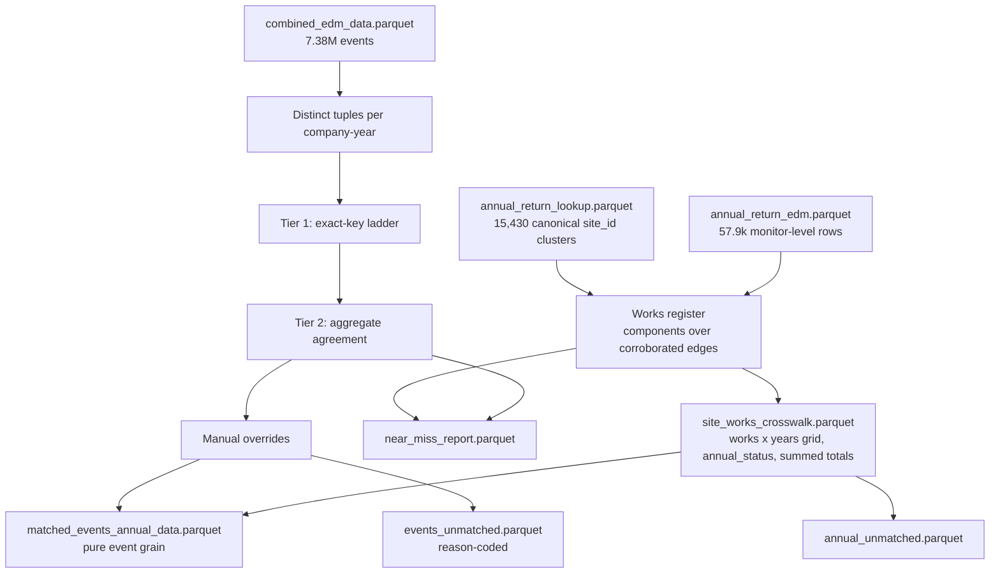
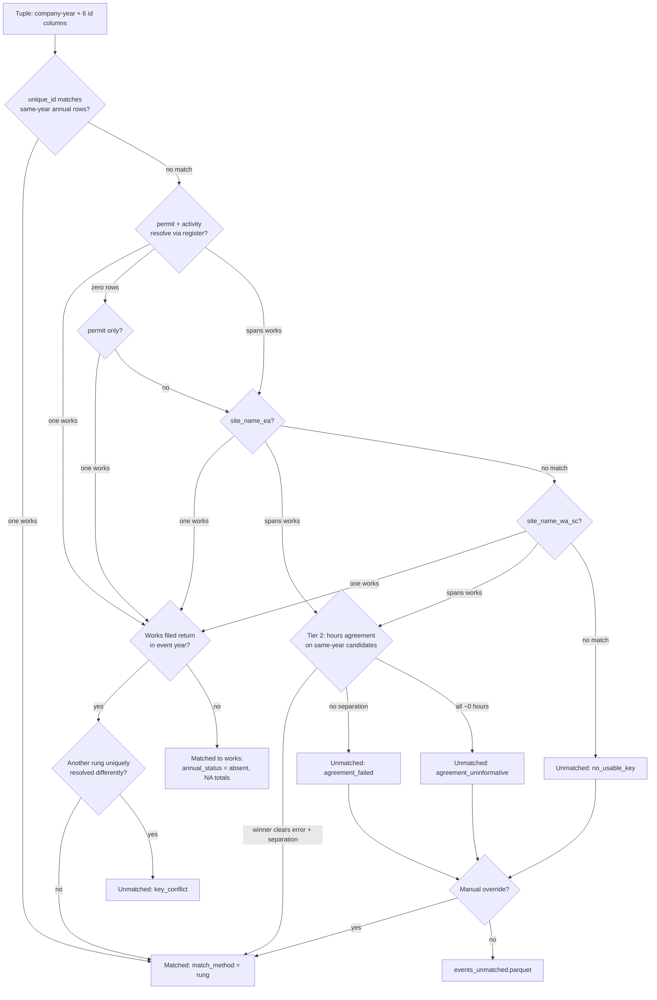
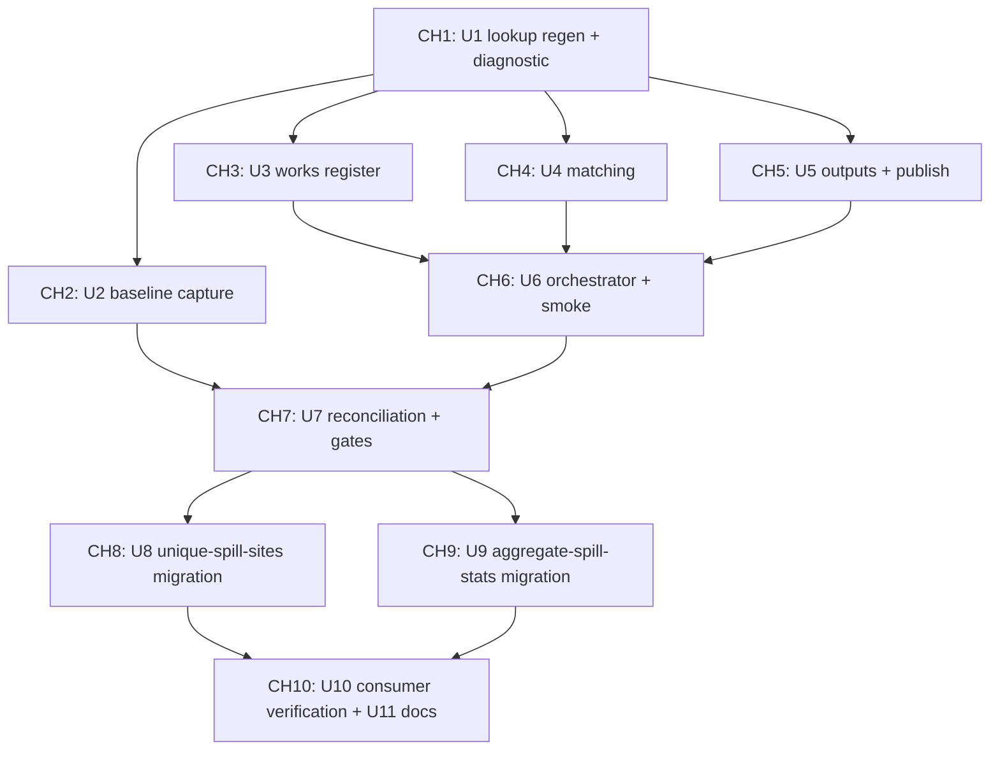

# refactor: Rebuild merge_individ_annual_location on a works-register crosswalk

## Summary

Rebuild `scripts/R/05_data_integration/merge_individ_annual_location.R` around a works-register crosswalk: a precision-first exact-key ladder plus an aggregate-agreement tier replace the old per-event three-stage matcher, producing five reason-coded outputs with contract tests that mirror the annual-return-lookup refactor. Two downstream consumers are migrated off the removed pseudo-rows; six are verified against the preserved schema contract.

## Problem Frame

The current script matches 7.38M spill events to annual-return site records per event row through key enumeration, a max-to-one merge that selects on the treatment variable, and EM fuzzy matching. It accumulated 25 review findings including silent row loss (`todos/011-pending-p0-location-merge-findings.md`, now superseded). A grill session on 2026-07-04 locked twelve design decisions (D1–D12 in the origin document); this plan operationalises them.

A planning-time verification pass (2026-07-05) confirmed the origin's evidence base and produced four amendments, each ratified by the user:

- `aggregate_spill_stats.R` is promoted from verify-only to full migration: its EA-fallback logic builds site-year metadata from distinct rows of the matched file, and the NA-timestamp pseudo-rows are the only source of EA totals for event-less site-years. Removing pseudo-rows (D7) without migrating it would silently drop all reported-zero site-years from `agg_spill_yr/mo/qtr`.
- Events whose key resolves to exactly one works that filed no annual return in the event's year are matched to the works (annual columns NA, `annual_status` = `absent`), not routed to `events_unmatched`. The register is year-invariant, so exact-key resolution remains precise identity evidence; the property-distance analyses need the coordinates.
- The reconciliation baseline is captured before any new publish: the on-disk old outputs (January, 5.41M rows) predate the June input regeneration, so the old script is re-run once on current inputs to make the D12 hard gates evaluable.
- `site_code` is dropped from the matching tuple: the annual file has no such column, event coverage is 4.6% (2021–22 only), and keeping it only fragments tuples.

Decisions D1–D12 remain locked; the origin document stays the decision record. Where this plan pins details the origin left open, the pin is recorded under Key Technical Decisions.

---

## Requirements

**Matching behaviour**

- R1. Matching happens once per distinct identifier tuple at works grain via a crosswalk; the event-level file is a mechanical join of events onto crosswalk decisions (origin D1).
- R2. No match is justified by magnitude heuristics; every unmatched tuple carries a reason code from {`no_usable_key`, `name_spans_works`, `agreement_failed`, `agreement_uninformative`, `key_conflict`} (origin D2, D7).
- R3. The works register collapses same-works outlets per origin D3: edges require same company + same normalised name + a corroborator (identical `permit_reference_ea` or NGR distance ≤ 250 m, threshold in CONFIG); no permit-only edges; membership is year-invariant; representative `site_id` is the smallest member.
- R4. Tier 1 is the ordered exact-key ladder of origin D4 with the semantics pinned in KTD-2 through KTD-4; light normalisation only; no key weaker than a site identifier.
- R5. Tier 2 is aggregate agreement per origin D5 with the hours definition pinned in KTD-5; thresholds (relative error 0.25, runner-up separation 2×, absolute floor) live in CONFIG.
- R6. No fuzzy stage and no temporal-bridge stage; their caseload routes to the near-miss report and a validated manual-overrides file (origin D6, contract in KTD-7).

**Outputs**

- R7. Five outputs per origin D7: `site_works_crosswalk.parquet`, `matched_events_annual_data.parquet` (pure event grain, no pseudo-rows), `events_unmatched.parquet`, `annual_unmatched.parquet`, `near_miss_report.parquet`. Event columns keep native names and values; annual attachments arrive under explicit names; no coalesce-prefer-annual.
- R8. Every works-year carries exactly one `annual_status` from {`reported_zero`, `reported_positive`, `reported_na`, `absent`} with coverage qualifiers attached (origin D8); the crosswalk is a full works × `CONFIG$years` grid.
- R9. Consumer-critical schema is preserved: `site_id` int32, `start_time`/`end_time` timestamp[us, UTC], `spill_hrs_ea`/`spill_count_ea` double, column names unchanged, one parquet file per output name (the 06 scripts call `arrow::open_dataset` on single-file paths).

**Downstream**

- R10. `create_unique_spill_sites.R` and `aggregate_spill_stats.R` are migrated to read site-year existence, availability, EA totals, and zero/NA status from the crosswalk; the remaining six consumers get a verify-and-diff pass (origin D9 as amended).

**Engineering and testing**

- R11. Engineering conventions per origin D10: orchestrator keeps its path and name; utils extracted and sourced; arrow-only I/O (drop `reclin2` and `rio`); preflight input validation; fail-closed publish gate plus staged atomic swap; all year-dependent constructs from `CONFIG$years`; row-accounting assertions at every stage boundary; per-stage logging with `05_`-prefixed log file.
- R12. Contract tests per origin D11, sourcing production utils, organised as three module test files (`scripts/R/testing/test_merge_works_register_contracts.R`, `test_merge_matching_contracts.R`, `test_merge_outputs_contracts.R`) plus a thin runner `scripts/R/testing/test_merge_individ_annual_contracts.R` that sources all three and the integration smoke test. The runner preserves origin D11's single documented entry point; the split gives parallel work threads disjoint files (see Execution Chunking).
- R13. Acceptance per origin D12 against the U2 baseline: reconciliation report; hard gates (old exact-tier matches preserved in substance with explained exceptions, zero unexplained event-row loss, contract tests green); soft gate (overall match rate expected mid-90s%, shortfall resolved as an explicit logged CONFIG decision at a user decision point).

---

## Key Technical Decisions

These are the decisions added or pinned by this planning pass. The twelve grill-session decisions live in the origin document and are not restated.

- KTD-1. **`aggregate_spill_stats.R` is migrated, not verified.** Its metadata branch (`scripts/R/03_data_enrichment/aggregate_spill_stats.R` lines ~88–93) and EA-fallback coalesces (~lines 289–353) consume annual totals that only pseudo-rows carry for event-less site-years. It will read site-year totals and `annual_status` from the crosswalk, and its `rio::import` read moves to arrow (same nanoparquet fragility class the rebuild closes in the merge script).
- KTD-2. **Per-rung year scoping.** The `unique_id` rung matches within the event's company-year only — the identifier is re-keyed each year, and cross-year uid matching would misattach (profiling found 2,187 cross-year uid collisions). Permit and name rungs resolve through the year-invariant register: their matching annual rows may come from any year, and the rung succeeds iff they all belong to exactly one works. When the resolved works filed no return in the event's year, the event matches with `annual_status` = `absent` and NA annual columns. Name collisions that need tier-2 adjudication but have no same-year totals stay unmatched as `name_spans_works`.
- KTD-3. **Rung 2 is a two-step permit rung.** Step 2a matches `permit_reference_ea` + `activity_reference`; when the composite matches zero annual rows, step 2b retries permit-only. Rationale: 4,900 annual rows (8.5% of permit-bearing rows) carry a permit but NA activity, while every permit-bearing event row also carries activity — the composite alone would always fail against those rows. Each step still requires single-works resolution.
- KTD-4. **`key_conflict` fires only between rungs that each uniquely resolve.** A rung whose candidate rows span several works, or match nothing, never vetoes another rung; `match_method` records the highest-priority resolving rung. Conflicting unique resolutions from two usable keys mean an upstream data error and route to `events_unmatched` with reason `key_conflict` (origin D4 intent, made precise).
- KTD-5. **Tier-2 event hours are computed, and compared at collision-group grain.** `event_duration_in_hours` is NA for 95% of events, so event-side hours = sum of `end_time − start_time` over all events in the (company, year, colliding-name) group — the grain the origin's ambiguity diagnostic used. Comparing a subset of a works' events against its full-year total inflates relative error one-sidedly toward rejection; this bias is accepted (precision-first) and documented in the near-miss report.
- KTD-6. **Matching tuple has six columns.** `site_name_ea`, `site_name_wa_sc`, `permit_reference_ea`, `permit_reference_wa_sc`, `activity_reference`, `unique_id`. `site_code` is dropped (absent from the annual file, 4.6% event coverage); `new_unqiue_id` (sic — the column name in `combined_edm_data.parquet` carries this typo; do not "correct" it in code) is deliberately unused — it is the temporal bridge the origin rejected (D6).
- KTD-7. **Manual-overrides contract.** A CSV at a CONFIG path, keyed on (`water_company`, `year`, the six tuple columns) → works `site_id`. Applied only to tuples the ladder and agreement tier left unmatched; validated at preflight against the register (unknown `site_id` is a fatal error); recorded as `match_method` = `manual_override`. Ships empty.
- KTD-8. **Utils live in `scripts/R/utils/`** as `merge_works_register_utils.R`, `merge_matching_utils.R`, `merge_outputs_utils.R`, following the `annual_return_lookup_*` precedent (the origin's bare `utils/` is resolved to the repo's shared-helpers location; `scripts/R/05_data_integration/utils/` does not exist). NGR helpers `clean_ngr()` and `parse_bng_coordinates()` (currently private to `create_unique_spill_sites.R`) are hoisted to a shared `scripts/R/utils/ngr_utils.R`, since the register needs exactly them.
- KTD-9. **Publish = fail-closed gate, then staged directory swap.** The validation gate follows `validate_publishable_combined_data()` from the EDM hardening work (reject NULL, zero-row where rows are expected, schema-incomplete candidates; never overwrite last-known-good). The promote mechanism is pinned: all five outputs live in `data/processed/matched_events_annual_data/`; write them to a sibling staging directory, validate all five, then promote via double directory rename (canonical → `.prev`, staging → canonical) — which also sweeps the retired `site_metadata.parquet` out of the canonical path. Tested invariant (subprocess pattern from `test_edm_api_pipeline_contracts.R`): at every kill point a complete output set exists on disk (at canonical or at `.prev`); the canonical path never holds a mixed old/new set; a missing canonical directory with `.prev` present is the documented recoverable crash state.
- KTD-10. **Crosswalk NGR rule.** Each works-year row carries the representative member's most recent non-NA NGR (with derived easting/northing); absent years carry the same carried-forward location, NA metrics, and NA coverage qualifiers. The rule is recorded in the crosswalk so the D12 coordinate-churn gate can attribute location moves.
- KTD-11. **Tests run with plain `Rscript`, not `--vanilla`.** `--vanilla` bypasses `.Rprofile` and the `rv`-managed library, so `arrow` disappears (per the 2026-06-10 tooling decision doc, which supersedes the older hardening doc's `--vanilla` invocation).

---

## High-Level Technical Design

Stage flow — where each input enters and which outputs each stage owns:

Tuple resolution — the decision path each distinct tuple walks (directional guidance, not implementation specification):

---

## Implementation Units

### Phase A — Groundwork

### U1. Regenerate the annual-return lookup and re-check ambiguity parameters

- **Goal:** Replace the stale on-disk lookup (mtime 2026-06-10 17:00, predating fix commits `b4493f2` and `5692af6`) and confirm the D3/D5 parameters still hold on the regenerated data.
- **Requirements:** prerequisite to R3, R13.
- **Dependencies:** none.
- **Files:** run `scripts/R/03_data_enrichment/create_annual_return_lookup.R` unchanged; a re-derived ambiguity diagnostic script (the grill-session scratchpad scripts are gone) saved under `scripts/R/testing/` for repeatability.
- **Approach:** archive the stale `data/processed/annual_return_lookup.parquet` before regenerating. Run the re-derived diagnostic against the archived stale file first and require it to reproduce the origin's figures (3,116 ambiguous groups; 64.6% identical NGR; 71.7% identical permit; 61.6% of groups with ≥3× top-two hours ratio) — this calibrates the reimplementation on the data the origin's numbers came from. Then run the builder and `scripts/R/testing/test_annual_return_lookup_contracts.R` (pinned baselines: per-year coverage 14470/14580/14530/14285, 15,430 clusters — drift acceptable only if explained), and re-run the diagnostic on the regenerated lookup: any delta is now attributable to data change, not to the re-derived script. Material shifts pause the plan before U3.
- **Test scenarios:** Test expectation: none — verification-only unit covered by the existing lookup contract tests.
- **Verification:** lookup mtime newer than the fix commits; contract tests green; diagnostic deltas written up and within tolerance.

### U2. Archive old outputs and capture a like-for-like reconciliation baseline

- **Goal:** Preserve the current outputs and produce an old-script run on current inputs so the D12 gates compare algorithm change, not input drift.
- **Requirements:** R13.
- **Dependencies:** U1 (the old script also reads the lookup).
- **Files:** `data/processed/matched_events_annual_data/` archived to a sibling directory; the old `scripts/R/05_data_integration/merge_individ_annual_location.R` run once, unmodified.
- **Approach:** archive first (the old outputs are themselves evidence); then one full run of the old script. `nanoparquet` was added to dependencies on 2026-06-11 (commit `65e2d3e`), so the old script's `rio::import` path now works. Record row counts and match-method distribution of the baseline, and record input fingerprints (path, size, mtime, ideally checksum) of `combined_edm_data.parquet`, `annual_return_edm.parquet`, and the regenerated lookup alongside it — U7 asserts these are unchanged before reconciling; a mismatch forces a re-baseline.
- **Test scenarios:** Test expectation: none — capture-only unit; correctness is the recorded row accounting.
- **Verification:** archive and baseline both on disk with logged counts; baseline matched-row total in the vicinity of the prior-run profile (97.8% of 7.38M) rather than the January 5.41M.

### Phase B — Core build

### U3. Works register (`merge_works_register_utils.R` + contract tests)

- **Goal:** Year-invariant works register over canonical lookup site_ids, per origin D3.
- **Requirements:** R3.
- **Dependencies:** U1.
- **Files:** `scripts/R/utils/merge_works_register_utils.R`; `scripts/R/utils/ngr_utils.R` (hoisted `clean_ngr()` + `parse_bng_coordinates()`); `scripts/R/testing/test_merge_works_register_contracts.R`.
- **Approach:** nodes are canonical `site_id`s; edges require same company + same normalised name + a corroborator (byte-identical `permit_reference_ea`, or BNG distance ≤ `CONFIG$works_merge_ngr_m` = 250 computed from `rnrfa::osg_parse` easting/northing); connected components via `igraph` or the union-find pattern in `scripts/R/utils/annual_return_lookup_graph_utils.R` (integer vertex ids, deterministic edge ordering); representative = smallest member `site_id`; per-edge justification logged; same-name pairs 250 m–1 km emitted for the near-miss report. `create_unique_spill_sites.R` keeps its private NGR copies until its U8 migration switches it to the shared util; the interim duplication is accepted.
- **Patterns to follow:** `annual_return_lookup_graph_utils.R` (graph mechanics, audit exports), `clean_ngr()`/`parse_bng_coordinates()` in `scripts/R/03_data_enrichment/create_unique_spill_sites.R` lines ~135–366.
- **Test scenarios:**
  - Same company + same name + identical permit merges two site_ids into one works.
  - Same company + same name + NGRs 200 m apart merges; 400 m apart does not merge and lands in the near-miss list; 1.2 km apart appears nowhere.
  - Identical permit + different names does not merge (no permit-only edges).
  - A one-year name variant with a corroborator cannot split a works: membership identical when built from any single year's rows versus all years (year-invariance).
  - Representative `site_id` deterministic under shuffled input row order.
  - Monitor-multiple rows (identical on every identifier) collapse into one works without error.
  - Annual rows with unparseable or NA NGR form edges only via the permit corroborator.
  - Empty input yields an empty register with schema identical to the populated one (prototype parity).
- **Verification:** contract-test section green via plain `Rscript`; edge counts by justification logged on the real inputs and consistent with the U1 diagnostic.

### U4. Matching ladder and agreement tier (`merge_matching_utils.R` + contract tests)

- **Goal:** Tier-1 ladder and tier-2 agreement with the pinned semantics (KTD-2 to KTD-7), producing per-tuple decisions with `match_method`, `match_quality`, and reason codes.
- **Requirements:** R2, R4, R5, R6.
- **Dependencies:** U3 for integration; development may start in parallel against Contract A fixtures (see Execution Chunking).
- **Files:** `scripts/R/utils/merge_matching_utils.R`; `scripts/R/testing/test_merge_matching_contracts.R`.
- **Approach:** distinct tuples per company-year over the six id columns (KTD-6); normalisation = trim, case-fold, whitespace-collapse plus the placeholder-to-NA pattern from `create_annual_return_lookup.R` `prepare_data_list()`, applied identically to both sides; ladder rungs `unique_id` (same-year only) → permit+activity → permit-only → `site_name_ea` → `site_name_wa_sc` with register-mediated resolution and match-to-absent (KTD-2, KTD-3); conflict rule per KTD-4; agreement tier on same-year candidate totals with computed event hours (KTD-5), reusing `calculate_spill_hours()` from `scripts/R/utils/spill_aggregation_utils.R`; manual overrides applied last (KTD-7). `CONFIG$agreement_abs_floor_hrs` is set during implementation from the near-miss error distribution and logged.
- **Execution note:** build each rung and the conflict rule test-first against micro-fixtures; the semantics pinned in KTD-2/3/4 are exactly the cases that are cheap to encode now and expensive to debug on 7.38M rows.
- **Test scenarios:**
  - Ladder discipline: two unrelated same-company-year records never match; normalisation-only variants (case, whitespace) do match.
  - `unique_id` matching an annual row in a different year only does NOT match via rung 1 (cross-year uid fixture).
  - Two-step permit rung: composite fails against a permit-present/activity-NA annual row; permit-only step then resolves when candidates form one works; when they span two works the rung falls through.
  - `key_conflict`: uid uniquely resolves works A while permit uniquely resolves works B → unmatched with `key_conflict`; uid resolves A while the name merely spans A and B → matched to A, no conflict.
  - Match-to-absent: key resolves one works with no same-year annual row → matched, `annual_status` = `absent` downstream, no reason code consumed.
  - Agreement: candidate at relative error 0.1 with runner-up at 0.5 → accepted with `match_quality` = 0.1; two candidates at near-equal error → `agreement_failed`; all candidates and event hours ~0 → `agreement_uninformative`; NA candidate metrics neither crash nor match.
  - Manual override: applied only to an otherwise-unmatched tuple; an override naming a `site_id` absent from the register fails preflight fatally.
  - Row accounting: every input tuple appears exactly once across matched + reason-coded outputs.
- **Verification:** contract sections green; per-rung tuple counts logged on real inputs and reconcilable with the origin's tier profile (windfall ~89% analogue on the exact rungs).

### U5. Outputs assembly and atomic publish (`merge_outputs_utils.R` + contract tests)

- **Goal:** The five outputs of R7/R8 with row-accounting assertions, the fail-closed publish gate, and the staged swap (KTD-9, KTD-10).
- **Requirements:** R7, R8, R9, R11.
- **Dependencies:** U3 and U4 for integration; development may start in parallel against Contract A and B fixtures (see Execution Chunking).
- **Files:** `scripts/R/utils/merge_outputs_utils.R`; `scripts/R/testing/test_merge_outputs_contracts.R`.
- **Approach:** crosswalk = full works × `CONFIG$years` grid with `annual_status` (`reported_na` currently 4,179 annual rows — the origin's 4,076 has drifted with the June input regeneration, worth re-noting in the reconciliation), summed works-year totals with the documented 12/24 overcount caveat, `n_outlets`, `n_outlets_reporting`, NGR rule per KTD-10, coverage qualifiers, match map. Matched events file = events joined onto tuple decisions, pure event grain, native columns preserved. `annual_unmatched` derived as works-years with reported positive spills and no matched events. Near-miss report = agreement rejects with candidate errors, string-near names among unmatched, register 250 m–1 km pairs. Publish: preflight (input existence + required columns, narrowed reads), gate, staging dir, promote.
- **Test scenarios:**
  - Every works-year appears exactly once with exactly one status; status taxonomy correct on fixtures covering reported_zero (0/0), reported_positive, reported_na (NA metrics), and absent years.
  - Row accounting: fixture events in = matched + unmatched out, works-years in = crosswalk rows out; a deliberately dropped row makes the assertion `stop()`.
  - NA annual metrics flow into `reported_na` without crashing or being coerced to zero.
  - Schema parity: empty and populated versions of all five outputs have identical names, order, and arrow types (prototype pattern from `annual_return_lookup_audit_utils.R`).
  - Publish atomicity: a run killed after the gate but mid-promotion (subprocess pattern from `test_edm_api_pipeline_contracts.R`) exits non-zero and satisfies the KTD-9 invariant — a complete output set exists at canonical or at `.prev`, never a mixed set at canonical; all five declared outputs exist post-publish with expected schema and non-zero rows where the fixture implies rows.
- **Verification:** contract sections green; staged-swap behaviour demonstrated in the subprocess test, not just claimed.

### U6. Orchestrator rebuild and integration smoke test

- **Goal:** Rewrite the orchestrator in place, wiring the three utils behind the repo's standard bootstrap, CONFIG, logging, and `main()` conventions.
- **Requirements:** R11, R12.
- **Dependencies:** U3, U4, U5.
- **Files:** `scripts/R/05_data_integration/merge_individ_annual_location.R` (rewritten, same path); `scripts/R/testing/test_merge_individ_annual_contracts.R` (thin runner sourcing the three module test files, plus the integration smoke test).
- **Approach:** mirror `create_annual_return_lookup.R` section-for-section: header banner, `here` guard + `script_setup.R`, alphabetical `REQUIRED_PACKAGES` (arrow-only I/O; no `reclin2`, no `rio`; `stringdist` only if the near-miss name pass needs it), `LOG_FILE` = `output/log/05_merge_individ_annual_location.log` (origin D10's prefix decision), flat CONFIG carrying every path and threshold, sourced-utils block, pure build functions, `main()` owning exports and fatal-error semantics, `sys.nframe() == 0` guard.
- **Patterns to follow:** `scripts/R/03_data_enrichment/create_annual_return_lookup.R` structure; `docs/solutions/best-practices/data-cleaning-script-header-bootstrap-standardisation-20260310.md`.
- **Test scenarios:**
  - Integration smoke test on one real company-year: full run of the matching path asserting the matched-file schema — column names and arrow types the eight consumers pin (`site_id` int32, `start_time`/`end_time` timestamp[us, UTC], `spill_hrs_ea`/`spill_count_ea` double, `unique_id` string, `ngr`, `water_company`, `year`).
  - Subprocess exit-code test: a sabotaged CONFIG (missing input) makes the script exit non-zero with the canonical outputs untouched.
- **Verification:** full contract suite green via plain `Rscript`; a complete real run finishes with per-stage logged counts and publishes all five outputs.

### Phase C — Validation gate

### U7. Reconciliation report and gate review

- **Goal:** Old-versus-new comparison against the U2 baseline, reviewed against the D12 gates.
- **Requirements:** R13.
- **Dependencies:** U2, U6.
- **Files:** `scripts/R/testing/reconcile_merge_rebuild.R` (one-off, kept for the record); report written under `output/`.
- **Approach:** first assert the U2 input fingerprints are unchanged (a mismatch forces a re-baseline before anything is compared). Report match rate by tier and year, both including and excluding `annual_status = absent` matches — the excluding variant is the like-for-like comparison against the baseline, since match-to-absent widens the definition of "matched"; fate of the baseline's max-to-one events (register-absorbed / agreement-matched / matched-to-absent / unmatched by reason); site count change (a drop is expected — outlet collapse); coordinate churn distribution with every event moving >1 km listed and attributed via the KTD-10 rule; explained-exceptions list for any old exact-tier match that changed works.
- **Test scenarios:** Test expectation: none — this unit produces the evidence the gates consume; its correctness checks are the hard-gate assertions themselves.
- **Verification:** hard gates pass (exact-tier preservation with explained exceptions, zero unexplained row loss, contract tests green). Soft gate is a user decision point: if the overall match rate lands materially below mid-90s%, CONFIG tolerance changes are proposed with near-miss evidence, decided explicitly, and logged.

### Phase D — Downstream migration

### U8. Migrate `create_unique_spill_sites.R`

- **Goal:** Site-year existence, availability flags, fallback `water_company`/`ngr`, and zero/NA status read from the crosswalk instead of pseudo-rows.
- **Requirements:** R10.
- **Dependencies:** U6, U7 gates passed.
- **Files:** `scripts/R/03_data_enrichment/create_unique_spill_sites.R`; switch its NGR helpers to `scripts/R/utils/ngr_utils.R`.
- **Approach:** `build_matched_site_data()` derives `available_year_YYYY` from crosswalk works-years with status ≠ `absent`; NLO carryforward caps read works-year totals and status from the crosswalk (the summed-hours caveat does not affect it — positivity is what it consumes, per origin D3).
- **Test scenarios:**
  - Fixture crosswalk with statuses {reported_zero, reported_positive, reported_na, absent} across years yields the correct availability flags per year (absent = unavailable; the other three = available).
  - Fallback `water_company`/`ngr` populated for a site with zero matched events but a reporting works-year.
  - NLO carryforward blocked for a site-year whose crosswalk totals are positive (matching current behaviour on pseudo-rows).
- **Verification:** old-versus-new diff of the site inventory and availability flags to the explain-every-change standard (origin D12); expected changes are register collapses.

### U9. Migrate `aggregate_spill_stats.R`

- **Goal:** EA-fallback and site-year grid membership read from the crosswalk; `rio::import` replaced with arrow (KTD-1).
- **Requirements:** R10.
- **Dependencies:** U6, U7 gates passed.
- **Files:** `scripts/R/03_data_enrichment/aggregate_spill_stats.R`; `scripts/R/utils/spill_aggregation_utils.R` if its `prepare_spill_data()` NA-filter needs adjusting for the pure-event input (likely a no-op — the filter becomes vacuous).
- **Approach:** the event branch reads the pure-event matched file unchanged; the metadata branch reads works-year rows from the crosswalk, so reported-zero and reported-na site-years re-enter the yearly/monthly/quarterly grids explicitly rather than via pseudo-rows; the coalesce fills from crosswalk totals under their explicit names. The thirteen descriptive columns `complete_data_observations()` currently fills from pseudo-row metadata (`site_name_ea` through `edm_commission_date`) are deliberately dropped from the aggregated outputs — verified unconsumed by any downstream script — and their removal is recorded as an expected, explained change in the diff.
- **Test scenarios:**
  - A works-year with `reported_zero` and no events appears in the yearly grid with zero counts (the case that silently vanishes without this migration).
  - A works-year with events uses computed stats, not the EA fallback (coalesce precedence preserved).
  - `reported_na` works-years propagate NA totals rather than zeros.
- **Verification:** old-versus-new diff of `agg_spill_yr/mo/qtr` with every change explained (expected: works-collapse site count drop; reported-zero site-years preserved; no silent disappearances).

### U10. Verify the remaining six consumers and diff downstream outputs

- **Goal:** Confirm the preserved schema contract satisfies the untouched consumers, and diff their outputs.
- **Requirements:** R9, R10.
- **Dependencies:** U6, U7 gates passed, U8 (all six consumers read `unique_spill_sites.parquet`, which U8 regenerates — running U10 first would diff against a pre-collapse site inventory).
- **Files (verify only):** `scripts/R/03_data_enrichment/identify_dry_spills.R`, `scripts/R/03_data_enrichment/aggregate_daily_spill_rainfall.R`, `scripts/R/06_analysis_datasets/cross_section_prior_to_sale.R`, `scripts/R/06_analysis_datasets/house_spill_prior_to_sale.R`, `scripts/R/06_analysis_datasets/cross_section_prior_to_rental.R`, `scripts/R/06_analysis_datasets/rental_spill_prior_to_rental.R`.
- **Approach:** these consumers select `site_id`/`start_time`/`end_time`/`year` (plus `ngr`, `water_company` in the 03 scripts) and already drop NA-timestamp rows, so the pure event grain is compatible by construction; verify by rerun and output diff. `identify_dry_spills.R` still reads via `rio::import` — flagged, fix deferred (Scope Boundaries).
- **Test scenarios:** Test expectation: none — verification unit; the smoke test (U6) owns the schema contract these scripts rely on.
- **Verification:** each script runs green on the new matched file; output diffs attributable to the reconciliation's explained changes (works collapse, matched-set changes), nothing structural.

### Phase E — Retirement

### U11. Documentation and retirement

- **Goal:** Close the paper trail.
- **Requirements:** R13 (closure), origin phase 7.
- **Dependencies:** U7–U10.
- **Files:** `todos/011-pending-p0-location-merge-findings.md` (retire to done with the findings→resolution map already in the origin document); `docs/pipeline_documentation.md` (fix the stale execution order — it currently lists the merge at step 11 before the lookup at step 13, contradicting the data dependency; correct order is lookup → merge → unique-spill-sites → aggregate-spill-stats); `scripts/R/testing/test_merge_individ_annual_location.rmd` (retire — superseded by the contract tests).
- **Test scenarios:** Test expectation: none — documentation-only unit.
- **Verification:** pipeline documentation matches actual dependencies; todo 011 archived with resolution map; no orphaned references to `site_metadata.parquet` remain in docs.

---

## Execution Chunking (multi-thread)

The plan is executed as ten chunks, each sized for one independent work thread (e.g. a Codex session). A chunk is self-contained: a fresh thread reads only the kickoff context below plus its own unit(s), and lands its work without needing another thread's conversation. Ready-to-paste per-chunk prompts live in `docs/plans/2026-07-05-002-merge-rebuild-chunk-prompts.md`.

| Chunk | Units | Runs after | Parallel with | Files owned (no other active chunk touches these) |
|---|---|---|---|---|
| CH1 | U1 | — | — | archive dir; diagnostic script in `scripts/R/testing/` |
| CH2 | U2 | CH1 | CH3, CH4, CH5 | output archive dir; baseline + fingerprint records |
| CH3 | U3 | CH1 | CH2, CH4, CH5 | `scripts/R/utils/merge_works_register_utils.R`, `scripts/R/utils/ngr_utils.R`, `scripts/R/testing/test_merge_works_register_contracts.R` |
| CH4 | U4 | CH1 | CH2, CH3, CH5 | `scripts/R/utils/merge_matching_utils.R`, `scripts/R/testing/test_merge_matching_contracts.R` |
| CH5 | U5 | CH1 | CH2, CH3, CH4 | `scripts/R/utils/merge_outputs_utils.R`, `scripts/R/testing/test_merge_outputs_contracts.R` |
| CH6 | U6 | CH3, CH4, CH5 | CH2 (if still running) | `scripts/R/05_data_integration/merge_individ_annual_location.R`, `scripts/R/testing/test_merge_individ_annual_contracts.R` |
| CH7 | U7 | CH2, CH6 | — (user decision point) | `scripts/R/testing/reconcile_merge_rebuild.R`, report under `output/` |
| CH8 | U8 | CH7 | CH9 | `scripts/R/03_data_enrichment/create_unique_spill_sites.R` |
| CH9 | U9 | CH7 | CH8 | `scripts/R/03_data_enrichment/aggregate_spill_stats.R` (+ `spill_aggregation_utils.R` if needed) |
| CH10 | U10 + U11 | CH8, CH9 | — | docs, todo retirement, `.rmd` removal |

**Inter-chunk data contracts.** CH3, CH4, CH5 run in parallel by building against these pinned interfaces with micro-fixtures; real data flows through them for the first time in CH6. The contracts are directional (column intent, not final signatures); any change a chunk needs must be edited into THIS section first — the plan file is the coordination point between threads, since threads share no conversation state.

- Contract A (register, produced by CH3, consumed by CH4 and CH5): a membership table with one row per member — representative works `site_id`, member `site_id`, `water_company` — plus a resolver view of annual rows keyed to works (annual row identifiers → works `site_id`) that the ladder queries.
- Contract B (decisions, produced by CH4, consumed by CH5): one row per (company, year, tuple) — the six tuple columns, matched works `site_id` (NA when unmatched), `match_method`, `match_quality`, `reason`.
- Contract C (crosswalk works-year schema): as pinned in R7/R8/U5 — this is also the interface CH8 and CH9 code against, so those chunks can be drafted from the plan alone once CH7's gates pass.

**Kickoff context for every chunk** (paste into the fresh thread): this plan file; the origin decision record (`docs/plans/2026-07-04-002-refactor-merge-individ-annual-location-rebuild-plan.md`) for the locked D1–D12 rationale; the structural template `scripts/R/03_data_enrichment/create_annual_return_lookup.R` and its contract test for conventions; run tests with plain `Rscript`, never `--vanilla` (KTD-11); R 4.6.0 via `rv`; branch per chunk prefixed `jo/` (e.g. `jo/merge-ch3-works-register`), merged back in dependency order.

**Chunk-completion criterion:** the unit's Verification field passes and the chunk's own contract-test file is green standalone. CH6 additionally runs the full runner; CH7 is the gate review and includes the soft-gate user decision — do not start CH8–CH10 threads before CH7 signs off.

---

## Scope Boundaries

**In scope:** everything above — the rebuild, five outputs, two consumer migrations, six consumer verifications, contract tests, reconciliation, documentation closure.

### Deferred to Follow-Up Work

- `identify_dry_spills.R` still reads the matched file via `rio::import` — same fragility class fixed elsewhere; mechanical swap to arrow in its own change.
- `todos/007-pending-p2-stage-combined-edm-output-atomically.md` — atomic staging for the upstream EDM combiner; KTD-9's staged-swap design is reusable prior art for it, but it is a different script.
- `edm_operation_percent` scaling in the agreement tier — excluded from v1 by origin D5 (false-acceptance failure mode); partial-coverage rejects land in the near-miss report where the case for it can be assessed.
- `stringdist`-based enrichment of the near-miss name pass — added only if the plain report proves too coarse.

### Outside this rebuild's identity

- Probabilistic/fuzzy matching and RF scoring — removed by origin D6 and independently rejected by the RF shadow-run evidence (`docs/solutions/tooling-decisions/annual-return-lookup-rf-matcher-light-trainer-threshold.md`).
- The temporal `unique_id` bridge (including `new_unqiue_id`) — rejected by origin D6; ~2% end-to-end yield.

---

## Risks & Dependencies

- **Lookup regeneration may shift the ambiguity landscape** the D3/D5 parameters were tuned on. Mitigated by U1's explicit re-diagnostic and pause point before core build.
- **The multi-file staged swap is unprecedented in the repo** (single-file `tmp` + `file.rename` in `combine_individ_edm_data.R` is the only prior art). Mitigated by KTD-9's design and the mandatory subprocess atomicity test in U5.
- **`site_id` type churn would break consumers quietly**: `aggregate_spill_stats.R` builds `NA_character_` placeholders and `rental_spill_prior_to_rental.R` declares `site_id = character()` in an empty branch. The crosswalk keeps `site_id` int32 and the U6 smoke test pins the arrow type.
- **`aggregate_spill_stats.R` semantics change by design** (reported-zero site-years become explicit). The U9 diff must explain every change; anything unexplained blocks.
- **Summed works-year spill counts slightly overcount** simultaneous multi-outlet spills (per-outlet 12/24 blocks; origin D3 caveat). Hours sum cleanly; the only counting consumer is the NLO carryforward, which uses positivity. Documented in the crosswalk column docs.
- **Monitor-multiples before 2023 are genuinely untrackable** at monitor grain (convention doc, high severity) — the works grain absorbs them by construction, which is part of why the register approach is sound; the reconciliation should confirm the old max-to-one cases land as register-absorbed rather than unmatched.
- **Input drift is live**: the annual file's `reported_na` count already moved (4,076 → 4,179) between the grill session and this plan. The U1 diagnostic re-run is the control for stale evidence; per-year identifier-duplicate group counts are characterization-tested in the lookup contract suite (38/20/14/17), which will flag a data refresh.

---

## Sources & Research

- Origin decision record: `docs/plans/2026-07-04-002-refactor-merge-individ-annual-location-rebuild-plan.md` (D1–D12, evidence base, findings map for `todos/011`).
- Structural template: `scripts/R/03_data_enrichment/create_annual_return_lookup.R` + `scripts/R/utils/annual_return_lookup_{graph,audit}_utils.R` + `scripts/R/testing/test_annual_return_lookup_contracts.R` (orchestrator sections, prototype schema parity, pinned-baseline style, bespoke assert helpers).
- Publish-gate pattern: `docs/solutions/best-practices/edm-api-combine-hardening-20260310.md` (`validate_publishable_combined_data()`, narrowed reads, main-owns-fatal-errors); atomic promotion deliberately goes beyond it (KTD-9).
- Grain constraint: `docs/solutions/conventions/annual-return-rows-are-monitor-level-not-works-level.md` — sum only after linkage, deliberately, documented; this plan's D3 aggregation cites it.
- Graph-collapse learnings: `docs/solutions/logic-errors/annual-return-lookup-same-year-component-conflicts.md` (failed approaches on record; deterministic edge ordering; failure-gated diagnostics).
- Fuzzy-matching rejection evidence: `docs/solutions/tooling-decisions/annual-return-lookup-rf-matcher-light-trainer-threshold.md` (also the plain-`Rscript` invocation rule, KTD-11).
- Bootstrap and header conventions: `docs/solutions/best-practices/data-cleaning-script-header-bootstrap-standardisation-20260310.md`, `docs/solutions/best-practices/script-setup-runtime-package-cleanup-ingestion-20260310.md`.
- Output-existence assertion precedent: `docs/solutions/best-practices/individ-edm-yearly-combined-parquet-fix-20260310.md` (never log success for unwritten outputs).
- Planning-time profiling (2026-07-05, session scratchpad): event `event_duration_in_hours` 95% NA; zero NA year/company events; `water_company` byte-identical across files; 4,900 permit-present/activity-NA annual rows; unique_id same-year keyed (11,123/11,124 of 2024 event uids hit annual-2024; 2,187 cross-year collisions); 118 of 2023 event uids with no annual counterpart; lookup covers 100% of annual site_ids pre-regeneration.
