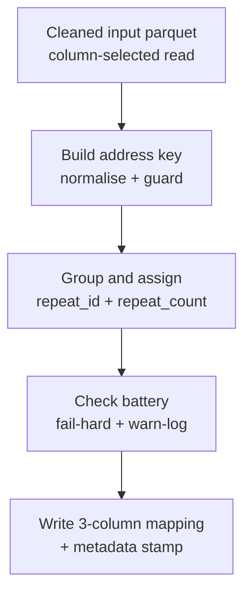
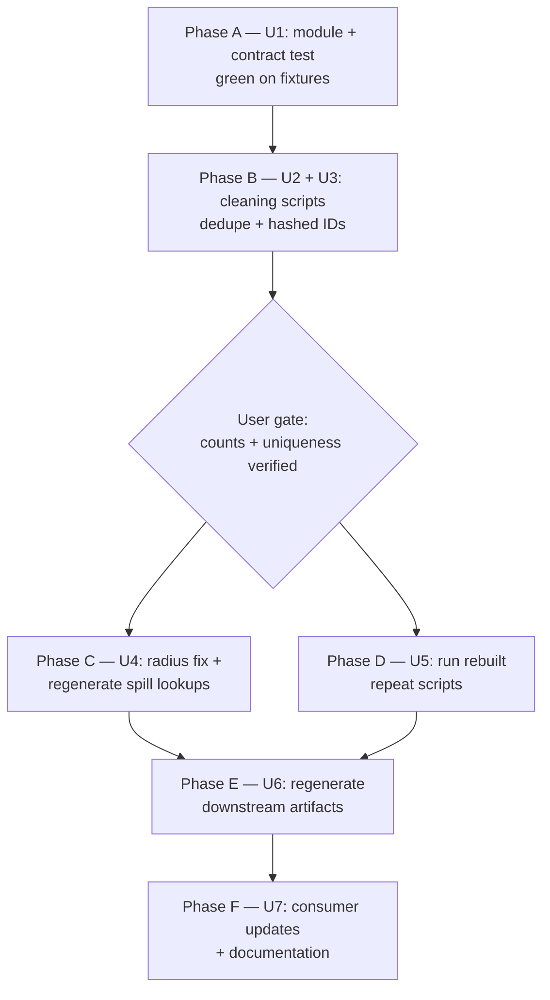

# refactor: Rebuild repeat_rentals and repeat_sales on content-stable IDs

> **SUPERSEDED (2026-08-14).** Do not implement from this document. The consolidated plan `docs/plans/2026-08-14-001-refactor-repeat-transactions-consolidated-rebuild-plan.md` replaces it after a second grilling session: U4 (radius fix) and U6's doc reconciliation were completed independently in August 2026; the evidence base was re-verified (the staleness flipped to the sales side, and the rebuilt sales input contains 65 mixed-vintage duplicate `transaction_id` pairs); and new decisions were added (hashed `repeat_id`, long-run superset/subset windows, int32 contract flips, invariants-vs-manifest testing). Decisions here remain valid only as restated there.

## Summary

Rebuild `scripts/R/06_analysis_datasets/repeat_rentals.R` and `repeat_sales.R` as thin entry scripts over one shared parameterized pipeline module, keyed on content-stable transaction identifiers created upstream in the two cleaning scripts. Delete the distance-summary stage, restore the rental spill lookup to a 10 km radius, and regenerate every ID-keyed artifact so the whole `data/processed` tree sits on one ID generation.

---

## Problem Frame

A validated multi-agent review (`todos/2026-07-07-review-repeat-rentals-sales.md`) proved an active data-integrity failure: `rental_id` and `house_id` are positional row numbers, and the shipped rentals mapping (built October 2025) is misaligned with the March 2026 input rebuild — 1,266 mapped ids exceed the current input's row count, so downstream joins silently attach repeat groups to the wrong transactions. Secondary defects: 3,453 exact-duplicate rows in the cleaned Zoopla data manufacture roughly 3,400 fake zero-gap repeat pairs; the distance summary (which nothing consumes) misclassifies every property with no site in radius and pools mapping-absent ids into one fake property; the twin scripts are hand-maintained duplicates; address keys embed literal `"NA"` text.

All design decisions below were locked in the grilling session of 2026-07-07. Implementers must not re-open them; genuinely new information goes back to the user instead.

---

## Requirements

**Identity and cleaning**

- R1. `scripts/R/02_data_cleaning/clean_zoopla_data.R` removes exact duplicate rows (identical in all columns except `rental_id`) before ID assignment, logs the removed count, and records a spot-check of whether the duplicates originate in the raw inputs or are collapsed by cleaning.
- R2. `rental_id` becomes a content-stable hash of seven source fields — `postcode`, `address_line_01`, `address_line_02`, `address_line_03`, `listing_price`, `latest_to_rent`, `rented` — taken at their post-cleaning values at the current ID-assignment point (after postcode normalisation, before any derived fields), matching the composite whose uniqueness was verified in the Evidence Base. The column keeps its name.
- R3. `house_id` becomes a content-stable hash of the Land Registry `transaction_id`, keeping its column name; the `transaction_id` column is dropped from the cleaned output afterwards.
- R4. The exact hash-input serialization (field order, NA token, separator, algorithm) is documented in code comments in both cleaning scripts so IDs are recomputable from source data. The documentation must note that recomputing an ID from raw source data requires reapplying the cleaning transforms first, since the hash consumes post-cleaning values.

**Pipeline rebuild**

- R5. A new shared module `scripts/R/utils/repeat_transactions_utils.R` holds the whole repeat-identification pipeline as pure functions over a config; `repeat_rentals.R` and `repeat_sales.R` shrink to thin entry scripts that source the shared bootstrap and the module, define a config, and call it.
- R6. The mapping output has exactly three columns — the ID, `repeat_id`, `repeat_count` — at transaction grain with singles included, plus parquet key-value metadata recording input path, input row count, input modification time, and run timestamp. No pair metrics, no distance-summary stage, no spill-lookup input.
- R7. The address-matching key is postcode + `paon` + `saon` + `street` (sales) and postcode + `address_line_01`–`03` (rentals), normalised by uppercasing, whitespace squishing, punctuation stripping, and empty-string substitution for missing components — never the literal text `"NA"`. Rows missing postcode or the primary address field carry no key. No fuzzy matching.
- R8. The check battery (specified in U1's approach) runs on every execution, and a fixture contract test exists at `scripts/R/testing/test_repeat_transactions_contracts.R` following the repo's contract-test convention.

**Radius resolution and regeneration**

- R9. The rental spill lookup is rebuilt at `radius_km = 10` (the 5 km configuration was temporary), the house builder's conflicting internal radius defaults are reconciled to one explicit config value, and `todos/012-pending-p0-review-10km-site-match-scripts.md` is closed or updated accordingly.
- R10. After the cleaning scripts rerun, every ID-keyed artifact regenerates in pipeline order, and consumers are updated: the `transaction_id` reference in `scripts/R/09_analysis/03_repeat_sales/repeat_sales.R`, plus any code found by a repo-wide search for `transaction_id` or for arithmetic on the ID columns. The pipeline execution-order documentation (`docs/pipeline_documentation.md`) reflects the new module.

---

## Key Technical Decisions

- **Hash format is xxhash64 rendered as a 16-character hex string, not integer64:** R silently coerces 64-bit integers to doubles in many operations, corrupting values above 2^53 and breaking joins invisibly; strings fail loudly. Collision risk at 3.2M rows is about 1e-7 — negligible. Vectorise with `digest::getVDigest("xxhash64")`.
- **Sales identity hashes `transaction_id` rather than using it verbatim:** format symmetry with rentals; provenance stays recoverable by recomputing the hash from Land Registry source data.
- **Rentals identity keys the raw date fields (`latest_to_rent`, `rented`), not the derived `rented_est`:** `rented_est` is `coalesce(rented, latest_to_rent)` (`clean_zoopla_data.R:203`); keying the raw pair means a future change to the coalesce rule cannot churn IDs.
- **Singles stay in the mapping with a `repeat_count` column:** the file remains a census of keyable transactions, so attrition is auditable by subtraction, and consumers filter repeats without regrouping.
- **`street` stays in the sales key:** dropping it falsely merges same-numbered houses on different streets sharing a postcode (bias in the repeat-sales estimator); keeping it splits only 0.02% of groups via spelling variants (efficiency loss only). Punctuation stripping recovers the fixable subset.
- **No coordinate-consistency check:** both datasets carry ONS postcode-centroid coordinates (verified: zero postcodes with more than one distinct coordinate), so a within-group check can never fire. Property-type consistency and extreme price-ratio flags are the false-merge alarms instead.
- **The distance-summary stage is deleted, not fixed:** no script consumes either summary parquet, and three of the four high-severity review findings live in that stage. If the diagnostic is wanted later it becomes a standalone on-demand script.
- **Old positional-ID artifacts are retired by full regeneration, not bridged:** stale hash-keyed joins fail loudly (near-zero match rate), which is the desired failure mode.

---

## Evidence Base

Verified against the real data on 2026-07-07; implementers should reproduce a figure before relying on it.

| Fact | Value |
|------|-------|
| `zoopla_rentals.parquet` rows | 1,450,255; 1,446,802 after exact-duplicate removal (3,453 excess rows in 3,324 groups, identical in every column except `rental_id`) |
| Rentals natural key uniqueness | (postcode, address lines 1–3, `listing_price`, `latest_to_rent`, `rented`) exactly unique post-dedupe |
| `house_price.parquet` rows | 3,175,951; `transaction_id` exactly unique |
| Stale-mapping proof | shipped `repeated_rentals.parquet` max `rental_id` = 1,451,521 vs current input 1,450,255 rows; 1,266 ids nonexistent |
| Street in sales key | adds 2,393 real distinctions; only 683 of 3.04M groups show >1 spelling; 41 collapse with punctuation stripping, ~35 likely typos, 369 genuinely different streets |
| Coordinates | postcode centroids in both datasets (zero postcodes with >1 coordinate) |
| Spill lookups | cover all properties with NA distance beyond radius (62,369 rentals at 5 km; 148,426 houses at 10 km); rentals builder configured at 5 km despite the 10 km name |
| Key-field NAs | `rented` NA for ~1.04M rentals; `latest_to_rent` NA for ~35k; composite uniqueness verified with those NAs present |

---

## High-Level Technical Design

The shared module processes either dataset through the same five stages; only the config differs.

Execution phases and their dependencies. The repeat mappings need only the cleaned inputs — the summary stage is gone, so Phase C and Phase D run in parallel.

---

## Implementation Units

### U1. Shared pipeline module and contract test

- **Goal:** the whole repeat-identification pipeline exists as pure functions over a config, proven on synthetic fixtures before touching real data.
- **Requirements:** R5, R6, R7, R8.
- **Dependencies:** none.
- **Files:** `scripts/R/utils/repeat_transactions_utils.R` (create), `scripts/R/testing/test_repeat_transactions_contracts.R` (create), `scripts/R/06_analysis_datasets/repeat_rentals.R` (rewrite as thin entry), `scripts/R/06_analysis_datasets/repeat_sales.R` (rewrite as thin entry).
- **Approach:** module functions take (data, config) where config names the id column, date column, price column, address columns, paths, and log name. Column-selected loading via `arrow::read_parquet(col_select = ...)` plus `setDT()`; single-call grouped projection for `repeat_id` assignment (no full-width intermediate copies); `max()`-on-empty guarded with an explicit zero-row branch. The check battery: fail-hard input checks (schema, non-empty, id uniqueness, rentals zero-duplicates, dates in window), threshold checks (key-coverage floor with logged exclusion count; repeat groups above ~12 transactions written to a review file), fail-hard output checks (mapping id unique; mapping rows equal keyed input rows; `repeat_id` non-NA and finite; `repeat_count` reconciliation; metadata stamp present), and warn-only diagnostics (property-type consistency within groups, extreme annualised price-ratio pairs to a review file, repeat-share floor). R warnings route into the logger; plain non-colour log layout.
- **Execution note:** test-first — the fixture contract test is written and failing before the module functions exist.
- **Patterns to follow:** contract-test shape from `scripts/R/testing/test_merge_outputs_contracts.R`; sourced-utils pattern from `scripts/R/utils/spill_aggregation_utils.R`; bootstrap via `scripts/R/utils/script_setup.R` per `docs/solutions/best-practices/script-setup-runtime-package-cleanup-ingestion-20260310.md`; config-driven parameterization per `docs/solutions/design-patterns/parameterize-analysis-scripts-over-a-config-vector.md`.
- **Test scenarios:**
  - A fixture with two transactions at one address and one at another yields two `repeat_id` groups with `repeat_count` 2 and 1, singles included.
  - A row missing the primary address field receives no key, is absent from the mapping, and the logged exclusion count equals 1.
  - Missing secondary fields serialize as empty strings: a key built from (postcode, paon, NA saon, street) contains no literal `"NA"` text.
  - Punctuation variants match: `"ST. JOHN'S ROAD"` and `"ST JOHNS ROAD"` produce identical keys.
  - Zero-repeat input: every single gets a finite positive `repeat_id`; the finiteness assertion passes; no negative-infinity values.
  - Duplicate input ids abort with the fail-hard uniqueness check.
  - An input with a repeat group of 15 transactions lands in the collision review file without failing the run.
  - Mixed property types within one group trigger the warn-log diagnostic, not a failure.
  - The written parquet carries all four metadata fields and exactly three columns.
  - Key coverage below the configured floor aborts; coverage above it logs the excluded count.
- **Verification:** contract test green on fixtures; both entry scripts source and run against a fixture end-to-end without touching production data.

### U2. Zoopla cleaning — dedupe and hashed rental_id

- **Goal:** the cleaned rentals table is duplicate-free and carries a content-stable `rental_id`.
- **Requirements:** R1, R2, R4.
- **Dependencies:** U1 (so the downstream contract exists to test against).
- **Files:** `scripts/R/02_data_cleaning/clean_zoopla_data.R` (modify).
- **Approach:** remove exact duplicates (all columns except `rental_id`) before ID assignment; assign `rental_id` as the xxhash64 hex of the seven-field composite with a documented serialization (fixed field order, fixed NA token, fixed separator). Log the removed-duplicate count and write the raw-origin spot-check finding into the run log.
- **Test scenarios:**
  - Rerun produces exactly 1,446,802 rows (from 1,450,255) and the log records 3,453 removed.
  - `rental_id` is unique across the full output.
  - Hash determinism: recomputing the hash for a sample of 1,000 rows from their field values reproduces the stored `rental_id` exactly.
  - Two runs of the script produce byte-identical `rental_id` columns (stability under re-execution).
  - Rows with NA `rented` or NA `latest_to_rent` hash deterministically and remain unique.
- **Verification:** row count, uniqueness, and determinism checks pass; duplicate-origin spot-check written up in the log or a short note.

### U3. Land Registry cleaning — hashed house_id

- **Goal:** the cleaned sales table carries a content-stable `house_id` and no `transaction_id` column.
- **Requirements:** R3, R4.
- **Dependencies:** U1.
- **Files:** `scripts/R/02_data_cleaning/clean_lr_house_price_data.R` (modify).
- **Approach:** `house_id` becomes xxhash64 hex of the Land Registry `transaction_id`; drop `transaction_id` from the output; document the hash input in a comment so provenance is recoverable by recomputation.
- **Test scenarios:**
  - Output has 3,175,951 rows and `house_id` is unique.
  - `transaction_id` is absent from the output schema.
  - Hash determinism: recomputing from a sample of source `transaction_id` values reproduces stored `house_id`.
- **Verification:** row count preserved, uniqueness holds, schema check passes, and hash determinism holds (recomputing from source `transaction_id` values reproduces stored `house_id`).

**User gate after U2 and U3:** confirm the counts and uniqueness results above with the user before any downstream regeneration begins.

### U4. Radius resolution and spill-lookup regeneration

- **Goal:** both spill lookups are rebuilt on the new IDs at an explicit, consistent 10 km radius, closing the pending radius P0.
- **Requirements:** R9, R10 (partially — the two lookups).
- **Dependencies:** U2, U3, user gate.
- **Files:** `scripts/R/04_feature_engineering/10km_site_rental_match.R` (modify: `radius_km` 5 → 10), `scripts/R/04_feature_engineering/10km_site_house_sale_match.R` (modify: reconcile the conflicting internal radius defaults to one explicit config value), `todos/012-pending-p0-review-10km-site-match-scripts.md` (close or update).
- **Approach:** make the radius a single explicit CONFIG value in each builder and log it at run time; regenerate both lookups.
- **Test scenarios:**
  - Regenerated rentals lookup has maximum non-NA distance just under 10,000 m; same for the sales lookup.
  - Every ID in the corresponding cleaned input appears in its lookup (beyond-radius properties present with NA distance).
  - Lookup IDs are 16-character hex strings joining cleanly back to the cleaned inputs with a 100% match rate.
- **Verification:** the three checks above pass; the todos item is closed or updated with what was done.

### U5. Run the rebuilt repeat scripts

- **Goal:** fresh three-column mappings exist on the new IDs, with baselines recorded.
- **Requirements:** R5, R6, R7, R8.
- **Dependencies:** U2, U3, user gate. Runs in parallel with U4 — the pipeline no longer reads the spill lookups.
- **Files:** `data/processed/repeated_transactions/` outputs (regenerate; archive the old mapping parquets first), `scripts/R/testing/test_repeat_transactions_contracts.R` (pin observed baselines).
- **Approach:** archive `repeated_rentals.parquet` and `repeated_sales.parquet` (and the two now-orphaned `*_summary.parquet` files), run both entry scripts, record key-coverage and repeat-share baselines in the log and as pinned expectations in the contract test.
- **Test scenarios:**
  - Full check battery passes on both real datasets.
  - Mapping row counts equal keyed input rows; logged exclusion counts equal input rows minus mapping rows.
  - Spot check: one known repeat property (from the review's Birmingham sample or the log's largest legitimate group) resolves to a single `repeat_id`.
- **Verification:** both runs complete with the battery green; baselines pinned; old artifacts archived, not deleted.

### U6. Regenerate downstream ID-keyed artifacts

- **Goal:** every artifact keyed on the old positional IDs is rebuilt on the new generation — no stale/fresh mixing anywhere in `data/processed`.
- **Requirements:** R10.
- **Dependencies:** U4, U5.
- **Files:** the ID-keyed outputs of `scripts/R/06_analysis_datasets/` (cross-sections, panels, prior-to-sale and prior-to-rental datasets), regenerated by running those scripts in the order given by `docs/pipeline_documentation.md`; `docs/pipeline_documentation.md` (modify: reconcile the Layer 06 execution order before Phase E runs); a new standalone match-rate verification script under `scripts/R/testing/` (create).
- **Approach:** before running anything, reconcile the Layer 06 execution order in `docs/pipeline_documentation.md` against the actual contents of `scripts/R/06_analysis_datasets/` — it currently lists only 12 of the 16 scripts, omitting `house_spill_prior_to_sale.R`, `rental_spill_prior_to_rental.R`, `repeat_rentals.R`, and `repeat_sales.R` — and include `house_spill_prior_to_sale.R` and `rental_spill_prior_to_rental.R` in the regeneration set (both are keyed on `house_id`/`rental_id`). Run the scripts unchanged in the corrected order. Match-rate checks run as a standalone verification script under `scripts/R/testing/` (following the `diff_*`/`reconcile_*` precedent, e.g. `diff_ch10_site_keyed_consumers.R`): it joins each regenerated artifact's ID column back to its cleaned input and fails on any match rate below 100% — a near-zero match rate indicates a missed regeneration upstream and stops the sequence.
- **Test scenarios:** Test expectation: none — this unit executes existing scripts unchanged; correctness is carried by their own logs plus the standalone match-rate verification script.
- **Verification:** the standalone verification script confirms every regenerated artifact's ID join back to its cleaned input matches at 100%; no script in the sequence errors or warns about missing ids.

### U7. Consumer updates and documentation

- **Goal:** all consumers work on the new IDs, and the plan's paper trail is closed out.
- **Requirements:** R10.
- **Dependencies:** U6.
- **Files:** `scripts/R/09_analysis/03_repeat_sales/repeat_sales.R` (modify: remove the `transaction_id` select); the ~20 known consumers that deselect `transaction_id` and will hard-error after R3 — the live scripts under `scripts/R/09_analysis/02_hedonic/` (7) and `scripts/R/09_analysis/06_upstream_downstream/` (13) plus `scripts/R/testing/test_lsoa_variation_updown_prior.R` (modify); any further files surfaced by a repo-wide search for `transaction_id` or arithmetic on ID columns (modify as found); `docs/pipeline_documentation.md` (update: name the new module and refresh dependency notes — the Layer 06 run-list reconciliation itself happens in U6); `todos/2026-07-07-review-repeat-rentals-sales.md` (check off resolved findings).
- **Approach:** grep-driven sweep for `transaction_id` and for integer-ID assumptions (`rental_id +`, `seq_len` over ids, `max(.*_id)`); fix each; rerun the affected 09_analysis outputs.
- **Test scenarios:**
  - The Palmquist script runs end-to-end on the new mappings and produces its regression table.
  - Repo-wide search for `transaction_id` returns no live references outside the cleaning script's hash comment.
- **Verification:** affected analyses rerun cleanly; `docs/pipeline_documentation.md` names the new module; review findings checked off with status notes.

---

## Execution Chunking (multi-thread)

CH1 = U1. CH2 = U2 + U3 in one thread, ending at the user gate. After the gate, CH3 = U4 and CH4 = U5 in parallel. CH5 = U6 + U7 last. Do not launch CH3/CH4 before the gate clears.

---

## Scope Boundaries

- No fuzzy or edit-distance address matching — decided against on bias grounds (false merges corrupt the estimator; splits only lose observations).
- No change to downstream estimator logic: dropping extreme price-ratio pairs stays a decision inside the Palmquist analysis script; the mapping only flags them.
- No semantic rename of `house_id` (it labels a transaction row, not a property); the grain is documented in the cleaning script instead of renamed across the repo.

### Deferred to Follow-Up Work

- A standalone on-demand diagnostic for "repeat properties near spill sites", replacing the deleted summary stage, if the descriptive statistics are wanted for the paper.
- The wider `06_analysis_datasets` migration to the shared `script_setup.R` bootstrap and deduplicated helpers across the other 14 scripts (staged migration per the best-practices doc).
- Deciding whether the canonical `scripts/R/utils/postcode_processing_utils.R` normaliser (which maps literal `"NA"` strings to missing) should replace local postcode handling repo-wide — a deliberate convergence, not a drop-in swap.

---

## Risks & Dependencies

- **ID churn on cleaning-rule changes:** hashes key off cleaned field values, so a future change to address or postcode normalisation regenerates IDs. The failure is loud (match rates crater) but regeneration discipline becomes mandatory; the metadata stamp and match-rate logs are the tripwires.
- **Rentals lookup at 10 km:** roughly four times the pair-table area of the 5 km build — expect a longer spatial join and a larger output. The existing 10 km house lookup is the scale reference.
- **NA-heavy key fields:** `rented` is NA for about 1.04M rentals and `latest_to_rent` for about 35k. The NA token must serialize deterministically in the hash input; composite uniqueness was verified with those NAs present.
- **Full-regeneration cost:** Phase E touches most of layer 06 and most of layer 09 (the ~20 `transaction_id`-deselecting consumers must be modified and rerun); `docs/pipeline_documentation.md` is the authority on sequence — U6 reconciles its Layer 06 run list before executing and U7 completes the documentation update, or the next contributor inherits a wrong map.

---

## Sources & Research

- Review report and validated findings: `todos/2026-07-07-review-repeat-rentals-sales.md` (run artifacts under `/tmp/compound-engineering/ce-code-review/20260707-150922-3129613e/`, machine-local).
- Radius P0: `todos/012-pending-p0-review-10km-site-match-scripts.md`.
- Conventions: `docs/solutions/design-patterns/parameterize-analysis-scripts-over-a-config-vector.md`; `docs/solutions/best-practices/script-setup-runtime-package-cleanup-ingestion-20260310.md`; contract-test pattern in `scripts/R/testing/test_merge_outputs_contracts.R`.
- Key code locations: `rented_est` derivation at `scripts/R/02_data_cleaning/clean_zoopla_data.R:203`; positional ID assignment at `clean_zoopla_data.R:262` and `scripts/R/02_data_cleaning/clean_lr_house_price_data.R:219`; downstream join at `scripts/R/09_analysis/03_repeat_sales/repeat_sales.R:99`.
