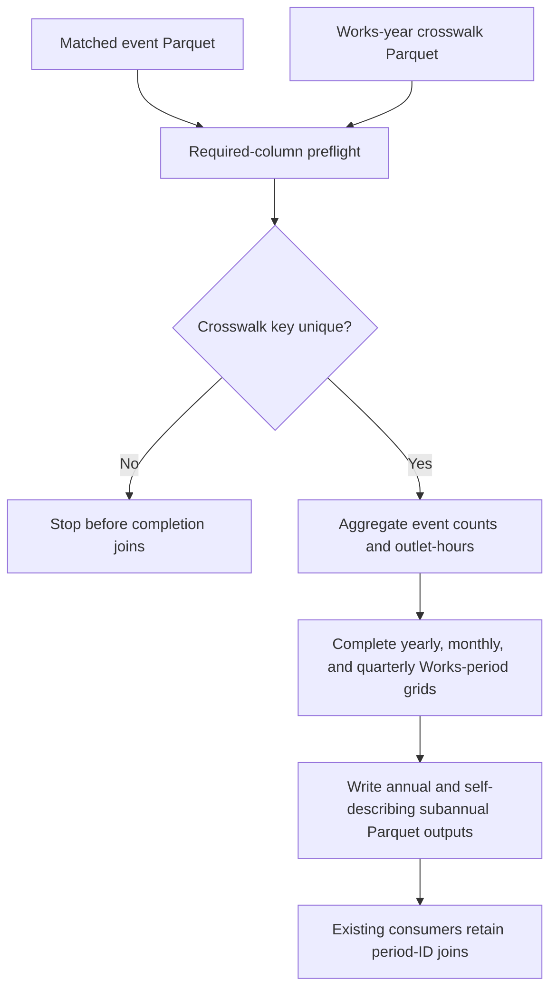
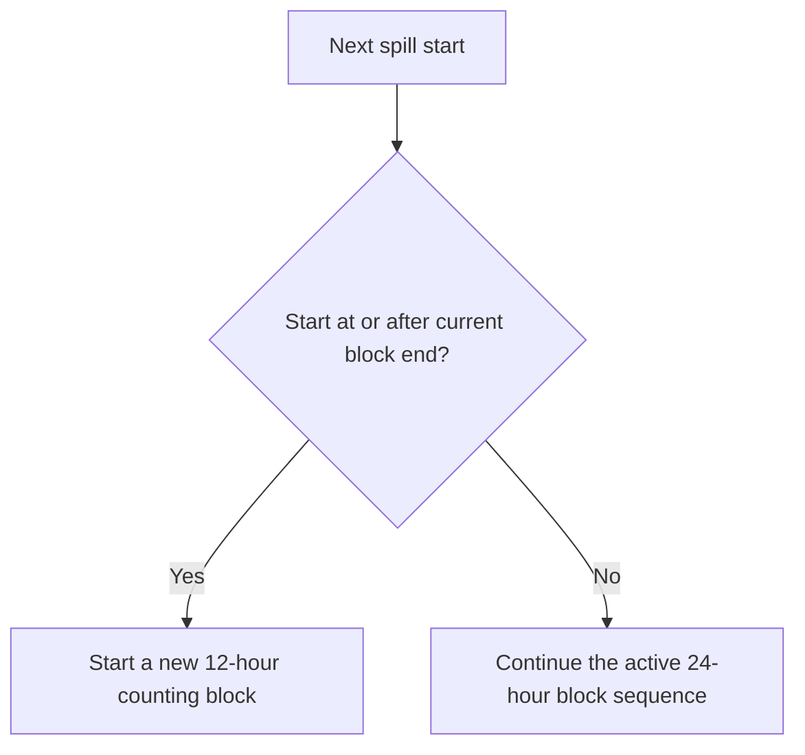

# Aggregate Spill Statistics Low-Severity Findings - Plan

## Goal Capsule

- **Objective:** Close the remaining low-severity findings for the main spill aggregation without changing its Works-level estimands, missing-value policy, or downstream period-ID contracts.
- **Authority:** The decisions approved in the 2026-08-10 planning conversation govern implementation. The review record in `todos/2026-07-07-review-aggregate_spill_stats.md` supplies the defect evidence.
- **Execution profile:** Make focused changes to spill counting, aggregation contracts, shared logging, tests, and documentation. Use R 4.6.0 with the `rv`-activated project environment and plain `Rscript` commands.
- **Stop conditions:** Stop if the proposed calendar columns create a downstream join fanout, if the metadata key is not unique in the canonical crosswalk, or if verification reveals changes beyond the exact block-boundary count correction and additive output columns.
- **Tail ownership:** Regenerate the canonical spill aggregates, reconcile the new outputs against a pre-change snapshot, update the review record with evidence, and remove abandoned or superseded code from the diff.

---

## Product Contract

### Summary

This plan hardens spill counting at an exact block boundary, makes monthly and quarterly outputs self-describing, enforces local input and grain contracts, standardizes startup and file logging, and refreshes the script's documentation. It preserves existing period IDs and all current aggregation semantics outside the reviewed boundary case.

### Problem Frame

The major spill-aggregation defects have already been corrected, but the remaining review findings expose small weaknesses at important boundaries. `count_spills()` mishandles an event that starts exactly when the current counting block ends. The completed subannual outputs retain only synthetic period IDs, which forces consumers to know the configured base year. The script also relies on upstream crosswalk guarantees without checking them locally, and its startup, log file, header, and function documentation predate the repository's current conventions.

These issues are low severity because the exact timestamp case is rare, the canonical crosswalk is currently valid, and existing consumers understand the period-ID convention. They remain worth fixing because each has a small, established repository-level solution and because silent join fanout or documentation drift would be expensive to diagnose later.

### Requirements

**Counting behavior**

- R1. A spill that starts exactly at the current 12/24 counting-block end must begin a new 12-hour counting block.
- R2. The exact monthly boundary implementation and positive-duration filtering that closed review finding 9 must remain unchanged and covered by existing tests.

**Output and input contracts**

- R3. Monthly outputs must retain `year`, `month`, and `month_id`; quarterly outputs must retain `year`, `quarter`, and `qtr_id`.
- R4. `month_id` and `qtr_id` must preserve their current formulas relative to `CONFIG$base_year`, so existing joins and fixed effects remain compatible.
- R5. Both input Parquet files must be checked for their required columns before full processing begins.
- R6. Works-year metadata must be unique on `site_id`, `year`, and `water_company` before any completion join; malformed input must fail rather than be silently deduplicated.
- R7. Completed yearly, monthly, and quarterly outputs must contain exactly one row per declared output key.

**Startup, logging, and documentation**

- R8. The script must use the repository's shared fail-fast package and logging bootstrap, with no runtime package installation in the entry script.
- R9. Persistent logs must use the basename `aggregate_spill_stats.log` and a plain layout with no ANSI escape bytes.
- R10. The script header must state its purpose, author, creation and modification dates, concrete inputs, concrete outputs, and log path using the approved pipeline-header format.
- R11. All function documentation and nearby explanatory comments must describe the current yearly, monthly, and quarterly behavior using the canonical Works vocabulary.
- R12. Direct repository documentation and the original review record must reflect the final script contract and resolution status.

**Preservation**

- R13. The change must preserve annual-status handling, EA fallback rules, outlet-hour semantics, Works-level spill-count semantics, output row membership, and existing period-ID values.
- R14. Existing consumers must continue to work without a coordinated downstream migration; explicit calendar columns are additive.

### Acceptance Examples

- AE1. **Exact block boundary**
  - **Covers:** R1
  - **Given:** One spill from hour 0 to hour 1 and a second spill from hour 36 to hour 37.
  - **When:** The events are counted with the 12/24 method.
  - **Then:** The result is two spills because the second event starts at the excluded end of the current block.
- AE2. **Boundary neighborhood**
  - **Covers:** R1
  - **Given:** Otherwise identical second events beginning one second before, exactly at, and one second after the current block end.
  - **When:** Each fixture is counted.
  - **Then:** The pre-boundary event remains in the active block sequence, while the exact and post-boundary events start new sequences.
- AE3. **Self-describing month and quarter**
  - **Covers:** R3, R4
  - **Given:** A completed monthly or quarterly Works-period row.
  - **When:** Its calendar columns are compared with its synthetic period ID.
  - **Then:** Both representations identify the same configured calendar period.
- AE4. **Duplicate Works-year metadata**
  - **Covers:** R6
  - **Given:** Two crosswalk rows with the same `site_id`, `year`, and `water_company`, whether their values agree or conflict.
  - **When:** Completion is attempted.
  - **Then:** Processing stops before any join can multiply rows.
- AE5. **Missing input column**
  - **Covers:** R5
  - **Given:** An event or crosswalk Parquet fixture missing one required column.
  - **When:** Input preflight runs.
  - **Then:** Processing stops with an error that identifies the input and missing column.
- AE6. **Plain persistent log**
  - **Covers:** R8, R9
  - **Given:** Logging is initialized against a temporary file and writes a known message.
  - **When:** The file is read as raw bytes.
  - **Then:** It contains the message and no ANSI escape byte.

### Scope Boundaries

- Do not redesign the Environment Agency 12/24 counting algorithm beyond the reviewed equality condition and its comments.
- Do not reopen finding 9 or alter the current half-open monthly interval behavior.
- Do not change `annual_status`, zero-fill, EA fallback, outlet-hour, or Works-count policies.
- Do not remove or renumber `month_id` or `qtr_id`.
- Do not migrate downstream consumers to the new calendar columns in this change; named selections and existing ID joins remain valid.
- Do not introduce a validation package or a general schema framework. Small local helpers should follow existing repository patterns.
- Do not broaden bootstrap migration across unrelated scripts. The shared logger default and this entry script are the only startup surfaces in scope.
- Do not rewrite analysis books that merely use period IDs correctly. Refresh the target script, its direct pipeline description, its tracked test notebook reference, and the review record.

---

## Planning Contract

### Key Technical Decisions

- KTD1. **Treat a counting-block endpoint as excluded.** Change the reset comparison so an event at or after `block_end` starts a new 12-hour block. Add fixtures immediately around the endpoint to preserve the distinction. (session-settled: user-approved — chosen over retaining strict positive-gap behavior: the current condition counts an empty elapsed block at equality.) Governs R1 and R2.
- KTD2. **Publish calendar columns alongside synthetic IDs.** Keep both representations in the monthly and quarterly outputs instead of replacing the stable join keys. (session-settled: user-approved — chosen over ID-only outputs: explicit calendar columns remove hidden base-year knowledge without breaking consumers.) Governs R3, R4, R13, and R14.
- KTD3. **Fail locally on malformed input and duplicate metadata keys.** Mirror the existing Parquet preflight pattern and reject duplicate Works-year keys before completion joins; do not use `distinct()` as an implicit repair. (session-settled: user-approved — chosen over trusting the upstream producer alone: the aggregation script owns the point where a duplicate would become join fanout.) Governs R5, R6, and R7.
- KTD4. **Adopt the shared bootstrap and make its persistent layout plain.** Migrate the entry script to `script_setup.R`, keep script-specific initialization thin, and change the shared logger layout to `layout_glue`. (session-settled: user-approved — chosen over a script-local formatter: the repository has one approved startup helper and file logs should not contain terminal control bytes.) Governs R8 and R9.
- KTD5. **Refresh documentation from the current data contract.** Use the standard header shape and the canonical term Works; document every returned period and every written artifact. (session-settled: user-directed — chosen over patching only the previously enumerated sentences: the script has changed substantially since its original documentation was written.) Governs R10, R11, and R12.

### High-Level Technical Design

### Patterns to Follow

- `scripts/R/02_data_cleaning/clean_lr_house_price_data.R` for the standard header, `here` preflight, `REQUIRED_PACKAGES`, `LOG_FILE`, thin environment and logging wrappers, and direct-execution guard.
- `scripts/R/05_data_integration/merge_individ_annual_location.R` for `INPUT_CONTRACT`, Parquet schema preflight, informative `stop(..., call. = FALSE)`, and project-rooted paths.
- `scripts/R/02_data_cleaning/combine_api_edm_data_2024_onwards.R` for reading only required Parquet columns and making schema failures identify the offending input.
- `scripts/R/testing/test_spill_time_boundaries.R` and `scripts/R/testing/test_aggregate_spill_stats_crosswalk_contracts.R` for lightweight contract tests that source production code and use explicit assertions without introducing `testthat`.
- `docs/solutions/best-practices/data-cleaning-script-header-bootstrap-standardisation-20260310.md` for the approved startup and documentation migration boundary.
- `CONCEPTS.md` for the meanings of Works, Monitored Discharge Point, and Annual Status.

### Sequencing

1. Characterize and correct the counting boundary in the shared aggregation utility.
2. Add input/grain contracts and calendar columns in the main aggregator, with contract coverage.
3. Migrate startup and logging, then refresh direct documentation against the settled data contract.
4. Run focused and end-to-end verification, reconcile regenerated outputs, and close the review findings with evidence.

### System-Wide Impact

- Changing `scripts/R/utils/script_setup.R` from a colored to a plain layout affects every entry script already using the shared helper. Message content, thresholds, appenders, and file paths remain unchanged; only ANSI styling is removed from both file and tee output.
- Adding calendar columns changes the Parquet schemas but not their keys or existing columns. Current production consumers use named selections or period-ID joins, so extra columns are compatible.
- Rejecting duplicate metadata can turn a previously silent upstream defect into an explicit pipeline failure. That is the intended failure mode because proceeding would corrupt row grain.
- Regenerating `agg_spill_mo.parquet` and `agg_spill_qtr.parquet` should only add calendar columns and reflect any genuine exact-boundary count corrections. Hours and annual-status semantics must not move.

### Risks and Mitigations

- **Shared logger regression:** Plain layout could inadvertently alter whether tee logging reaches the file. Cover both file-only and tee paths with a temporary-file contract test.
- **Join-key overreach:** Including non-key calendar columns in a downstream dynamic merge could narrow matches unexpectedly. Confirm that the dry-spill integration continues to derive join keys only from columns common to both inputs and that output keys remain unique.
- **Unintended count changes:** The equality fix could expose more exact-boundary cases than expected. Compare regenerated counts with a pre-change snapshot and explain every changed Works-period using event timestamps.
- **Schema drift hidden by in-memory tests:** Contract fixtures can pass while export selections still omit a field. Regenerate and inspect the actual Parquet schemas as a required gate.
- **Documentation divergence:** Updating only the header would leave roxygen and the pipeline description stale. Audit every function and direct documentation surface in the same unit.

---

## Implementation Units

### U1. Correct the 12/24 exact-boundary rule

- **Goal:** Make exact block endpoints follow half-open interval semantics without refactoring the counting algorithm.
- **Requirements:** R1, R2, R13; KTD1; covers AE1 and AE2.
- **Dependencies:** None.
- **Files:**
  - `scripts/R/utils/spill_aggregation_utils.R`
  - `scripts/R/testing/test_spill_time_boundaries.R`
- **Approach:**
  1. Add characterization fixtures for starts immediately before, exactly at, and immediately after the active block end.
  2. Change only the equality behavior in `count_spills()`.
  3. Rewrite the surrounding reset comments in terms of the current block endpoint rather than a misleading gap since the prior event.
  4. Keep the month/year splitting logic that resolved finding 9 untouched.
- **Execution note:** Add the exact-boundary assertion first and observe it fail before changing the production condition.
- **Test scenarios:**
  - Covers AE1. Two short spills at hours 0-1 and 36-37 return a count of two.
  - Covers AE2. A second spill beginning one second before the boundary remains in the active block sequence.
  - Covers AE2. Second spills beginning exactly at and one second after the boundary start new sequences.
  - A single long spill still creates the same 12-hour and subsequent 24-hour counts as before.
  - Existing month-crossing, exact month-end, exact year-end, UTC, and Europe/Rome fixtures remain unchanged.
- **Verification:** The focused boundary test passes and the diff in `count_spills()` is limited to the equality rule and accurate comments.

### U2. Enforce aggregation contracts and publish calendar columns

- **Goal:** Fail before malformed inputs can fan out joins and make subannual output rows interpretable without external base-year knowledge.
- **Requirements:** R3-R7, R13, R14; KTD2 and KTD3; covers AE3-AE5.
- **Dependencies:** None.
- **Files:**
  - `scripts/R/03_data_enrichment/aggregate_spill_stats.R`
  - `scripts/R/testing/test_aggregate_spill_stats_crosswalk_contracts.R`
- **Approach:**
  1. Declare the required event and crosswalk columns near configuration and preflight both Parquet schemas before loading data.
  2. Narrow reads to the declared columns so unrelated upstream schema changes do not enter this stage.
  3. Add a small local key-uniqueness assertion and call it on the Works-year-company metadata before completion joins and on each completed dataset before export, including direct test callers.
  4. Remove silent metadata deduplication once the invariant is explicit.
  5. Retain `year` plus `month` or `quarter` in the final subannual selections while preserving `month_id` and `qtr_id` unchanged.
  6. Exercise the production key assertions and calendar-ID consistency in the contract test rather than adding a general validation framework.
- **Execution note:** Extend the existing crosswalk contract fixtures before changing output selections or join behavior.
- **Test scenarios:**
  - Covers AE3. Monthly rows contain `year`, `month`, and `month_id`, with the configured mapping holding for both configured years.
  - Covers AE3. Quarterly rows contain `year`, `quarter`, and `qtr_id`, with the configured mapping holding for both configured years.
  - Covers AE4. An exact duplicate metadata key fails before completion rather than being silently collapsed.
  - Covers AE4. A duplicate key with conflicting annual status or EA totals fails with the same key-level contract error.
  - Covers AE5. Event and crosswalk fixtures missing one required column identify the input and column in the error.
  - Completed yearly, monthly, and quarterly fixtures are unique on their declared keys.
  - Existing `reported_positive`, `reported_zero`, `reported_na`, `absent`, EA-only, simultaneous-outlet, zero-fill, and yearly/subannual reconciliation cases continue to pass.
- **Verification:** Both focused contract scripts pass; the in-memory schemas include the additive calendar columns; no row count, period ID, status, or spill-hour expectation changes.

### U3. Standardize bootstrap, logging, and direct documentation

- **Goal:** Align the entry script with the approved pipeline header/bootstrap contract and produce readable persistent logs while documenting the current behavior end to end.
- **Requirements:** R8-R12, R13; KTD4 and KTD5; covers AE6.
- **Dependencies:** U2.
- **Files:**
  - `scripts/R/03_data_enrichment/aggregate_spill_stats.R`
  - `scripts/R/utils/script_setup.R`
  - `scripts/R/testing/test_script_setup.R`
  - `scripts/R/testing/test_count_spill_function.Rmd`
  - `docs/pipeline_documentation.md`
- **Approach:**
  1. Replace the legacy banner with the approved purpose/author/date/inputs/outputs header and use Works terminology.
  2. Add the upfront `here` check, source the shared setup helper locally, declare explicit required packages and `LOG_FILE`, and fail fast through `check_required_packages()`.
  3. Keep package attachment and logger initialization in thin script-specific wrappers; remove runtime installation from this entry script.
  4. Change the shared logger layout to plain `layout_glue` without changing appenders, thresholds, or console-selection behavior.
  5. Add a focused setup contract test that writes to temporary file-only and tee logs and checks message presence plus absence of ANSI escape bytes.
  6. Rewrite all roxygen blocks and misleading comments so yearly, monthly, and quarterly inputs, outputs, Works grain, outlet-hour behavior, and imported utility ownership are accurate.
  7. Update the tracked test notebook's log reference and expand the direct pipeline description with the canonical inputs and outputs; do not rewrite unrelated analysis books.
- **Execution note:** Treat bootstrap migration as behavior-preserving except for fail-fast dependency handling, the new log basename, and plain formatting.
- **Test scenarios:**
  - Covers AE6. File-only logging writes a known message without an ANSI escape byte.
  - Covers AE6. Tee logging still writes the same message to its file without an ANSI escape byte.
  - Sourcing `aggregate_spill_stats.R` in a fresh environment defines functions without running `main()`.
  - The target script contains no runtime `install.packages()` call and points missing dependencies to `rv sync`.
  - The script parses after header, setup, and roxygen changes.
  - Direct documentation names all three output Parquet files and the Works-year crosswalk input.
- **Verification:** The new setup test and parse/source smoke checks pass; live source and documentation contain no stale `12_aggregate_spill_stats.log` reference; generated file logs contain plain text.

### U4. Reconcile outputs and close the review record

- **Goal:** Prove that only the intended behavior and schema changed, then record the evidence against the original findings.
- **Requirements:** R2, R7, R12-R14; KTD1-KTD5.
- **Dependencies:** U1, U2, U3.
- **Files:**
  - `todos/2026-07-07-review-aggregate_spill_stats.md`
  - Generated `data/processed/agg_spill_stats/agg_spill_yr.parquet`
  - Generated `data/processed/agg_spill_stats/agg_spill_mo.parquet`
  - Generated `data/processed/agg_spill_stats/agg_spill_qtr.parquet`
  - Generated `output/log/aggregate_spill_stats.log`
- **Approach:**
  1. Snapshot the current canonical aggregate files outside the repository diff, then run the revised aggregation entrypoint.
  2. Compare schemas, row keys, IDs, statuses, EA fields, spill hours, and spill counts against the snapshot.
  3. Require identical row membership, key uniqueness, period IDs, statuses, EA fields, and hours; restrict count differences to event groups that begin exactly at a 12/24 block endpoint.
  4. Confirm monthly and quarterly calendar columns agree with their IDs on the written Parquet files.
  5. Write concise resolution notes and verification evidence for findings 8 and 10-13. Keep finding 9 marked closed with its existing resolution.
  6. After the new log is successfully produced, remove the orphaned unversioned `output/log/12_aggregate_spill_stats.log` file.
- **Test expectation:** No new test file belongs to this evidence-and-closure unit; it consumes the focused tests from U1-U3 and validates the generated artifacts.
- **Verification:** Every output difference is either an additive calendar column or an explained exact-boundary count correction, all open low findings are marked resolved, and finding 9 remains closed.

---

## Verification Contract

Run all commands from the repository root with R 4.6.0 after `rv sync`. Use plain `Rscript` so `.Rprofile` activates the `rv` project library; do not use `--vanilla`.

| Gate | Command | Proves | Applies to |
|---|---|---|---|
| Parse target and helpers | `Rscript -e "parse(file='scripts/R/03_data_enrichment/aggregate_spill_stats.R'); parse(file='scripts/R/utils/spill_aggregation_utils.R'); parse(file='scripts/R/utils/script_setup.R')"` | Startup, documentation, and utility edits remain valid R | U1-U3 |
| Source target safely | `Rscript -e "source('scripts/R/03_data_enrichment/aggregate_spill_stats.R', local = new.env(parent = globalenv()))"` | The entry script can be sourced without executing the pipeline | U3 |
| Spill boundary contracts | `Rscript scripts/R/testing/test_spill_time_boundaries.R` | Exact 12/24 boundary behavior and existing calendar-boundary behavior | U1 |
| Aggregation contracts | `Rscript scripts/R/testing/test_aggregate_spill_stats_crosswalk_contracts.R` | Status semantics, calendar columns, required schemas, uniqueness, and reconciliation | U2 |
| Shared logging contract | `Rscript scripts/R/testing/test_script_setup.R` | File and tee appenders emit plain persistent logs | U3 |
| Full aggregation run | `Rscript scripts/R/03_data_enrichment/aggregate_spill_stats.R` | Real inputs pass preflight and canonical Parquet outputs are regenerated | U4 |
| Stale setup scan | `rg -n "install\\.packages\\(|12_aggregate_spill_stats\\.log|layout_glue_colors" scripts/R/03_data_enrichment/aggregate_spill_stats.R scripts/R/testing/test_count_spill_function.Rmd` | The target entrypoint and direct notebook no longer carry obsolete setup or log references | U3 |

The full-run reconciliation must also establish these outcomes on disk:

- Yearly keys remain unique on `site_id`, `water_company`, and `year`.
- Monthly keys remain unique on `site_id`, `water_company`, and `month_id`; `year` and `month` agree with `CONFIG$base_year`.
- Quarterly keys remain unique on `site_id`, `water_company`, and `qtr_id`; `year` and `quarter` agree with `CONFIG$base_year`.
- Row membership, annual statuses, EA fields, spill hours, and period IDs match the pre-change snapshot.
- Every spill-count difference traces to an exact counting-block endpoint.
- `output/log/aggregate_spill_stats.log` is readable plain text and the stale old log has been removed.

---

## Definition of Done

- R1-R14 are satisfied and AE1-AE6 are covered by focused tests or generated-artifact verification.
- `count_spills()` handles exact endpoints correctly while existing month and year boundary contracts remain green.
- Both source Parquets fail preflight clearly when required columns are absent.
- Duplicate Works-year metadata cannot reach a completion join.
- Written subannual Parquet files contain explicit calendar columns and preserve existing period IDs and keys.
- The target entry script follows the approved header and shared fail-fast bootstrap pattern.
- Shared persistent logs contain no ANSI styling, and the renamed aggregate log replaces the stale generated file.
- The target script, direct pipeline description, tracked notebook reference, roxygen blocks, comments, and review record agree on current behavior.
- Focused contract tests, parse/source checks, the full aggregation run, and output reconciliation all pass.
- No unrelated consumer migration, validation framework, generated diagnostic artifact, dead-end helper, or abandoned experimental code remains in the diff.

---

## Appendix

### Sources and Research

- `todos/2026-07-07-review-aggregate_spill_stats.md` — original findings, evidence, and already-resolved boundary work.
- `docs/solutions/best-practices/data-cleaning-script-header-bootstrap-standardisation-20260310.md` — approved header and bootstrap migration contract.
- `docs/solutions/best-practices/script-setup-runtime-package-cleanup-ingestion-20260310.md` — shared setup ownership and smoke-verification precedent.
- `docs/solutions/best-practices/edm-api-combine-hardening-20260310.md` — narrow Parquet reads, fail-fast contracts, and focused regression checks.
- `docs/solutions/best-practices/data-enrichment-readme-standardisation-20260310.md` — direct script inventory documentation derived from actual configured inputs and outputs.
- `scripts/R/02_data_cleaning/clean_lr_house_price_data.R` — current standard header and entry-script bootstrap example named by the user.
- `scripts/R/05_data_integration/merge_individ_annual_location.R` — current input preflight pattern.
- `scripts/R/testing/test_spill_time_boundaries.R` and `scripts/R/testing/test_aggregate_spill_stats_crosswalk_contracts.R` — existing contract-test style and preservation coverage.
- `CONCEPTS.md` — canonical Works and Annual Status terminology.
