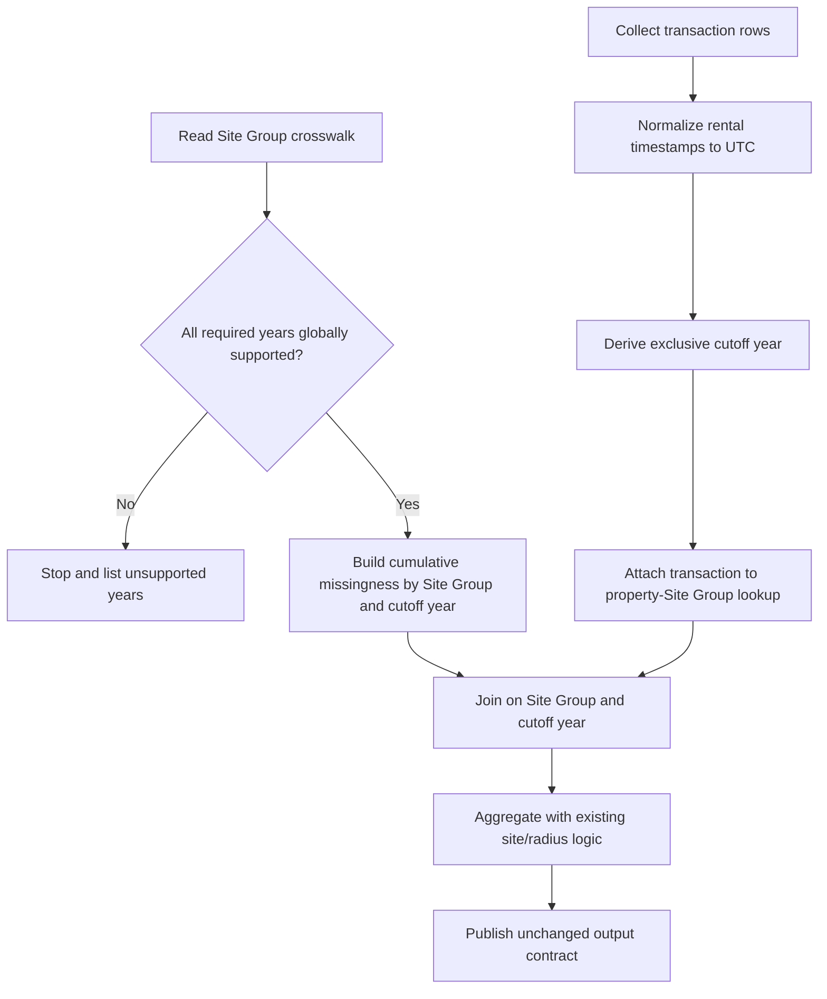

# Prior Exposure Window Contracts - Plan

## Goal Capsule

- **Objective:** Correct findings 1, 4, and 5 from the prior-exposure review so rental time comparisons are type-safe, Site Group completeness follows each transaction's exposure window, and unsupported monitoring years stop the run.
- **Authority:** The decisions approved in the 2026-08-12 planning conversation govern implementation. `todos/2026-07-07-review-prior-to-sale-rental-spill-scripts.md` supplies the defect evidence and measured impact.
- **Execution profile:** Make a focused shared-helper change, update the four prior-exposure builders consistently, and add standalone R contract tests before regenerating outputs. Use R 4.6.0 with the `rv`-activated project environment and plain `Rscript` commands.
- **Stop conditions:** Stop if the prefix contract changes Annual Status semantics, introduces transaction-to-site fanout, changes public output schemas or key grains, or requires resolving findings outside 1, 4, and 5.
- **Tail ownership:** Regenerate and reconcile all four canonical prior-exposure datasets, then update the review record with the implementation and verification evidence.

---

## Product Contract

### Summary

This plan makes transaction timestamps and monitoring completeness match the exposure interval actually used by the prior-to-sale and prior-to-rental measures. It replaces future-looking global missingness with cumulative Site Group completeness through each transaction's exclusive cutoff, and it distinguishes an unavailable Site Group-year inside a supported horizon from a year the crosswalk does not support at all.

### Problem Frame

The rental builders compare Arrow `Date` values with `POSIXct` spill timestamps. Their results currently depend on lubridate methods being attached as a side effect, so the same functions can silently produce different exposure when sourced or called in a clean namespace.

All four builders also calculate one missingness flag per Site Group over the complete sample-year range. That flag lets a monitoring gap after an early transaction invalidate exposure that was fully observable when the transaction occurred. The August outputs contain 70,708 affected sale rows and 32,911 affected rental rows with complete coverage through their own transaction year.

The same global calculation treats a year absent from the entire crosswalk as if every Site Group were individually absent. One future or malformed transaction can therefore convert every exposure to missing while the script still completes. The code needs to fail on an unsupported monitoring horizon instead of manufacturing universal absence.

### Requirements

**Transaction time contract**

- R1. Both rental builders must convert collected `rented_est` values to UTC `POSIXct` before year derivation, event comparison, event clamping, or window-length calculation.
- R2. Rental event overlap and clamping must be correct without relying on lubridate being attached to the search path.
- R3. Sale transaction timestamps must retain their existing UTC timestamp semantics.

**Transaction-specific completeness**

- R4. Each transaction must have an internal integer cutoff year derived from the UTC calendar instant immediately before its exclusive transaction endpoint.
- R5. Site Group missingness for a transaction must cover every year from `CONFIG$base_year` through that transaction's cutoff year and no later year.
- R6. Within a supported horizon, `absent` must make the current and every later prefix missing; `reported_zero`, `reported_positive`, and `reported_na` must remain available under the existing Annual Status contract.
- R7. A missing Site Group-year row inside a globally supported year must retain the existing interpretation as `absent`.
- R8. A Site Group absent entirely from the crosswalk must retain the current conservative missing fallback.
- R9. A transaction exactly at `CONFIG$window_start` must have an empty completeness interval and must not require the preceding unsupported year.

**Supported horizon and preservation**

- R10. The shared completeness workflow must stop before expansion when any required year is absent from the crosswalk's global year coverage, and the error must identify every unsupported year.
- R11. A transaction at midnight on January 1 must require coverage only through the preceding calendar year; a later transaction in that year must require the current year.
- R12. All four builders must consume the same shared prefix-completeness contract and apply it at transaction-Site Group grain.
- R13. Internal cutoff fields must not appear in final Parquet outputs, and existing output paths, radius partitions, column names, column types, row counts, and exact key sets must remain unchanged.
- R14. Radius-level builders must continue to invalidate only radii that contain a missing Site Group.

### Acceptance Examples

- AE1. **Future monitoring gap does not invalidate an earlier sale**
  - **Covers:** R4-R6, R12
  - **Given:** Site Group X is available in 2021, 2022, and 2024 but `absent` in 2023.
  - **When:** House A is sold during 2022 and House B is sold during 2024.
  - **Then:** House A's exposure remains observed, while House B's cumulative exposure is missing.
- AE2. **Rental comparison works in a clean namespace**
  - **Covers:** R1-R3
  - **Given:** `rented_est` is collected as an R `Date` and one spill overlaps the rental cutoff.
  - **When:** The rental builder is sourced without attaching lubridate and prepares the transaction.
  - **Then:** `rented_est` is UTC `POSIXct`, the overlap is retained, and its end is clamped to the rental timestamp.
- AE3. **Unsupported future year stops instead of masking all sites**
  - **Covers:** R10, R11
  - **Given:** The Site Group crosswalk supports 2021-2024.
  - **When:** One run contains only a transaction at `2025-01-01 00:00:00`, and a separate run contains a transaction later in 2025.
  - **Then:** The January 1-only run requires only 2021-2024 and succeeds. The later-2025 run requires 2025 and stops before producing output, with 2025 named as unsupported; any mixed batch containing that later transaction also stops as a whole.
- AE4. **Missing row and unsupported year remain different states**
  - **Covers:** R7, R10
  - **Given:** 2023 exists globally in the crosswalk, but one Site Group has no 2023 row.
  - **When:** Prefix completeness is derived through 2023.
  - **Then:** That Site Group is missing through 2023, while processing continues because 2023 is a supported global year.
- AE5. **Window-start transaction preserves the deferred zero-day policy**
  - **Covers:** R9, R13
  - **Given:** A transaction occurs exactly at `CONFIG$window_start`.
  - **When:** Its completeness cutoff is derived.
  - **Then:** It does not request a pre-base monitoring year; its existing zero-day exposure and rate behavior are otherwise unchanged.
- AE6. **Missingness remains radius-local**
  - **Covers:** R13, R14
  - **Given:** A reported Site Group lies inside 250 m and a missing Site Group lies between 250 m and 500 m.
  - **When:** Radius-level exposure is calculated.
  - **Then:** The 250 m exposure remains observed and the 500 m and 1,000 m exposures are missing.

### Scope Boundaries

- Address only findings 1, 4, and 5 from `todos/2026-07-07-review-prior-to-sale-rental-spill-scripts.md`.
- Do not resolve finding 2's zero-day `NaN` policy. Preserve the current boundary transaction rows while preventing a false unsupported-year or missing-site result.
- Do not change the event-feed completeness policy in finding 11. For this plan, `reported_positive` and `reported_na` remain available under the current Annual Status missingness contract.
- Do not consolidate the four builders into a shared transaction-exposure framework. The broader duplication in finding 8 remains deferred.
- Do not alter event counting, spill-hour aggregation, daily or weekly rate formulas, radius thresholds, chunking, output publication, or stale-partition behavior.
- Do not change the existing one-row-per-Site-Group `derive_site_group_missing_flags()` contract used by other consumers.
- Do not introduce a validation package, generalized date abstraction, or new dependency.

### Product Contract Preservation

The Product Contract records the decisions settled in the 2026-08-12 conversation without expanding the review scope.

---

## Planning Contract

### Key Technical Decisions

- KTD1. **Normalize rental timestamps at the collection boundary.** Convert `rented_est` once in each rental loader so all downstream comparisons use UTC `POSIXct`. (session-settled: user-approved — chosen over relying on attached lubridate methods: package attachment must not determine exposure values.) Governs R1-R3.
- KTD2. **Use transaction-specific prefix completeness.** Derive cumulative Site Group missingness from `CONFIG$base_year` through each exclusive cutoff year and join by `(site_id, cutoff_year)`. (session-settled: user-approved — chosen over one full-sample Site Group flag: future monitoring gaps cannot invalidate earlier complete exposures.) Governs R4-R9 and R12-R14.
- KTD3. **Validate support before filling missing Site Group-years.** Reject globally unsupported required years in the prefix helper, while retaining `absent` for a missing Site Group-year inside a supported year. (session-settled: user-approved — chosen over manufacturing universal absence, silently clamping, or adding a separate validation framework: unsupported horizon and missing reporting evidence are different states.) Governs R7, R10, and R11.
- KTD4. **Add a prefix helper without changing the existing helper's grain.** Keep `derive_site_group_missing_flags()` and its read wrapper intact; add a focused sibling helper that returns one row per `(site_id, cutoff_year)`. This limits the behavioral migration to the four reviewed consumers. Governs R6-R8, R10, and R12.
- KTD5. **Represent the empty pre-base prefix explicitly.** Treat the `CONFIG$window_start` boundary as an empty completeness interval for known Site Groups, without requesting `base_year - 1` from the crosswalk. This prevents false missingness while leaving the separate zero-day-rate policy untouched. Governs R9 and R13.
- KTD6. **Move missingness attachment after transaction attachment.** The transaction row must supply `cutoff_year` before a lookup pair joins prefix flags. Keep `cutoff_year` internal and preserve the existing `site_missing` and `has_missing_site` outputs. Governs R12-R14.

### High-Level Technical Design

The completeness table is a compact prefix grid. Each Site Group has one row for every requested cutoff year. An `absent` state flips `site_missing` to true at that cutoff and keeps it true thereafter. A separate empty-prefix state supports transactions exactly at the configured window start without pretending that the crosswalk covers a prior year.

### Sequencing

1. Characterize the reviewed defects and shared-helper boundaries with synthetic fixtures.
2. Add the shared prefix-completeness contract and make its focused tests pass.
3. Normalize rental timestamps and migrate all four consumers to the composite missingness join.
4. Re-run focused contracts, regenerate the four datasets, reconcile their public contracts, and close the three review findings.

### Risks and Mitigations

- **Composite-join row drift:** Prefix flags have a wider grain than the current site flag. Enforce uniqueness on `(site_id, cutoff_year)`, use the existing `assert_left_row_count()` around the composite join, and test exact transaction-Site Group pair conservation so the join can neither add nor drop lookup rows.
- **Boundary off-by-one:** Calendar-year derivation can make January 1 require the wrong year. Pin the exclusive-midnight and window-start cases with fixtures shared across sale and rental paths.
- **Silent schema drift:** An internal cutoff column could leak through wide selections. Assert exact output column sets and Arrow types for each builder family.
- **Partial parity:** Fixing only the two named site-level scripts would leave the radius-level twins semantically inconsistent. Exercise all four builders from one focused integration contract.
- **Accidental scope expansion:** Findings 2, 8, and 11 touch nearby code. Preserve their current behavior and list any newly observed issue as follow-up rather than repairing it in this change.

---

## Implementation Units

### U1. Add the shared prefix-completeness contract

- **Goal:** Provide one validated Site Group prefix table that distinguishes supported-year absence from an unsupported monitoring horizon.
- **Requirements:** R5-R11; KTD2-KTD5.
- **Dependencies:** None.
- **Files:**
  - `scripts/R/utils/site_group_utils.R`
  - `scripts/R/testing/test_site_group_consumer_contracts.R`
- **Approach:**
  1. Add a sibling to `derive_site_group_missing_flags()` that reuses the existing required-column, key, company, and Annual Status validations but returns unique `(site_id, cutoff_year)` prefixes.
  2. Validate the requested exposure years against the crosswalk's global year set before expanding Site Group-year combinations; list all unsupported years in a fatal error.
  3. Preserve the current interpretation of a missing group row inside a supported year as `absent`, and compute ordered cumulative missingness without collapsing raw annual-return records.
  4. Represent the empty interval before `CONFIG$base_year` explicitly for known Site Groups so the window-start boundary does not request unsupported history.
  5. Leave the existing one-row-per-site helper and read wrapper unchanged for other consumers.
- **Execution note:** Add characterization assertions for the current Annual Status contract before changing the reviewed consumers.
- **Patterns to follow:** Existing validation and tidyverse pipeline in `scripts/R/utils/site_group_utils.R`; standalone assertions and synthetic crosswalk fixtures in `scripts/R/testing/test_site_group_consumer_contracts.R`.
- **Test scenarios:**
  - Covers AE1. A Site Group available in 2021, 2022, and 2024 but absent in 2023 is non-missing at cutoff 2022 and missing at cutoffs 2023 and 2024.
  - Covers AE4. Removing one Site Group's 2023 row while retaining global 2023 coverage makes that group cumulatively missing without stopping the helper.
  - `reported_zero`, `reported_positive`, and `reported_na` each remain non-missing; `absent` flips the current and later prefixes to missing.
  - Requesting 2025 from a crosswalk containing 2021-2024 fails and names 2025; a non-contiguous global support gap names every missing required year.
  - Covers AE5. The explicit empty-prefix cutoff is non-missing for known Site Groups and does not make the helper require a pre-base crosswalk year.
  - A Site Group with duplicate keys, inconsistent company membership, or an invalid Annual Status still fails under the existing validation messages.
  - The prefix output is unique on `(site_id, cutoff_year)` and preserves integer identifier/year types plus logical `site_missing`.
- **Verification:** The focused consumer-contract script passes, existing projection and one-row-per-site missingness assertions remain green, and the helper's output grain and failure semantics match the declared contract.

### U2. Normalize rental transaction timestamps

- **Goal:** Remove the hidden lubridate method dependency from both rental prior-exposure builders.
- **Requirements:** R1-R3; KTD1.
- **Dependencies:** None.
- **Files:**
  - `scripts/R/06_analysis_datasets/rental_spill_prior_to_rental.R`
  - `scripts/R/06_analysis_datasets/cross_section_prior_to_rental.R`
  - `scripts/R/testing/test_prior_exposure_contracts.R`
- **Approach:**
  1. Convert collected `rented_est` values immediately to UTC `POSIXct` in both rental loaders, before keys, cutoff derivation, comparisons, or metadata calculations.
  2. Keep the existing exclusive transaction endpoint, event overlap predicate, event clamping, and window-length formula unchanged after normalization.
  3. Source each producer into an isolated environment in the new test script so identical `CONFIG`, `load_data()`, and processing function names cannot collide.
- **Execution note:** Start with a clean-search-path fixture that reproduces the mixed `Date`/`POSIXct` failure before applying the normalization.
- **Patterns to follow:** Boundary normalization and named timestamp checks from `docs/solutions/best-practices/individ-edm-combiner-safe-readability-refactor-validation-20260310.md`; isolated producer environments in `scripts/R/testing/test_property_site_match_contracts.R`.
- **Test scenarios:**
  - Covers AE2. A collected rental `Date` becomes UTC `POSIXct` without lubridate attached.
  - Covers AE2. An event that overlaps the rental is retained and clamped exactly to rental midnight in UTC.
  - An event starting exactly at the rental endpoint remains excluded under the existing half-open exposure interval.
  - The normalized rental timestamp yields the same `n_days_in_window` and cutoff behavior as an isomorphic UTC sale timestamp.
  - Both rental builders expose the same normalized timestamp contract.
- **Verification:** The new focused contract proves correct clean-namespace comparison and clamping in both rental producers; the two scripts parse and source without executing `main()`.

### U3. Apply transaction-specific completeness in all four builders

- **Goal:** Replace the global Site Group flag with the shared transaction-cutoff prefix join while preserving each builder's public output contract.
- **Requirements:** R4-R14; KTD2-KTD6.
- **Dependencies:** U1, U2.
- **Files:**
  - `scripts/R/06_analysis_datasets/house_spill_prior_to_sale.R`
  - `scripts/R/06_analysis_datasets/rental_spill_prior_to_rental.R`
  - `scripts/R/06_analysis_datasets/cross_section_prior_to_sale.R`
  - `scripts/R/06_analysis_datasets/cross_section_prior_to_rental.R`
  - `scripts/R/testing/test_prior_exposure_contracts.R`
- **Approach:**
  1. Derive the internal exclusive cutoff year on each collected transaction and request prefix completeness from `CONFIG$base_year` through the maximum required cutoff.
  2. Replace the global one-row-per-site missingness object with the composite prefix table and update logging to describe its exposure horizon and `(site_id, cutoff_year)` grain.
  3. Attach transaction metadata to property-Site Group lookup pairs before joining missingness on both keys. Keep the lookup pairs as the preserved side, use the existing `assert_left_row_count()` around the join, and retain the conservative missing fallback for a Site Group with no crosswalk record.
  4. Remove internal cutoff fields before the existing reducers and final selections so downstream site-level and radius-level schemas remain unchanged.
  5. Preserve existing radius accumulation: missing Site Groups affect only radii that include them.
- **Execution note:** Use isomorphic sale/rental fixtures first, then apply the same join-order change to all four scripts before running any full producer.
- **Patterns to follow:** Shared-contract ownership from `docs/solutions/best-practices/england-only-edm-api-contract-alignment-20260310.md`; existing `site_missing` and cumulative `has_missing_site` reducers in the four builders.
- **Test scenarios:**
  - Covers AE1. A 2022 sale and rental remain observed when the same Site Group becomes absent only in 2023; their 2024 counterparts are missing.
  - Covers AE3. A `2025-01-01 00:00:00` sale/rental requires cutoff 2024, while a later 2025 transaction fails and names 2025.
  - Covers AE5. A transaction at `CONFIG$window_start` is not falsely marked missing and retains its existing zero-day output behavior.
  - A lookup Site Group absent entirely from the crosswalk remains missing in both site-level and radius-level products.
  - The composite join preserves the exact pre-join `(transaction_id, site_id, distance_m)` rows, including the entirely absent Site Group fixture; it neither adds prefix-only rows nor drops lookup pairs.
  - Covers AE6. A missing Site Group outside 250 m but inside 500 m leaves the 250 m aggregate observed and invalidates the 500 m and 1,000 m aggregates.
  - Every builder preserves its exact output column names and types; no cutoff field appears in a result.
  - Site-level outputs remain unique on `(transaction_id, site_id, radius)` and radius-level outputs remain unique on `(transaction_id, radius)`.
  - Sale and rental paths produce identical missingness decisions for isomorphic timestamp, lookup, and crosswalk fixtures.
- **Verification:** All four isolated producer contracts pass; each composite join preserves its exact input pair set and row count; each builder's key grain and output schema match its pre-change contract; no global full-sample missingness join remains in the scoped scripts.

### U4. Reconcile regenerated datasets and close the review findings

- **Goal:** Prove the semantic changes are limited to the reviewed rows and record the evidence.
- **Requirements:** R1-R14; KTD1-KTD6.
- **Dependencies:** U1-U3.
- **Files:**
  - `todos/2026-07-07-review-prior-to-sale-rental-spill-scripts.md`
  - Generated `data/processed/cross_section/sales/prior_to_sale`
  - Generated `data/processed/cross_section/rentals/prior_to_rental`
  - Generated `data/processed/cross_section/sales/prior_to_sale_house_site`
  - Generated `data/processed/cross_section/rentals/prior_to_rental_rental_site`
- **Approach:**
  1. Snapshot the current four canonical outputs outside the repository diff, then run the revised builders.
  2. Compare schemas, radius sets, partition layout, exact key sets, row counts, and unaffected values against the snapshots.
  3. Isolate rows whose missingness changes. Every change must be attributable to a monitoring gap after the transaction's exclusive cutoff under the old global rule. Rows with the same through-cutoff completeness classification must remain value-equivalent, and no row may become newly missing because of a post-cutoff gap.
  4. Confirm unsupported-year fixtures fail before processing or publication, rather than producing an all-missing dataset.
  5. Mark findings 1, 4, and 5 resolved with concise implementation and validation evidence; leave every other finding's status unchanged.
- **Test expectation:** No new test file belongs to this reconciliation unit; it consumes the focused contracts from U1-U3 and validates the real generated artifacts.
- **Verification:** All four datasets retain their public contracts, every changed missingness flag is attributable to the agreed cutoff rule, and the review record closes only findings 1, 4, and 5.

---

## Verification Contract

Run all commands from the repository root with R 4.6.0 after `rv sync`. Use plain `Rscript` so `.Rprofile` activates the `rv` project library; do not use `--vanilla`.

| Gate | Command | Proves | Applies to |
|---|---|---|---|
| Parse shared and producer code | `Rscript -e "parse(file='scripts/R/utils/site_group_utils.R'); files <- c('house_spill_prior_to_sale.R', 'rental_spill_prior_to_rental.R', 'cross_section_prior_to_sale.R', 'cross_section_prior_to_rental.R'); invisible(lapply(file.path('scripts/R/06_analysis_datasets', files), parse))"` | All scoped source changes remain valid R | U1-U3 |
| Site Group helper contracts | `Rscript scripts/R/testing/test_site_group_consumer_contracts.R` | Annual Status semantics, prefix transitions, supported-year failure, empty-prefix behavior, and helper grain | U1 |
| Prior-exposure producer contracts | `Rscript scripts/R/testing/test_prior_exposure_contracts.R` | Rental time normalization, sale/rental parity, transaction-specific missingness, year boundaries, radius propagation, schemas, and grains | U2-U3 |
| Full sale radius-level builder | `Rscript scripts/R/06_analysis_datasets/cross_section_prior_to_sale.R` | Canonical prior-to-sale radius dataset regenerates under the new contract | U4 |
| Full rental radius-level builder | `Rscript scripts/R/06_analysis_datasets/cross_section_prior_to_rental.R` | Canonical prior-to-rental radius dataset regenerates under the new contract | U4 |
| Full sale site-level builder | `Rscript scripts/R/06_analysis_datasets/house_spill_prior_to_sale.R` | Canonical house-Site Group dataset regenerates under the new contract | U4 |
| Full rental site-level builder | `Rscript scripts/R/06_analysis_datasets/rental_spill_prior_to_rental.R` | Canonical rental-Site Group dataset regenerates under the new contract | U4 |

The generated-artifact reconciliation must also establish these outcomes:

- Each dataset contains exactly the configured 250 m, 500 m, and 1,000 m radius partitions.
- Site-level outputs preserve the exact pre-change `(house_id or rental_id, site_id, radius)` key sets and row counts; radius-level outputs preserve the exact pre-change `(house_id or rental_id, radius)` key sets and row counts. Both remain unique on those keys.
- Column names and Arrow types match the pre-change snapshots, and no cutoff field is published.
- Rows already complete or incomplete through their own cutoff remain unchanged.
- Rows previously masked only by a later monitoring gap become observed; no new row is masked by a post-transaction gap.
- Daily and weekly exposure retain `weekly = daily * 7` wherever daily exposure is defined.
- The current window-start `NaN` behavior is unchanged and remains tracked under finding 2.

---

## Definition of Done

- R1-R14 are satisfied and AE1-AE6 are covered by focused tests or generated-artifact reconciliation.
- Both rental builders operate on UTC `POSIXct` transaction timestamps without relying on attached lubridate methods.
- All four builders use one shared transaction-cutoff prefix-completeness contract.
- Unsupported required years stop before Site Group-year expansion and name every unsupported year.
- Future monitoring gaps no longer mask earlier complete transaction exposures.
- Annual Status meanings and conservative missing-site behavior remain unchanged outside the agreed cutoff rule.
- Existing output paths, radius partitions, schemas, types, exact key sets, row counts, rate formulas, and unaffected values are preserved.
- Findings 1, 4, and 5 are marked resolved with test and output evidence; all other review findings retain their prior status.
- Focused tests, parse/source checks, four full producer runs, and output reconciliation pass under R 4.6.0 with `rv`.
- No broad builder consolidation, zero-day policy change, event-feed completeness change, generalized validation framework, dead-end helper, or abandoned experimental code remains in the diff.

---

## Appendix

### Sources and Research

- `todos/2026-07-07-review-prior-to-sale-rental-spill-scripts.md` — reviewed defects, production evidence, measured impact, and current status.
- `scripts/R/utils/site_group_utils.R` — current Site Group validation and analysis-window missingness contract.
- `scripts/R/testing/test_site_group_consumer_contracts.R` — standalone shared-helper fixture and assertion style.
- `scripts/R/testing/test_property_site_match_contracts.R` — isolated-environment parity testing for house and rental producer twins.
- `docs/solutions/best-practices/england-only-edm-api-contract-alignment-20260310.md` — one shared contract for parallel pipeline consumers.
- `docs/solutions/best-practices/individ-edm-combiner-safe-readability-refactor-validation-20260310.md` — timestamp-boundary normalization and output-preservation checks.
- `docs/solutions/best-practices/edm-api-combine-hardening-20260310.md` — proportionate fatal validation and focused contract coverage.
- `docs/solutions/conventions/annual-return-rows-are-monitor-level-not-works-level.md` — constraint to derive completeness from the Site Group Register, not collapsed raw annual-return rows.
- `CONCEPTS.md` — canonical definitions of Site Group, Site Group Register, Annual Status, and Spill Exposure.
