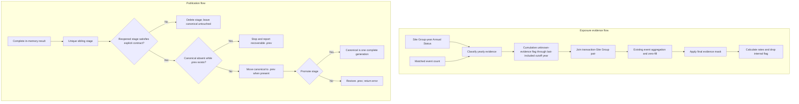

# Prior Exposure Evidence and Safe Publication - Plan

## Goal Capsule

- **Objective:** Resolve findings 6, 7, and 11 for the house-site and rental-site prior-exposure producers by distinguishing observed zero from incomplete event evidence, replacing live Arrow datasets safely, and adding only the two agreed regression checks.
- **Authority:** The decisions approved in the 2026-08-12 planning conversation govern implementation. `todos/2026-07-07-review-prior-to-sale-rental-spill-scripts.md` supplies the defect evidence and measured impact.
- **Execution profile:** Extend the transaction-specific prefix seam from `docs/plans/2026-08-12-001-fix-prior-exposure-window-contracts-plan.md`, update the two site-level producers, add one focused publication utility, and extend the existing standalone contract script. Use R 4.6.0 with the `rv`-activated project environment and plain `Rscript` commands.
- **Prerequisite:** Complete `docs/plans/2026-08-12-001-fix-prior-exposure-window-contracts-plan.md` in full, including U4 regeneration, reconciliation, review-record updates, and its Definition of Done, before modifying code under this plan. Establish this plan's comparison baseline only after that reconciled state is accepted. Stop if the prefix contract or either producer has materially diverged.
- **Stop conditions:** Stop if the fix requires changing Annual Status definitions, using annual-return totals as pre-transaction exposure, changing the public schemas or key grains, modifying the two radius-level producers, or resolving review findings outside 6, 7, and 11.
- **Tail ownership:** Regenerate and reconcile only the two named site-level datasets, then update the review record with implementation and verification evidence.

---

## Product Contract

### Summary

The two site-level producers will treat detailed spill events as usable only when Annual Status and matched-event evidence show no contract-defined detailed-event evidence gap through the transaction cutoff. Unknown evidence will make cumulative count and hours `NA` without changing the existing public `site_missing` meaning. Each finished radius-partitioned dataset will be written and validated away from the live path before one controlled replacement.

### Problem Frame

The detailed event feed contains positive events rather than a complete Site Group-year panel. The current producers nevertheless zero-fill unmatched transaction-site aggregates. A `reported_positive` year with no matched events is therefore interpreted as zero, or silently omitted from a cumulative total, even though the detailed exposure is unknown. The same problem applies more directly to `reported_na` and `absent` years. Because a later zero-fill occurs after aggregation, masking only an intermediate table would not be sufficient.

The producers also write directly into the canonical Hive-partitioned Arrow directories. Re-running with a smaller radius configuration leaves obsolete partitions behind, and a failed write can expose a mixture of old and new files. The current production outputs are valid, but the publication method does not preserve that guarantee.

The original finding 7 proposal listed a broad producer test suite. For this project, that scope is disproportionate. The durable risks introduced by these fixes are covered by one final-output evidence fixture and one two-run publication fixture.

### Requirements

#### Exposure evidence

- R1. `matched_event_count` in the Site Group crosswalk must be the authoritative indicator that detailed events were matched for a Site Group-year.
- R2. A Site Group-year must have unknown exposure evidence when Annual Status is `reported_na` or `absent`, or when Annual Status is `reported_positive` and `matched_event_count` is zero.
- R3. `reported_zero` with no matched events must remain an observed zero, while `reported_zero` or `reported_positive` with matched events must use the detailed events.
- R4. Use the prerequisite's last-included `cutoff_year`: a transaction-site exposure must be unknown when any Site Group-year satisfies `CONFIG$base_year <= annual_year <= cutoff_year`; `cutoff_year < CONFIG$base_year` retains the prerequisite's empty-prefix behavior, and later years do not affect the transaction.
- R5. After the final raw-metric zero-fill, unknown evidence must set `spill_count` and `spill_hrs` to `NA_real_`; the unchanged rate arithmetic must propagate those values to all four daily and weekly derivatives, with no later fill of missing exposure.
- R6. `site_missing` must retain its existing absence/reporting meaning, and the internal evidence flag must not appear in the published schema.
- R7. Annual-return spill counts or hours must not be substituted for missing detailed events.
- R8. Contradictory status/event combinations must be counted and logged without stopping production: events remain usable for `reported_zero`, while `reported_na` and `absent` remain unknown even when events exist.

#### Safe publication

- R9. Each producer must write the complete candidate dataset to a unique sibling staging directory rather than the canonical path.
- R10. A producer must reject an empty candidate before writing; before the canonical path changes, the staged dataset must reopen successfully and match the producer's literal 13-column schema, the in-memory candidate row count, and the exact integer radius set derived from producer configuration.
- R11. Under a single-writer precondition, publication must check each safety-critical operation: removal of an older `.prev`, canonical-to-`.prev`, stage-to-canonical, and `.prev`-to-canonical restoration. It must preserve the last-known-good canonical dataset as `.prev`, restore it when stage promotion fails, and retain and report the exact recoverable `.prev` path if restoration also fails. Canonical absent with `.prev` present is an interrupted state that must stop rather than be treated as first publication; unique-stage cleanup remains best-effort and must not mask the primary error.
- R12. A successful publication must replace the complete canonical directory, so partitions absent from the new run cannot survive from an older run.
- R13. Canonical paths, Hive partitioning by integer `radius`, column names, Arrow types, row counts, and exact key grains must remain compatible with the current outputs.

#### Proportionate verification and closure

- R14. `scripts/R/testing/test_prior_exposure_contracts.R` must add only two plan-specific top-level regression scopes: one isomorphic sale/rental final-output evidence fixture and one shared-publisher fixture containing successful two-generation replacement plus the promotion, restoration, and interrupted-state subcases required by R11.
- R15. Regeneration must reconcile only `prior_to_sale_house_site` and `prior_to_rental_rental_site`, and the review record must close only findings 6, 7, and 11.

### Key Flows

- F1. **Classify and accumulate evidence:** Read Site Group-year Annual Status and `matched_event_count`, derive `event_evidence_unknown`, cumulatively carry `has_unknown_event_evidence` through the last-included cutoff year, and join it at transaction-Site Group grain.
- F2. **Finalize exposure:** Complete existing aggregation and zero-fill behavior, apply the evidence mask, calculate daily and weekly measures, and drop the internal evidence field from the public result.
- F3. **Publish a complete generation:** Write one staged dataset, reopen and validate it, preserve the canonical dataset as `.prev`, promote the stage, and restore the backup if promotion fails.
- F4. **Reconcile and close:** Regenerate the two canonical datasets, attribute new missing values to the evidence rule, verify public compatibility, and update the three review findings.

### Acceptance Examples

- AE1. **Unknown evidence starts at the correct transaction cutoff**
  - **Covers:** R1-R4
  - **Given:** One Site Group has usable evidence in 2021-2022 and a `reported_positive` year with zero matched events in 2023.
  - **When:** One transaction has `cutoff_year = 2022` and another has `cutoff_year = 2023`, using the prerequisite's last-included-year definition.
  - **Then:** The earlier transaction remains observed, while both cumulative metrics for the later transaction are `NA`.
- AE2. **Annual Status distinguishes zero from unknown**
  - **Covers:** R2, R3, R7, R8
  - **Given:** Isomorphic Site Group-years cover `reported_zero` without events, `reported_zero` with events, `reported_positive` with events, `reported_positive` without events, `reported_na` with events, and `absent` with events.
  - **When:** The sale and rental producers compute final site-level exposure.
  - **Then:** Zero-without-events is zero; zero-with-events and positive-with-events use the events; positive-without-events, `reported_na`, and `absent` are unknown. The three contradictory event-bearing states are logged according to R8.
- AE3. **Final masking survives zero-fill**
  - **Covers:** R4-R6
  - **Given:** An unknown transaction-site pair has no joined detailed event rows.
  - **When:** It passes through both existing zero-fill paths and rate calculation.
  - **Then:** Its two cumulative metrics and four rate metrics are `NA`, `site_missing` keeps its independent value, and no internal evidence column is published.
- AE4. **A removed radius cannot remain on disk**
  - **Covers:** R9, R10, R12-R14
  - **Given:** A temporary canonical dataset is first published with radii 250 and 500.
  - **When:** The same path is published again with only radius 250.
  - **Then:** Reopening the canonical dataset returns only radius 250 with the expected schema and row count; the obsolete radius 500 partition is absent.
- AE5. **Promotion failure remains recoverable**
  - **Covers:** R9-R11
  - **Given:** A valid canonical dataset exists and a replacement stage has passed validation.
  - **When:** stage-to-canonical promotion fails after the canonical directory has moved to `.prev`.
  - **Then:** If restoration succeeds, the helper returns an error while the canonical path reopens as the exact prior generation. If restoration also fails, `.prev` remains readable and the error identifies its exact path.
- AE6. **An interrupted publication is not mistaken for a first publication**
  - **Covers:** R11
  - **Given:** The canonical path is absent and a readable `.prev` dataset exists.
  - **When:** A later run reaches publication.
  - **Then:** The helper stops before deleting or moving `.prev`, reports its exact path, and does not promote the new stage as a first publication.

### Success Criteria

- The shared final-output evidence fixture, exercised against both producers, distinguishes observed zero from unknown evidence after all aggregation and zero-fill steps.
- A two-run temporary publication leaves exactly the second run's configured partitions.
- The two regenerated canonical datasets reopen with their existing 13-column schemas, exact key sets, row counts, and configured radii.
- Every newly missing metric row is attributable to an unknown Site Group-year inside that transaction's prefix.
- Findings 6, 7, and 11 are marked resolved. Finding 7's closure cites the combined producer/output-contract coverage from the completed prerequisite plan and this plan, while findings 2, 3, and 12 remain separately open for the deliberately untested cases.

### Scope Boundaries

- Address only findings 6, 7, and 11 in `todos/2026-07-07-review-prior-to-sale-rental-spill-scripts.md`.
- Do not expand or rewrite `docs/plans/2026-08-12-001-fix-prior-exposure-window-contracts-plan.md`.
- Do not change the two radius-level producers or regenerate their outputs.
- Do not redefine `site_missing`, publish a second missingness flag, or change downstream schemas.
- Do not use annual-return totals as fallback exposure.
- Do not consolidate all four exposure builders or introduce a general publication framework, manifest, symlink, or version-pointer system.
- Do not add the original broad finding 7 matrix for zero-day policy, empty chunks, empty cohorts, or general producer parity. Limit injected failures to the narrow publisher rename seam required by AE5-AE6.
- Do not make contradictory status/event combinations fatal in this plan; they remain upstream data-quality diagnostics.

### Dependencies

- `docs/plans/2026-08-12-001-fix-prior-exposure-window-contracts-plan.md` must be complete through U4 and its Definition of Done because this plan extends its reconciled `(site_id, cutoff_year)` prefix table, transaction-specific joins, and accepted output baseline.
- `data/processed/matched_events_annual_data/site_group_crosswalk.parquet` must continue to provide validated `annual_status` and zero-filled integer `matched_event_count` at unique Site Group-year grain.
- No external package or service is added.

---

## Planning Contract

### Key Technical Decisions

- KTD1. **Keep exposure evidence separate from site availability.** Add internal `event_evidence_unknown` and cumulative `has_unknown_event_evidence` flags beside `site_missing`; do not change the established `derive_site_group_missing_flags()` meaning. (session-settled: user-approved — chosen over broadening `site_missing`: the public flag describes reporting availability, while event completeness governs whether count and hours are estimable.) Governs R2, R4-R6.
- KTD2. **Use crosswalk `matched_event_count`.** Extend the prefix workflow with the canonical Site Group-year event count already produced by `scripts/R/utils/merge_outputs_utils.R`; do not regroup the multi-million-row event table. Validate the field as non-missing, integer-like, and nonnegative before classification. Governs R1-R4 and R8.
- KTD3. **Prefer unknown to fabricated exposure.** Keep both cumulative metrics unknown for incomplete evidence and do not use annual-return totals as a fallback. (session-settled: user-approved — chosen over zero-filling or annual-total substitution: neither alternative reconstructs transaction-window event timing.) Governs R2-R7.
- KTD4. **Mask once at the final raw-metric boundary.** Carry `has_unknown_event_evidence` through chunk and radius processing, apply it to `spill_count` and `spill_hrs` after the second and final zero-fill, then calculate rates with unchanged pure arithmetic and remove the flag from the final selection. All known fill sites precede the mask, and no later operation may replace missing exposure. Governs R4-R6.
- KTD5. **Diagnose contradictions without blocking regeneration.** Log counts for event-bearing `reported_zero`, `reported_na`, and `absent` years while applying R3 and R8. (session-settled: user-approved — chosen over a fatal consistency gate: these combinations exist in production and have a clear conservative interpretation for this downstream measure.) Governs R3 and R8.
- KTD6. **Use one focused publisher for the two producers.** Add a small shared prior-exposure utility that writes a unique sibling stage, validates the reopened dataset, and performs backup/promotion/restoration. (session-settled: user-approved — chosen over direct Arrow writes, `delete_matching`, manifests, or a generic publication framework: directory-level replacement fixes stale partitions and mixed generations with a narrow recoverability seam.) Governs R9-R13.
- KTD7. **Validate against explicit producer contracts.** Each producer supplies its literal 13-column names and Arrow types, including the Hive-derived integer `radius`; expected radii come from producer configuration and expected row count comes from the in-memory candidate. These checks establish faithful on-disk representation, while semantic and key correctness remain owned by fixtures and reconciliation. Governs R10 and R13.
- KTD8. **Protect only the two settled regressions.** Extend the standalone test script with two plan-specific scopes: a final-output evidence fixture shared across sale and rental and one shared publisher fixture with successful replacement and narrow recovery subcases. (session-settled: user-approved — chosen over no regression coverage or the original broad suite: these checks directly guard the scientific and publication failures without creating a second producer framework.) Governs R14.

### High-Level Technical Design

The two flows meet only at the complete in-memory result. Evidence semantics remain owned by the prefix and producer layers. Filesystem recoverability remains owned by the publication utility.

### Sequencing

1. Complete and reconcile the prerequisite plan in full, establishing the accepted baseline for this plan.
2. Extend the shared prefix result with cumulative unknown-evidence flags and carry them through both site-level producers.
3. Apply the final evidence mask and make the single isomorphic producer fixture pass.
4. Add the shared staged publisher and make the two-run fixture pass.
5. Run focused contracts, regenerate the two site-level datasets, reconcile the semantic delta and output contracts, and close the three findings.

### System-Wide Impact

- **Data semantics:** Some currently numeric site-level exposures will become `NA`; this intentionally removes observations with a contract-defined detailed-event evidence gap inside their cumulative prefix.
- **Public interfaces:** Canonical paths, schemas, keys, and `site_missing` remain unchanged. Downstream code will observe the correction only through metric missingness.
- **Filesystem lifecycle:** Publication assumes one writer per canonical path. A successful run leaves the new canonical generation and, when a canonical dataset existed before publication, one `.prev` generation. A validation failure does not touch either. A process crash between the two directory renames can still leave `.prev` as the recoverable copy; the next run stops and reports that state rather than rotating it. Eliminating that interval would require the out-of-scope version-pointer design.
- **Performance:** Reusing `matched_event_count` avoids a second aggregation of the detailed event table. Reopening and counting each staged dataset adds one bounded validation scan before publication.

### Risks and Mitigations

- **Prefix contamination:** A full-sample evidence flag could recreate finding 4 for unknown evidence. Extend the same `(site_id, cutoff_year)` seam and pin AE1 at final producer output.
- **Mask reversal:** Intermediate `NA` values can be zero-filled later. Apply the raw-metric mask after both known fill sites, keep rate calculation free of fills, and pin all six final metrics in AE3.
- **Semantic collision:** Reusing `site_missing` would conflate absence with incomplete event evidence. Keep a separate internal flag and assert the exact public schema.
- **Tautological stage validation:** Inferring the expected schema from the candidate would allow a consistently wrong result to pass. Bind validation to explicit sale and rental contracts.
- **Promotion recovery:** A failed second rename can temporarily remove the canonical path. Restore `.prev` immediately and name its path if restoration fails.
- **Interrupted-state loss:** Treating canonical absent with `.prev` present as first publication could discard the recoverable generation. Stop and report `.prev` before any rotation or promotion.
- **Over-testing:** Recreating the original finding 7 matrix would duplicate the prerequisite plan and expand scope. Add only the two R14 regression scopes.

### Sources and Research

- `scripts/R/03_data_enrichment/aggregate_spill_stats.R` — established rule that subannual zero-fill requires either `reported_zero` or `reported_positive` with event data.
- `scripts/R/utils/merge_outputs_utils.R` — source of crosswalk `matched_event_count` and the closest staged-output validation/promotion control flow.
- `scripts/R/04_feature_engineering/site_house_sale_match.R` — unique sibling-stage naming with `tempfile(..., tmpdir = dirname(output_path))`.
- `scripts/R/testing/test_property_site_match_contracts.R` — isolated producer environments and small shared fixtures.
- `docs/solutions/best-practices/edm-api-combine-hardening-20260310.md` — validate a complete staged candidate before changing the canonical output.
- `docs/solutions/best-practices/individ-edm-combiner-safe-readability-refactor-validation-20260310.md` — staged validation is part of the output contract and must inspect the written result.
- `docs/solutions/design-patterns/parameterize-analysis-scripts-over-a-config-vector.md` — derive the expected radius set from the configured sweep.
- `docs/solutions/conventions/annual-return-rows-are-monitor-level-not-works-level.md` — preserve uncertainty rather than forcing annual-return evidence into an event-exposure fallback.
- `docs/solutions/logic-errors/annual-return-lookup-same-year-component-conflicts.md` — structural coverage does not prove semantic correctness; test the final transformation.
- `CONCEPTS.md` — canonical definitions of Annual Status and Spill Exposure.

---

## Implementation Units

### U1. Extend the prefix contract with unknown event evidence

- **Goal:** Produce transaction-cutoff unknown-evidence flags without changing the existing site-availability contract.
- **Requirements:** R1-R4, R6-R8; KTD1-KTD3, KTD5.
- **Dependencies:** The complete and reconciled `docs/plans/2026-08-12-001-fix-prior-exposure-window-contracts-plan.md`.
- **Files:**
  - `scripts/R/utils/site_group_utils.R`
  - `scripts/R/testing/test_prior_exposure_contracts.R`
- **Approach:**
  1. Extend the prerequisite prefix helper's validated Site Group-year input to retain `matched_event_count` and derive the logical `event_evidence_unknown` field under R2-R3; do not introduce an enum or state object.
  2. Validate `matched_event_count` before classification and preserve the prerequisite handling of missing Site Group-year rows as `absent` inside a supported horizon.
  3. Derive `has_unknown_event_evidence` as cumulative-any over `CONFIG$base_year <= annual_year <= cutoff_year`, alongside the existing `site_missing` prefix and empty-prefix behavior.
  4. Count and log the three contradictory event-bearing status categories once at validated unique Site Group-year grain, before prefix expansion, without changing the public Annual Status vocabulary.
  5. Do not change `derive_site_group_missing_flags()` or any unscoped consumer.
- **Patterns to follow:** Prefix construction and key validation from `scripts/R/utils/site_group_utils.R`; `can_zero_fill` semantics from `scripts/R/03_data_enrichment/aggregate_spill_stats.R`.
- **Test scenarios:**
  - Covers AE1. The final fixture keeps the 2022-cutoff transaction observed and marks the 2023-cutoff transaction unknown when only 2023 lacks positive-event evidence.
  - Covers AE2. The fixture covers every usable/unknown state and both treatments of event-bearing contradictions.
  - The fixture asserts one diagnostic count for each event-bearing contradiction category at source Site Group-year grain.
  - Invalid, missing, negative, or non-integer-like `matched_event_count` fails before prefix classification.
- **Verification:** The semantic fixture reaches the expected cutoff-specific classifications in both isolated producer environments, and existing Site Group consumer contracts remain green.

### U2. Apply evidence masking in both site-level producers

- **Goal:** Ensure incomplete event evidence produces final missing exposure without leaking a new public field.
- **Requirements:** R4-R8, R13-R14; KTD1, KTD3-KTD5, KTD8.
- **Dependencies:** U1.
- **Files:**
  - `scripts/R/06_analysis_datasets/house_spill_prior_to_sale.R`
  - `scripts/R/06_analysis_datasets/rental_spill_prior_to_rental.R`
  - `scripts/R/testing/test_prior_exposure_contracts.R`
- **Approach:**
  1. Join the cumulative evidence flag through the transaction-specific `(site_id, cutoff_year)` path established by the prerequisite plan.
  2. Preserve the flag through lookup attachment, pair reduction, chunk binding, and radius replication.
  3. Retain the existing aggregation and fill behavior, apply R5 to the two raw metrics after the final zero-fill, and calculate the four rates from those masked values with no later coalesce or fill.
  4. Remove the internal flag in the final projection and keep the existing public column order and types.
  5. Source the sale and rental producers into separate environments and exercise both with one isomorphic fixture.
- **Patterns to follow:** Isolated producer loading in `scripts/R/testing/test_property_site_match_contracts.R`; final semantic enforcement near the current second zero-fill in each producer.
- **Test scenarios:**
  - Covers AE1-AE3 in one small fixture for both producers.
  - An unknown row with no joined events remains `NA` after every fill, while an observed-zero row becomes numeric zero.
  - `spill_count`, `spill_hrs`, and all four rates have the expected numeric-or-`NA` values; none is restored from unknown to zero.
  - `site_missing` remains independent, the internal evidence flag is absent, and sale/rental output schemas remain the current 13-column contracts.
- **Verification:** The single final-output evidence fixture passes for both producers and proves the mask is applied at the last semantic boundary.

### U3. Publish one complete Arrow generation safely

- **Goal:** Replace each canonical dataset only after its complete staged generation satisfies the on-disk contract.
- **Requirements:** R9-R14; KTD6-KTD8.
- **Dependencies:** U2.
- **Files:**
  - `scripts/R/utils/prior_exposure_utils.R`
  - `scripts/R/06_analysis_datasets/house_spill_prior_to_sale.R`
  - `scripts/R/06_analysis_datasets/rental_spill_prior_to_rental.R`
  - `scripts/R/testing/test_prior_exposure_contracts.R`
- **Approach:**
  1. Add a focused utility sourced only by the two producers. Keep staging, validation, promotion, restoration, and cleanup together.
  2. Create a unique staging directory beside the canonical directory and register best-effort stage cleanup on exit.
  3. Calculate the candidate row count internally and reject zero rows before writing. Reopen the stage as a Hive-partitioned Arrow dataset and validate the producer's literal schema, the candidate row count, and the exact integer radii derived from producer configuration; do not derive an expected contract from the reopened stage.
  4. Assume one writer per canonical path. If canonical is absent while `.prev` exists, stop before deleting or moving anything and report the exact `.prev` path; do not treat that state as first publication.
  5. On first publication, check that stage-to-canonical succeeds. When canonical exists, remove an older `.prev` only after stage validation and check that removal, canonical-to-`.prev`, and stage-to-canonical each succeed.
  6. If stage-to-canonical fails, attempt `.prev`-to-canonical restoration before returning an error. If restoration succeeds, confirm canonical exists and return the promotion error. If restoration fails, leave `.prev` untouched and include its exact path in the error. Use one defaulted `rename_path = file.rename` seam for these tests; keep unique-stage cleanup best-effort so it cannot mask the primary error.
  7. Replace each producer's direct `arrow::write_dataset()` call with this utility without changing its canonical path or partitioning.
- **Patterns to follow:** Publication control flow in `scripts/R/utils/merge_outputs_utils.R`; unique sibling paths in `scripts/R/04_feature_engineering/site_house_sale_match.R`.
- **Test scenarios:**
  - Covers AE4. Publish a valid temporary dataset with radii 250/500, publish a second valid dataset with only 250, then reopen and assert that 500 is absent and the second schema and row count are exact.
  - Covers AE5. Force stage-to-canonical to fail after canonical moves to `.prev`, allow restoration, and assert that the helper errors while canonical reopens as the exact prior generation.
  - Covers AE5. In a second subcase of the same fixture, force promotion and restoration to fail; assert that `.prev` remains readable and the error includes its exact path.
  - Covers AE6. With canonical absent and readable `.prev` present, assert that publication stops without deleting or moving `.prev`.
  - One shared fixture owns all publication subcases; it does not duplicate sale and rental publication cases or introduce a general fault-injection framework.
- **Verification:** The shared publisher fixture passes successful replacement, restoration, failed-restoration, and interrupted-state assertions, and both producers use that publisher.

### U4. Regenerate, reconcile, and close the findings

- **Goal:** Prove that real output changes match the agreed evidence rule and publication contract.
- **Requirements:** R1-R15; KTD1-KTD8.
- **Dependencies:** U1-U3.
- **Files:**
  - `todos/2026-07-07-review-prior-to-sale-rental-spill-scripts.md`
  - Generated `data/processed/cross_section/sales/prior_to_sale_house_site`
  - Generated `data/processed/cross_section/rentals/prior_to_rental_rental_site`
- **Approach:**
  1. Snapshot the two current canonical datasets outside the repository diff, then run the revised producers.
  2. Reopen each published dataset and compare exact schemas, Arrow types, configured radius values, exact `radius=<integer>` Hive partition directories, exact key sets, row counts, and unaffected values with its snapshot. Do not compare Arrow fragment filenames or file counts.
  3. Identify rows that become missing. Every such row must touch at least one R2 Site Group-year satisfying `CONFIG$base_year <= annual_year <= cutoff_year`; rows without that condition must remain value-equivalent.
  4. Confirm the final public schemas remain: sale uses integer `house_id`, `price`, `n_days_in_window`, `site_id`, and `radius`; rental uses integer `rental_id`, `n_days_in_window`, `site_id`, and `radius`, with double `listing_price`; both retain double distance, raw metrics, and four rates plus logical `site_missing`.
  5. Mark findings 6, 7, and 11 resolved with concise evidence. For finding 7, cite the combined producer/output-contract coverage from the completed prerequisite plan and this plan's two added scopes; name findings 2, 3, and 12 as separately tracked residual risks rather than implying those cases were tested here. Leave every other status unchanged.
- **Test expectation:** No new test file belongs to reconciliation; it consumes the two focused fixtures and inspects the regenerated artifacts.
- **Verification:** Both datasets contain one complete generation at the canonical path, all semantic changes satisfy R2-R5, and only findings 6, 7, and 11 are closed.

---

## Verification Contract

Run all commands from the repository root with R 4.6.0 after `rv sync`. Use plain `Rscript` so `.Rprofile` activates the `rv` project library; do not use `--vanilla`.

| Gate | Command | Proves | Applies to |
|---|---|---|---|
| Parse scoped code | `Rscript -e "files <- c('scripts/R/utils/site_group_utils.R', 'scripts/R/utils/prior_exposure_utils.R', 'scripts/R/06_analysis_datasets/house_spill_prior_to_sale.R', 'scripts/R/06_analysis_datasets/rental_spill_prior_to_rental.R'); invisible(lapply(files, parse))"` | Shared and producer changes remain valid R | U1-U3 |
| Existing prefix contracts | `Rscript scripts/R/testing/test_site_group_consumer_contracts.R` | The prerequisite prefix and existing Site Group semantics remain intact | U1-U2 |
| Two focused regressions | `Rscript scripts/R/testing/test_prior_exposure_contracts.R` | Final zero-versus-unknown semantics in both producers, complete-generation replacement, and executable promotion/restoration recovery | U1-U3 |
| Full sale site-level producer | `Rscript scripts/R/06_analysis_datasets/house_spill_prior_to_sale.R` | The sale dataset regenerates and publishes under the new contracts | U4 |
| Full rental site-level producer | `Rscript scripts/R/06_analysis_datasets/rental_spill_prior_to_rental.R` | The rental dataset regenerates and publishes under the new contracts | U4 |

The generated-artifact reconciliation must also establish these outcomes:

- Each canonical dataset contains exactly the radii in its current `CONFIG$radius_thresholds`; no unconfigured partition remains.
- Sale remains unique on `(house_id, site_id, radius)` and rental remains unique on `(rental_id, site_id, radius)` with exact pre-change key sets and row counts.
- Each dataset retains its exact 13-column order and Arrow types, and no evidence field appears on disk.
- Every newly missing raw or derived metric is predicted by the R2-R4 evidence-prefix rule.
- Rows without a contract-defined evidence gap through their last-included cutoff retain their pre-change metric values.
- `site_missing` retains the result produced by the prerequisite plan.
- The canonical dataset reopens after publication, and `.prev` is a readable prior generation when a prior canonical dataset existed.
- The two radius-level outputs covered by the prerequisite plan are neither regenerated nor altered.

---

## Definition of Done

- R1-R15 are satisfied; AE1-AE3 are covered by the evidence fixture, AE4-AE6 by the publisher fixture, and real-output compatibility by generated-artifact reconciliation.
- Both producers use the crosswalk's validated `matched_event_count` to derive transaction-specific exposure evidence.
- Observed zero, observed positive exposure, and unknown evidence remain distinct through final output.
- Unknown evidence masks both cumulative metrics and all four rate metrics after every zero-fill path.
- `site_missing`, canonical paths, exact schemas, Arrow types, partitioning, key sets, and row counts remain compatible.
- Both producers publish through one focused staged-validation and backup-promotion utility.
- A second publication cannot retain a radius absent from its configured dataset.
- The last-known-good dataset remains canonical or recoverable as `.prev` when promotion fails.
- The two focused regression scopes pass without adding the rejected broad test matrix.
- Both site-level producers complete, their generated outputs pass reconciliation, and the radius-level outputs remain untouched.
- Findings 6, 7, and 11 are marked resolved with evidence. Finding 7 cites the combined coverage from both plans and records findings 2, 3, and 12 as separately open residual cases; all other findings retain their prior status.
- No annual-total fallback, public evidence flag, generalized publication framework, manifest, symlink, version pointer, dead-end helper, or abandoned experimental code remains in the diff.

---

## Appendix

### Current Public Schema Baseline

- `prior_to_sale_house_site`: `house_id` int32, `price` int32, `n_days_in_window` int32, `site_id` int32, `distance_m` double, `spill_hrs` double, `spill_count` double, `site_missing` bool, four double daily/weekly measures, and Hive-derived `radius` int32.
- `prior_to_rental_rental_site`: `rental_id` int32, `listing_price` double, `n_days_in_window` int32, `site_id` int32, `distance_m` double, `spill_hrs` double, `spill_count` double, `site_missing` bool, four double daily/weekly measures, and Hive-derived `radius` int32.

### Production Evidence That Shapes the Plan

- The current crosswalk contains 832 `reported_positive` Site Group-years with zero matched events across 732 Site Groups.
- Event-bearing contradictions exist in production: 97 `reported_zero`, 120 `reported_na`, and 2 `absent` Site Group-years have `matched_event_count > 0`. This is why R8 diagnoses rather than stops.
- The current outputs are structurally clean: each has radii 250, 500, and 1,000, unique transaction-Site Group-radius keys, and the schema recorded above. The plan changes the publication guarantee, not the current artifacts' observed validity.
