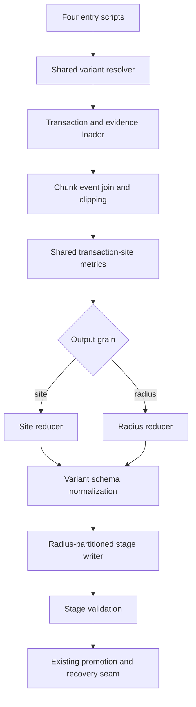
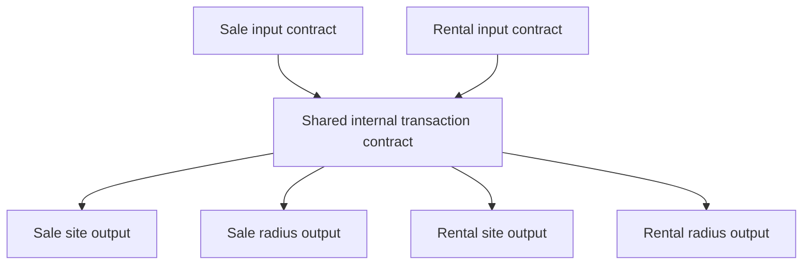
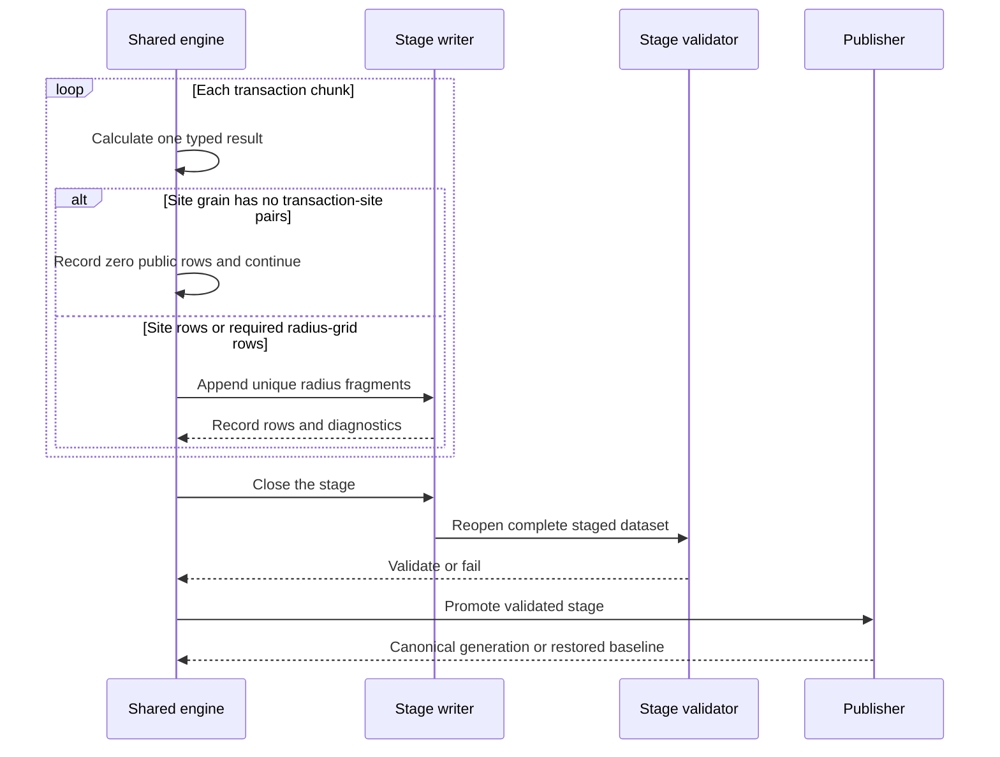

# Prior Exposure Shared Builders and Streaming - Plan

## Goal Capsule

- **Objective:** Resolve findings 2, 3, 8, 9, 12, and 13 by enforcing a shared 30-complete-day eligibility rule, consolidating the four prior-exposure builders behind one module, and streaming strictly typed chunks into validated staged datasets.
- **Authority:** The decisions approved in the `prior-to-sale 3` conversation govern this plan. `todos/2026-07-07-review-prior-to-sale-rental-spill-scripts.md` supplies the defect evidence. The completed findings 1/4/5 plan and the separate findings 6/7/11 plan govern semantics outside this plan.
- **Execution profile:** Characterize all four producer contracts first. Extend the shared prior-exposure utility and publisher. Replace the four full implementations with thin entry scripts. Regenerate and reconcile all four canonical datasets with R 4.6.0 in the `rv` environment.
- **Prerequisite:** Complete `docs/plans/2026-08-12-002-fix-prior-exposure-evidence-publication-plan.md`, including its regeneration and reconciliation, before starting implementation. Planning and focused test preparation may proceed, but no production code or canonical output may change until the accepted post-6/7/11 site outputs and unchanged accepted post-1/4/5 radius outputs establish the four comparison baselines.
- **Stop conditions:** Stop if implementation would change Annual Status or event-evidence semantics, alter the 12/24 spill-counting method, change public output grains or paths, add a new dependency, or require resolving a review finding outside this plan.
- **Tail ownership:** Regenerate and reconcile all four prior-exposure datasets, update the review record for only the scoped findings, and record finding 10 as won't fix with its agreed rationale.

---

## Product Contract

### Summary

The four prior-exposure producers will share one explicit sale/rental and site/radius engine. Every published transaction will have at least 30 complete exposure days, every chunk will satisfy an authoritative schema, and output production will remain memory-bounded by writing each completed chunk to a validated stage.

### Problem Frame

The current producers admit transactions at the exposure-window boundary. Their zero-day denominators produce `NaN` rates. The four scripts also maintain parallel loading, clipping, missingness, aggregation, rate, and export logic. Their empty-result paths have already drifted in names and types, and permissive binding can let one empty chunk corrupt a complete result.

Chunking currently limits only the transaction-event expansion. All completed results remain in an `lapply()` list until a second full allocation binds them. This creates avoidable peak memory pressure at the current scale of millions of transactions, lookup pairs, events, and output rows. The entry scripts also retain inconsistent headers, runtime package installation, unused dependencies, and stale debug comments.

Finding 13 is supported by a confirmed allocation shape at production scale, not by a demonstrated failed production run. Streaming removes the known avoidable result-list and bind allocations; it does not claim that eager input collection has already caused an operational failure.

### Requirements

**Exposure eligibility and failure semantics**

- R1. The exposure interval remains `[2021-01-01 00:00:00 UTC, transaction time)`, and all four producers must retain a transaction only when that interval contains at least 30 complete days.
- R2. `n_days_in_window` must be the integer count of complete 24-hour periods between the UTC window start and transaction endpoint for both markets. Eligibility requires `n_days_in_window >= 30`; any shorter duration must be excluded.
- R3. Published daily and weekly rates must be finite or `NA`; `NaN` and positive or negative infinity are forbidden.
- R4. Eligibility processing order is fixed: normalize and validate transaction identifiers and UTC endpoints; compute complete 24-hour days; retain `n_days_in_window >= 30`; fail if the retained market is empty; only then derive cutoff years and transaction-specific completeness prefixes from retained endpoints. The empty-cohort error must identify the input, window start, 30-day requirement, and pre-filter row count, and it must occur before staging or publication.

**Shared producer and schema contract**

- R5. One shared prior-exposure module must own transaction normalization, transaction-key validation, eligibility, cutoff derivation, transaction-specific completeness attachment, event overlap and clipping, transaction-site metrics, site/radius reduction, rates, schemas, chunk orchestration, staged validation, and publication handoff.
- R6. The four entry scripts must remain discoverable at their current paths and vary only by market, output grain, paths, chunk size, radius configuration, and logging identity. The closed shared resolver derives public field names and schemas from market and grain; entry scripts must not supply column-name mappings.
- R7. The shared module must explicitly support only sale versus rental and site versus radius output. It must not introduce an arbitrary column-mapping or plugin framework.
- R8. Each of the four public outputs must use the literal reopened Arrow/Hive schema in the appendix, fixing column names, order, and types. Every public chunk must be normalized with checked, lossless casts before it reaches a writer; no registry or schema framework is permitted.
- R9. Empty behavior is grain-specific. A site-grain chunk with no transaction-site pairs writes no fragment. A radius-grain chunk must emit one row for every eligible transaction and configured radius even when no nearby site exists; those rows have zero spill counts, hours, and sites, missing distance summaries, and `has_missing_site = FALSE`. Unexpected, missing, duplicated, or reordered public columns must fail validation rather than being admitted through permissive binding.
- R10. Existing canonical paths, Hive radius partitions, configured radius set, public column names and types, and key grains must remain unchanged, apart from removal of transactions that fail R1.
- R11. The completed transaction-specific completeness and event-evidence contracts must remain unchanged. The existing site/radius distinction in those contracts must be preserved until its owning review scope changes it.
- R12. `count_spills()` and its 12/24 counting semantics must remain unchanged.

**Bounded-memory staging**

- R13. Producers must process transaction IDs sequentially by chunk and release each chunk after it is normalized and written. They must not retain a list of all chunk results or allocate a complete in-memory result.
- R14. Each run must write to one unique sibling staging dataset partitioned by configured integer radius, using unique fragment names so later chunks cannot overwrite earlier fragments.
- R15. Each producer must reject missing or duplicate transaction identifiers before chunk construction and internally assign every validated identifier to exactly one chunk. Before writing, each normalized chunk must exactly match its expected grain-specific keys: the chunk's surviving transaction-site-radius lookup pairs for site grain, or its complete eligible transaction-radius grid for radius grain. The writer must reject chunk-local duplicate keys, log per-chunk counts, and retain only scalar expected-versus-written row totals—no ownership ledger or full-run key set. It then reopens the complete stage to validate exact schema, types, configured radii, total rows, finite-or-`NA` rates, and the 30-day minimum. Disjoint transaction ownership plus chunk key equality and reopened row conservation are the bounded cross-chunk proof; full baseline-to-output key equality belongs to U5 reconciliation. Fragment filenames and file counts are implementation details, not validation contracts.
- R16. Empty stages and failed or invalid stages must not replace a canonical dataset. Final promotion and recovery must continue to satisfy the separate publication plan's last-known-good contract.
- R17. Chunk diagnostics must report transaction count, lookup-pair count, joined-event count, output-row count, elapsed time, and enough stage identity to diagnose a failed run without logging row-level data.

**Entrypoint quality and closure**

- R18. All four entry scripts must use the repository's standard header, `script_setup.R`, fail-fast `rv sync` dependency guidance, and script-specific logging. Runtime package installation, including installation-on-source in `spill_aggregation_utils.R`, unused packages, stale test markers, dead alternatives, and inaccurate comments must be removed. The shared spill utility cleanup is limited to failing with `rv sync` guidance while preserving its attachment behavior, functions, and callers.
- R19. Focused regression tests required by this refactor must cover all four market/grain combinations, the 29/30-day boundary, empty eligible cohorts, grain-specific empty behavior, strict schema enforcement, streaming-specific failure paths, sale/rental parity, and public output contracts. This coverage neither reopens nor re-closes finding 7, whose closure remains owned by the separate plan.
- R20. Regeneration must reconcile the two site outputs against the accepted post-6/7/11 baselines and the two radius outputs against the accepted post-1/4/5 baselines, in each case after applying the 30-day cohort restriction. The review record must close only findings 2, 3, 8, 9, 12, and 13 and mark finding 10 won't fix.

### Key Decisions

- **Thirty complete days.** Apply one duration rule across all four producers. (session-settled: user-directed — chosen over a calendar-month rule and a 90-day buffer: 30 complete days removes unstable boundary observations with a smaller sample loss.) Governs R1-R4.
- **Separate review scope.** Keep this refactor distinct from the findings 6/7/11 plan. (session-settled: user-directed — chosen over superseding or absorbing that plan: the findings have separate semantic and closure contracts.) Governs R11, R16, and R20.
- **Do not optimize spill counting.** Preserve `count_spills()` behind its existing interface. (session-settled: user-directed — chosen over a compiled or vectorized rewrite: no production evidence shows that the correctness-sensitive reducer is the binding bottleneck.) Governs R12 and R20.

### Acceptance Examples

- AE1. **Exact complete-day boundary**
  - **Covers:** R1-R3.
  - **Given:** Isomorphic sale and rental transactions occur at 29 days plus 23 hours 59 minutes and at exactly 30 days after the window start.
  - **When:** Eligibility and rates are calculated.
  - **Then:** The first transactions are excluded, the exact 30-day transactions are retained with `n_days_in_window = 30`, and every defined weekly rate equals its daily rate multiplied by seven.
- AE2. **No eligible cohort**
  - **Covers:** R4, R16.
  - **Given:** An input contains rows, but every transaction has fewer than 30 complete exposure days.
  - **When:** Either market loader runs.
  - **Then:** It stops with the cohort-specific error before cutoff-prefix derivation, stage creation, or canonical publication.
- AE3. **Empty chunk cannot corrupt a later chunk**
  - **Covers:** R8, R9, R13-R15.
  - **Given:** For each grain, the first chunk has no transaction-site pair inside the maximum radius and the second chunk has valid pairs.
  - **When:** Site- and radius-grain producers write their stages.
  - **Then:** The site-grain first chunk writes no fragment. The radius-grain first chunk writes every eligible transaction-radius row with zero counts, hours, and sites, missing distances, and false missingness. Both second chunks write their established public rows, and the validated stages preserve the exact grain-specific key sets and schemas.
- AE4. **Four variants preserve their public contracts**
  - **Covers:** R5-R12, R19.
  - **Given:** Isomorphic sale and rental fixtures contain one observed site, one missing site, and all configured radii.
  - **When:** Site- and radius-grain reducers run through the shared engine.
  - **Then:** Sale/rental exposure decisions agree, site outputs remain unique by transaction-site-radius, radius outputs remain unique by transaction-radius, and each variant has its established schema.
- AE5. **Interrupted streaming leaves the baseline readable**
  - **Covers:** R13-R17.
  - **Given:** A canonical dataset exists and a later run fails after its first staged chunk or during stage validation.
  - **When:** Cleanup and publication handling run.
  - **Then:** The incomplete stage is not published, the canonical dataset remains readable and unchanged, and the log identifies the failed chunk or validation gate.
- AE6. **Schema drift fails closed**
  - **Covers:** R8-R10, R15.
  - **Given:** A chunk has a phantom rental `price` field, a character identifier, a missing public field, or a duplicated key.
  - **When:** It is normalized or the stage is validated.
  - **Then:** The run fails before publication rather than coercing, filling, or silently dropping the drift.

### Success Criteria

- Peak output-result memory is bounded by one processed chunk plus writer/validation overhead; completed chunk results do not accumulate in R.
- Every public row has `n_days_in_window >= 30`, and all rate columns contain only finite values or `NA`.
- All four regenerated datasets retain their accepted schemas, radii, and grain-specific eligible key sets: site outputs preserve surviving transaction-site-radius lookup pairs, while radius outputs preserve every eligible transaction-radius combination, including transactions with no nearby sites.
- The four entry scripts share one implementation of the scientific pipeline and contain no runtime package installation or identified debris.

### Scope Boundaries

- Address only findings 2, 3, 8, 9, 12, and 13 from `todos/2026-07-07-review-prior-to-sale-rental-spill-scripts.md`; record finding 10 as won't fix.
- Do not close or redefine findings 6, 7, or 11. Their existing plan remains authoritative for evidence semantics, publication recovery, and its own test-scope decision.
- Do not represent this plan's broader refactor regressions as new closure evidence for finding 7; run the owning plan's tests unchanged and add only coverage required for findings in this plan.
- Do not change transaction-specific Site Group completeness, Annual Status meanings, event-evidence masking, spill-hour aggregation, the half-open exposure interval, configured radii, or weekly-rate scaling.
- Do not add 30/180/365-day sensitivity datasets or make the 30-day threshold a runtime sweep.
- Do not make Arrow inputs lazy or introduce DuckDB in this pass. If post-change profiling shows input collection dominates peak memory, record that as follow-up work.
- Do not rename or remove the four pipeline entry scripts, canonical outputs, or log identities.
- Do not create a general ETL framework, schema registry package, manifest system, or new dependency.

### Dependencies

- `docs/plans/2026-08-12-001-fix-prior-exposure-window-contracts-plan.md` is complete and supplies the current transaction-cutoff prefix contract.
- `docs/plans/2026-08-12-002-fix-prior-exposure-evidence-publication-plan.md` must be complete before production-code changes under this plan. Its accepted regenerated outputs supply the two site baselines. The accepted radius outputs from the completed findings 1/4/5 plan remain the two radius baselines because the 6/7/11 plan does not modify them. This plan extends the accepted evidence and publisher seams without changing their semantics.
- R 4.6.0 and the repository's `rv` environment must provide Arrow, data.table, dplyr, glue, here, logger, and the existing dependencies.

---

## Planning Contract

### Key Technical Decisions

- KTD1. **Use one explicit two-axis engine with one-way dependencies.** The shared module accepts only `market = sale|rental` and `grain = site|radius`, resolves the four known contracts internally, and exposes one orchestration entrypoint. It depends on `site_group_utils.R` and `spill_aggregation_utils.R`; neither utility depends on it, and no utility sources an entry script. (session-settled: user-approved — chosen over four maintained pipelines and an arbitrary configuration framework: the two axes are the only real variants.) Governs R5-R7.
- KTD2. **Make four literal reopened Arrow schemas authoritative.** Use one closed four-case schema definition for chunk normalization and stage validation, with checked lossless conversion from R `integer`/`double`/`logical` values to the appendix types. Physical fragments omit partition field `radius`; reopened Hive datasets restore it as `int32`. Do not add a registry, constructor hierarchy, or separate fragment-schema abstraction. (session-settled: user-approved — chosen over hand-maintained empty tables and `fill = TRUE`: permissive binding allowed schema drift to change valid rows.) Governs R8-R10 and R19.
- KTD3. **Keep internal and public vocabularies separate.** Normalize transactions to shared internal identifiers, values, and UTC endpoints, then project public sale/rental names only at the schema boundary. Reducers own the site-versus-radius fields. Governs R5-R11.
- KTD4. **Stream partitioned fragments into the existing publication lifecycle.** Extend the prerequisite publisher so it can validate and promote a stage assembled incrementally, while preserving its backup and restoration behavior. (session-settled: user-approved — chosen over retaining every result and publishing one full in-memory table: staged streaming removes the demonstrated avoidable allocation.) Governs R13-R17.
- KTD5. **Preserve grain-specific empty semantics.** A site-grain chunk with no pairs returns its typed prototype and writes no fragment. A radius-grain chunk with no pairs is not empty: it writes one zero-site row per eligible transaction-radius combination. A zero-row complete stage remains fatal. Governs R4, R8, R9, R14-R16.
- KTD6. **Refactor before redesigning input access.** Keep the currently collected transactions, lookups, events, and prefix tables in memory, then measure the result after eliminating output accumulation. (session-settled: user-approved — chosen over an immediate Arrow/DuckDB query redesign: output accumulation is the demonstrated avoidable allocation and can be removed without a second data-access architecture.) Governs R13 and the deferred input-memory boundary.
- KTD7. **Use thin standard entry scripts.** Each entry script declares its header, dependency list, log path, paths, radii, chunk size, market, and grain, then delegates to the shared engine. Generic setup remains in `script_setup.R`. Governs R6 and R18.
- KTD8. **Reconcile against eligible projections of two baseline sources.** Use the accepted post-6/7/11 generations for site outputs and the accepted post-1/4/5 generations for radius outputs, restricting each to `n_days_in_window >= 30` rather than treating the intentional cohort removal as row drift. Governs R10 and R20.

### High-Level Technical Design

#### Component and data-flow topology

The shared engine owns the common scientific path. The variant resolver keeps source and public naming explicit. The publisher remains the only component allowed to change a canonical directory.

#### Supported variant matrix

The four leaves have separate public schemas. The matrix is closed: a new market or grain requires an explicit plan and contract rather than an unchecked configuration value.

#### Streaming and publication sequence

No completed result survives beyond the chunk that produced it. Validation operates on the written dataset, not on an in-memory object that could differ from the on-disk representation.

### Sequencing

1. Complete and accept the separate findings 6/7/11 plan before changing production code or outputs.
2. Snapshot the two accepted post-6/7/11 site baselines and two unchanged post-1/4/5 radius baselines, then add characterization contracts for the 30-day rule, literal schemas, empty cohorts, grain-specific empty behavior, and four-variant parity.
3. Extract the typed shared calculation engine behind the existing producer functions while preserving accepted outputs.
4. Extend the publisher with incremental partitioned staging and switch chunk orchestration away from result accumulation.
5. Reduce the four producers to standard entry scripts and remove bootstrap/debug debris.
6. Run focused contracts, regenerate the four datasets, reconcile the eligible baseline, and update the review record.

### System-Wide Impact

- **Analysis sample:** Transactions with fewer than 30 complete prior-exposure days disappear from all four datasets. This is an intentional common-support restriction.
- **Scientific semantics:** Transaction-specific completeness, event-evidence handling, missingness, event clipping, spill counts, spill hours, and rates for retained rows remain unchanged.
- **Pipeline interface:** Script paths, output paths, partition names, schemas, and keys remain stable. Operators gain consistent fail-fast dependency and empty-cohort errors.
- **Memory posture:** Inputs remain eagerly collected. Output memory changes from all chunks plus a combined result to one chunk plus writer state and later stage-validation scans.
- **Plan interaction:** The separate publication plan lands first. This plan extends its shared utility but does not claim its findings or change its recovery policy.
- **Generation consistency:** Each canonical output remains an independent publication unit. A failed four-script regeneration can temporarily leave old and new cohorts side by side; completion requires all four outputs to publish and reconcile from the same accepted baseline.

### Risks and Mitigations

- **Refactor changes science:** Moving four pipelines behind one engine could erase a meaningful site/radius or sale/rental distinction. Characterize the four variants first, keep a closed variant matrix, and reconcile all retained keys and values.
- **Evidence semantics become accidentally uniform:** The prerequisite plan may intentionally affect only the site outputs. Preserve its accepted variant behavior and assert it explicitly rather than forcing parity that belongs to finding 11.
- **Arrow partition schema mismatch:** Hive partition fields may be represented differently in fragment files and reopened datasets. Bind validation to each reopened public dataset contract, including integer radius, rather than comparing only individual fragment schemas.
- **Chunk fragment collision:** Reusing default fragment names can overwrite rows written by an earlier chunk. Give every chunk a unique fragment namespace and test a multi-chunk stage.
- **Duplicate or dropped keys across chunks:** Validate unique input transaction IDs, assign each internally to exactly one chunk, enforce chunk-local public-key uniqueness, conserve written rows, and reconcile the complete stage using the grain-specific key rules.
- **Validation recreates the memory problem:** Collecting the whole staged dataset for validation would undo streaming. Use Arrow/DuckDB-free aggregate scans and bounded per-partition checks; collect only compact summaries or failing samples.
- **Cross-chunk validation becomes unbounded:** Do not retain a global in-memory key set or inspect fragment inventories. Use disjoint validated transaction ownership, chunk-local key checks, compact row conservation, and bounded reopened-dataset checks.
- **Partial four-output rollout:** The four canonical paths cannot be promoted as one filesystem transaction. Treat each as last-known-good independently, record which generations completed, and do not close the plan until every output is rebuilt and reconciled.
- **Plan collision:** Both this plan and the prerequisite touch `prior_exposure_utils.R` and producer tests. Enforce the prerequisite and begin from its accepted head rather than implementing the plans concurrently.
- **Review-status overreach:** Staged streaming may improve finding 6 incidentally. Leave its status governed by its own plan and close only R20's findings here.

### Sources and Research

- `todos/2026-07-07-review-prior-to-sale-rental-spill-scripts.md` — finding evidence, current scale, and closure inventory.
- `docs/plans/2026-08-12-001-fix-prior-exposure-window-contracts-plan.md` — accepted transaction-cutoff completeness contract.
- `docs/plans/2026-08-12-002-fix-prior-exposure-evidence-publication-plan.md` — prerequisite event-evidence and publication recovery contract.
- `scripts/R/testing/test_prior_exposure_contracts.R` — existing isolated-producer, schema, grain, cutoff, and parity fixtures.
- `scripts/R/04_feature_engineering/site_rental_match.R` — explicit Arrow schema, chunk-at-a-time Parquet writing, on-disk validation, and staged promotion pattern.
- `scripts/R/utils/script_setup.R` and `docs/solutions/best-practices/data-cleaning-script-header-bootstrap-standardisation-20260310.md` — approved header, dependency, and logging bootstrap.
- `docs/solutions/best-practices/edm-api-combine-hardening-20260310.md` — fail closed on empty or schema-invalid publish candidates.
- `docs/solutions/best-practices/individ-edm-combiner-safe-readability-refactor-validation-20260310.md` — preserve validation boundaries during readability refactors and verify actual outputs.
- `CONCEPTS.md` — canonical Spill Exposure, Near-Overflow Radius, Site Group, and Annual Status vocabulary.

---

## Implementation Units

### U1. Characterize the shared producer contract

- **Goal:** Make the agreed eligibility, schema, empty-state, and four-variant behaviors executable before consolidation.
- **Requirements:** R1-R4, R8-R12, R19; KTD2, KTD5.
- **Dependencies:** The prerequisite plan's production-code and output baseline is complete and accepted.
- **Files:**
  - `scripts/R/testing/test_prior_exposure_contracts.R`
  - `scripts/R/utils/prior_exposure_utils.R`
- **Approach:**
  1. Before characterization or production changes, snapshot the accepted post-6/7/11 site outputs and unchanged post-1/4/5 radius outputs outside the repository diff; record provenance, schemas, radii, row counts, grain-specific keys, and eligible-key projections.
  2. Extend the existing isolated-producer harness rather than creating a second test framework.
  3. Add shared fixtures for the exact complete-day boundary, empty eligible markets, site-empty/radius-zero-site chunk sequences, strict schema drift, and the four variant contracts.
  4. Capture the prerequisite plan's accepted site/radius evidence behavior so the later refactor cannot broaden or erase it.
  5. Introduce one literal four-case schema definition at the shared utility boundary so tests and later production code use the appendix contracts without adding schema machinery.
- **Execution note:** Add failing characterization tests for findings 2, 3, and 12 before changing producer behavior; pin retained behavior before extracting shared code.
- **Patterns to follow:** Isolated environments, fixture writers, exact names/types, key assertions, and sale/rental parity checks already in `scripts/R/testing/test_prior_exposure_contracts.R`; schema construction in `scripts/R/04_feature_engineering/site_rental_match.R`.
- **Test scenarios:**
  - Covers AE1. Sale and rental transactions just below 30 complete days are excluded, while exact 30-day transactions are retained.
  - Covers AE2. A non-empty input whose rows all fail the threshold produces the required error before a stage path exists.
  - Covers AE3. An empty site-level chunk followed by a populated chunk preserves exact identifier, value, radius, and logical types.
  - Covers AE3. A radius-level chunk with no nearby sites still emits every eligible transaction-radius key with zero counts, hours, and sites, missing distances, and false missingness.
  - Covers AE4. All four variants retain exact column order, types, radius sets, key grains, and prerequisite missingness/evidence behavior.
  - Covers AE6. Wrong rental value name, character identifiers, missing fields, extra fields, reordered fields, and duplicate keys each fail closed.
  - Missing or duplicate transaction identifiers fail before chunk construction in every variant.
  - A known missing Site Group remains missing, a no-event observed site retains its accepted treatment, and weekly rates remain daily rates multiplied by seven.
- **Verification:** The focused script fails only on the not-yet-implemented 30-day and strict-schema behavior, while all prerequisite contracts remain green.

### U2. Extract the typed shared calculation engine

- **Goal:** Replace duplicated preparation and reduction logic with one explicit market/grain module without changing retained-row results.
- **Requirements:** R1-R12, R19; KTD1-KTD3, KTD5-KTD6.
- **Dependencies:** U1.
- **Files:**
  - `scripts/R/utils/prior_exposure_utils.R`
  - `scripts/R/06_analysis_datasets/house_spill_prior_to_sale.R`
  - `scripts/R/06_analysis_datasets/rental_spill_prior_to_rental.R`
  - `scripts/R/06_analysis_datasets/cross_section_prior_to_sale.R`
  - `scripts/R/06_analysis_datasets/cross_section_prior_to_rental.R`
  - `scripts/R/testing/test_prior_exposure_contracts.R`
- **Approach:**
  1. Define the closed four-variant resolver and normalize sale/rental inputs to one internal transaction vocabulary.
  2. Move the shared eligibility, cutoff, completeness, event join/clipping, transaction-site aggregation, rate construction, schema normalization, and invariants into the utility. Enforce this order: validate identifiers and normalize endpoints to UTC; compute complete 24-hour days; retain `n_days_in_window >= 30`; fail if none remain; then derive cutoff years and completeness prefixes only from retained endpoints.
  3. Keep separate focused site and radius reducers inside the module. Preserve their public fields and prerequisite evidence rules.
  4. Keep `count_spills()` in `spill_aggregation_utils.R` and call it through its unchanged interface.
  5. Keep input collection eager and measure chunk diagnostics without adding a second query engine.
- **Execution note:** Migrate one isomorphic sale/rental fixture through the internal contract first, then enable all four variants together so no script remains on a divergent half-refactor.
- **Patterns to follow:** Prefix joins and row-count guards in `scripts/R/utils/site_group_utils.R`; current site/radius reducers in the four producers; one-source-of-truth refactor guidance in `docs/solutions/best-practices/output-compatible-edm-standardisation-refactor-20260309.md`.
- **Test scenarios:**
  - Covers AE1-AE4 against the shared engine in all four modes.
  - Events starting at the transaction endpoint remain excluded; overlapping events are clamped to the half-open exposure interval.
  - Missing Site Groups and prerequisite unknown-evidence states propagate exactly as they do in the accepted baseline for each grain.
  - Site reducers retain distance and `site_missing`; radius reducers retain site counts, distance summaries, and radius-local missingness.
  - A variant outside the four supported combinations fails before data loading.
  - `count_spills()` boundary fixtures remain unchanged and no new counting implementation appears in the module.
- **Verification:** The focused contracts pass through the shared module, each retained fixture row is value-equivalent to its pre-refactor result, and duplicated scientific calculations are absent from the entry scripts.

### U3. Stream typed chunks into validated radius stages

- **Goal:** Bound output-result memory by writing each completed chunk immediately and validating the full staged generation before publication.
- **Requirements:** R8-R10, R13-R17, R19; KTD2, KTD4-KTD6.
- **Dependencies:** U2 and the prerequisite publisher.
- **Files:**
  - `scripts/R/utils/prior_exposure_utils.R`
  - `scripts/R/testing/test_prior_exposure_contracts.R`
- **Approach:**
  1. Replace list-based orchestration with one sequential chunk loop that normalizes, validates, writes, records diagnostics, and releases each result.
  2. Extend the prerequisite publisher to accept an incrementally assembled sibling stage while keeping its promotion, backup, restoration, and cleanup semantics.
  3. Write site-grain chunks only when they contain public rows. Always write radius-grain chunks after constructing the complete eligible transaction-radius grid, including zero-site rows. Use collision-proof fragment identities without treating filenames or file counts as contracts.
  4. Validate unique input transaction IDs and assign each to exactly one internal chunk. Before writing, require exact equality between the normalized chunk's keys and the expected site or radius keys for that chunk; reject duplicates, log per-chunk counts, and update scalar expected-versus-written totals without retaining an ownership ledger. Reopen the dataset for bounded schema, type, radius, total-row, minimum-window, and finite-or-`NA` rate checks. Leave full baseline key equality to U5.
  5. Reuse the prerequisite publisher's promotion/restoration fixture unchanged. Add only streaming-specific failures after the first chunk and during stage validation, proving neither path calls promotion or changes the canonical output.
- **Execution note:** Use small multi-chunk fixtures first. Measure peak memory on a representative production chunk before the full regenerations; do not add lazy input work unless this plan is revised.
- **Patterns to follow:** Row-group streaming and stage validation in `scripts/R/04_feature_engineering/site_rental_match.R`; promotion/recovery helper delivered by `docs/plans/2026-08-12-002-fix-prior-exposure-evidence-publication-plan.md`.
- **Test scenarios:**
  - Covers AE3. An empty site chunk writes nothing, a no-site radius chunk writes its complete zero-site transaction-radius grid, and both can precede populated chunks without schema or key drift.
  - Two populated chunks in the same radius preserve both key sets and do not overwrite one another.
  - Covers AE5. Failure after the first stage write removes or reports the stage and leaves the canonical generation unchanged.
  - Covers AE5. Stage validation failure never calls the promotion seam; the prerequisite publisher fixture continues to own promotion/restoration fault coverage.
  - Covers AE6. Duplicate input transaction IDs, chunk-local duplicate or missing expected keys, wrong radii, `NaN` or infinite rates, and a row below 30 days each fail before publication.
  - A successful multi-radius stage reopens with exact integer radii and the expected total row count for all four schemas.
  - Chunk diagnostics report counts and elapsed time without retaining result objects or exposing row-level values.
- **Verification:** Streaming tests pass, list-based result accumulation and permissive binding are absent, and memory inspection shows completed chunks are released before the next chunk finishes.

### U4. Reduce the four producers to standard entry scripts

- **Goal:** Make each producer a readable configuration and orchestration boundary with no duplicated pipeline or bootstrap debris.
- **Requirements:** R5-R7, R10-R12, R18-R19; KTD1, KTD7.
- **Dependencies:** U2, U3.
- **Files:**
  - `scripts/R/06_analysis_datasets/house_spill_prior_to_sale.R`
  - `scripts/R/06_analysis_datasets/rental_spill_prior_to_rental.R`
  - `scripts/R/06_analysis_datasets/cross_section_prior_to_sale.R`
  - `scripts/R/06_analysis_datasets/cross_section_prior_to_rental.R`
  - `scripts/R/utils/spill_aggregation_utils.R`
  - `scripts/R/testing/test_prior_exposure_contracts.R`
- **Approach:**
  1. Apply the standard purpose/inputs/outputs/log header and source `script_setup.R` with local scope.
  2. Declare a fixed dependency list and log path, run fail-fast dependency checks, and attach only packages needed for remaining unqualified calls.
  3. Keep script-local configuration for paths, radii, chunk size, market, grain, and logging identity. Delegate calculation and publication to the shared module.
  4. Remove runtime installation, unused `fs` attachment, test markers, commented alternatives, inaccurate copy comments, and unresolved export notes. In `spill_aggregation_utils.R`, replace only installation-on-source with fail-fast `rv sync` guidance while preserving package attachment, every existing function signature, and all existing callers.
  5. Preserve the direct-execution guard so tests can source every script without running production.
- **Patterns to follow:** `scripts/R/02_data_cleaning/clean_lr_house_price_data.R`, `scripts/R/utils/script_setup.R`, and `docs/solutions/best-practices/data-cleaning-script-header-bootstrap-standardisation-20260310.md`.
- **Test scenarios:**
  - All four scripts parse and source in isolated environments without running `main()`.
  - Missing required packages produce the shared `rv sync` guidance and no script calls `install.packages()`.
  - The existing spill-time boundary contracts remain green after the narrow shared-utility bootstrap cleanup.
  - Each wrapper resolves the correct market, grain, input, output, log, radii, and chunk-size configuration.
  - Invoking each wrapper on the shared fixture produces the exact schema and values already proven in U1-U3.
  - A repository search finds none of the scoped debug/dead-code markers or runtime installation calls.
- **Verification:** The scripts contain only header/bootstrap, configuration, logging initialization, and a short main delegation; the focused contracts still pass from the public entrypoints.

### U5. Regenerate, reconcile, and close the scoped findings

- **Goal:** Prove that production changes are limited to the agreed 30-day cohort and implementation architecture, then update the review record accurately.
- **Requirements:** R1-R20; KTD8.
- **Dependencies:** U1-U4.
- **Files:**
  - `todos/2026-07-07-review-prior-to-sale-rental-spill-scripts.md`
  - Generated `data/processed/cross_section/sales/prior_to_sale`
  - Generated `data/processed/cross_section/rentals/prior_to_rental`
  - Generated `data/processed/cross_section/sales/prior_to_sale_house_site`
  - Generated `data/processed/cross_section/rentals/prior_to_rental_rental_site`
- **Approach:**
  1. Verify and consume the four pre-implementation snapshots created in U1: the accepted post-6/7/11 site generations and accepted post-1/4/5 radius generations. Stop if provenance is missing or a snapshot no longer matches its recorded schema, radii, row count, or grain-specific keys.
  2. Run all four revised entry scripts and retain their chunk and validation logs.
  3. Reopen each canonical dataset and compare it with its baseline restricted to at least 30 complete days. Require exact schemas, radii, values, and grain-specific key sets: surviving transaction-site-radius lookup pairs for site outputs and every eligible transaction-radius combination for radius outputs, including no-site transactions.
  4. Confirm that every removed key belongs to a transaction below the threshold and that no retained row contains `NaN`, infinity, or a window below 30 days.
  5. If any producer fails, record which canonical generations already changed and resume from the failed producer; do not treat the four-output regeneration as complete until every output reconciles against the same baseline.
  6. Inspect peak-memory evidence to confirm output-result accumulation is gone. Record input-memory follow-up only if the eager tables remain operationally material.
  7. Mark findings 2, 3, 8, 9, 12, and 13 resolved with concise evidence. Mark finding 10 won't fix. Leave all other statuses unchanged.
- **Test expectation:** No new test file belongs to this reconciliation unit; it consumes the focused contracts and validates the real generated artifacts.
- **Verification:** All four production runs complete, retained rows match the eligible baseline exactly, publication validation passes, peak output memory is chunk-bounded, and only the scoped review statuses change.

---

## Verification Contract

| Gate | Command or evidence | Proves |
|---|---|---|
| Environment preparation | `rv sync` | The R 4.6.0 project library is restored before any verification command. |
| Focused producer contracts | `Rscript scripts/R/testing/test_prior_exposure_contracts.R` | R1-R19 across all four variants, including eligibility, schema, streaming, failure, and parity cases. |
| Shared completeness regression | `Rscript scripts/R/testing/test_site_group_consumer_contracts.R` | The transaction-specific Site Group prefix contract remains intact. |
| Bootstrap regression | `Rscript scripts/R/testing/test_script_setup.R` | Shared dependency and logging setup remains valid. |
| Spill aggregation regression | `Rscript scripts/R/testing/test_spill_time_boundaries.R` | Narrow removal of installation-on-source does not change `count_spills()` or time-boundary behavior. |
| Parse and source gate | Parse and source the four entry scripts in isolated environments without calling `main()`. | Thin wrappers are syntactically valid and safe for test loading. |
| Static cleanup gate | Search the four entry scripts and `spill_aggregation_utils.R` for runtime installation, and the entry scripts for permissive chunk binding, result-list accumulation, stale test markers, and dead alternatives. | Findings 3, 8, 9, and 13 are structurally removed without broad utility refactoring. |
| Full production regeneration | Run each of the four entry scripts with R 4.6.0 in the activated `rv` environment. | The complete production paths work with real data and bounded chunk output. |
| Output reconciliation | Compare accepted baseline versus regenerated canonical datasets at schema, radius, key, and retained-row value levels. | Only the agreed sub-30-day cohort changes; established scientific and public contracts remain stable. |
| Memory evidence | Capture per-chunk diagnostics and representative process peak memory for the largest producer. | Completed output chunks do not accumulate and the intended memory reduction is realized. |

---

## Definition of Done

- U1-U4 focused contracts pass, including every applicable happy path, boundary, error, and integration scenario listed in this plan.
- One shared module owns the common prior-exposure pipeline, the four supported variants, the schemas, and streaming orchestration.
- The four entry scripts use standard headers and bootstrap, contain no identified debris, and delegate to the shared engine; their shared spill utility no longer installs packages at source time.
- All four canonical outputs contain only transactions with at least 30 complete days; every rate is finite or `NA`, with no `NaN` or positive or negative infinity.
- Regenerated outputs preserve accepted paths, partitions, schemas, keys, radii, and retained-row values.
- Staged failures and validation failures cannot replace the last-known-good canonical datasets.
- `count_spills()` is unchanged, and finding 10 is documented as won't fix.
- Findings 2, 3, 8, 9, 12, and 13 are closed with implementation and verification evidence; findings 6, 7, and 11 retain their separate ownership.
- Any abandoned experimental code, unused helpers, temporary instrumentation, and stale stages created during implementation are removed before completion.

---

## Appendix: Authoritative Public Schemas

These are the accepted reopened Arrow/Hive schemas, in public column order. Physical Parquet fragments omit the partition field; reopening the Hive dataset restores `radius` as `int32`. Before writing, normalized R chunks use `integer` for `int32`, `double` for Arrow `double`, and `logical` for Arrow `bool`; any source value requiring conversion must pass a checked, lossless cast.

- **Sale, site grain — `prior_to_sale_house_site`:** `house_id int32`, `price int32`, `n_days_in_window int32`, `site_id int32`, `distance_m double`, `spill_hrs double`, `spill_count double`, `site_missing bool`, `spill_count_daily_avg double`, `spill_hrs_daily_avg double`, `spill_count_weekly_avg double`, `spill_hrs_weekly_avg double`, `radius int32`.
- **Rental, site grain — `prior_to_rental_rental_site`:** `rental_id int32`, `listing_price double`, `n_days_in_window int32`, `site_id int32`, `distance_m double`, `spill_hrs double`, `spill_count double`, `site_missing bool`, `spill_count_daily_avg double`, `spill_hrs_daily_avg double`, `spill_count_weekly_avg double`, `spill_hrs_weekly_avg double`, `radius int32`.
- **Sale, radius grain — `prior_to_sale`:** `house_id int32`, `price int32`, `n_days_in_window int32`, `spill_hrs double`, `n_spill_sites int32`, `spill_count double`, `mean_distance double`, `min_distance double`, `has_missing_site bool`, `spill_count_daily_avg double`, `spill_hrs_daily_avg double`, `spill_count_weekly_avg double`, `spill_hrs_weekly_avg double`, `radius int32`.
- **Rental, radius grain — `prior_to_rental`:** `rental_id int32`, `listing_price double`, `n_days_in_window int32`, `spill_hrs double`, `n_spill_sites int32`, `spill_count double`, `mean_distance double`, `min_distance double`, `has_missing_site bool`, `spill_count_daily_avg double`, `spill_hrs_daily_avg double`, `spill_count_weekly_avg double`, `spill_hrs_weekly_avg double`, `radius int32`.
