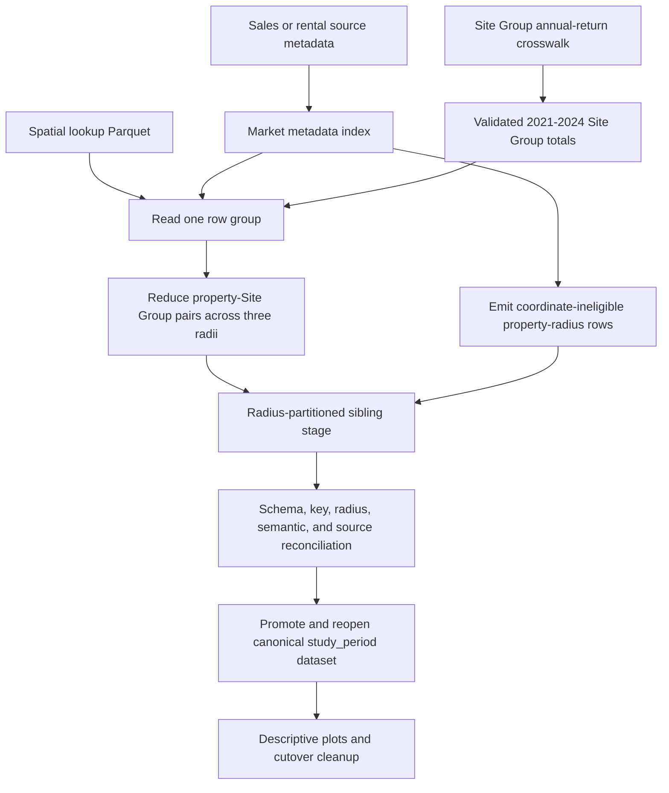
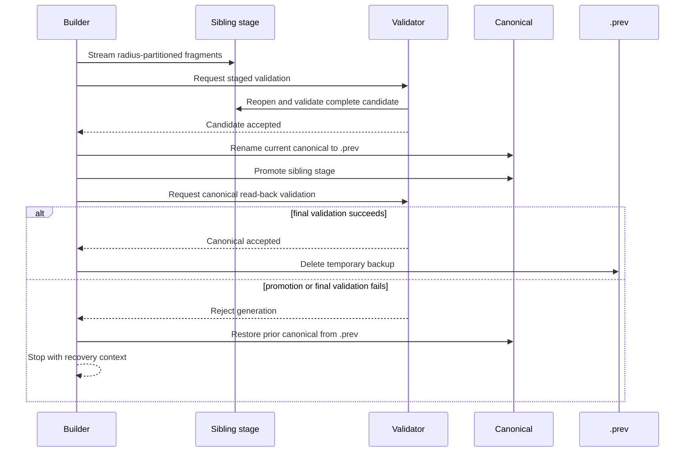

# Study-Period Cross-Sections - Plan

> **Partially superseded.** This plan's decision that the EA Annual Returns are the canonical complete-year evidence for the study-period cross-sections was reversed by [docs/plans/2026-08-17-001-feat-event-based-study-period-cross-sections-plan.md](2026-08-17-001-feat-event-based-study-period-cross-sections-plan.md), which rebuilds the unsuffixed `study_period/` datasets from individual EDM events and moves the Annual-Returns variant to `study_period_ea/`. Everything else here — the shared engine, the schema, the missingness rule, and the publication contract — still stands and is what both variants reuse.

## Goal Capsule

- **Objective:** Replace the DuckDB-based sales and rental cross-section builders with one sequential `data.table` engine that publishes validated 2021–2024 Study-Period Spill Exposure datasets.
- **Authority:** The Requirements define product and scientific behavior. Key Technical Decisions define implementation mechanisms. Implementation Units must cite both and may not weaken either.
- **Execution profile:** Add focused contract coverage before replacing the builders. Process the existing spatial lookup row groups sequentially. Complete the work with full production regeneration and plot smoke verification.
- **Stop conditions:** Stop on partial-year or reversed bounds, an invalid annual-return state, a derived study year absent from the crosswalk as a whole, lookup-count or row-group ownership violation, source metadata or eligibility mismatch, an ambiguous canonical/`.prev` state outside the explicitly verified one-time legacy transition, staged validation failure, or failed recovery of the prior canonical generation. A missing Site Group-year follows R2 instead.
- **Tail ownership:** The change is complete only after the four legacy prior-exposure backups are migrated explicitly, both markets pass read-back reconciliation, the descriptive plots run against `study_period`, and obsolete generated directories are removed.

---

## Product Contract

### Summary

Build independent sales and rental cross-sections for the fixed 2021–2024 study period at 250, 500, and 1,000 m. Use the EA annual-return measures already consolidated to Site Group-year grain. Preserve every source transaction and distinguish valid zero exposure, unknown annual-return exposure, and spatial ineligibility.

### Problem Frame

The current builders cache inputs in a shared DuckDB database without provenance, expand large property-site-month relations across five radii, collect large results in memory, and write directly to live Arrow roots. Their missing-value logic drops valid controls, converts partial evidence into understated totals, and permits non-monotonic samples across radii. The published outputs are also stale relative to their current inputs.

The monthly `prior_12mo` products have no supported production consumer and duplicate the daily-precision prior-exposure pipeline. The direct descriptive consumer reads the misleading `all_years` paths and uses the obsolete rental value name `rent`. Two exploratory Quarto chapters also execute those obsolete reads in the supported book render; preserving the settled direct-consumer-only migration requires archiving those chapters out of the render rather than migrating their separate 5,000 m exploration.

### Key Decisions

- **Use EA annual returns as the canonical complete-year evidence.** (session-settled: user-directed — chosen over raw-event or monthly-panel recomputation: the revised EA measures are authoritative at the required annual grain and avoid expensive spill reconstruction.) Governs R1, R2, R3.
- **Retain every source transaction with explicit status semantics.** (session-settled: user-directed — chosen over dropping spatially ineligible or incompletely reported rows: the output must distinguish true controls from unknown exposure.) Governs R4, R5, R6.
- **Publish both Land Registry categories and preserve their provenance.** (session-settled: user-directed — chosen over a Category-A-only canonical sample: sample selection belongs downstream and existing analysis variable names should remain stable.) Governs R7.
- **Replace `all_years` with `study_period` and remove `prior_12mo`.** (session-settled: user-directed — chosen over compatibility aliases: the fixed window should be named accurately and the unused monthly product should not remain plausible stale output.) Governs R8, R12.
- **Use staged publication without a receipt or checkpoint.** (session-settled: user-directed — chosen over manifests and resumable stages: the established prior-exposure lifecycle is sufficient and failed computation can restart.) Governs R9, R10, R11.
- **Limit analysis migration to the direct descriptive consumer.** (session-settled: user-directed — chosen over refactoring all full-period hedonic or exploratory analyses: those analyses construct different products and require a separate reconciliation. The two obsolete cross-section exploration chapters remain as archival source files but are removed from the supported Quarto render.) Governs R12, R13.

### Requirements

#### Scientific evidence and measures

- R1. Configured dates are the single study-period authority: the start must be 1 January, the end must be 31 December, the bounds must be ordered, and the required contiguous year sequence must be derived from those bounds. Production uses 2021-01-01 through 2024-12-31 and only `spill_count_ea` and `spill_hrs_ea` from `data/processed/matched_events_annual_data/site_group_crosswalk.parquet` for the derived years 2021 through 2024.
- R2. `reported_zero` must contribute zero, `reported_positive` must contribute its nonnegative EA values, and `reported_na`, `absent`, or a missing required Site Group-year must make that Site Group's study-period exposure unknown.
- R3. Each output must publish `spill_count`, `spill_hrs`, their daily and weekly averages, and an inclusive `n_days_in_window` derived from the same whole-year bounds that select the annual evidence rather than from a hard-coded day count or independently configured years.

#### Row population and spatial semantics

- R4. Each source transaction must appear exactly once at each configured radius: 250, 500, and 1,000 m.
- R5. A transaction with usable coordinates and no Site Group inside a radius must have `spatially_eligible = TRUE`, `has_missing_site = FALSE`, zero site count and spill measures, and missing distance measures.
- R6. A transaction with unusable coordinates must have `spatially_eligible = FALSE`, exactly matching the finite-coordinate predicate derived from its current source row, `has_missing_site = FALSE`, and missing site-count, distance, spill-total, daily-average, and weekly-average fields.
- R7. Sales output must retain `house_id`, `price`, and `ppd_category` for Categories A and B; rental output must retain `rental_id` and expose the value as `listing_price`. Every staged and canonical row must reproduce these source fields exactly for its transaction ID.
- R8. If any Site Group inside a radius has unknown study-period exposure, the property-radius row must retain its known `n_spill_sites`, `mean_distance`, and `min_distance`, set `has_missing_site = TRUE`, and set all spill measures to `NA`.

#### Publication and failure behavior

- R9. Sales and rental generations must be streamed to separate sibling stages, validated with a product-owned validator, promoted independently, reopened, and checked with that same validator before becoming successful canonical outputs.
- R10. Publication must fail closed on the four possible initial canonical/`.prev` states. Replacing a canonical generation must preserve it as `.prev` during promotion and recovery, restore it on a failed promotion or final validation, and delete only the `.prev` created by the current attempt after successful final validation. A failed backup cleanup must keep the validated replacement canonical, retain `.prev`, report both readable paths, and return nonzero rather than roll back or claim complete success.
- R11. The shared prior-exposure publisher must apply R10 to all four existing prior-exposure products without changing their data schemas or exposure semantics. Before any of those roots uses the new lifecycle, a one-time operational transition must validate all four current canonicals and then remove only their four explicitly named legacy `.prev` siblings; this transition is not a generic present/present recovery rule.

#### Migration and operational completion

- R12. The builders must stop using DuckDB and the monthly spill panel, remove `prior_12mo` computation, and publish only `data/processed/cross_section/{sales,rentals}/study_period/`.
- R13. `scripts/R/09_analysis/01_descriptive/cross_sectional_plots.R` must read `study_period`, consume `listing_price`, retain both sales categories in its primary plots, and keep established spill metric names. `book/house_data_exploration.qmd` and `book/zoopla_data_exploration.qmd` must remain unchanged archival source files but be removed from `book/_quarto.yml` so the supported render no longer executes obsolete paths outside this migration's radius contract.
- R14. Completion must include source/lookup lineage and transient input-stability preflights, sufficient disk space, the separately allow-listed legacy-backup transition from R11, full sales and rental regeneration, exact read-back reconciliation, a descriptive-plot smoke run, and allow-listed deletion of all four obsolete `all_years` and `prior_12mo` directories only after those gates pass.

### Acceptance Examples

- AE1. **Covers R2, R5.** Given a coordinate-eligible property whose lookup row contains no Site Group, when all radii are reduced, then every radius has zero site count and spill exposure with missing distances.
- AE2. **Covers R4, R6.** Given a source sale with missing easting and northing and no lookup row, when the build completes, then the sale appears at all three radii with `spatially_eligible = FALSE` and unknown spatial and exposure fields.
- AE3. **Covers R2, R8.** Given a property with one nearby Site Group that is `absent` in one configured year, when the radius is reduced, then the site count and distances remain known while all spill measures are `NA` and `has_missing_site = TRUE`.
- AE4. **Covers R2, R3.** Given complete `reported_zero` and `reported_positive` years, when the Site Group is collapsed, then annual counts and hours sum across 2021–2024 and daily and weekly averages use the derived inclusive window length.
- AE5. **Covers R4, R5, R8.** Given Site Groups at 300 m and 750 m, when the three radii are reduced, then 250 m is a true zero, 500 m includes only the first Site Group, and 1,000 m includes both.
- AE6. **Covers R2.** Given `reported_zero` with positive values or `reported_positive` with a missing measure, when inputs are validated, then the build stops before creating a stage.
- AE7. **Covers R9, R10.** Given a current canonical generation and an injected promotion or final-validation failure, when publication runs, then the prior generation is restored or left at the reported recoverable `.prev` path.
- AE8. **Covers R9, R10.** Given a valid replacement generation, when post-promotion read-back succeeds, then the replacement is canonical and `.prev` no longer exists.
- AE9. **Covers R4.** Given a physical lookup row group whose transaction declares two Site Groups but contains only one, when the group is validated, then the build stops even though the transaction ID itself was observed.
- AE10. **Covers R6, R7, R9.** Given the correct source ID with a changed value, category, or coordinate-eligibility flag in a staged fragment, when bounded validation runs, then the candidate is rejected before promotion.
- AE11. **Covers R10, R11.** Given the four known legacy prior-exposure canonical/`.prev` pairs, when every canonical passes its independently derived product contract and no writer or owned stage exists, then only the four named legacy backups are removed. If any precondition fails, no legacy backup is removed, and `data/processed/matched_events_annual_data.prev` is never a deletion candidate.

### Success Criteria

- Both canonical datasets reopen with literal schemas, exactly three integer radius partitions, and no duplicate `(transaction_id, radius)` keys.
- Per-radius ID counts equal the current source transaction count, and total rows equal source rows multiplied by three.
- Each physical lookup row group reconciles every transaction's declared `n_site_groups`, sentinel shape, unique Site Group rows, and distances before reduction.
- Lookup IDs reconcile exactly to coordinate-eligible source IDs; coordinate-ineligible IDs reconcile exactly to the source-only remainder; and every output row reproduces its source value, provenance, and derived eligibility exactly.
- Production logs show bounded row-group processing rather than a whole-lookup materialization or DuckDB connection.
- The descriptive plot script completes from the new canonical paths before obsolete outputs are removed.

### Scope Boundaries

#### In scope

- The two whole-period cross-section builders, their shared engine, publication lifecycle, focused contract tests, direct descriptive consumer, pipeline documentation, and production cutover.
- The one-time, explicitly allow-listed transition from the four prior-exposure publishers' legacy steady-state backups to the new cleanup-on-success lifecycle.

#### Deferred to Follow-Up Work

- Migrating hedonic and other full-period analyses that independently construct exposure.
- Adding a generic source-freshness receipt, manifest, or scheduler-level stale-output check.
- Optimizing the memory profile of the descriptive plot script.

#### Outside this plan

- Recomputing detailed events, changing the Site Group construction, changing the 12/24 prior-exposure algorithm, or revising annual-return linkage.
- Adding 2,000 m or 5,000 m outputs, resumable row-group checkpoints, parallel workers, or a new intermediate lookup dataset.
- Changing upstream sales or rental cleaning, identifiers, coordinates, or category definitions.
- Inspecting, migrating, or deleting `data/processed/matched_events_annual_data.prev`; it belongs to a different publisher.

---

## Planning Contract

### Key Technical Decisions

- KTD1. **One shared reducer with thin market adapters.** (session-settled: user-directed — chosen over separate sales and rental implementations: a single owner prevents scientific and failure-semantics drift.) The shared utility owns validation, annual-return collapse, row-group reduction, schema casting, reconciliation, and publication; the entry scripts provide market-specific paths and fields. Implements R1–R12.
- KTD2. **Use existing Parquet row groups as the sequential transaction boundary.** (session-settled: user-directed — chosen over a new ID-partitioned intermediate or repeated arbitrary-ID filters: the lookup producer already writes transaction-owned row groups.) Each physical lookup row group is read once, validates its per-transaction `n_site_groups`, sentinel, pair-uniqueness, and distance contracts, is reduced with `data.table`, written immediately, and checked against cross-row-group source ownership. Implements R4–R9.
- KTD3. **Collapse the small Site Group crosswalk once before lookup streaming.** (session-settled: user-directed — chosen over detailed-event or monthly-panel joins: annual returns match the complete-year estimand and fit in memory.) The collapse validates one required state per Site Group-year and produces one study-period record per Site Group. Implements R1–R3, R8.
- KTD4. **Use one source metadata index as the construction and reconciliation ledger.** The engine loads only ID, value/provenance, and coordinate eligibility from the property source, marks coordinate-eligible IDs as their lookup row group is processed, and writes coordinate-ineligible rows separately. Each stage or canonical validation call allocates fresh zeroed per-radius occurrence counters keyed to the same immutable source-ledger positions, asserts every counter equals one, and discards them after that call. The ledger therefore proves ownership, exact source-field equality, eligibility, and one output occurrence per source ID and radius without retaining lookup pairs, accumulating counts across validations, or creating a second reconciliation table. Implements R4, R6, R7, R9.
- KTD5. **Expand nested radii within each row group.** A property-radius grid supplies true zero rows, while Site Groups contribute only to radii at or above their distance. This calculates all radii in one lookup pass and preserves known geography when exposure is unknown. Implements R5, R8.
- KTD6. **Share the promotion state machine, not the data contracts.** A small publication utility owns only paths, sibling staging, renames, canonical-to-`.prev` preservation, restoration, and backup cleanup. It accepts a product-owned read-only validator callback and invokes the same callback before and after promotion; it knows nothing about Arrow schemas, radii, keys, markets, or scientific rules. Study-period and prior-exposure code keep separate schemas and reducers. Implements R9–R11.
- KTD7. **Keep literal Arrow schemas and dynamic cardinality checks.** Schema order and types are fixed per market, while expected row totals are derived from the current source and configured radius set. This permits future source refreshes without weakening exact reconciliation. Implements R3–R10.
- KTD8. **Use characterization-first contract coverage.** Add fixture proofs for the new scientific and row-group contracts before removing DuckDB code; extend existing prior-exposure tests before changing shared promotion behavior. Implements R1–R14.

### High-Level Technical Design

#### Data flow

The source metadata index is the cardinality authority. The lookup is the spatial authority for coordinate-eligible transactions. The annual-return crosswalk is the spill-evidence authority.

#### Publication protocol

Stages must be siblings of their canonical roots so directory renames remain on one filesystem. A computation failure removes only its unique stage. No checkpoint or receipt survives a successful run.

The publisher must inspect both paths before mutation:

| Canonical | `.prev` | Required behavior |
|---|---|---|
| Absent | Absent | Allow first publication. |
| Present | Absent | Allow replacement and preserve the canonical as this attempt's `.prev`. |
| Absent | Present | Stop without mutation and report `.prev` as the recoverable generation. |
| Present | Present | Stop without deleting or moving either path; the prior attempt is ambiguous or cleanup is incomplete. |

If preserving the canonical fails, stop with the canonical untouched or report the exact readable recovery path. If stage promotion or final validation fails, remove or quarantine the rejected candidate and restore `.prev`; if restoration fails, `.prev` must remain readable and be named in the error. A first-generation validation failure must leave no invalid canonical presented as successful. If final validation succeeds but deleting the current attempt's `.prev` fails, keep the validated canonical and `.prev`, return nonzero with `cleanup incomplete`, and do not roll back a valid replacement. Publication assumes one exclusive writer per canonical path; unique stage names are not a locking mechanism.

The existing four prior-exposure roots predate this state table and currently use canonical-present/`.prev`-present as their successful steady state. Their one-time migration is an explicit U6 operation performed before those roots use the new publisher, not a branch in the generic state machine. After that migration, present/present always remains a fail-closed stop.

### Output Schemas

The study-period utility must define the following exact reopened Arrow schemas and column order. `radius` is restored from Hive partitioning. `NA` rules are semantic validator rules rather than a second Arrow-nullability abstraction.

#### Sales

| Position | Column | Arrow type | `NA` allowed | Source or cast precondition |
|---:|---|---|---|---|
| 1 | `house_id` | `int32` | No | Exact current-source ID; unique and nonmissing. |
| 2 | `price` | `int32` | No | Exact current-source value; lossless source cast. |
| 3 | `ppd_category` | `string` | No | Exact current-source `A` or `B`. |
| 4 | `n_days_in_window` | `int32` | No | Inclusive days from the validated whole-year bounds. |
| 5 | `spill_hrs` | `double` | R6 or R8 only | Nonnegative finite total when known. |
| 6 | `n_spill_sites` | `int32` | R6 only | Nonnegative count; zero for an eligible no-site row. |
| 7 | `spill_count` | `double` | R6 or R8 only | Nonnegative finite total when known. |
| 8 | `mean_distance` | `double` | R5 or R6 only | Finite, nonnegative, and no greater than `radius` when known. |
| 9 | `min_distance` | `double` | R5 or R6 only | Finite, nonnegative, and no greater than `mean_distance` when known. |
| 10 | `spatially_eligible` | `bool` | No | Exact finite-coordinate predicate from the source ledger. |
| 11 | `has_missing_site` | `bool` | No | True only for an eligible radius containing unknown Site Group evidence. |
| 12 | `spill_count_daily_avg` | `double` | R6 or R8 only | `spill_count / n_days_in_window`. |
| 13 | `spill_hrs_daily_avg` | `double` | R6 or R8 only | `spill_hrs / n_days_in_window`. |
| 14 | `spill_count_weekly_avg` | `double` | R6 or R8 only | Daily average multiplied by seven. |
| 15 | `spill_hrs_weekly_avg` | `double` | R6 or R8 only | Daily average multiplied by seven. |
| 16 | `radius` | `int32` | No | One of 250, 500, or 1,000 from Hive partitioning. |

#### Rentals

| Position | Column | Arrow type | `NA` allowed | Source or cast precondition |
|---:|---|---|---|---|
| 1 | `rental_id` | `int32` | No | Exact current-source ID; unique and nonmissing. |
| 2 | `listing_price` | `double` | No | Exact finite current-source value. |
| 3 | `n_days_in_window` | `int32` | No | Inclusive days from the validated whole-year bounds. |
| 4 | `spill_hrs` | `double` | R6 or R8 only | Nonnegative finite total when known. |
| 5 | `n_spill_sites` | `int32` | R6 only | Nonnegative count; zero for an eligible no-site row. |
| 6 | `spill_count` | `double` | R6 or R8 only | Nonnegative finite total when known. |
| 7 | `mean_distance` | `double` | R5 or R6 only | Finite, nonnegative, and no greater than `radius` when known. |
| 8 | `min_distance` | `double` | R5 or R6 only | Finite, nonnegative, and no greater than `mean_distance` when known. |
| 9 | `spatially_eligible` | `bool` | No | Exact finite-coordinate predicate from the source ledger. |
| 10 | `has_missing_site` | `bool` | No | True only for an eligible radius containing unknown Site Group evidence. |
| 11 | `spill_count_daily_avg` | `double` | R6 or R8 only | `spill_count / n_days_in_window`. |
| 12 | `spill_hrs_daily_avg` | `double` | R6 or R8 only | `spill_hrs / n_days_in_window`. |
| 13 | `spill_count_weekly_avg` | `double` | R6 or R8 only | Daily average multiplied by seven. |
| 14 | `spill_hrs_weekly_avg` | `double` | R6 or R8 only | Daily average multiplied by seven. |
| 15 | `radius` | `int32` | No | One of 250, 500, or 1,000 from Hive partitioning. |

All integer casts must be lossless and range-checked. All known doubles must be finite; NaN and infinite values are invalid.

#### Annual evidence truth table

| Input state | Required EA values | Study-period contribution |
|---|---|---|
| `reported_zero` | Both measures present and exactly zero. | Known zeros. |
| `reported_positive` | Both measures present, finite, nonnegative, and at least one strictly positive. | Known values. |
| `reported_na` | Both measures missing. | Unknown. |
| `absent` | Both measures missing. | Unknown. |
| Missing Site Group-year row | No raw row to validate; synthesize only during the complete Site Group-year collapse. | Unknown. |

Any other status/value pairing is fatal before staging. The production preflight must characterize the current 2021–2024 crosswalk against this stricter consumer contract before the full build.

#### Public row-state truth table

| Spatial state | `n_spill_sites` | Distances | `has_missing_site` | Totals and averages |
|---|---:|---|---|---|
| Eligible, no Site Group in radius | `0` | `NA` | `FALSE` | Known zero. |
| Eligible, one or more complete Site Groups | Positive | Finite and ordered | `FALSE` | Known finite values. |
| Eligible, at least one unknown Site Group | Positive | Finite and ordered | `TRUE` | All `NA`. |
| Ineligible source coordinates | `NA` | `NA` | `FALSE` | All `NA`. |

### Sequencing and Dependencies

1. Lock the scientific and schema contract in U1.
2. Implement and prove the row-group reducer in U2.
3. Harden the shared publication lifecycle in U3.
4. Replace both entry scripts in U4.
5. Migrate the direct consumer and documentation in U5.
6. Run the production cutover and delete obsolete generated artifacts in U6.

U2 depends on U1. U3 depends on U2 so the publication API is proved against the actual streaming stage. U4 depends on U1–U3. U5 depends on the output contract from U1 and entry paths from U4. U6 depends on all earlier units.

### Risks and Mitigations

- **Row-group ownership drift or truncation:** A future lookup producer could split one transaction across row groups or omit some of its site rows while retaining the ID. Reconcile `n_site_groups` inside every physical row group and require each transaction ID in exactly one group; do not deduplicate or merge state across groups silently.
- **Source and lookup vintage mismatch:** Positional IDs can be dangerous across rebuilds. Reconcile coordinate-eligible IDs exactly before promotion; a mismatch is fatal even when row counts agree. Exact output values and eligibility protect the published source join but do not prove lookup vintage.
- **Same-cardinality positional rekeying:** Equal ID sets cannot prove that a positional-ID lookup came from the current property generation. This plan relies on explicit operational evidence because a receipt and generic freshness system are out of scope. U6 must tie each lookup to the current source from producer logs, eligible cardinality, and modification history; if the evidence is missing or contradictory, regenerate the lookup before building.
- **Shared publisher regression:** U3 changes behavior used by four prior-exposure products. Keep their schemas and reducers untouched, and require their existing contract suite to pass with new success and recovery assertions.
- **Nested-radius semantic drift:** A Site Group must contribute to every configured radius at or above its distance. Pin this with multi-distance fixtures rather than only aggregate row counts.
- **First-generation publication failure:** With no `.prev`, an invalid promoted candidate must not remain as a canonical success. The publisher must remove or quarantine it and return a non-zero failure.
- **Ambiguous publication state:** Canonical and `.prev` both present may indicate an incomplete prior cleanup. Stop without deleting either path; only `.prev` created by the current successful attempt is eligible for automatic cleanup.
- **Legacy prior-exposure backups:** All four prior-exposure products currently have canonical and `.prev` present because the old publisher retained successful backups. Validate every current canonical and all migration preconditions before deleting any of the four exact legacy backups. Never discover or delete arbitrary `.prev` paths, and leave `data/processed/matched_events_annual_data.prev` untouched because that product is outside this plan.
- **Concurrent writers:** Directory rename recovery is not safe when two processes publish the same canonical path. Keep the one-writer-per-market contract, reject a pre-existing live stage owned by another run where ownership is detectable, and do not parallelize promotion.
- **Production runtime:** The sales lookup contains hundreds of millions of pairs. Log row-group number, transaction count, lookup-pair count, output rows, and elapsed time without logging row-level IDs.
- **Dual validation I/O:** All six publishers intentionally run the same bounded, sequential product validator before and after promotion. The first scan proves candidate validity; the second proves the canonical path reopens under the identical contract. Budget and log fragments or bytes, rows, and elapsed time for both scans; do not introduce a lighter validator mode, cached validation state, or a validation framework.
- **Premature cleanup:** Old datasets are the last recovery path for the descriptive consumer until both new markets and plots pass. U6 gates deletion on all acceptance checks, sufficient disk space, pre-deletion reader classification, and four literal allow-listed paths.

### System-Wide Impact

- **Public data interface:** The canonical directory changes from `all_years` to `study_period`; sales gains `ppd_category` and both markets gain `spatially_eligible`, `has_missing_site`, daily averages, and weekly averages. The direct consumer changes in the same delivery unit, so no compatibility alias is retained.
- **Persistent data lifecycle:** Each market has an independent last-known-good canonical generation. A build may mutate only its unique stage until validation passes; promotion may mutate only that market's canonical and `.prev` paths.
- **Shared publication infrastructure:** The generic promotion lifecycle also serves four prior-exposure products. Its change is operational only: their paths, schemas, grains, and scientific calculations remain unchanged.
- **Failure propagation:** Contract, stream, validation, promotion, and restoration failures must reach the shell as nonzero exits. Logs must distinguish a restored canonical generation from a recoverable `.prev` state that needs operator action.
- **Resource posture:** The rewrite removes persistent DuckDB state and bounds lookup memory to one Parquet row group plus source metadata and the small annual-return collapse. Sequential processing is an explicit reliability constraint, not a performance fallback.
- **Cutover boundary:** Until both new datasets and the plots pass, the old directories remain readable. After their deletion, rollback requires regenerating the legacy outputs or re-running the corrected builders; there is intentionally no retained compatibility copy.

### Operational Cutover

1. **Preflight:** Require passing focused contracts; unique nonmissing source IDs; whole-year dates and a conforming crosswalk; expected stage states; and exclusive publication. Tie each lookup to the current source using producer log/run evidence, lookup modification time after the source, and the logged coordinate-eligible cardinality; regenerate when that evidence is unavailable or contradictory. Capture path, size, modification time, schema signature, and relevant row cardinality for both sources, both lookups, and the crosswalk in the run logs only. Measure free space and require a conservative logged peak estimate covering candidate stages, current canonicals, temporary `.prev` generations, untouched legacy outputs, and headroom. No manifest, receipt, or capacity framework is introduced.
2. **Legacy backup transition:** Before any prior-exposure root uses the new lifecycle, inspect the four literal canonical/`.prev` pairs named in U6. Require all four canonicals and backups to exist, no owned stage or active writer, each canonical to be newer than its backup and associated with a successful producer run, and each canonical to pass its product-owned bounded validator using expected schema, radii, and cardinality derived independently from current inputs. Validate all four before deleting any backup. Then remove only the separately allow-listed four legacy `.prev` paths; a failed check stops without mutation, while a deletion failure returns nonzero and reports the exact paths that remain. `data/processed/matched_events_annual_data.prev` is explicitly outside this transition.
3. **Build:** Apply the normal four-state publication preflight, then publish sales and rentals independently while leaving all old output directories untouched. Before either promotion and again before destructive cleanup, require the transient input snapshot to remain unchanged.
4. **Go/no-go:** Proceed only when both canonical read-backs match their current source ID sets, values, provenance, eligibility, schemas, radii, and semantic invariants; the descriptive plot smoke run completes; and every repository match for an obsolete path is classified as active, archival, documentation, or legacy test. Any active reader blocks deletion.
5. **Obsolete-output cleanup:** Resolve and compare the four obsolete paths literally, require each to be the named child of `data/processed/cross_section/{sales,rentals}/`, reject symlink, glob, parent, or unexpected targets, then delete only those allow-listed directories and rerun the active-reader audit.
6. **Rollback:** Before obsolete-output cleanup, point the consumer back to the untouched old paths if necessary. After cleanup, restore by regeneration rather than by keeping an undocumented backup. The legacy-backup transition is separately guarded and never authorizes deletion of a canonical.

### Sources and Research

- `todos/2026-07-07-review-cross-section-sales-rental.md` documents the stale-cache, sample-loss, publication, memory, and testing failures this plan closes.
- `scripts/R/04_feature_engineering/site_house_sale_match.R` and `scripts/R/04_feature_engineering/site_rental_match.R` establish bounded Parquet row groups and coordinate-eligibility handling.
- `scripts/R/utils/prior_exposure_utils.R` establishes literal schemas, radius grids, streaming stage fragments, read-back validation, and recovery seams.
- `scripts/R/testing/test_prior_exposure_contracts.R` is the pattern for standalone deterministic R contract tests and injected publication failures.
- `docs/solutions/best-practices/edm-api-combine-hardening-20260310.md` requires narrow Parquet reads, fail-closed publishing, and fatal error propagation.
- `CONCEPTS.md` defines Study-Period Spill Exposure, Spatially Eligible Transaction, and the daily/weekly normalization vocabulary used here.

---

## Implementation Units

### U1. Define the study-period scientific and schema contract

- **Goal:** Create the shared contract layer that validates configured dates and annual-return states, collapses Site Group-year rows, and owns both market schemas.
- **Requirements:** R1–R3, R7, R8; KTD3, KTD7, KTD8.
- **Dependencies:** None.
- **Files:**
  - Create `scripts/R/utils/cross_section_study_period_utils.R`.
  - Create `scripts/R/testing/test_cross_section_study_period_contracts.R`.
- **Approach:**
  1. Define one market contract for each source ID, value/provenance columns, input path, lookup path, output path, and literal Arrow schema.
  2. Validate ordered whole-calendar-year bounds, derive both the contiguous study-year sequence and inclusive `n_days_in_window` from them, and expose no independently configurable years parameter.
  3. Read only the required annual-return columns, select the derived years, require every derived year globally, and validate uniqueness plus the literal annual evidence truth table before staging.
  4. Collapse to one Site Group record with totals plus an internal missing-evidence flag; keep the internal flag out of public schemas.
- **Execution note:** Start with failing contract fixtures for annual-return states and schema signatures before implementing the collapse.
- **Patterns to follow:** `prior_exposure_public_schema()` and `prior_exposure_validate_and_cast_public()` in `scripts/R/utils/prior_exposure_utils.R`; Site Group status validation in `scripts/R/testing/test_aggregate_spill_stats_crosswalk_contracts.R`.
- **Test scenarios:**
  1. A 2021-01-01 through 2024-12-31 configuration derives years 2021–2024 and 1,461 inclusive days; a 2022-01-01 through 2024-12-31 fixture derives years 2022–2024 and 1,096 days; partial-year, reversed, or non-date bounds fail.
  2. Complete `reported_zero` years produce paired zero values; complete `reported_positive` years preserve and sum both EA measures.
  3. `reported_na`, `absent`, or a missing configured year for one Site Group marks that Site Group's collapsed exposure unknown.
  4. A derived year absent from the crosswalk as a whole, duplicate Site Group-year rows, an unknown status, a negative or non-finite value, or any status/value pairing outside the truth table stops before staging; extra years outside the derived period are ignored.
  5. Sales schema includes `ppd_category`; rental schema includes `listing_price` and rejects `rent`.
  6. Both schemas use the exact names, order, and Arrow types required by the Product Contract.
- **Verification:** The focused test can source the utility without running a production build, and every invalid scientific state fails with a specific contract error.

### U2. Stream spatial lookup row groups into complete radius outputs

- **Goal:** Implement the sequential `data.table` engine that combines source metadata, collapsed annual returns, and one spatial lookup row group at a time.
- **Requirements:** R4–R8; KTD1, KTD2, KTD4, KTD5, KTD7, KTD8.
- **Dependencies:** U1.
- **Files:**
  - Modify `scripts/R/utils/cross_section_study_period_utils.R`.
  - Modify `scripts/R/testing/test_cross_section_study_period_contracts.R`.
- **Approach:**
  1. Load the narrow source metadata columns into a keyed market index and derive coordinate eligibility from finite easting and northing.
  2. Read each physical lookup row group once. For every transaction require one constant nonmissing nonnegative `n_site_groups`; `0` requires exactly one null `site_id`/distance sentinel, while a positive value requires exactly that many nonmissing unique `site_id` rows with finite nonnegative distances. Reject duplicate transaction–Site Group pairs, mixed sentinels, and any transaction observed in more than one physical row group.
  3. Join the row group to collapsed Site Group totals, expand the nested radius grid, aggregate site counts and distances, and apply R5/R8 spill semantics.
  4. Write each validated row-group result immediately; emit coordinate-ineligible source rows in bounded chunks using R6.
  5. Use the one indexed source ledger to maintain compact row-group ownership, then assert every eligible source ID was read from one physical group and every ineligible ID from zero groups.
  6. Invoke the same product-owned validator independently for the complete stage and promoted canonical; each invocation must enforce KTD4's fresh occurrence, exact source-field, eligibility, and unknown-ID invariants through bounded fragment scans.
- **Execution note:** Characterize row-group ownership and spatial status behavior before removing any DuckDB code.
- **Patterns to follow:** `ParquetFileReader$ReadRowGroup()` loops and ownership checks in `scripts/R/04_feature_engineering/site_house_sale_match.R`, `scripts/R/04_feature_engineering/site_rental_match.R`, and `scripts/R/testing/test_property_site_match_contracts.R`; radius grids in `prior_exposure_reduce_radius()`.
- **Test scenarios:**
  1. Covers AE1. A lookup null sentinel produces all three true-zero rows with known eligibility and missing distances.
  2. Covers AE2. A source-only coordinate-ineligible transaction produces all three rows with unknown geography and exposure.
  3. Covers AE3. A nearby missing-evidence Site Group preserves site count and distances while making all totals and averages unknown.
  4. Covers AE4. Complete Site Groups produce correct totals and derived daily and weekly averages.
  5. Covers AE5. Sites at 300 m and 750 m produce the correct nested 250/500/1,000 m counts, distances, and exposure totals.
  6. A Parquet fixture with two verified physical row groups and disjoint transaction IDs streams without accumulation and produces collision-free fragments.
  7. A declared count larger than the contained Site Group rows, inconsistent `n_site_groups`, malformed or mixed sentinel, duplicate transaction–Site Group pair, transaction split across physical row groups, lookup ID absent from eligible sources, eligible source ID absent from the lookup, duplicate public key, invalid distance, or wrong radius stops before promotion.
  8. Deliberately changing a staged source value, sales category, or eligibility flag while retaining the correct ID is rejected; missing crosswalk evidence remains unknown rather than zero.
  9. Sites exactly at 250, 500, and 1,000 m enter the inclusive expected radii, and known rows satisfy `min_distance <= mean_distance <= radius`.
  10. Sales and rental fixtures with isomorphic geography and annual evidence produce identical scientific fields.
- **Verification:** The fixture output reopens with exact market schemas, source rows multiplied by three, unique public keys, exact source fields, and complete eligible/ineligible reconciliation through the same source ledger and validator used by production.

### U3. Share staged publication and clean temporary backups

- **Goal:** Give study-period and prior-exposure publishers one fail-closed promotion lifecycle with post-promotion validation and successful `.prev` cleanup.
- **Requirements:** R9–R11; KTD6, KTD8.
- **Dependencies:** U1, U2.
- **Files:**
  - Create `scripts/R/utils/dataset_publication_utils.R`.
  - Modify `scripts/R/utils/cross_section_study_period_utils.R`.
  - Modify `scripts/R/utils/prior_exposure_utils.R`.
  - Modify `scripts/R/06_analysis_datasets/cross_section_prior_to_sale.R` only if required to source the new lifecycle dependency explicitly.
  - Modify `scripts/R/06_analysis_datasets/cross_section_prior_to_rental.R` only if required for that same import.
  - Modify `scripts/R/06_analysis_datasets/house_spill_prior_to_sale.R` only if required for that same import.
  - Modify `scripts/R/06_analysis_datasets/rental_spill_prior_to_rental.R` only if required for that same import.
  - Modify `scripts/R/testing/test_cross_section_study_period_contracts.R`.
  - Modify `scripts/R/testing/test_prior_exposure_contracts.R`.
- **Approach:**
  1. Extract only the generic sibling-stage, path-state, rename, restoration, and backup-cleanup lifecycle. Retain product-specific candidate validators in their owning utilities and pass the same read-only validator callback for stage and canonical checks.
  2. Implement the four-state canonical/`.prev` preflight table before mutation. Require stage validation before any canonical rename and canonical read-back validation before deleting only the backup created by the current attempt.
  3. Restore the prior canonical generation after promotion or final-validation failure; report the exact readable canonical and `.prev` paths when rejected-candidate cleanup, restoration, or successful backup cleanup cannot complete.
  4. Keep the four prior-exposure schemas, reducers, stage fragments, configurations, and public paths unchanged while routing their final publication through the shared lifecycle. Inspect the call graph first: if the four entry scripts must source `dataset_publication_utils.R`, their only allowed change is that import before `prior_exposure_utils.R`; otherwise leave them untouched.
  5. Keep the legacy present/present transition outside the generic utility: U3 defines and tests the new fail-closed state machine, while U6 performs the separately allow-listed one-time cleanup only after validating the current four canonicals.
- **Execution note:** Full validation before and after promotion is intentional for study-period and prior-exposure products. Both passes remain bounded and sequential and log scan volume plus elapsed time; there is no light validation mode.
- **Patterns to follow:** `prior_exposure_validate_stage()`, `prior_exposure_promote_stage()`, and publication failure seams in `scripts/R/testing/test_prior_exposure_contracts.R`.
- **Test scenarios:**
  1. Covers AE8. A successful second publication replaces all old radius partitions, passes canonical read-back, and leaves no `.prev`.
  2. Covers AE7. An injected stage-to-canonical rename failure restores the exact prior generation and stops nonzero.
  3. Covers AE7. An injected post-promotion validation failure removes the rejected canonical, restores `.prev`, and stops nonzero.
  4. A first-generation post-promotion validation failure removes or quarantines the rejected canonical and stops nonzero without reporting success.
  5. A failed restoration leaves the prior generation readable at `.prev` and names that path in the error.
  6. A canonical-absent/`.prev`-present interrupted state stops without deleting or moving the recoverable generation.
  7. A canonical-present/`.prev`-present state stops without deleting or moving either generation.
  8. An injected canonical-to-`.prev` failure leaves the canonical readable; a failed rejected-candidate cleanup names the remaining path; and a `.prev` deletion failure after final validation keeps the validated canonical plus `.prev`, reports cleanup incomplete, and returns nonzero without rollback.
  9. An empty candidate, schema drift, duplicate key, missing ID, wrong radius, invalid rate, validator callback error, or incomplete staged scan fails before promotion.
  10. All four prior-exposure producer variants pass their unchanged schema and scientific fixtures under the new lifecycle.
- **Verification:** Both focused test files pass; successful tests assert `.prev` absence, and failure tests prove the last-known-good generation remains readable.

### U4. Replace DuckDB entry scripts with thin market adapters

- **Goal:** Rewrite the two existing entry scripts to configure and invoke the shared study-period engine with consistent setup, logging, and fatal-error behavior.
- **Requirements:** R1–R3, R7, R9, R12; KTD1, KTD2, KTD3, KTD8.
- **Dependencies:** U1, U2, U3.
- **Files:**
  - Modify `scripts/R/06_analysis_datasets/cross_section_sales.R`.
  - Modify `scripts/R/06_analysis_datasets/cross_section_rental.R`.
  - Modify `scripts/R/testing/test_cross_section_study_period_contracts.R`.
- **Approach:**
  1. Source `script_setup.R`, the shared publication utility, and the study-period utility.
  2. Keep configuration limited to market, paths, whole-year bounds 2021-01-01 through 2024-12-31, and radii 250/500/1,000 m; the utility derives the year sequence and day count from those bounds.
  3. Replace runtime installation, DuckDB connection/cache management, monthly joins, `all_years`, `prior_12mo`, and full-result collection with one shared build invocation.
  4. Use the same top-level catch-log-rethrow-finally boundary in both scripts so fatal failures return nonzero status.
- **Execution note:** Preserve callable script functions for fixture tests, but keep direct execution as the production entry point.
- **Patterns to follow:** `check_required_packages()` and `setup_logging()` in `scripts/R/utils/script_setup.R`; thin producer adapters in `scripts/R/06_analysis_datasets/cross_section_prior_to_sale.R` and `cross_section_prior_to_rental.R`.
- **Test scenarios:**
  1. Sourcing either entry script does not start a production build and exposes the same shared orchestration seam.
  2. Sales passes `house_id`, `price`, `ppd_category`, sales source/lookup paths, and the sales `study_period` path.
  3. Rental passes `rental_id`, `listing_price`, rental source/lookup paths, and the rental `study_period` path.
  4. Both configurations derive the day count from dates and reject any radius outside the supported set.
  5. A missing package reports `rv sync`; no path calls `install.packages()`.
  6. An injected shared-engine failure is logged and rethrown by both entry points.
  7. Static contract checks find no DuckDB, `dat_mo`, `all_years`, or `prior_12mo` execution path in either script.
- **Verification:** Both scripts parse and source cleanly, their focused adapter tests pass, and fatal injected runs exit nonzero without changing canonical outputs.

### U5. Migrate the direct consumer and pipeline documentation

- **Goal:** Point the supported descriptive workflow at the new paths and schema while documenting the narrowed cross-section contract.
- **Requirements:** R7, R12, R13; KTD7.
- **Dependencies:** U1, U4.
- **Files:**
  - Modify `scripts/R/09_analysis/01_descriptive/cross_sectional_plots.R`.
  - Modify `docs/pipeline_documentation.md`.
  - Modify `book/data_clean_documentation/01_pipeline.qmd` as supported pipeline documentation.
  - Modify `book/_quarto.yml` to exclude the two archival cross-section exploration chapters from the supported render.
  - Modify `scripts/R/testing/test_cross_section_study_period_contracts.R`.
- **Approach:**
  1. Replace sales and rental `all_years` input paths with `study_period` and update the script header inventory.
  2. Consume the rental output's `listing_price` directly and remove the `rent` compatibility remap.
  3. Keep both sales categories in the primary descriptive sample and preserve established spill and inverse-distance variable names.
  4. Extract only `prepare_cross_section_sales()` and `prepare_cross_section_rentals()` as small pure functions local to this script. Move dependency checks, fonts, production reads, output-directory creation, plotting, and writes behind `main()` plus `if (sys.nframe() == 0L) main()` so sourcing is side-effect free. Use the project's fail-fast `rv` dependency check and never install packages at runtime.
  5. Make plot preparation preserve unknown and spatially ineligible exposure as `NA`, preserve eligible no-site totals as zero with missing distance/inverse-distance measures, and never reinterpret unknown rows as controls through explicit imputation.
  6. Remove `book/house_data_exploration.qmd` and `book/zoopla_data_exploration.qmd` from `book/_quarto.yml` while preserving the chapter files unchanged as archival sources; their 5,000 m exploration is outside the new three-radius contract. Classify `scripts/R/testing/test_cross_section.Rmd` as a legacy reader outside the supported contract, and update supported pipeline documentation rather than requiring historical text to have zero matches.
  7. Document that these builders publish fixed-period annual-return exposure only; prior-to-transaction exposure remains owned by the existing prior-exposure builders.
- **Execution note:** Limit restructuring to the two local preparation functions and moving existing side effects behind one guarded production entry point. Do not redesign plot APIs, themes, specifications, output names, or create a reusable plotting module.
- **Patterns to follow:** Existing `RADII_TO_INCLUDE` and plot specifications in `scripts/R/09_analysis/01_descriptive/cross_sectional_plots.R`; Study-Period Spill Exposure vocabulary in `CONCEPTS.md`.
- **Test scenarios:**
  1. Static consumer checks find both `study_period` paths and no live `all_years` or `rent` field dependency.
  2. A small sales fixture containing Categories A and B reaches plot preparation without category filtering.
  3. A rental fixture uses `listing_price` for trimming and log transformation.
  4. Eligible no-site rows retain zero totals and missing distance-derived fields; unknown and spatially ineligible exposure remains `NA` and is never converted to a control.
  5. Sourcing the script performs no package installation, input read, font/network setup, directory creation, or figure write.
  6. The supported Quarto chapter list excludes the two archival exploration files, and a render cannot execute their obsolete reads.
- **Verification:** The consumer contract test passes, fixture-level pure preparation produces the expected sales and rental variable sets, and the production smoke run creates every expected PDF with nonzero size.

### U6. Regenerate, reconcile, smoke-test, and retire obsolete outputs

- **Goal:** Cut production over to the new canonical datasets and remove obsolete generated products only after the entire chain is proven.
- **Requirements:** R9–R11, R14; KTD7.
- **Dependencies:** U1–U5.
- **Files:**
  - Generate `data/processed/cross_section/sales/study_period/`.
  - Generate `data/processed/cross_section/rentals/study_period/`.
  - Remove `data/processed/cross_section/sales/prior_to_sale.prev/` only through the validated one-time legacy-backup transition.
  - Remove `data/processed/cross_section/sales/prior_to_sale_house_site.prev/` only through that transition.
  - Remove `data/processed/cross_section/rentals/prior_to_rental.prev/` only through that transition.
  - Remove `data/processed/cross_section/rentals/prior_to_rental_rental_site.prev/` only through that transition.
  - Remove `data/processed/cross_section/sales/all_years/` after all gates pass.
  - Remove `data/processed/cross_section/rentals/all_years/` after all gates pass.
  - Remove `data/processed/cross_section/sales/prior_12mo/` after all gates pass.
  - Remove `data/processed/cross_section/rentals/prior_12mo/` after all gates pass.
  - Regenerate affected outputs under `output/figures/`.
  - Do not modify or remove `data/processed/matched_events_annual_data.prev/`.
- **Approach:**
  1. Run the focused contracts, characterize the current crosswalk against the annual truth table, prove source/lookup lineage, classify obsolete readers, check exclusive-writer preconditions, capture the transient input snapshot, and verify conservatively estimated free space.
  2. Complete Operational Cutover step 2: validate all four current prior-exposure canonicals and every legacy-transition precondition before deleting any backup, then remove only the four literal legacy `.prev` paths. Keep this allow-list separate from obsolete-output cleanup and leave `matched_events_annual_data.prev` untouched.
  3. Apply the normal publication state preflight and regenerate sales and rentals independently.
  4. Reopen both canonical datasets through the same product-owned validator and require KTD4's exact source-ledger reconciliation plus the public schema and semantic contracts through bounded scans, without collecting all output IDs or constructing a second ledger.
  5. Run the descriptive plots from the new paths and inspect the expected figure set for successful writes.
  6. Confirm the logged input snapshot is unchanged. Delete only the four resolved allow-listed obsolete generated directories after both market reconciliations, reader classification, and the plot smoke pass; verify no supported active reader still names them.
- **Test scenarios:**
  1. Sales output contains three rows per current sales source ID; the eligible and ineligible ID sets derived from finite current source coordinates reconcile exactly, and ineligible rows have unknown spatial and exposure values.
  2. Rental output contains three rows per current rental source ID and dynamically reconciles the exact eligible and ineligible source sets rather than hard-coding the current observed count.
  3. Each radius contains the same complete source ID set, with no duplicate public keys and no unexpected radius partition.
  4. Every finite daily average equals its total divided by derived days, and every finite weekly average equals its daily average multiplied by seven.
  5. Both successful study-period roots and all four prior-exposure roots contain no retained successful `.prev` or abandoned owned stage; an intentional fixture failure still preserves recovery behavior.
  6. The plot smoke run reads only `study_period` and produces the expected sales, rental, slide, no-legend, and shared-legend PDFs.
  7. Repository search after cleanup finds no supported active `all_years` or `prior_12mo` cross-section reader; frozen exploratory, historical documentation, and legacy-test matches are explicitly classified rather than silently counted as active.
  8. A changed input snapshot, missing lineage evidence, insufficient estimated free space, active obsolete reader, unexpected publication state, or resolved deletion target outside its applicable literal allow-list stops before destructive cleanup.
  9. The one-time transition removes all four legacy backups only after all four canonicals validate; any failed precondition leaves every legacy backup untouched, and `matched_events_annual_data.prev` remains unchanged.
- **Verification:** The one-time legacy transition, production read-back checks, and plot smoke test pass before obsolete outputs are removed; the final filesystem contains the two supported `study_period` cross-sections and no legacy `.prev` under the four migrated prior-exposure roots.

---

## Verification Contract

| Gate | Command or check | Proves | Units |
|---|---|---|---|
| Focused study-period contracts | `Rscript --vanilla scripts/R/testing/test_cross_section_study_period_contracts.R` | Annual states, schemas, row-group streaming, spatial semantics, adapters, consumer paths, reconciliation, and study-period publication | U1, U2, U3, U4, U5 |
| Prior-exposure regression contracts | `Rscript --vanilla scripts/R/testing/test_prior_exposure_contracts.R` | All four existing products retain their schemas and recovery behavior while successful `.prev` cleanup changes | U3 |
| Legacy prior-exposure backup transition | Validate the four current canonicals with independently derived expectations, verify no writer/stage and successful-run evidence, then remove exactly the four named legacy `.prev` paths | The old successful steady state is migrated once without weakening generic present/present failure behavior or touching `matched_events_annual_data.prev` | U3, U6 |
| Production preflight | Inspect whole-year configuration and crosswalk truth table; verify source/lookup lineage; capture run-local input metadata; recognize the four exact legacy prior-exposure pairs separately, then check normal publication states, exclusive writer, disk estimate, reader classifications, and both resolved deletion allow-lists | No build or cleanup begins from incompatible, stale, changing, ambiguous, space-constrained, or unsafe inputs | U1, U3, U5, U6 |
| Sales production build | `Rscript --vanilla scripts/R/06_analysis_datasets/cross_section_sales.R` | Full sales row-group stream, staged publication, and canonical read-back | U4, U6 |
| Rental production build | `Rscript --vanilla scripts/R/06_analysis_datasets/cross_section_rental.R` | Full rental row-group stream, staged publication, and canonical read-back | U4, U6 |
| Descriptive smoke run | `Rscript --vanilla scripts/R/09_analysis/01_descriptive/cross_sectional_plots.R` | Direct consumer compatibility and figure generation from `study_period` | U5, U6 |
| Production reconciliation | Reopen both canonical datasets with the product validator; use the one indexed source ledger to compare per-radius occurrences, values/provenance, and eligibility to the current sources | Exact grain, source conservation, source-field integrity, eligibility split, and no stale partitions | U2, U6 |
| Obsolete-reader audit | Search executable scripts and supported documentation for cross-section `all_years`, `prior_12mo`, and rental `rent` dependencies; classify historical and frozen matches explicitly | Cleanup does not strand a supported live consumer without demanding zero historical text matches | U5, U6 |

Production commands must run with the project's `rv` environment and R 4.6.0. Any fatal contract or publication failure must return a nonzero process status and leave the last-known-good canonical generation recoverable.

---

## Definition of Done

- R1–R14 and AE1–AE11 are covered by a passing focused contract, production reconciliation, or explicit operational gate.
- `scripts/R/06_analysis_datasets/cross_section_sales.R` and `cross_section_rental.R` are thin adapters with no DuckDB, monthly-panel, runtime-installation, or `prior_12mo` path.
- `scripts/R/utils/cross_section_study_period_utils.R` owns one tested scientific and streaming implementation for both markets.
- Study-period and prior-exposure publishers use product-owned validators before and after promotion, fail closed on every initial canonical/`.prev` state, restore on failure, and delete only a backup created by the current successfully validated attempt.
- Both canonical `study_period` datasets contain one row per source ID per configured radius, literal schemas, exact source values/provenance/eligibility, exact partitions, and the settled zero/unknown semantics.
- The descriptive plot script is side-effect free when sourced, and its production entry point completes from the new paths using `listing_price` and established spill metric names.
- The four obsolete generated directories are removed only after the two production builds, reconciliations, and plot smoke run pass.
- The four validated legacy prior-exposure `.prev` paths are removed through their separate one-time allow-list before those products use the new state machine; `matched_events_annual_data.prev` remains untouched.
- Documentation describes the fixed 2021–2024 annual-return product and distinguishes it from prior-to-transaction exposure.
- No abandoned experimental code, stale owned stage, retained successful `.prev` across the six product roots, compatibility alias, or supported obsolete active reader remains in the final diff or generated output roots.
