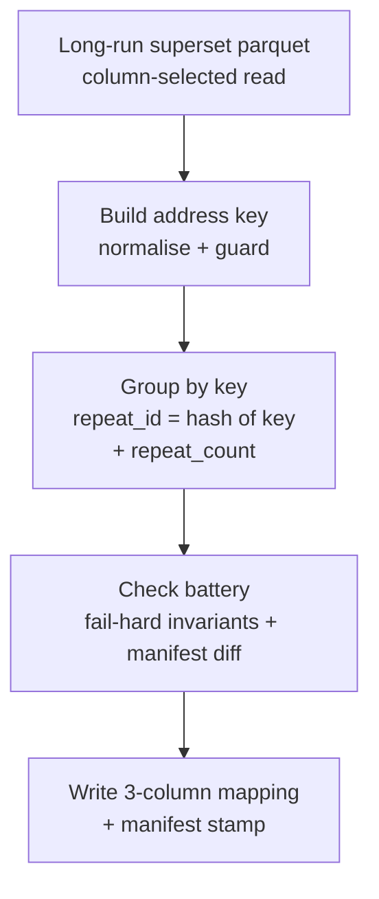
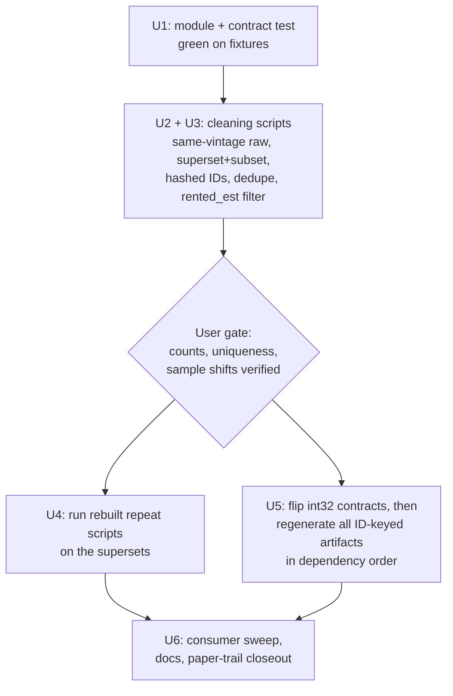

# refactor: Rebuild repeat transactions on content-stable IDs with long-run windows

## Summary

Rebuild `scripts/R/06_analysis_datasets/repeat_rentals.R` and `repeat_sales.R` as thin entry scripts over one shared parameterized pipeline module, keyed on content-stable hashed identifiers created upstream in the two cleaning scripts. Extend both cleaned datasets to long-run windows (sales 2014–2024, rentals 2014–2023) as superset tables from which the existing study-window files are derived in the same run, leaving study-window consumers on their current paths with changes bounded by the R6a allowed-delta contract. Flip the six Arrow schema contracts that pin the ID columns to int32, regenerate every ID-keyed artifact in one dependency-ordered pass, and close out the review paper trail.

All decisions were locked in grilling sessions (2026-07-07, 2026-08-14). Implementers must not re-open them; genuinely new information goes back to the user instead.

## Problem Frame

`rental_id` and `house_id` are positional row numbers (`clean_zoopla_data.R:262`, `clean_lr_house_price_data.R:219`): any upstream change to row count or order silently re-labels every transaction, which has caused two silent-misjoin episodes (rentals July 2026, sales August 2026 — the current sales mapping is misaligned with its rebuilt input). Secondary verified defects: exact-duplicate rows in cleaned rentals manufacture fake zero-gap repeat pairs; mixed-vintage raw Land Registry files put 65 `transaction_id`s in the sales input twice under different dates; the rentals cleaner selects rows by an OR across two date fields but time-indexes by a third, shipping out-of-window `qtr_id` values; the twin repeat scripts are hand-maintained duplicates; address keys embed literal `"NA"`; an unconsumed distance-summary stage misclassifies properties. Separately, repeat-sales is a long-run analysis needing history back to 2014, while the rest of the pipeline assumes the 2021–2024 study window and (verified by audit) enforces it nowhere — the window exists only as "which raw files the cleaner reads".

## Requirements

**Raw inputs and cleaning**

- R1. All Land Registry raw files `pp-2014.csv` … `pp-2024.csv` come from **one download session** (same vintage; performed by the user). The cleaning script asserts `transaction_id` uniqueness fail-hard before ID assignment, so a mixed-vintage refresh dies loudly.
- R2. `clean_lr_house_price_data.R` writes two outputs in one run: the canonical long-run superset `data/processed/house_price_long_run.parquet` (2014–2024) and the study-window file `data/processed/house_price.parquet` (2021–2024) **derived as a pure filter of the superset** — identical to today's file within the R6a allowed-delta contract. The subset is never built independently.
- R3. `clean_zoopla_data.R` filters on `year(rented_est) %in% window` (the field that time-indexes rows), replacing the OR-across-two-fields filter, and writes superset `data/processed/zoopla/zoopla_rentals_long_run.parquet` (2014–2023) plus derived subset `data/processed/zoopla/zoopla_rentals.parquet` (2021–2023) under the same one-run discipline. Exact duplicate rows (identical in all columns except `rental_id`) are removed before ID assignment, with the removed count logged and a raw-versus-cleaning origin spot-check recorded.
- R4. `rental_id` = xxhash64 hex of the seven-field post-cleaning composite (`postcode`, `address_line_01`, `address_line_02`, `address_line_03`, `listing_price`, `latest_to_rent`, `rented`), assigned in the superset so superset and subset carry identical ids. `house_id` = xxhash64 hex of `transaction_id`; the `transaction_id` column is dropped afterwards. Both scripts assert ID uniqueness fail-hard **at assignment time**.
- R5. The hash-input serialization is implemented **once**, in a shared side-effect-free helper `scripts/R/utils/hash_utils.R` sourced by both cleaning scripts and the repeat module — field order as listed, UTF-8 encoding, dates formatted `%Y-%m-%d`, numerics via `format(scientific = FALSE, trim = TRUE)`, NA token and separator that cannot appear in the fields (asserted), lowercase 16-character hex output. `digest` joins the relevant `REQUIRED_PACKAGES` vectors (already locked: `rproject.toml:85`, `rv.lock:675`). Note that recomputing an ID from raw data requires reapplying the cleaning transforms first.
- R6. `qtr_id`/`month_id` keep `base_year = 2021` everywhere. Negative values for pre-2021 superset rows are valid and documented; subset values stay bit-identical to today's for rows unaffected by the R6a deltas.
- R6a. **Allowed-delta acceptance contract.** The derived study-window files match today's files exactly **except**: (a) `house_id`/`rental_id` become utf8 hash strings; (b) sales `transaction_id` is removed; (c) rentals lose exact-duplicate rows and shift by the quantified `rented_est` selection correction; (d) sales rows change only where the same-vintage refresh corrected dates. Paths, all other columns, values, and row membership are otherwise identical — verified at the gate by joining old to new sales rows via `xxhash64(old file's transaction_id)`; no retained crosswalk or audit ledger is needed because the hash is recomputable from the old file.
- R6b. **Candidate-path discipline.** `data/` is Dropbox-shared and not branch-isolated, so both cleaners write all four outputs to candidate sibling paths (`*_candidate.parquet`). The gate reviews candidates while canonical files stay untouched; canonical replacement happens only after the gate clears, immediately before U4/U5 launch, so the shared tree never dwells in a mixed ID generation and the old files remain available for reconciliation.

**Pipeline rebuild**

- R7. A new shared module `scripts/R/utils/repeat_transactions_utils.R` holds the whole repeat-identification pipeline as pure functions over a config; `repeat_rentals.R` and `repeat_sales.R` shrink to thin entry scripts reading the **long-run supersets**. No distance-summary stage, no spill-lookup input.
- R8. The mapping output has exactly three columns — the transaction ID, `repeat_id`, `repeat_count` — at transaction grain with singles included, under a declared literal Arrow schema (transaction ID utf8, `repeat_id` utf8, `repeat_count` int32). `repeat_id` = xxhash64 hex of the normalised address key (stable across runs, no sequential assignment). Distinct address keys map to distinct `repeat_id`s — asserted at build time while the key column is still in memory (`uniqueN(key) == uniqueN(repeat_id)`) rather than claimed collision-free by construction; a `repeat_id` is meaningful only within its market's mapping. `repeat_count` is defined over the long-run window; window-restricted uses must regroup (documented in the module and `CONCEPTS.md`).
- R9. The address key is postcode + `paon` + `saon` + `street` (sales) and postcode + `address_line_01`–`03` (rentals), normalised by uppercasing, whitespace squishing, punctuation stripping, and empty-string substitution for missing components — never literal `"NA"`. Rows missing postcode or the primary address field (`paon` / `address_line_01`) carry no key and are excluded with a logged count. No fuzzy matching.
- R10. Contract tests assert **invariants only**: ID uniqueness, mapping-rows-equal-keyed-input-rows, zero post-dedupe duplicates, `repeat_id` well-formed, key→`repeat_id` bijection, `repeat_count` reconciliation, key-coverage floor, metadata stamp present. Empirical thresholds (key-coverage floor, repeat-share floor, large-group size) are **named config parameters, not invented constants**: on the first long-run generation the coverage floor is set to a permissive construction-bug value, the observed coverage, repeat share, and group-size distribution are recorded as baselines in the manifest and presented at the gate, and operational floors are fixed with the user afterwards. Exact counts live in the run manifest (parquet key-value metadata: input path, input row count, input mtime, run timestamp, keyed/excluded counts) and are diffed against the previous run with a logged delta, not hard-failed; when no previous compatible manifest exists (the first hash generation), the diff logs "first generation" and is skipped. Fixture contract test at `scripts/R/testing/test_repeat_transactions_contracts.R`.

**Consumers and regeneration**

- R11. Six files pinning ID columns to int32 are flipped to `utf8` with coercions removed, **before** their artifacts regenerate: `scripts/R/utils/prior_exposure_utils.R`, `scripts/R/utils/cross_section_study_period_utils.R` (incl. its numeric-ID validator), `scripts/R/04_feature_engineering/site_house_sale_match.R` and `site_rental_match.R` (incl. `as.integer()` coercions), `scripts/R/testing/test_prior_exposure_contracts.R`, `test_cross_section_study_period_contracts.R`. The flips touch **only the transaction-ID columns** — `site_id`, `radius`, `n_site_groups`, and period-count fields remain int32 — and both updated contract suites must run green on character-ID fixtures (including an ID with a leading zero) **before** any production regeneration starts.
- R12. After the gate, every ID-keyed artifact regenerates in one dependency-ordered pass and all consumers are updated: the 29 live `transaction_id`-referencing files, plus `rental_id`/`house_id` dtype and join-key assumptions in `scripts/R/09_analysis/05_news/` (18 files), `00_data_load/` (2, incl. the Python loader), `01_descriptive/` (2). A standalone match-rate verification script under `scripts/R/testing/` joins each regenerated artifact back to its cleaned input and fails below 100%. That check certifies **referential integrity only**: its near-zero failure signature for stale artifacts is specific to this one-time positional→hash transition, and each producer's own contract tests remain the completeness and correctness guarantee for future regenerations. `docs/pipeline_documentation.md` gains the module, the superset/subset outputs, and the one-run derivation rule.

## Key Technical Decisions

- **xxhash64 as 16-char hex string, not integer:** integer64 silently coerces to double above 2^53; int32 is collision-certain at these row counts; strings fail loudly. Vectorise with `digest::getVDigest("xxhash64")`. Deliberately overrides the int32 Arrow contracts from PRs #28/#29 — flip them, then they enforce the string regime. See `docs/adr/0002-content-stable-transaction-identity.md`.
- **`repeat_id` derives from the address key:** identity-from-content one level up — kills the `max()`-on-empty/`-Inf` bug class, makes run-over-run diffs meaningful. Distinct-key → distinct-id is **asserted at build time**, not claimed by construction, and an id is meaningful only within its market's mapping.
- **Superset + subset, derived in one run:** no downstream script enforces the study window, so extending the shared files in place would silently corrupt a dozen-plus consumers (wrong exposure denominators, decades-long DiD pre-periods, phantom FE levels). Content-stable IDs make the two-artifact design safe: the same transaction hashes identically in both.
- **Windows 2014–2024 (sales) / 2014–2023 (rentals):** Zoopla raw starts 2014; windows aligned across markets. No partial years (registration lag bias).
- **Same-vintage raw download is the duplicate fix; the assertion is the tripwire:** the 65 duplicate pairs are date corrections straddling year files of different vintages. Only a same-session download makes the *dates* correct; deduping would keep silently wrong dates — worse than a broken join for an estimator built on holding periods.
- **Rentals filter on `rented_est`:** selection rule and time index must agree. Sample shifts slightly; quantified at the gate.
- **Sales identity hashes `transaction_id` rather than using it verbatim:** format symmetry with rentals; provenance recoverable by recomputation.
- **Rentals identity keys the raw date pair, not derived `rented_est`:** a future coalesce-rule change cannot churn IDs.
- **Singles stay in the mapping with `repeat_count`:** the file is a census of keyable transactions; attrition auditable by subtraction.
- **`street` stays in the sales key:** dropping it falsely merges same-numbered houses across streets (estimator bias); keeping it splits only ~0.02% of groups (efficiency loss only).
- **No coordinate-consistency check:** both datasets carry ONS postcode-centroid coordinates, so a within-group check can never fire. Property-type consistency and extreme price-ratio flags are the false-merge alarms (warn-only).
- **Tests assert invariants; manifests carry counts:** exact figures are snapshots of one input generation; pinning them makes green tests rot silently.
- **Distance-summary stage deleted, not fixed;** old summary parquets archived. A standalone diagnostic can replace it later if wanted.
- **Positional-ID artifacts retired by full regeneration, never bridged:** stale hash-keyed joins fail loudly (near-zero match rate) — the desired failure mode. No interim realignment of the stale sales mapping.
- **The downstream estimator is out of scope:** `scripts/R/09_analysis/03_repeat_sales/repeat_sales.R` needs a `site_id` → Site Group migration unrelated to IDs; that plus its long-run redesign live in `todos/2026-08-14-repeat-sales-estimator-site-group-migration.md`. This plan's verification stops at the mapping boundary.

## Evidence Base

Verified 2026-08-14; reproduce before relying on. Figures for the 2014+ windows do not exist until the cleaning scripts first run — the gate verifies them.

| Fact | Value |
|------|-------|
| `zoopla_rentals.parquet` (2021–2023) | 1,450,255 rows; 3,453 excess exact-duplicate rows in 3,324 groups; 1,446,802 after dedupe |
| Rentals 7-field composite | exactly unique post-dedupe **on 2021–2023 only**; unverified on 2014–2023 — the fail-hard assertion is the check, a violation is a gate decision |
| `house_price.parquet` (2021–2024) | 3,891,124 rows; 65 duplicate `transaction_id` pairs from mixed-vintage raw (retired by R1's re-download) |
| Spill lookups | regenerated Aug 2026 **on positional IDs** — stale again after this rebuild; the ~5 GB house lookup is a multi-hour job and U5's critical path |

## High-Level Technical Design

The shared module processes either dataset through the same five stages; only the config differs.

## Implementation Units

### U1. Shared pipeline module and contract test

- **Goal:** the whole repeat-identification pipeline exists as pure functions over a config, proven on synthetic fixtures before touching real data.
- **Requirements:** R7, R8, R9, R10. **Dependencies:** none.
- **Files:** `scripts/R/utils/repeat_transactions_utils.R` (create), `scripts/R/utils/hash_utils.R` (create — the R5 shared serializer/hash helper), `scripts/R/testing/test_repeat_transactions_contracts.R` (create), `scripts/R/06_analysis_datasets/repeat_rentals.R` and `repeat_sales.R` (rewrite as thin entries).
- **Approach:** module functions take (data, config) where config names the id column, date column, price column, address columns (primary field identified), the optional property-type column (required by the property-type diagnostic), paths, and log name. Column-selected loading via `arrow::read_parquet(col_select = ...)` + `setDT()`; `repeat_id` assigned as the hash of the normalised address key in a single grouped projection (no full-width intermediate copies, no sequences, no `max()`). Check battery: fail-hard input checks (schema, non-empty, id uniqueness, zero exact duplicates, dates in window), threshold checks (key-coverage floor with logged exclusions, first-generation handling per R10; groups above ~12 transactions to a **large-group review file** — an address-quality audit, not a collision check), fail-hard output checks (mapping id unique; rows equal keyed input rows; `repeat_id` 16-char hex; distinct keys map one-to-one to `repeat_id`s, asserted while the key column is in memory; `repeat_count` reconciliation; manifest present), warn-only diagnostics (property-type consistency, extreme annualised price-ratio pairs to a review file, repeat-share floor), and a manifest diff against the previous run (logged delta, not a failure). R warnings route into the logger; plain non-colour log layout.
- **Execution note:** test-first — the fixture contract test is written and failing before the module functions exist.
- **Patterns:** contract-test shape from `scripts/R/testing/test_merge_outputs_contracts.R`; sourced-utils pattern from `scripts/R/utils/spill_aggregation_utils.R`; bootstrap via `scripts/R/utils/script_setup.R`; config-driven parameterization per `docs/solutions/design-patterns/parameterize-analysis-scripts-over-a-config-vector.md`.
- **Test scenarios:**
  - Two transactions at one address and one at another yield two `repeat_id`s with `repeat_count` 2 and 1, singles included; each `repeat_id` equals the recomputed hash of its normalised key.
  - Two runs on the same fixture, and a run on the row-shuffled fixture, produce value-identical sorted three-column mappings; metadata is validated separately, with timestamps allowed to differ (no byte-for-byte parquet comparison).
  - A row missing the primary address field gets no key, is absent from the mapping, and the logged exclusion count equals 1.
  - A key built from (postcode, paon, NA saon, street) contains no literal `"NA"` text.
  - `"ST. JOHN'S ROAD"` and `"ST JOHNS ROAD"` produce identical keys and `repeat_id`s.
  - Zero-repeat input: every single carries a well-formed hashed `repeat_id`; no sentinel values.
  - Duplicate input ids abort via the fail-hard uniqueness check.
  - A 15-transaction group lands in the large-group review file without failing the run.
  - Mixed property types within a group warn, not fail.
  - The written parquet carries exactly three columns and the full manifest, re-read through the same Arrow API production will use, with every metadata key and value asserted; if the installed Arrow version cannot round-trip the metadata, escalate to the user rather than substituting a different contract.
  - With no previous compatible manifest, the run logs "first generation" and skips the diff.
  - Key coverage below the configured floor aborts (exercised via a fixture-specific config value); above it, the excluded count is logged.
- **Verification:** contract test green on fixtures; both entry scripts run a fixture end-to-end without touching production data.

### U2. Land Registry cleaning — same-vintage raw, superset + subset, hashed house_id

- **Requirements:** R1, R2, R4, R5, R6, R6a, R6b. **Dependencies:** U1; the user's same-session download of `pp-2014.csv` … `pp-2024.csv` into `data/raw/lr_house_price/`. **Before the new files land**, the current Land Registry raw files are moved to a dated archive directory (kept, not deleted) and `shasum` checksums of both the old and new files are recorded in the gate log — the archived vintage is the only evidence of the 65 mixed-vintage duplicates. The user's same-session confirmation is gate testimony supplementing the checksums; a common file modification date proves nothing on a Dropbox-synced filesystem.
- **Files:** `scripts/R/02_data_cleaning/clean_lr_house_price_data.R` (modify); `scripts/R/testing/test_cleaning_rebuild_contracts.R` (create, shared with U3 — durable superset/subset derivation and shared-run-stamp contract test); `scripts/R/testing/reconcile_cleaning_rebuild.R` (create, shared with U3 — one-off old-versus-new gate-evidence script following the `reconcile_*` precedent, not a permanent snapshot suite).
- **Approach:** first verify the raw refresh — all eleven year files present, `transaction_id` globally unique across them, nonmissing and nonempty (if duplicates or missings remain, stop and report), `date_of_transfer` within 2014–2024. Then: `CONFIG$years = 2014:2024`; fail-hard `transaction_id` uniqueness; assert the postcode lookup is unique on `postcode` and enrichment is row-count preserving (many-to-one join); `house_id = xxhash64 hex(transaction_id)` via the shared R5 helper; drop `transaction_id`; fail-hard `house_id` uniqueness at assignment; write the superset, derive the subset by `year(date_of_transfer) %in% 2021:2024` — both to candidate paths per R6b. For the gate, report the old-versus-new transition — changes in `date_of_transfer`, `qtr_id`, `month_id`, and 2021–2024 membership, joined by hashing the old file's `transaction_id` — with the 65 previously duplicated IDs and their corrected retained records called out (the corrected dates are the payoff the re-download exists for; the gate must see them).
- **Test scenarios:** a raw `transaction_id` duplicate aborts before any output; superset and subset carry identical `house_id` for the same transaction (spot-join); the subset matches today's file within the R6a allowed deltas, with `qtr_id` bit-identical for shared rows; hash determinism on a source-`transaction_id` sample; `transaction_id` absent from both output schemas.
- **Verification:** vintage check passed; both candidate outputs written; uniqueness and determinism pass; row counts and the date-transition report logged for the gate.

### U3. Zoopla cleaning — rented_est filter, dedupe, superset + subset, hashed rental_id

- **Requirements:** R3, R4, R5, R6, R6a, R6b. **Dependencies:** U1 (raw Zoopla files already span 2014–2023; no new download).
- **Files:** `scripts/R/02_data_cleaning/clean_zoopla_data.R` (modify); the two shared testing scripts created in U2.
- **Approach:** replace the OR-filter with `year(rented_est) %in% CONFIG$years`; `CONFIG$years = 2014:2023`; remove exact duplicates before ID assignment (log count + raw-origin spot-check); assert the postcode lookup is unique on `postcode` and enrichment is row-count preserving (many-to-one join); assign `rental_id` as the composite hash via the shared R5 helper; fail-hard uniqueness at assignment — **if the composite is not unique on the extended window, stop and bring the collision profile to the gate rather than extending the composite unilaterally**; write superset, derive subset by `year(rented_est) %in% 2021:2023` — both to candidate paths per R6b.
- **Test scenarios:** no output row has `year(rented_est)` outside its window (no negative `qtr_id` in the subset); superset and subset carry identical `rental_id` for the same row; rows with NA `rented` or `latest_to_rent` hash deterministically and stay unique; two runs produce byte-identical `rental_id` columns; the dedupe count and the filter-change sample shift are both logged.
- **Verification:** uniqueness holds (or the collision profile is escalated); both candidate outputs written; the subset's sample delta versus the current file is quantified for the gate.

**User gate after U2 and U3:** confirm with the user — vintage check result and raw-vintage checksums; superset/subset row counts for both datasets; rentals dedupe count and composite-uniqueness result on 2014–2023; sales `transaction_id` uniqueness result and the old-versus-new date/period/membership transition report; the rentals sample shift from the `rented_est` filter; the observed key-coverage/repeat-share baselines once U4 runs (threshold values fixed per R10); every delta checked against the R6a contract via `reconcile_cleaning_rebuild.R`. The gate reviews **candidate** files; canonical files are untouched until it clears. No downstream regeneration before the gate clears; promotion of the candidates to canonical paths happens immediately before U4/U5 launch.

### U4. Run the rebuilt repeat scripts

- **Requirements:** R7, R8, R9, R10. **Dependencies:** U2, U3, gate. Parallel with U5 (the pipeline does not read the spill lookups).
- **Files:** `data/processed/repeated_transactions/` outputs (regenerate; U4 is the **sole owner** of the two mapping paths — U5 does not touch them).
- **Approach:** read the previous mappings' manifests for the run diff **before** touching the files; run both entry scripts against the supersets, writing to stage paths; only after the full check battery passes, archive `repeated_rentals.parquet`, `repeated_sales.parquet`, and the two orphaned `*_summary.parquet` files to `data/processed/repeated_transactions/_archive/2026-08-14/` and promote the new mappings — a failed run must never leave the tree with no canonical mapping; record key-coverage and repeat-share baselines in the manifests and log.
- **Verification:** full battery green on both real datasets; mapping rows equal keyed superset rows with exclusions reconciling by subtraction; spot check that one known repeat property resolves to a single `repeat_id` equal to the recomputed hash of its address key; old artifacts archived, not deleted.

### U5. Type-contract flips and downstream regeneration

- **Requirements:** R11, R12 (regeneration half). **Dependencies:** U2, U3, gate. Parallel with U4.
- **Files:** the six R11 files (modify first); the ID-keyed outputs of `scripts/R/04_feature_engineering/` (both spill lookups) and `scripts/R/06_analysis_datasets/` (run unchanged in the order given by `docs/pipeline_documentation.md` — the 14 Layer-06 scripts **excluding** `repeat_sales.R` and `repeat_rentals.R`, which U4 owns exclusively); a new standalone match-rate verification script under `scripts/R/testing/` (create, following the `diff_*`/`reconcile_*` precedent).
- **Approach:** flip int32 → `utf8` and remove `as.integer()` coercions **on the transaction-ID columns only** in the six files (adjacent legitimate int32 fields — `site_id`, `radius`, `n_site_groups`, period counts — stay integer) **before** running anything; run both updated contract suites green on character-ID fixtures, including a leading-zero ID, before launching any production regeneration; check free disk headroom before the house-lookup rebuild (16-character string IDs enlarge every transaction-site row of the ~5 GB artifact); then regenerate in dependency order: spill lookups first (the house lookup is the long pole), then cross-section/prior-exposure builders, then the remaining Layer-06 artifacts. The match-rate script joins each artifact's ID column back to its cleaned source and fails below 100% — a near-zero rate means a missed upstream regeneration and stops the sequence.
- **Verification:** match-rate script reports 100% everywhere; updated contract tests pass; no script errors or warns about missing ids.

### U6. Consumer sweep, documentation, and paper-trail closeout

- **Requirements:** R12 (consumer half). **Dependencies:** U4, U5.
- **Files:** `scripts/R/09_analysis/03_repeat_sales/repeat_sales.R` (remove the `transaction_id` selects at lines 95 and 198 **only** — the Site Group migration is out of scope); the remaining live `transaction_id` referencers — `scripts/R/09_analysis/02_hedonic/` (5), `06_upstream_downstream/` (12), `scripts/R/testing/test_lsoa_variation_updown_prior.R`, and the testing notebooks (`sales_repeat_purchases.qmd`, `sales_repeat_purchases2.qmd`, `rent_repeat_purchases.qmd`, `spill_count_variation_share_prior.qmd`, `test_house_price_sewage_merge.Rmd`); ID dtype/join assumptions in `05_news/` (18), `00_data_load/` (2, incl. `load_data_sewage.py`), `01_descriptive/` (2); `docs/pipeline_documentation.md` (module, superset/subset outputs, one-run derivation rule, removal of the summary-stage claims); both cleaner headers (paired long-run/study-window output lists); `docs/adr/0002-content-stable-transaction-identity.md` (implementation status); `docs/solutions/best-practices/script-setup-runtime-package-cleanup-ingestion-20260310.md` (correct the stale `renv::restore()` references to `rv sync`); `todos/2026-07-07-review-repeat-rentals-sales.md` (check off findings with status notes).
- **Approach:** grep-driven sweep for `transaction_id`, integer-ID assumptions (`as.integer` on ids, arithmetic on ids, `seq_len` over ids, int32/int64 schema references), and mapping reads; for every mapping read found, confirm any window-restricted use regroups rather than consuming the long-run `repeat_count`, and note the check in the sweep record; fix each; rerun the affected 09_analysis outputs **except** the repeat-sales estimator (blocked on its own migration).
- **Verification:** repo-wide search finds no live references to the Land Registry **source column** `transaction_id` (dependencies or type assumptions) outside the cleaning script's hash comment, with an explicit allow-list for the utilities' legitimate internal generic `transaction_id` variable names; no remaining integer pins on ID columns; affected analyses rerun cleanly; documentation updated; review findings checked off.

## Execution Chunking (multi-thread)

CH1 = U1. CH2 = U2 + U3 in one thread, ending at the user gate (U2 additionally waits on the raw download). After the gate, CH3 = U4 and CH4 = U5 — **sequential by default on a single machine**: the long-run volumes and the multi-hour ~5 GB lookup rebuild contend for memory and Dropbox-synced disk, and parallelism is permitted only on separate machines or with measured headroom. CH5 = U6 last. Do not launch CH3/CH4 before the gate clears.

## Scope Boundaries

- No estimator changes beyond the mechanical `transaction_id` removals — see `todos/2026-08-14-repeat-sales-estimator-site-group-migration.md`. Verification stops at the mapping boundary (join match rates, not regression tables).
- No fuzzy or edit-distance address matching (false merges corrupt the estimator; splits only lose observations).
- No study-window sample changes outside the R6a allowed deltas (the quantified `rented_est` filter fix, rental exact-duplicate removal, and sales rows corrected by the same-vintage refresh).
- No semantic rename of `house_id` (it labels a transaction row, not a property); the grain is documented in the cleaning script.
- No partial-year (2025+) data.

### Deferred to Follow-Up Work

- The repeat-sales estimator: Site Group migration, long-run window adoption, pair-filter methodology (own grilling session).
- A standalone on-demand "repeat properties near spill sites" diagnostic, if wanted for the paper.
- Wider `06_analysis_datasets` migration to the shared `script_setup.R` bootstrap.
- Repo-wide convergence on the canonical postcode normaliser (`scripts/R/utils/postcode_processing_utils.R`).

## Risks & Dependencies

- **Rentals composite uniqueness on 2014–2023 is unverified:** the fail-hard assertion detects a violation; it stops U3 and goes to the gate for a deliberate composite extension.
- **ID churn on cleaning-rule changes:** future normalisation changes regenerate IDs; failure is loud, regeneration discipline mandatory; manifests and the match-rate script are the tripwires.
- **Superset/subset drift:** the subset must only ever be derived inside the cleaning run — enforced structurally (one script, two writes) and by contract test (subset = superset filtered to window; shared run stamp).
- **Long-run volumes:** sales roughly doubles (~8–9M rows expected). The column-pruned data.table path covers the **repeat module only** — the Land Registry cleaner itself is eager (per-year import, `map_dfr`, full-width postcode join); watch memory on its first 11-year run, and check disk headroom before the lookup rebuild.
- **`repeat_count` semantics:** defined over the long-run window; window-filtered consumers must regroup. Documented in the module, `CONCEPTS.md`, and the manifest.
- **Raw download is a user dependency:** U2 starts with the vintage check and cannot run before the files land.

## Sources

- Superseded plan: `docs/plans/2026-07-07-001-refactor-repeat-transactions-rebuild-plan.md`. Validated review: `todos/2026-07-07-review-repeat-rentals-sales.md`.
- Identity-regime ADR: `docs/adr/0002-content-stable-transaction-identity.md`. Vocabulary: `CONCEPTS.md` § Repeat-Transactions Area.
- Conventions: `docs/solutions/design-patterns/parameterize-analysis-scripts-over-a-config-vector.md`; `docs/solutions/best-practices/script-setup-runtime-package-cleanup-ingestion-20260310.md` (its `renv::restore()` references are stale — `AGENTS.md` and the live `scripts/R/utils/script_setup.R` with `rv sync` are authoritative for this refactor; the doc is corrected in U6); `scripts/R/testing/test_merge_outputs_contracts.R`.
- External review: GPT Pro plan review 2026-08-14 (`/tmp/oracle-repeat-review/review.md`), adjudicated by two independent adversarial verification passes against the codebase; the edits both passes endorsed are folded in above. Rejected by both passes: the per-producer dependency run table (P1-8) — regenerating all of Layer-06 in documented order is the deliberate omission-proof strategy. Explicitly not adopted (single-pass endorsement only): market-namespaced `repeat_id` preimages, input-content fingerprints in manifests, a full rental duplicate-provenance ledger, and producer-specific reconciliation suites.
