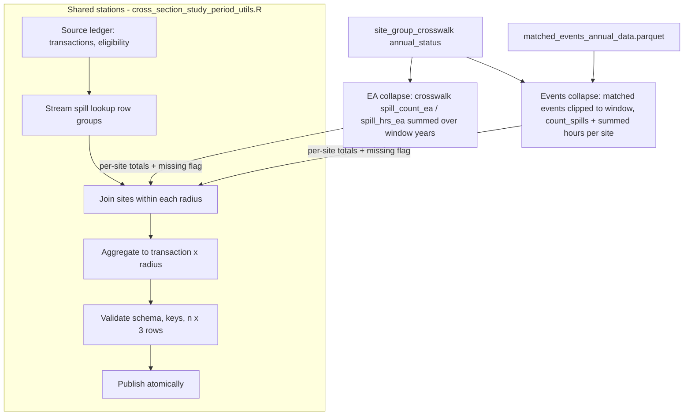

# Event-Based Study-Period Cross-Sections - Plan

## Goal Capsule

- **Objective:** Rebuild the study-period sales and rental cross-sections from individual EDM events instead of EA Annual Returns, keeping the output contract identical, while preserving the Annual-Returns builders under an `_ea` suffix.
- **Authority:** The decisions in this plan were settled interactively with the author and supersede, by reference, the "EA annual returns as canonical complete-year evidence" decision in docs/plans/2026-08-13-1903-refactor-study-period-cross-sections-plan.md. The canonical exposure source for the paper remains an open research question; this plan makes the event-based variant what downstream analysis consumes by default.
- **Branch:** All work happens on `jo/cross-section-individual-edm`, created in a dedicated worktree off `jo/update-analysis-outputs` after the in-flight changes on that branch (rental window trim, `hedonic_bins_full.R` rewiring, deck checklist note) are committed.
- **Stop conditions:** Surface to the author instead of guessing if (a) the shared-utility refactor cannot keep the EA collapse byte-identical in behavior, (b) the events-based and EA outputs disagree on the missingness (NA) pattern in the validation comparison, since the design implies they must match exactly, or (c) any existing contract test fails for a reason unrelated to this change.

---

## Product Contract

### Summary

Two new builders, `scripts/R/06_analysis_datasets/cross_section_sales.R` and `cross_section_rental.R`, compute study-period spill exposure from matched individual EDM events and publish to the unsuffixed `data/processed/cross_section/{sales,rentals}/study_period/` paths that downstream analysis reads. The current Annual-Returns builders are renamed to `cross_section_sales_ea.R` / `cross_section_rental_ea.R` and publish to sibling `study_period_ea/` paths. Both families share one validated pipeline in `scripts/R/utils/cross_section_study_period_utils.R`, differing only in a pluggable per-site collapse step. A logged comparison quantifies how much the source swap moves exposure.

### Problem Frame

The repository measures spill exposure two ways. The prior-exposure datasets (`prior_to_sale`, `prior_to_rental`, and their site-grain siblings) aggregate individual EDM events clipped to per-transaction windows. The study-period cross-sections instead sum the EA Annual Returns figures (`spill_count_ea`, `spill_hrs_ea`) from the site-group crosswalk over a fixed window. The two families therefore differ in both window and measurement method, so differences between analyses built on them are not attributable to the window alone. Rebuilding the study-period cross-sections from the same event data used by the prior-exposure family removes the method difference: after this change the two families differ only in window. Which source ultimately becomes canonical for the paper is deliberately left open; consistency across analyses is the motivation.

### Requirements

**Naming and paths**

- R1. `cross_section_sales.R` and `cross_section_rental.R` are renamed (history-preserving) to `cross_section_sales_ea.R` and `cross_section_rental_ea.R`, with output paths moved to `data/processed/cross_section/sales/study_period_ea/` and `data/processed/cross_section/rentals/study_period_ea/` and log files renamed to `cross_section_sales_ea.log` / `cross_section_rental_ea.log`. Headers state that "EA" means the Annual Returns data, published by the Environment Agency.
- R2. New `cross_section_sales.R` and `cross_section_rental.R` own the unsuffixed `study_period/` output paths and `cross_section_sales.log` / `cross_section_rental.log`, so `hedonic_bins_full.R`, `cross_sectional_plots.R`, and the verification specs run unchanged against event-based data.

**Event-based exposure**

- R3. Exposure is computed from `data/processed/matched_events_annual_data/matched_events_annual_data.parquet` (matched individual EDM events only), reading only `site_id`, `start_time`, `end_time`, and `year`.
- R4. Events are clipped to the fixed study window; `spill_hrs` is the sum of clipped durations and `spill_count` is computed with the EA 12/24 counting rule (`count_spills()` in `scripts/R/utils/spill_aggregation_utils.R`) over the clipped intervals, matching the prior-exposure convention.
- R5. Study windows are identical to the EA builders: sales 2021-01-01 to 2024-12-31, rentals 2021-01-01 to 2023-12-31.
- R6. The output schema, grain (one row per transaction per radius), row-count contract (exactly `n_transactions × 3`), eligibility semantics, and daily/weekly average definitions are identical to the EA builders. No columns are added or removed.
- R7. The missingness rule is identical to the EA builders: the Annual Returns statuses remain the evidence oracle, so a property whose radius contains any site with any window year of `annual_status` in `reported_na` or `absent` (or a site-year missing from the completed grid) gets NA exposure and `has_missing_site = TRUE`. Consequently the NA pattern of the event-based output must equal that of the EA output row for row.

**Architecture**

- R8. The events-based collapse is a pluggable step inside `scripts/R/utils/cross_section_study_period_utils.R`; the ledger, lookup streaming, radius aggregation, ineligible handling, output validation, and atomic publication stations are shared between both variants, and the existing EA collapse behavior is unchanged.

**Validation**

- R9. All four builders run end-to-end and publish validated datasets.
- R10. A comparison script reports, per market and radius: row-count reconciliation, exact equality of the NA pattern, shares of zero-exposure properties under each source, and correlations plus level differences of `spill_count` and `spill_hrs` between sources. Results are written to a log so the source comparison is citable.

**Documentation**

- R11. `CONCEPTS.md` splits Study-Period Spill Exposure into an event-based variant and an Annual-Returns (EA) variant, records that "EA data" and "Annual Returns" are synonyms in this project, and makes no canonical claim.
- R12. The supersession of the 08-13 plan's canonical-source decision is recorded: this plan documents the reversal, and docs/plans/2026-08-13-1903-refactor-study-period-cross-sections-plan.md gains a one-line pointer here. Pipeline documentation (docs/pipeline_documentation.md, book/data_clean_documentation/01_pipeline.qmd) reflects the four builders and their paths.

### Acceptance Examples

- AE1. **Missingness parity.** Given a property whose 250 m radius contains a site with `annual_status = reported_na` in 2023 and recorded events in 2021, when both builders run, then both the event-based and EA rows for that property show NA exposure and `has_missing_site = TRUE`.
- AE2. **Key parity.** Given the sales source ledger, when both sales builders complete, then `study_period/` and `study_period_ea/` contain exactly the same set of (`house_id`, `radius`) keys, each exactly once.
- AE3. **Counting rule.** Given a single continuous 25-hour event fully inside the window at a site with clean annual statuses, when the event-based builder runs, then that site contributes 25 spill hours and 2 spills (first 12 hours count 1, the following 24-hour block counts 1) to properties whose radius contains it.
- AE4. **Boundary clipping.** Given an event starting 2020-12-31 18:00 and ending 2021-01-01 06:00, when the sales builder runs, then only the 6 hours inside the window contribute to `spill_hrs`.

### Scope Boundaries

**Deferred to Follow-Up Work**

- An `annual_returns_na_then_absent`-style flag for the study-period datasets. It was established during scoping that under R7 the flag would only ever be TRUE on rows whose exposure is already NA, so it cannot change any estimate; revisit only if the missingness rule is loosened.
- Adding `study_period_ea` dataset specs to `scripts/R/testing/verify_id_artifact_match_rates.R`.
- The decision of which exposure source is canonical for the paper.

**Non-goals**

- No schema, window, or radius changes; radii stay `{250, 500, 1000}`.
- No changes to downstream analysis scripts; they keep reading `study_period/` and must run unchanged.
- No use of unmatched events (`combined_edm_data.parquet` beyond its matched subset).

---

## Planning Contract

### Key Technical Decisions

- KTD1. **Matched events only.** Exposure reads `matched_events_annual_data.parquet`, not the raw combined feed, because unmatched events carry no usable site identity and the prior-exposure family already draws from the matched set. Coverage is 2021–2024, so the 2024 sales window is served.
- KTD2. **Recomputed counting rule, accepted estimand change.** `spill_count` becomes an in-project `count_spills()` reconstruction rather than the companies' reported annual figure. This is the point of the change: the prior-exposure and study-period families then share one measurement method and differ only in window.
- KTD3. **Annual statuses stay the evidence oracle.** The event feed is positives-only, so it cannot distinguish a genuinely silent site from an unmonitored one. The window-level missingness rule from the EA collapse is kept verbatim, which also forces the NA patterns of the two outputs to coincide — used as a validation invariant (AE1, R10).
- KTD4. **Pluggable collapse, shared pipeline.** Only the per-site collapse step in `cross_section_study_period_utils.R` is source-specific; roughly the whole remaining pipeline (ledger, row-group streaming, radius aggregation, validation, atomic publication) is reused, so the schema stays identical by construction and existing contract tests keep protecting both variants.
- KTD5. **No new flag column.** The `annual_returns_na_then_absent` flag is structurally redundant here (see Scope Boundaries) and is not added.
- KTD6. **`_ea` suffix.** "EA" and "Annual Returns" are project synonyms (the Environment Agency publishes the returns), and `_ea` matches spoken vocabulary among the coauthors, so it is preferred over `_annual`.

### High-Level Technical Design

The shared pipeline with the pluggable collapse seam. Everything downstream of the collapse consumes the same small per-site totals table and is unchanged.

Directional guidance, not implementation specification: the events collapse produces the same intermediate shape the EA collapse produces today (per `site_id`: window totals plus a missing-evidence indicator derived from `annual_status`), selected via config (for example an `exposure_source` field plus an events path). The `n_days_in_window` divisor for daily/weekly averages is already window-derived and needs no change.

### Assumptions

- The in-flight changes on `jo/update-analysis-outputs` are committed before branching; the renames in U2 operate on the committed rental builder (window already trimmed to 2023).
- Event timestamps in `matched_events_annual_data.parquet` are UTC POSIXct, as consumed by `prior_exposure_utils.R`; window boundaries are converted consistently.

### Sequencing

U1 (shared utility) precedes everything; U2 (renames) and U3 (new builders) can proceed in parallel after U1; U4 (comparison) needs both U2 and U3 outputs; U5 (docs) last.

---

## Implementation Units

### U1. Pluggable collapse in the shared study-period utility

- **Goal:** `cross_section_study_period_utils.R` supports two per-site collapse implementations — the existing Annual-Returns collapse and a new events-based collapse — selected by config, with identical downstream behavior.
- **Requirements:** R3, R4, R7, R8.
- **Dependencies:** none.
- **Files:** `scripts/R/utils/cross_section_study_period_utils.R`, `scripts/R/testing/test_cross_section_study_period_contracts.R`.
- **Approach:** Extract the current `collapse_study_period_annual_returns` call site into a source dispatch. The events collapse loads `site_id`, `start_time`, `end_time`, `year` from the configured events path filtered to window years, keeps events overlapping the window, clips them to the window boundaries, and aggregates per site to `spill_hrs` (summed clipped hours) and `spill_count` (`count_spills()` over clipped intervals), mirroring the clipping in `prior_exposure_join_events` (`scripts/R/utils/prior_exposure_utils.R`). The missing-evidence flag is computed from the crosswalk `annual_status` exactly as the EA collapse computes it today, so both collapses emit the same intermediate columns. Config validation gains the new source option and the events path; EA remains the behavior for existing configs.
- **Patterns to follow:** event clipping and hour computation in `prior_exposure_utils.R`; the 12/24 rule in `spill_aggregation_utils.R` (`count_spills`); config validation and collapse structure already in `cross_section_study_period_utils.R`.
- **Test scenarios:**
  - Covers AE4. An event straddling the window start contributes only its in-window hours; one straddling the window end likewise; one entirely outside contributes nothing.
  - Covers AE3. A 25-hour in-window event yields `spill_hrs = 25` and `spill_count = 2` for its site.
  - Multiple events at one site sum hours and count independently under the 12/24 rule.
  - Covers AE1. A site with events in 2021 but `annual_status = reported_na` in a later window year produces the missing-evidence flag, and a transaction whose radius contains it gets NA exposure with `has_missing_site = TRUE`.
  - A site with `absent` in a window year behaves the same; a site with all window years `reported_zero` and no events yields a true zero.
  - A site with events but absent from the crosswalk grid in a window year is flagged missing.
  - Regression: the EA collapse path produces byte-identical results to the pre-refactor utility on the existing test fixtures.
  - Config validation rejects an unknown exposure source and an events source without an events path.
- **Verification:** `test_cross_section_study_period_contracts.R` passes with both the existing EA cases and the new events cases.

### U2. Rename the Annual-Returns builders to `_ea`

- **Goal:** The EA-based builders live at `cross_section_sales_ea.R` / `cross_section_rental_ea.R`, publish to `study_period_ea/`, and log to `_ea` log files, with headers stating the Annual-Returns (EA) source.
- **Requirements:** R1.
- **Dependencies:** U1 (renamed scripts must call the post-refactor utility).
- **Files:** `scripts/R/06_analysis_datasets/cross_section_sales_ea.R`, `scripts/R/06_analysis_datasets/cross_section_rental_ea.R` (history-preserving renames of the current unsuffixed scripts).
- **Approach:** Rename, then update `CONFIG$output_path`, `LOG_FILE`, header Purpose/Outputs blocks, and any explicit source selection to the EA collapse. No behavioral change beyond paths and naming.
- **Test scenarios:** Test expectation: none — path and naming configuration only; behavior is covered by U1's EA regression cases.
- **Verification:** Both `_ea` builders run end-to-end and publish validated datasets under `study_period_ea/`; the old `study_period/` outputs are untouched by these two scripts.

### U3. New event-based builders

- **Goal:** New `cross_section_sales.R` and `cross_section_rental.R` publish event-based study-period cross-sections to the unsuffixed `study_period/` paths.
- **Requirements:** R2, R3, R4, R5, R6.
- **Dependencies:** U1.
- **Files:** `scripts/R/06_analysis_datasets/cross_section_sales.R`, `scripts/R/06_analysis_datasets/cross_section_rental.R` (new files).
- **Approach:** Mirror the `_ea` scripts' structure (CONFIG, logging, `main`), selecting the events collapse and adding the matched-events path to CONFIG. Windows per R5. Headers state the individual-EDM source and the `count_spills()` convention.
- **Patterns to follow:** the `_ea` builder scripts (post-U2 shape); header conventions of `scripts/R/06_analysis_datasets/` scripts.
- **Test scenarios:** Covers AE2 at builder level — publication validation asserts the exact (`id`, `radius`) key contract; collapse behavior is unit-tested in U1. Test expectation beyond that: none — the scripts are thin config wrappers around the shared builder.
- **Verification:** Both builders run end-to-end and publish validated datasets under `study_period/`; `scripts/R/09_analysis/02_hedonic/hedonic_bins_full.R` runs unchanged against the new outputs.

### U4. Source-comparison report

- **Goal:** A reproducible script quantifies EA-vs-event differences and asserts the structural invariants.
- **Requirements:** R9, R10.
- **Dependencies:** U2, U3 (both dataset families published).
- **Files:** `scripts/R/testing/verify_study_period_exposure_sources.R` (new), `output/log/verify_study_period_exposure_sources.log`.
- **Approach:** For each market and radius, join the two outputs on the transaction key and report: row counts and key parity (must match exactly), NA-pattern equality (must match exactly, per KTD3), shares of zero-exposure properties per source, Pearson and Spearman correlations of `spill_count` and `spill_hrs`, and summary statistics of the level differences. Structural invariants fail loudly; distributional comparisons are reported, not asserted.
- **Patterns to follow:** verification-script conventions in `scripts/R/testing/verify_id_artifact_match_rates.R` (logging, spec-per-dataset structure).
- **Test scenarios:**
  - Covers AE2. Key-parity check fails loudly on a fabricated mismatched fixture and passes on the published outputs.
  - NA-pattern equality check fails loudly when one source has an NA the other lacks.
  - Correlation and zero-share sections handle the all-NA radius subset without erroring.
- **Verification:** The script runs against the four published datasets; the log contains the full comparison and all structural invariants pass.

### U5. Documentation and vocabulary

- **Goal:** The repo's vocabulary and pipeline docs reflect the two exposure variants and the recorded supersession.
- **Requirements:** R11, R12.
- **Dependencies:** U2, U3 (final names and paths settled).
- **Files:** `CONCEPTS.md`, `docs/pipeline_documentation.md`, `docs/plans/2026-08-13-1903-refactor-study-period-cross-sections-plan.md`, `book/data_clean_documentation/01_pipeline.qmd`.
- **Approach:** In `CONCEPTS.md`, split Study-Period Spill Exposure into event-based and Annual-Returns (EA) variants, state the EA/Annual-Returns synonymy, and note that the event-based variant is what unsuffixed paths carry, with no canonical claim. Add the one-line supersession pointer to the 08-13 plan. Update the pipeline execution-order docs with the four builders and their output paths.
- **Test scenarios:** Test expectation: none — documentation only.
- **Verification:** Docs name the four scripts and their paths accurately; `CONCEPTS.md` entries match the shipped behavior.

---

## Verification Contract

| Gate | Command / check | Proves |
|---|---|---|
| Contract tests | `Rscript scripts/R/testing/test_cross_section_study_period_contracts.R` | U1 collapse behavior, EA regression parity, config validation |
| Builder runs | `Rscript` each of the four scripts in `scripts/R/06_analysis_datasets/` | R1, R2, R9; publication-time schema, key, and row-count validation |
| Source comparison | `Rscript scripts/R/testing/verify_study_period_exposure_sources.R` | R10; key parity and NA-pattern equality invariants (AE1, AE2) |
| Downstream smoke | `Rscript scripts/R/09_analysis/02_hedonic/hedonic_bins_full.R` | R2, R6; consumers run unchanged on event-based data |

Environment: R 4.6.0 with dependencies via `rv sync`. Builders are long-running; run them sequentially and check `output/log/` on completion.

---

## Definition of Done

- All five units complete on `jo/cross-section-individual-edm`.
- Four validated datasets published: `study_period/` (event-based) and `study_period_ea/` (Annual Returns) for both markets.
- All Verification Contract gates pass, including exact key parity and NA-pattern equality between sources.
- `CONCEPTS.md`, pipeline docs, and the 08-13 plan pointer updated.
- No abandoned experimental code in the diff; the EA collapse path is behaviorally unchanged.

---

## Sources / Research

- `scripts/R/utils/cross_section_study_period_utils.R` — EA exposure enters via crosswalk columns `spill_count_ea` / `spill_hrs_ea` (collapse around line 130; crosswalk read around line 1047); the spill lookup carries geometry only.
- `scripts/R/utils/prior_exposure_utils.R` — event clipping convention (overlap filter and clamping around lines 394–407) and matched-events column selection.
- `scripts/R/utils/spill_aggregation_utils.R` — `count_spills()` 12/24 rule (around line 212).
- `scripts/R/utils/site_group_utils.R` — `annual_returns_na_then_absent` derivation (around line 342), grounding KTD5's redundancy argument.
- `docs/plans/2026-08-13-1903-refactor-study-period-cross-sections-plan.md` — the superseded canonical-source decision and the R1–R14 contract the shared utility implements.
- `CONCEPTS.md` — Annual Status (the positives-only-feed disambiguation role) and the current Study-Period Spill Exposure definition this plan splits.
- Downstream consumers of `study_period/`: `scripts/R/09_analysis/02_hedonic/hedonic_bins_full.R`, `scripts/R/09_analysis/01_descriptive/cross_sectional_plots.R`, `scripts/R/testing/verify_id_artifact_match_rates.R`.
