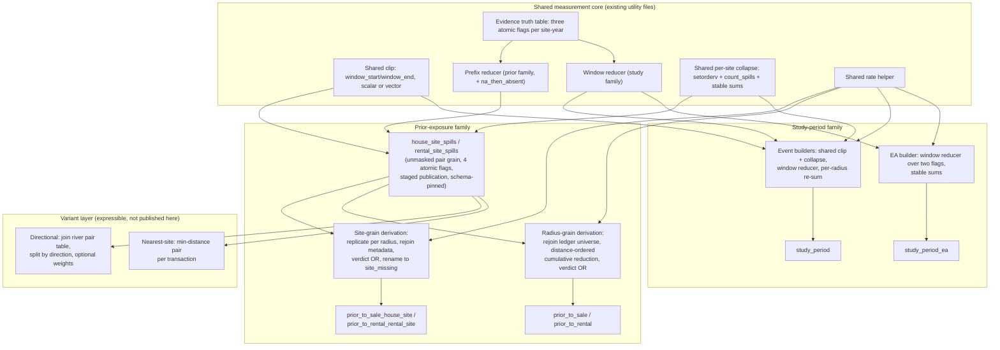

# Layered Exposure Builders and Harmonized Evidence Policy - Plan

Status: locked — signed off by Jacopo on 2026-08-17. This closes the
exposure-builder-refactor wayfinder map
(`docs/wayfinder/exposure-builder-refactor/map.md`). Execution rides the
next real surgery on these builders, outside the map.

## Goal Capsule

- **Objective:** Re-layer the six cross-section exposure datasets around one
  unmasked measurement layer (`house_site_spills` / `rental_site_spills`) and
  one shared measurement core, then harmonize the missing-evidence rule
  across every event-based dataset, executed as two gated stages: Stage 1
  re-layers with semantics frozen, Stage 2 flips the harmonized policy. The
  layered architecture must express the named future variants (directional,
  nearest-site, window choice) as cheap derivations without reopening the
  closed publication contracts.
- **Authority:** The decisions recorded on the exposure-builder-refactor
  wayfinder map, tickets 00 through 10, each settled with Jacopo on
  2026-08-17. Ticket paths are cited throughout as
  `docs/wayfinder/exposure-builder-refactor/tickets/NN-*.md`.
- **Execution profile:** R 4.6.0 with the `rv`-activated project environment
  and plain `Rscript` commands. All work happens in the two existing engine
  files (`scripts/R/utils/prior_exposure_utils.R`,
  `scripts/R/utils/cross_section_study_period_utils.R`), the two existing
  shared utilities (`scripts/R/utils/spill_aggregation_utils.R`,
  `scripts/R/utils/site_group_utils.R`), the builder entry scripts under
  `scripts/R/06_analysis_datasets/`, and the existing contract and
  verification scripts under `scripts/R/testing/`.
- **Prerequisite (already satisfied):** Pull request #34
  (`jo/cross-section-individual-edm`) merged to `main` on 2026-08-17 as
  commit `b9f8203`, and all four study-period datasets regenerated from the
  merged code the same afternoon. This plan is written against that
  post-merge state: `collapse_study_period_events()` fails loudly on
  unexpected NA totals, and `study_period_read_events(events_path)` takes
  one argument.
- **Stop conditions:** Stop if the work requires changing a public schema,
  key grain, canonical path, or partitioning; changing Annual Status
  definitions, the crosswalk build, or event matching; touching the panel or
  grid exposure datasets; fixing the analysis-layer re-aggregations named in
  the offender list; or introducing a registry, plugin, or configuration
  framework for variants or publication.
- **Tail ownership:** The plan ends when the six datasets are rebuilt under
  the harmonized rule, the contract and verification suite passes, and
  Jacopo has signed off the Stage-2 sample-impact memo. Analysis outputs do
  not regenerate inside this plan; that work belongs to the two named
  follow-ups in the Scope Boundaries.

---

## Product Contract

### Summary

The four prior-exposure datasets become thin, validated derivations from a
new internal, unmasked measurement layer at transaction–Site Group grain.
Both engines consume one shared measurement core: one event clip, one
evidence truth table with two reducers, one per-site collapse, one rate
helper. Stage 1 proves the re-layering is a no-op against frozen semantics.
Stage 2 then moves every event-based dataset onto one harmonized
missing-evidence verdict, quantifies the sample impact in a signed-off memo,
and locks the documentation. Public schemas, key grains, paths, and
partitioning never change.

### Problem Frame

Three defects motivate the refactor, all documented on the map:

1. **Masking is baked into measurement.** The prior-exposure engine computes
   raw clipped-event measures and immediately masks them, so the published
   datasets cannot support variants (directional splits, nearest-site
   selection) that need the unmasked pair rows. The twelve
   `upstream_downstream_*` scripts work around this by re-reducing published
   site-grain output with `na.rm = TRUE`, silently inverting the engine's
   NA-poisoning rule twelve times over
   (`assets/02-drift-map.md`, item 5).
2. **Two engines duplicate measurement arithmetic.** The prior and
   study-period engines each implement event clipping, evidence
   classification, per-site collapse, and rate arithmetic, publishing
   identically named columns from unshared code. The drift map ranks this
   the top drift risk: any future divergence lands silently in sibling
   directories under the same column names.
3. **The missing-evidence rule is inconsistent.** Today the site-grain prior
   datasets mask on the full finding-11 rule (`reported_na`, `absent`, or
   `reported_positive` with zero matched events), the radius-grain prior
   datasets mask on `absent` only, and both study-period datasets mask on
   `reported_na` or `absent` only. The same evidence gap therefore produces
   NA in one dataset and a numeric value in its sibling.

### Requirements

#### The measurement layer (`house_site_spills` / `rental_site_spills`)

- R1. Each measurement table has one row per eligible transaction × nearby
  Site Group within the maximum radius threshold, keyed by
  `house_id`/`rental_id` and `site_id`, carrying the pair's actual
  `distance_m` and **no `radius` column**. Per-radius replication is a
  mechanical step inside the site-grain derivation, not a property of the
  measurement table.
- R2. The measures are the window-clipped `spill_hrs` and the single
  `spill_count` column produced by the 12/24-hour block rule in
  `count_spills()`, computed over the prior-family per-transaction window
  (2021-01-01 to the transaction endpoint) only. Transaction metadata
  (`price`/`listing_price`, `n_days_in_window`) is excluded; the derivations
  rejoin it from the transaction ledger.
- R3. Evidence travels as four atomic flags. The first three are each true
  when their condition holds in at least one year of the transaction's
  lookback window: `annual_returns_absent` (today's `site_missing`,
  renamed internally), `annual_returns_na`, and
  `reported_positive_without_matched_events`. The fourth,
  `annual_returns_na_then_absent`, is a sequence flag computed by the
  prefix reducer over the full crosswalk horizon, unchanged from today's
  definition: a `reported_na` year within the window, no `absent` year
  within the window, and an `absent` year after it — its defining absent
  year lies outside the lookback window by construction. No verdict column
  is stored; the event and EA verdicts are ORs computed in the derivation
  layer.
- R4. Real pairs only: no sentinel rows and no NA keys. A transaction with
  zero nearby sites has no rows; the radius-grain derivation re-enumerates
  the transaction universe by rejoining the eligible-transaction ledger,
  exactly as today's `CJ(transaction_ids, radii)` grid does.
- R5. The tables live at
  `data/processed/cross_section/sales/house_site_spills` and
  `data/processed/cross_section/rentals/rental_site_spills`, as chunked
  parquet directories using the existing streaming `chunk-%010d` pattern,
  with no Hive partitioning.
- R6. Both tables publish through the full staged machinery
  (`publish_validated_dataset`: hidden sibling stage, pre- and
  post-promotion validation, atomic rename) with a hand-written Arrow schema
  and expected-key validation derived from the lookup. They stay off the
  public enumerated list, but their schemas are pinned in
  `test_prior_exposure_contracts.R` so drift is caught by tests.

#### The shared measurement core

- R7. The core is a named set of functions across the two existing utility
  files — spill arithmetic in `spill_aggregation_utils.R`, evidence
  classification in `site_group_utils.R` — never a third file.
- R8. One shared clip function takes the event table plus `window_start` and
  `window_end` arguments accepting scalars or per-row vectors; the
  `event_hours > 0` filter lives inside it. The prior engine passes per-row
  transaction endpoints; the study engine passes its two constants.
- R9. One shared evidence truth table takes crosswalk rows and returns, per
  site-year, the three atomic condition flags (`annual_returns_absent`
  covering both status `absent` and a site-year row missing entirely,
  `annual_returns_na` for status `reported_na`,
  `reported_positive_without_matched_events` for status `reported_positive`
  with `matched_event_count == 0`). Two thin reducers sit on top: a prefix
  reducer for the prior family (cumulative `any` to each cutoff year;
  `derive_site_group_prefix_missing_flags()` becomes an
  interface-preserving wrapper, and `annual_returns_na_then_absent` stays
  computed there only) and a window reducer for the study family (`any`
  over the fixed window years).
- R10. One shared per-site collapse — order the clipped events with explicit
  `setorderv`, then per group compute `count_spills()` and summed hours
  through the stable-sum wrappers — parameterized by grouping keys:
  (transaction, site) for the prior engine, site alone for the study
  engine. `count_spills()` remains the single 12/24 implementation. One
  shared rate helper owns the daily and weekly average formulas
  (`total / n_days_in_window`, times seven for weekly).
- R11. Radius reductions stay per-engine as an intentional, documented
  difference: the prior engine keeps its distance-ordered cumulative
  reduction, the study engine keeps its per-radius re-summing. The stated
  cost is that any future change to radius semantics must be made twice.
- R12. The stable-sum discipline is a core-wide invariant: a fixed row order
  before every grouped reduction, and every sum or cumulative sum routed
  through the stable wrappers. The study engine (including the EA
  collapse's two `base::sum()` calls) adopts it.
- R13. Validated pair uniqueness replaces the prior engine's defensive
  `min(distance_m)` dedupe. The uniqueness assertion lives in the
  publication gate, which already checks duplicate public keys. Empirical
  basis: zero duplicate transaction-site pairs in both lookups
  (272,728,062 rows in `spill_house_lookup.parquet`; 111,923,121 rows in
  `spill_rental_lookup.parquet`; checked 2026-08-17).
- R14. Core functions carry no validation: correctness lives in unit tests
  and the Stage-1 reconciliation, and the publication gate stays the single
  runtime check. Existing defensive checks inside the two engines are left
  alone in this refactor.

#### The harmonized evidence policy

- R15. One shared classification, two verdicts, both computed as ORs in the
  derivation layer and never stored: the **event-evidence verdict** is the
  OR of `annual_returns_absent`, `annual_returns_na`, and
  `reported_positive_without_matched_events`; the **EA-evidence verdict**
  is the OR of the first two flags only.
- R16. Stage 1 reproduces today's masks exactly: site-grain prior datasets
  keep the full finding-11 semantics, radius-grain prior datasets keep the
  `annual_returns_absent`-based `has_missing_site` only, and both
  study-period datasets keep the two-flag rule. Any output difference in
  Stage 1 is a refactor bug.
- R17. Stage 2 moves every event-based dataset — the four prior datasets and
  `study_period` — onto the full event-evidence verdict, each as a
  one-expression diff in its derivation. `study_period_ea` stays on the
  EA-evidence verdict permanently: the third flag indicts the event
  matching, not the Annual Returns its measures are read from.
- R18. The missing-evidence rule is baked into the shared reduction with no
  per-variant opt-out: any derivation's total is NA whenever a contributing
  site has unknown evidence. `study_period_ea` is not an opt-out but a
  different data source with its own verdict computed from the same shared
  classification; the plan states both sentences together so they cannot be
  read as contradicting.
- R19. Public names stay frozen: the site-grain derivation renames
  `annual_returns_absent` back to `site_missing` at publication, and
  `annual_returns_na_then_absent` keeps its published column and meaning in
  the radius schemas. The clearer internal names become public only in a
  later schema revision, outside this plan.

#### Publication contracts and compatibility

- R20. Public schemas, key grains, canonical paths, and Hive partitioning
  are byte-compatible throughout: the literal schemas in
  `prior_exposure_public_schema()` and `study_period_public_schema()`, the
  radius-grain key (transaction, radius), the site-grain key (transaction,
  site, radius), and the radii 250/500/1000. No consumer changes in
  Stage 1.
- R21. Extensibility lives in the computation layer only. Every public
  output keeps a hand-written Arrow schema and an explicit entry in an
  enumerated list. This is an explicit **amendment, not a repeal, of R7 and
  R8 of `docs/plans/2026-08-13-1322-refactor-prior-exposure-shared-builders-plan.md`**:
  the no-framework rule and the literal-schema rule stand unchanged for
  everything published, while the internal derivation layer may now express
  variants beyond the original two-axis (market × grain) matrix as named
  functions — never as a column-mapping or plugin framework.
- R22. Before Stage 1 runs, `verify_id_artifact_match_rates.R` gains the two
  `study_period_ea` entries (sales and rentals, mirroring the
  `study_period` specifications), and
  `test_verify_id_artifact_match_rates_contracts.R` moves its pinned
  inventory from fourteen to sixteen artifacts, so both the baseline and
  the rebuilt datasets carry verified transaction identifiers.

#### Two-stage execution and reconciliation

- R23. Stage-1 reconciliation compares every rebuilt dataset against its
  pre-refactor snapshot: exact match on key sets, integer columns, NA
  patterns, and boolean flags; float measures within a relative tolerance
  of order 1e-9. (Jacopo has accepted a looser 1e-6 tolerance for outputs
  whose methodology deliberately changes — the study engine's summation
  order changes under R12 — but the Stage-1 bar stays at 1e-9, which
  satisfies the looser figure.)
- R24. In Stage 2, every difference from the Stage-1 output must be
  attributable to the rule: rows that change do so only by NA status, the
  set of newly-NA rows is exactly the set predicted by the flags added to
  each dataset's verdict (flags 2 and 3 for the radius-grain prior
  datasets; flag 3 for `study_period`; nothing for the site-grain prior
  datasets and `study_period_ea`, which are unchanged), and all other rows
  keep their Stage-1 values.
- R25. `verify_study_period_exposure_sources.R` is updated in Stage 2: the
  key-set assertion stays exact, and the NA-pattern assertion changes from
  exact agreement to the harmonized relationship — `study_period_ea`'s NA
  rows are a subset of `study_period`'s, and the difference set is exactly
  the rows whose window contains a `reported_positive` year with zero
  matched events. The script continues to report distributional
  differences without asserting them.
- R26. After Stage 2's dry run and before its outputs are accepted as
  canonical, a sample-impact memo (see R28) is produced and Jacopo signs it
  off. Sign-off is the gate between "rebuilt" and "canonical".

#### Downstream boundary

- R27. The only in-scope analysis code change is removing the manual
  `!annual_returns_na_then_absent` exclusion from
  `scripts/R/09_analysis/02_hedonic/hedonic_continuous_prior.R` (currently
  lines 160 and 203) in Stage 2, backed by a contract assertion that
  `annual_returns_na_then_absent = TRUE` implies NA exposure in the
  harmonized radius datasets, so the redundancy is proven rather than
  assumed. Every other consumer is a plain re-run deferred to the
  follow-ups.
- R28. The Stage-2 sample-impact memo is a self-contained `.qmd` in
  `docs/reports/` (following the lagged-attention report precedent) that
  quantifies, per dataset and radius: rows before and after, which rows
  change NA status, and the exposure distribution of the removed rows —
  plus before-and-after coefficients and standard errors for the preferred
  250-metre continuous hedonic in both markets, estimated within the memo
  itself. It gives the paper's data section every number it needs but
  drafts no paper prose, and it does not modify or re-run any analysis
  script.
- R29. The plan names the NA-overriding consumers (the offender list in the
  Appendix) with an explicit warning that their outputs must not be
  refreshed after Stage 2 until they are fixed. The list is mirrored into a
  follow-up file in `todos/`. No warning comments are added to the
  offending scripts.

#### Documentation

- R30. `CONCEPTS.md` gains, when the plan executes: the `house_site_spills`
  / `rental_site_spills` entry (the pre-masking transaction–Site Group
  record of clipped event measures and evidence flags from which the
  published prior-exposure datasets are derived); glossary entries for the
  four atomic flags; the NA-propagation convention (missing evidence stays
  NA all the way into the regression sample; `na.rm = TRUE` re-reduction
  and zero-coercion of missing evidence are nonconforming); and the locked
  average-columns wording from ticket 10, appended verbatim to the
  "Average Daily Spill Exposure" entry (text in the Appendix).
- R31. The four identically named average columns
  (`spill_count_daily_avg`, `spill_hrs_daily_avg`,
  `spill_count_weekly_avg`, `spill_hrs_weekly_avg`) are renamed in
  neither family. The collision is resolved by documentation only: the
  `CONCEPTS.md` wording plus the named subsection "Identically named
  average columns across families" in this plan's Appendix. Arrow
  field-level metadata was rejected because it changes the serialized
  schema form the contract tests pin.

### Key Flows

- F1. **Measure once, unmasked:** Clip events to each transaction's window
  with the shared clip, collapse per (transaction, site) with the shared
  collapse, attach the four atomic evidence flags from the shared truth
  table's prefix reducer, and publish the two measurement tables through
  the staged machinery.
- F2. **Derive the published prior datasets:** The site-grain derivation
  replicates pairs per radius, rejoins transaction metadata, applies its
  verdict OR, renames `annual_returns_absent` to `site_missing`, and
  publishes the frozen schema. The radius-grain derivation re-enumerates
  the transaction universe from the ledger, runs the distance-ordered
  cumulative reduction, applies its verdict OR, and publishes the frozen
  schema.
- F3. **Share the core with the study family:** Both study-period builders
  call the shared clip (fixed window constants), the shared collapse (site
  grouping), the shared truth table with the window reducer, and the
  shared rate helper; the EA builder calls the truth table and rate helper
  only, ignoring the third flag.
- F4. **Reconcile Stage 1:** Snapshot all six datasets, rebuild everything
  through the new layers with verdict expressions frozen at today's
  per-dataset rules, and prove the R23 identity.
- F5. **Flip Stage 2:** Change each event-based derivation's verdict
  expression to the full three-flag OR, remove the redundant hedonic
  exclusion, update the source-comparison verifier, dry-run, produce the
  memo, and accept as canonical on sign-off.

### Acceptance Examples

- AE1. **Stage 1 is a no-op**
  - **Covers:** R1–R16, R20, R23
  - **Given:** Pre-refactor snapshots of all six published datasets.
  - **When:** The measurement tables are built, the four prior datasets are
    re-derived from them, and the study-period builders run on the shared
    core, all with per-dataset verdicts frozen at today's rules.
  - **Then:** Every dataset matches its snapshot exactly on keys, integers,
    NA patterns, and flags, and within 1e-9 relative tolerance on floats.
- AE2. **The four flags reproduce every current mask**
  - **Covers:** R3, R9, R15, R16
  - **Given:** A fixture with site-years covering each atomic condition:
    status `absent`, a site-year row missing from the crosswalk, status
    `reported_na`, status `reported_positive` with zero matched events, and
    status `reported_positive` with matched events.
  - **When:** The truth table classifies them and each derivation applies
    its Stage-1 verdict OR.
  - **Then:** The site-grain derivation masks the first four cases; the
    radius-grain derivation masks only the first two (through
    `has_missing_site`); the study-period window reducer masks the first
    three; and the matched-positive case is masked nowhere.
- AE3. **Stage 2 is a one-expression diff with full attribution**
  - **Covers:** R17, R24
  - **Given:** The accepted Stage-1 outputs.
  - **When:** Each event-based derivation's verdict expression changes to
    the three-flag OR and the datasets rebuild.
  - **Then:** The radius-grain prior datasets gain NA rows exactly where a
    window year has `annual_returns_na` or
    `reported_positive_without_matched_events`; `study_period` gains NA
    rows exactly where a window year has
    `reported_positive_without_matched_events`; the site-grain prior
    datasets and `study_period_ea` are unchanged; and no non-NA value
    moves.
- AE4. **The EA divergence is quantified, not hidden**
  - **Covers:** R17, R18, R25
  - **Given:** The Stage-2 `study_period` and `study_period_ea` outputs.
  - **When:** The updated `verify_study_period_exposure_sources.R` runs.
  - **Then:** The key sets match exactly, `study_period_ea`'s NA rows are a
    subset of `study_period`'s, the difference set is exactly the
    unverifiable-positive rows, and the log reports the distributional
    comparison.
- AE5. **The redundant exclusion is proven redundant before removal**
  - **Covers:** R19, R27
  - **Given:** The Stage-2 radius-grain datasets.
  - **When:** The contract assertion checks every row with
    `annual_returns_na_then_absent = TRUE`.
  - **Then:** All such rows have NA `spill_hrs`, `spill_count`, and all
    four averages, so removing the manual exclusion from
    `hedonic_continuous_prior.R` cannot change its estimation sample.
- AE6. **A window variant is a measurement re-run, not a derivation**
  - **Covers:** R2, R8, and the variant model
  - **Given:** A hypothetical new lookback window.
  - **When:** Someone asks the layered architecture for it.
  - **Then:** The answer is a new run of the measurement-table build
    through the core's window arguments; the clipped hours stored on each
    pair row were computed for one specific window and cannot be
    re-windowed downstream. Direction, nearest-site, and weighting, by
    contrast, are named derivation functions over the existing table.
- AE7. **The slot table fills with no footnotes**
  - **Covers:** R21 and the variant model
  - **Given:** The slot table in the Appendix.
  - **When:** Each current and named future exposure definition is written
    as one row.
  - **Then:** Every row fills every slot (measurement source, measurement
    window, pair selection, per-pair weight, reduction grouping) with no
    footnotes, and the status column marks exactly the six current
    datasets as published and the three future variants as expressible.
- AE8. **Duplicate pairs fail loudly**
  - **Covers:** R13
  - **Given:** A fixture lookup containing a duplicated transaction-site
    pair.
  - **When:** The measurement table publishes through the gate.
  - **Then:** Publication stops with an error naming the duplicate key; no
    silent `min(distance_m)` collapse occurs anywhere.

### Success Criteria

- Stage-1 reconciliation passes for all six datasets under R23, and the
  full contract and verification suite is green before any Stage-2 change.
- Stage-2 differences are fully attributed under R24, the memo is produced
  under R28, and Jacopo's sign-off is recorded before the outputs become
  canonical.
- The measurement tables exist, are schema-pinned, and both published prior
  datasets are derived from them; no masked dataset is the source of
  another dataset.
- Every named future variant is expressible per the slot table without
  touching publication contracts.
- The documentation set (CONCEPTS.md entries, offender-list follow-up in
  `todos/`, this plan's Appendix) is complete.

### Scope Boundaries

- The panel and grid exposure datasets (`sale_panel_exp`,
  `rental_panel_exp`, `house_panel_within_radius`,
  `rental_panel_within_radius`, grid long differences, site panels) are out
  of scope; extending the measurement layer to them is a fresh effort.
- Upstream semantics — Annual Status definitions, the crosswalk build,
  event matching — stay as they are.
- No analysis outputs (tables, figures, deck assets, book chapters)
  regenerate inside this plan. Two named follow-ups own that work, in
  order: **(1) the post-Stage-2 standard analysis battery refresh**
  (Jacopo's, runnable the day Stage 2 lands, covering the consumers in the
  inventory that are plain re-runs), and **(2) the analysis-layer
  NA-convention cleanup**, explicitly ordered fix-first-then-refresh, and
  partly blocked on the colleague-owned signed-pair CSVs. The offender
  list's outputs must not be refreshed in follow-up 1.
- The directional derivation is fully specified as the worked example but
  is not built, published, or added to the enumerated public list here;
  follow-up 2 inherits it as its spec.
- No variant beyond the named axes (directional, nearest-site, window) is
  designed for; no market beyond sale and rental is designed for.
- The `hedonic_continuous_full.R` hard-coded 1095-day denominator is an
  independent background task outside this plan.
- Cleanup of existing defensive checks inside the engines rides a later
  effort (R14).

### Dependencies

- Pull request #34 merged (commit `b9f8203`) and the four study-period
  datasets regenerated from the merged code — satisfied 2026-08-17.
- `data/processed/matched_events_annual_data/site_group_crosswalk.parquet`
  continues to provide validated `annual_status` and zero-filled integer
  `matched_event_count` at unique Site Group-year grain; the study-period
  and EA builders begin reading `matched_event_count` because the shared
  truth table requires it.
- The two pair lookups (`spill_house_lookup.parquet`,
  `spill_rental_lookup.parquet`) remain unique on transaction-site pairs;
  the publication gate now asserts this.
- The river-network signed-pair table
  (`upstream_downstream/output/03-02/river_filter/spill_house_signed_with_lateral`
  and its rental sibling) is the directional derivation's declared input,
  needed only when follow-up 2 builds it.
- No external package or service is added.

---

## Planning Contract

### Key Technical Decisions

Every decision below was settled with Jacopo in the map's grilling sessions
on 2026-08-17; the ticket file holds the full rationale and rejected
alternatives.

- KTD1. **Materialize the existing intermediate, unmasked.** The
  measurement tables materialize the stage the prior engine already
  computes once per chunk (`prior_exposure_transaction_site_metrics`,
  `prior_exposure_utils.R:411-468`) rather than inventing a new
  computation. (map-settled: ticket 02 — chosen over publishing evidence
  flags on the public site-grain datasets, which breaks consumers, and
  over widening public schemas with parallel raw columns.) Governs R1–R6.
- KTD2. **Atomic flags, not verdicts.** The measurement layer stores four
  atomic evidence conditions and no composite verdict; both harmonized
  verdicts are one-line ORs in the derivations, so the Stage-2 policy
  change is a visible one-expression diff. (map-settled: ticket 02 —
  chosen over a stored `has_unknown_event_evidence` composite, which
  bundles distinct conditions.) Governs R3, R15–R17.
- KTD3. **The core is a concept, not a file.** The shared measurement core
  is a named function list with stated invariants across the two existing
  utility files; a third utility file with its own partial view of
  measurement is the third-engine failure mode. (map-settled: ticket 03.)
  Governs R7–R10.
- KTD4. **Freeze what is frozen; share what drifts.** Radius reductions
  stay per-engine (documented intentional difference), while clipping,
  classification, collapse, rates, and the stable-sum discipline go
  core-wide — the pieces where silent drift under identical column names
  is the live risk. (map-settled: ticket 03 — merging the reductions was
  rejected as the largest rewrite for zero numerical gain.) Governs
  R10–R12.
- KTD5. **Test the code, keep the code clean.** Core functions carry no
  validation; unit tests and the one-off Stage-1 reconciliation prove
  correctness, and the publication gate stays the single runtime check —
  which is also where the new pair-uniqueness assertion lives.
  (map-settled: ticket 03.) Governs R13–R14.
- KTD6. **Per-source verdicts, no per-variant opt-outs.** Event-based
  datasets all use the three-flag OR with no opt-out in the shared
  reduction; `study_period_ea` uses the two-flag OR permanently because
  its measures come from the Annual Returns themselves. Cross-source
  comparability is quantified by the comparison verifier, not forced by
  identical missingness. (map-settled: charter ticket 00 and ticket 09 —
  chosen over masking on `reported_na`/`absent` only everywhere, which
  reopens the finding-11 understatement, and over applying the strictest
  rule to the EA variant, which throws away valid EA observations.)
  Governs R15–R18, R25.
- KTD7. **Two variant kinds, attaching at different layers.** Selection,
  direction, and weighting are named derivation functions over the
  measurement tables; window choice is a measurement-layer parameter
  requiring a re-run. Each new variant is one short named function — no
  registry, no framework. Directional attributes stay in the river-network
  pair table and enter via the derivation's declared join. (map-settled:
  ticket 08.) Governs R21 and the slot table.
- KTD8. **Amend, don't repeal, the closed-publication contract.**
  Extensibility lives in the computation layer only; every public output
  keeps a hand-written Arrow schema and an enumerated entry. No schema
  text is written for unpublished variants — a schema is written by the
  effort that publishes the dataset. (map-settled: ticket 08, amending
  R7/R8 of the 2026-08-13 shared-builders plan.) Governs R21.
- KTD9. **Two gated stages with different proof obligations.** Stage 1's
  proof is identity (any difference is a refactor bug); Stage 2's proof is
  attribution (every difference traced to the rule) plus a signed memo.
  Bit-identity was rejected for Stage 1 because it would freeze incidental
  accumulation order into the new code. (map-settled: charter ticket 00.)
  Governs R23–R26.
- KTD10. **A narrow downstream boundary.** The plan ends at the rebuilt
  datasets and a passing suite; one proven-redundant exclusion is removed,
  one memo is produced, the convention and offender list are documented,
  and everything else is a named follow-up. (map-settled: ticket 05.)
  Governs R27–R29.
- KTD11. **Document the name collision; do not rename.** The four average
  columns keep their names in both families; `n_days_in_window`
  self-describes every row, and the locked wording lands in `CONCEPTS.md`
  and this plan. (map-settled: ticket 10 — renaming reopens frozen
  schemas; Arrow field metadata changes the pinned schema form.) Governs
  R30–R31.

### High-Level Technical Design

The masked published datasets are leaves: nothing is derived from a masked
dataset. Window choice re-runs the measurement layer; every other variant
is a derivation from it.

### Sequencing

1. **Stage 0 (preliminaries):** Close the `study_period_ea` ID-verifier gap
   (R22), snapshot all six canonical datasets outside the repository diff,
   and record the baseline contract-suite state.
2. **Stage 1 (re-layering, frozen semantics):** Build the shared core with
   unit tests; build and publish the measurement tables; re-derive the four
   prior datasets; move the study-period builders onto the core; reconcile
   everything under R23. Gate: reconciliation passes and the full suite is
   green.
3. **Stage 2 (harmonized policy):** Flip the event-based verdicts; update
   the source-comparison verifier; add the redundancy assertion and remove
   the hedonic exclusion; dry-run and produce the memo. Gate: Jacopo signs
   the memo; only then do the Stage-2 outputs become canonical.
4. **Documentation close-out:** CONCEPTS.md entries, the `todos/` follow-up
   mirror, pipeline documentation touch-ups.

### System-Wide Impact

- **Data semantics:** Stage 1 changes nothing observable. Stage 2 adds NA
  rows to the radius-grain prior datasets (windows containing
  `reported_na` or unverifiable-positive years) and to `study_period`
  (unverifiable-positive years). The site-grain prior datasets and
  `study_period_ea` are semantically unchanged. Every consumer inherits
  the change through its existing drop-NA-averages filter; no consumer
  reads the masking flags directly (consumer inventory, ticket 01).
- **Known sensitivity:** The branch's manual
  `annual_returns_na_then_absent` exclusion removed 1.66 percent of the
  250-metre hedonic sample and moved the preferred sales estimate from
  insignificant to significant at 5 percent, and the current all-or-nothing
  study-period rule already sets 36.4 percent of properties to NA at
  1,000 metres. Stage 2's mask supersedes the former and adds to the
  latter; this is exactly why the memo and sign-off gate exist.
- **Public interfaces:** Paths, schemas, keys, partitioning, and column
  names never change. Two new internal artifacts appear beside the
  published ones.
- **Performance:** The measurement tables add one publication per market
  but remove the duplicated pair-metric computation from the two prior
  derivations, which now read a validated artifact instead of recomputing
  it. The study engine's arithmetic volume is unchanged.
- **Reproducibility:** The core-wide stable-sum discipline makes both
  engines' published floats reproducible bit for bit between runs.

### Risks and Mitigations

- **Silent semantic drift during re-layering:** The re-derivation could
  subtly change masks or universes. Mitigation: the Stage-1 identity bar
  (R23) with exact NA-pattern comparison, plus AE2's per-dataset mask
  fixture.
- **Universe loss at the pair grain:** Dropping sentinel rows could lose
  zero-site transactions. Mitigation: R4's ledger rejoin plus
  reconciliation on exact key sets.
- **Stage-2 attribution failure:** A difference not predicted by the added
  flags would indicate a bug hiding behind the policy change. Mitigation:
  R24's exact attribution requirement, computed row-by-row in the
  reconciliation, and the sequencing that lands Stage 2 only on top of an
  accepted Stage-1 baseline.
- **The comparison verifier breaks on the intended divergence:** Stage 2
  deliberately makes `study_period` and `study_period_ea` diverge, which
  the current verifier asserts against. Mitigation: R25 updates the
  assertion to the harmonized relationship in the same stage, and AE4 pins
  it.
- **Verdict wording read as contradictory:** "No per-variant opt-out"
  beside "the EA variant keeps a two-flag verdict" invites misreading.
  Mitigation: R18 states both together with the source-versus-variant
  distinction, in the plan and in CONCEPTS.md.
- **Frozen-name confusion:** Internal `annual_returns_absent` versus
  public `site_missing` could be miswired. Mitigation: the rename is
  confined to one place (the site-grain derivation's final projection) and
  the literal public schemas are asserted by the existing contract tests.
- **Scope creep into the analysis layer:** The offender list invites
  fixing. Mitigation: the boundary is a requirement (R29), the fixes are
  out of scope on the map, and the follow-ups are named and ordered.

### Sources and Research

- `docs/wayfinder/exposure-builder-refactor/map.md` and tickets 00–10 — the
  decision record this plan assembles; each ticket holds rejected
  alternatives.
- `docs/wayfinder/exposure-builder-refactor/assets/01-consumer-inventory.md`
  — the complete consumer, schema, and contract inventory (ticket 01).
- `docs/wayfinder/exposure-builder-refactor/assets/02-drift-map.md` — the
  independent-aggregation survey and ranked drift risk (ticket 07).
- `docs/plans/2026-08-12-002-fix-prior-exposure-evidence-publication-plan.md`
  — the finding-11 evidence rule this plan generalizes, and the style
  template.
- `docs/plans/2026-08-13-1322-refactor-prior-exposure-shared-builders-plan.md`
  — R7/R8, amended by R21 of this plan.
- `docs/plans/2026-08-17-001-feat-event-based-study-period-cross-sections-plan.md`
  and pull request #34 — the post-merge study-period baseline.
- `scripts/R/utils/prior_exposure_utils.R` — the engine whose intermediate
  (`prior_exposure_transaction_site_metrics`, lines 411–468) becomes the
  measurement layer; the literal public schemas (lines 33–111).
- `scripts/R/utils/cross_section_study_period_utils.R` — the study engine
  post-merge, including the loud-NA event collapse.
- `scripts/R/utils/site_group_utils.R`,
  `scripts/R/utils/spill_aggregation_utils.R` — the homes of the shared
  core.
- `CONCEPTS.md` — Annual Status vocabulary and the Average Daily/Weekly
  Spill Exposure entries this plan extends.

---

## Implementation Units

### Stage 0

#### U1. Close the `study_period_ea` verifier gap and freeze the baseline

- **Goal:** Give all six datasets verified transaction identifiers, then
  snapshot the pre-refactor state the reconciliation will compare against.
- **Requirements:** R22, R23 (baseline half).
- **Dependencies:** None.
- **Files:**
  - `scripts/R/testing/verify_id_artifact_match_rates.R`
  - `scripts/R/testing/test_verify_id_artifact_match_rates_contracts.R`
- **Approach:**
  1. Add the two `study_period_ea` entries (sales and rentals) to the
     verifier's artifact inventory, mirroring the `study_period`
     specifications; update the pinned inventory count from fourteen to
     sixteen in the contract test.
  2. Run the verifier and the full contract suite on the current canonical
     datasets; record the green baseline.
  3. Snapshot all six canonical datasets outside the repository diff (copy
     the canonical directories to a scratch location) for Stage-1 and
     Stage-2 reconciliation.
- **Test scenarios:** The verifier reports 100 percent match rates for
  sixteen artifacts; the inventory contract pins exactly sixteen.
- **Verification:** Baseline suite green; snapshots readable via
  `arrow::open_dataset()`.

### Stage 1 — re-layering with frozen semantics

#### U2. Build the shared measurement core

- **Goal:** One implementation each of clipping, evidence classification,
  per-site collapse, and rate arithmetic, as named functions in the two
  existing utility files, with unit tests.
- **Requirements:** R7–R12, R14.
- **Dependencies:** U1.
- **Files:**
  - `scripts/R/utils/spill_aggregation_utils.R` (shared clip, shared
    collapse, rate helper; `count_spills()` already lives here)
  - `scripts/R/utils/site_group_utils.R` (truth table, prefix reducer
    wrapper, window reducer)
  - `scripts/R/testing/test_prior_exposure_contracts.R` and
    `scripts/R/testing/test_cross_section_study_period_contracts.R` (unit
    fixtures for the core functions)
- **Approach:**
  1. Add the shared clip: event table in, `window_start`/`window_end` as
     scalars or per-row vectors, overlap filter and `pmax`/`pmin` clamping
     and the `event_hours > 0` filter inside, matching the arithmetic both
     engines use today bit for bit.
  2. Add the truth table over crosswalk rows returning the three atomic
     flags per site-year, treating a missing site-year row as
     `annual_returns_absent`; validate nothing inside it (R14).
  3. Wrap the existing `derive_site_group_prefix_missing_flags()` interface
     around the truth table plus cumulative-`any` prefix logic, keeping
     `annual_returns_na_then_absent` there; add the window reducer
     (`any` over fixed window years) and swap it into
     `study_period_annual_evidence_grid()`.
  4. Add the shared per-site collapse (explicit `setorderv`, grouped
     `count_spills()` and stable-summed hours, grouping keys as a
     parameter) and the shared rate helper.
  5. Unit-test each function against hand-computed fixtures, including the
     scalar-versus-vector window paths and the missing-site-year case.
- **Patterns to follow:** The stable-sum wrappers and explicit-ordering
  discipline already in `prior_exposure_utils.R`; fixture style from the
  existing contract scripts.
- **Test scenarios:** AE2's flag fixture at truth-table level; clip
  equivalence on a fixture straddling window edges; collapse equivalence
  against each engine's current output on a small fixture.
- **Verification:** New unit fixtures pass; both existing contract suites
  still pass untouched builders.

#### U3. Build and publish `house_site_spills` / `rental_site_spills`

- **Goal:** Materialize the unmasked measurement layer through the full
  staged publication machinery.
- **Requirements:** R1–R6, R13.
- **Dependencies:** U2.
- **Files:**
  - `scripts/R/utils/prior_exposure_utils.R` (measurement-table build path
    refactored out of `prior_exposure_transaction_site_metrics`, plus the
    hand-written internal Arrow schemas)
  - `scripts/R/06_analysis_datasets/house_site_spills.R` and
    `scripts/R/06_analysis_datasets/rental_site_spills.R` (new thin
    builder entry scripts, following the existing entry-script pattern)
  - `scripts/R/testing/test_prior_exposure_contracts.R` (schema pins and
    the uniqueness-gate fixture)
- **Approach:**
  1. Refactor the engine's chunk loop so the transaction-site metric stage
     emits the measurement rows (keys, `distance_m`, clipped `spill_hrs`,
     `spill_count`, four atomic flags) using the shared clip, collapse,
     and prefix reducer; real pairs only.
  2. Publish per market through `publish_validated_dataset` with a
     hand-written schema, expected keys derived from the lookup, and the
     new duplicate-pair assertion in the gate; write chunked parquet with
     the `chunk-%010d` pattern, no Hive partitioning, to the R5 paths.
  3. Pin both internal schemas in the contract test file; keep both tables
     off the public enumerated list.
- **Patterns to follow:** Staged publication and expected-key validation as
  used by the existing four prior builders; streaming chunk pattern from
  the current engine.
- **Test scenarios:** AE8's duplicate-pair fixture; schema-pin test; a
  fixture transaction with zero nearby sites produces zero rows.
- **Verification:** Both tables publish, reopen, and match their pinned
  schemas; gate rejects the duplicate fixture.

#### U4. Re-derive the four prior-exposure datasets

- **Goal:** Turn the published prior datasets into thin, validated
  derivations of the measurement tables, with today's masks reproduced
  exactly.
- **Requirements:** R4, R15–R16, R19–R20.
- **Dependencies:** U3.
- **Files:**
  - `scripts/R/utils/prior_exposure_utils.R` (site-grain and radius-grain
    derivation functions)
  - `scripts/R/06_analysis_datasets/house_spill_prior_to_sale.R`,
    `scripts/R/06_analysis_datasets/rental_spill_prior_to_rental.R`,
    `scripts/R/06_analysis_datasets/cross_section_prior_to_sale.R`,
    `scripts/R/06_analysis_datasets/cross_section_prior_to_rental.R`
    (entry scripts now invoke the derivations; names, outputs, and configs
    unchanged)
- **Approach:**
  1. Site-grain derivation: read the measurement table, replicate rows per
     configured radius (`distance_m <= radius`), rejoin transaction
     metadata from the ledger, apply the Stage-1 verdict (today's
     finding-11 mask), rename `annual_returns_absent` to `site_missing` in
     the final projection, publish the frozen literal schema.
  2. Radius-grain derivation: read the measurement table, re-enumerate the
     transaction universe from the eligible-transaction ledger, run the
     existing distance-ordered cumulative reduction with stable sums,
     compute `has_missing_site` from `annual_returns_absent` only
     (Stage-1 rule), carry `annual_returns_na_then_absent` through
     unchanged, apply the rate helper, publish the frozen literal schema.
  3. Remove the now-dead in-engine masking path and the `min(distance_m)`
     dedupe; leave the engines' other defensive checks alone (R14).
- **Patterns to follow:** The current builders' configuration and
  publication flow; the finding-11 plan's mask-at-final-boundary
  discipline.
- **Test scenarios:** AE2 at derivation level; existing contract suite
  unchanged and green; the site-grain public schema still shows
  `site_missing`.
- **Verification:** All four datasets rebuild and pass their contracts;
  reconciliation deferred to U6.

#### U5. Move the study-period builders onto the core

- **Goal:** Replace the study engine's private clip, collapse, evidence
  expression, and rate arithmetic with the shared core, output-identical.
- **Requirements:** R8–R12, R16.
- **Dependencies:** U2.
- **Files:**
  - `scripts/R/utils/cross_section_study_period_utils.R`
  - `scripts/R/testing/test_cross_section_study_period_contracts.R`
- **Approach:**
  1. Swap `study_period_clip_events()`'s arithmetic for the shared clip
     with the two window constants; swap the event collapse's grouping
     arithmetic for the shared collapse grouped by site, preserving the
     loud-NA zero-fill from commit `11c1687`.
  2. Replace the inline evidence expression in
     `study_period_annual_evidence_grid()` with the truth table plus
     window reducer; in Stage 1 the verdict ORs only the first two flags,
     so output is unchanged while the crosswalk read gains
     `matched_event_count`.
  3. Apply the R12 discipline to the per-radius re-sum inside the radius
     reduction: route its two `base::sum()` calls through the stable
     wrappers and fix the row order with an explicit `setorderv` before
     the grouped reduction. The reduction's per-radius re-summing shape
     is unchanged (R11); only its arithmetic adopts the wrappers, and the
     resulting low-order float shifts stay within R23's tolerance.
  4. Move the EA collapse's two `base::sum()` calls onto the stable-sum
     wrappers (row order already fixed by `order(site_id, year)`); route
     the rate arithmetic in both builders through the shared helper.
- **Patterns to follow:** The existing U1–U4 contract sections pin the
  behavior being preserved; extend fixtures only where a seam moved.
- **Test scenarios:** Existing study-period contract suite green;
  truth-table wiring reproduces the current evidence grid on a fixture
  including a missing site-year row.
- **Verification:** All four study-period outputs rebuild; float shifts
  from the changed summation order stay within R23's tolerance (checked in
  U6).

#### U6. Stage-1 reconciliation and gate

- **Goal:** Prove the re-layering is a no-op.
- **Requirements:** R16, R20, R23.
- **Dependencies:** U3, U4, U5.
- **Files:** No committed code; an ad hoc reconciliation script run against
  the U1 snapshots, with results recorded in the execution session.
- **Approach:**
  1. Rebuild all six datasets through the new layers.
  2. Per dataset: compare key sets exactly, integer columns exactly, NA
     patterns exactly, boolean flags exactly, floats within 1e-9 relative
     tolerance, against the U1 snapshot.
  3. Run the full contract and verification suite (both contract scripts,
     the sixteen-artifact ID verifier, the source-comparison verifier,
     which still asserts exact NA agreement at this stage).
  4. Record the reconciliation outcome; Stage 2 may not begin until this
     gate is green.
- **Verification:** The R23 identity holds for all six datasets; the full
  suite is green.

### Stage 2 — the harmonized evidence policy

#### U7. Flip the event-based verdicts

- **Goal:** Move the four prior datasets and `study_period` onto the full
  event-evidence verdict; leave `study_period_ea` and the site-grain
  semantics untouched.
- **Requirements:** R15, R17–R18, R24.
- **Dependencies:** U6 gate passed.
- **Files:**
  - `scripts/R/utils/prior_exposure_utils.R` (radius-grain derivation's
    verdict expression; the site-grain expression is already the full OR)
  - `scripts/R/utils/cross_section_study_period_utils.R` (event verdict
    gains the third flag)
  - both contract test files (mask expectations updated to the harmonized
    rule)
- **Approach:**
  1. Change the radius-grain derivation's mask from
     `annual_returns_absent` alone to the three-flag OR; the
     `has_missing_site` column keeps its published meaning (it remains the
     absence flag) while the exposure mask widens.
  2. Change the study-period event verdict from the two-flag to the
     three-flag OR.
  3. Update the contract fixtures that pin the old per-dataset rules to
     pin the harmonized rules instead, keeping the finding-11 semantics
     tests for the site grain unchanged.
- **Test scenarios:** AE3's per-dataset delta expectations at fixture
  level.
- **Verification:** Each change is a one-expression diff plus its test
  updates; suite green on fixtures before the dry run.

#### U8. Update the source-comparison verifier and remove the redundant exclusion

- **Goal:** Make the intended EA divergence an asserted, quantified
  relationship, and remove the manual hedonic exclusion under proof.
- **Requirements:** R25, R27.
- **Dependencies:** U7.
- **Files:**
  - `scripts/R/testing/verify_study_period_exposure_sources.R`
  - `scripts/R/testing/test_cross_section_study_period_contracts.R` (the
    sections pinning the verifier's invariants)
  - `scripts/R/09_analysis/02_hedonic/hedonic_continuous_prior.R`
  - `scripts/R/testing/test_prior_exposure_contracts.R` (the redundancy
    assertion)
- **Approach:**
  1. Change the verifier's NA-pattern assertion to: exact key agreement;
     `study_period_ea` NA rows are a subset of `study_period` NA rows; the
     difference set equals the rows whose window contains an
     unverifiable-positive year. Keep the distributional report
     non-asserting.
  2. Add the contract assertion that every radius-grain row with
     `annual_returns_na_then_absent = TRUE` has NA exposure measures
     (AE5).
  3. Remove the `!annual_returns_na_then_absent` filters at
     `hedonic_continuous_prior.R` lines 160 and 203 and the comment that
     explains them; make no other change to the script.
- **Test scenarios:** AE4 and AE5.
- **Verification:** Verifier passes on the Stage-2 outputs; the redundancy
  assertion passes; the hedonic script's diff contains only the removals.

#### U9. Stage-2 dry run, sample-impact memo, and sign-off

- **Goal:** Quantify the sample impact and obtain the acceptance decision.
- **Requirements:** R24, R26, R28.
- **Dependencies:** U7, U8.
- **Files:**
  - `docs/reports/` — new self-contained `.qmd` memo (named at execution
    time, following the lagged-attention report precedent)
- **Approach:**
  1. Rebuild all six datasets under the harmonized rule as a dry run
     (staged, not yet accepted as canonical).
  2. Reconcile against the accepted Stage-1 outputs under R24: attribute
     every difference to the added flags, row by row.
  3. Write the memo: per dataset and radius, rows before and after, rows
     changing NA status, and the exposure distribution of removed rows;
     plus before-and-after coefficients and standard errors for the
     preferred 250-metre continuous hedonic in both markets, estimated
     inside the memo. No analysis script is modified or run.
  4. Walk Jacopo through the memo; on sign-off, promote the Stage-2
     generations to canonical and re-run the full suite.
- **Test scenarios:** None beyond the R24 attribution; the memo is the
  deliverable.
- **Verification:** Memo rendered and signed off; canonical datasets are
  the Stage-2 generations; full suite green.

#### U10. Documentation close-out

- **Goal:** Land the durable vocabulary and the follow-up pointers.
- **Requirements:** R29–R31.
- **Dependencies:** U9.
- **Files:**
  - `CONCEPTS.md`
  - `todos/` — new follow-up file mirroring the offender list
  - `docs/pipeline_documentation.md` and
    `book/data_clean_documentation/01_pipeline.qmd` (measurement-layer
    mention, matching the ticket 04 precedent)
- **Approach:**
  1. Add the `house_site_spills` / `rental_site_spills` entry, the four
     atomic-flag entries, and the NA-propagation convention to
     `CONCEPTS.md`; append the locked average-columns wording (Appendix)
     to the "Average Daily Spill Exposure" entry.
  2. State beside the convention that event-based derivations have no
     opt-out and that `study_period_ea`'s two-flag verdict is a per-source
     rule, not an opt-out (R18).
  3. Create the `todos/` follow-up mirroring the offender list and the
     fix-first-then-refresh ordering for follow-up 2.
- **Verification:** Entries present; wording matches the locked text
  verbatim; follow-up file names every offender.

---

## Verification Contract

Run all commands from the repository root with R 4.6.0 after `rv sync`. Use
plain `Rscript` so `.Rprofile` activates the `rv` project library; do not
use `--vanilla`.

| Gate | Command | Proves | Applies to |
|---|---|---|---|
| Parse scoped code | `Rscript -e "files <- c('scripts/R/utils/prior_exposure_utils.R', 'scripts/R/utils/cross_section_study_period_utils.R', 'scripts/R/utils/spill_aggregation_utils.R', 'scripts/R/utils/site_group_utils.R'); invisible(lapply(files, parse))"` | Core and engine changes remain valid R | U2–U5, U7 |
| Prior-family contracts | `Rscript scripts/R/testing/test_prior_exposure_contracts.R` | Literal schemas, keys, masks, publication lifecycle, measurement-table pins, uniqueness gate, redundancy assertion | U2–U4, U7, U8 |
| Study-family contracts | `Rscript scripts/R/testing/test_cross_section_study_period_contracts.R` | Window authority, literal schemas, evidence truth table wiring, event and EA collapses, consumer seam | U2, U5, U7, U8 |
| Verifier inventory contract | `Rscript scripts/R/testing/test_verify_id_artifact_match_rates_contracts.R` | The pinned sixteen-artifact inventory | U1 |
| ID integrity | `Rscript scripts/R/testing/verify_id_artifact_match_rates.R` | 100 percent identifier match for all sixteen artifacts, all six datasets included | U1, U6, U9 |
| Source comparison | `Rscript scripts/R/testing/verify_study_period_exposure_sources.R` | Stage 1: exact key and NA agreement. Stage 2: the harmonized subset-and-difference relationship | U6, U8, U9 |
| Measurement tables | `Rscript scripts/R/06_analysis_datasets/house_site_spills.R` and `Rscript scripts/R/06_analysis_datasets/rental_site_spills.R` | The measurement layer builds and publishes through the staged gate | U3 |
| Prior-family builders | `Rscript` on the four existing prior entry scripts | The four datasets derive from the measurement tables and publish | U4, U6, U9 |
| Study-family builders | `Rscript` on `cross_section_sales.R`, `cross_section_rental.R`, `cross_section_sales_ea.R`, `cross_section_rental_ea.R` | The four study-period outputs build on the shared core | U5, U6, U9 |

The reconciliations must additionally establish:

- **Stage 1 (against the U1 snapshots):** exact key sets, integer columns,
  NA patterns, and flags for all six datasets; floats within 1e-9 relative
  tolerance; canonical paths, Hive partitions, and literal schemas
  unchanged; the two measurement tables reopen against their pinned
  internal schemas.
- **Stage 2 (against the accepted Stage-1 outputs):** differences are NA
  flips only; the newly-NA row set per dataset equals the set predicted by
  the added flags (flags `annual_returns_na` and
  `reported_positive_without_matched_events` for the radius grain, flag
  `reported_positive_without_matched_events` for `study_period`, empty for
  the site grain and `study_period_ea`); all other values identical; the
  redundancy assertion holds; the memo's counts match the reconciliation's
  counts.

---

## Definition of Done

- R1–R31 are satisfied; AE1–AE8 are covered by the named fixtures and
  reconciliations.
- The two measurement tables exist at their canonical internal paths,
  published through the staged gate, schema-pinned, off the public
  enumerated list.
- Both published prior-family datasets are derivations of the measurement
  layer; no masked dataset feeds another dataset; the in-engine
  `min(distance_m)` dedupe is gone and the uniqueness assertion lives in
  the publication gate.
- The shared measurement core exists as named functions in the two
  existing utility files — no third utility file, no registry, no
  framework — and both engines consume it; the stable-sum discipline holds
  core-wide.
- Public schemas, key grains, paths, partitioning, and column names are
  byte-identical to the pre-refactor state; `site_missing` and
  `annual_returns_na_then_absent` keep their published meanings.
- Stage-1 reconciliation passed at the R23 bar before any Stage-2 change
  landed.
- Every event-based dataset masks on the three-flag event-evidence
  verdict; `study_period_ea` masks on the two-flag EA verdict, documented
  as a per-source rule rather than an opt-out.
- Stage-2 differences are fully attributed, the memo in `docs/reports/`
  quantifies them with the 250-metre hedonic comparison, and Jacopo's
  sign-off is recorded before the outputs became canonical.
- The manual exclusion is removed from `hedonic_continuous_prior.R` under
  a passing redundancy assertion; no other analysis script changed.
- `verify_id_artifact_match_rates.R` covers all six datasets;
  `verify_study_period_exposure_sources.R` asserts the harmonized
  relationship.
- `CONCEPTS.md` carries the new entries and locked wording; the `todos/`
  follow-up mirrors the offender list; the two follow-ups are named with
  their ordering constraint.
- No variant framework, no schema text for unpublished variants, no
  panel/grid changes, no upstream-semantics changes, and no analysis-layer
  fixes beyond R27 appear in the diff.

---

## Appendix

### A1. The variant slot table (acceptance for the variant model)

Every current and named future exposure definition fills every slot with no
footnotes. Status **published** means an entry on the enumerated public
list with a hand-written Arrow schema; **expressible** means demonstrated
by the model only, with its schema written by the future effort that
publishes it.

| Exposure definition | Measurement source | Measurement window | Pair selection | Per-pair weight | Reduction grouping | Status |
|---|---|---|---|---|---|---|
| `prior_to_sale` | clipped events | per-transaction lookback (2021-01-01 to endpoint) | all pairs within each configured radius | none | transaction × radius, distance-ordered cumulative | published |
| `prior_to_rental` | clipped events | per-transaction lookback | all pairs within each configured radius | none | transaction × radius, distance-ordered cumulative | published |
| `prior_to_sale_house_site` | clipped events | per-transaction lookback | all pairs within each configured radius | none | identity (pair grain published, replicated per radius) | published |
| `prior_to_rental_rental_site` | clipped events | per-transaction lookback | all pairs within each configured radius | none | identity (pair grain published, replicated per radius) | published |
| `study_period` (both markets) | clipped events | fixed study window (sales 2021–2024; rentals 2021–2023) | all pairs within each configured radius | none | site totals, then transaction × radius re-sum | published |
| `study_period_ea` (both markets) | Annual Returns | fixed study window (sales 2021–2024; rentals 2021–2023) | all pairs within each configured radius | none | site totals, then transaction × radius re-sum | published |
| Directional, unweighted | clipped events | per-transaction lookback | pairs joined to the signed river-network table, lateral and river-distance eligibility, split by direction | none | transaction × direction | expressible (worked example) |
| Directional, weighted | clipped events | per-transaction lookback | pairs joined to the signed river-network table, lateral and river-distance eligibility, split by direction | inverse river distance | transaction × direction | expressible (worked example) |
| Nearest-site | clipped events | per-transaction lookback | minimum-distance pair per transaction | none | transaction | expressible |

The one-site sample (properties with exactly one site within the radius)
is deliberately absent: it is a sample filter owned by the consuming
analysis, not an exposure definition. The per-transaction site count
within a radius is a one-line derivation from the measurement table.

### A2. The directional worked example (spec inherited by follow-up 2)

Inputs: the market's measurement table plus the river-network signed-pair
table
(`upstream_downstream/output/03-02/river_filter/spill_house_signed_with_lateral`
and its rental sibling), joined on (transaction, site). Filters: the
lateral-distance and river-distance eligibility rules. Split: by direction.
Weights: none, and inverse river distance. Reduction: the shared collapse
with the evidence mask baked in. Output grain: one row per property with
upstream and downstream totals for spill hours and spill counts, unweighted
and inverse-river-distance-weighted, plus the evidence-mask columns. NA
semantics: a directional total is NA whenever a contributing site has
unknown event evidence; an analysis that wants "treat unknown as zero" must
write that as an explicit named step in its own script. Not built, not
published, no schema text here.

### A3. The offender list (do not refresh after Stage 2 until fixed)

These consumers override the engines' NA semantics and will silently
swallow the harmonized rule's additional NAs. Their outputs must not be
refreshed after Stage 2 until they are fixed by follow-up 2
(fix-first-then-refresh). Mirrored into a `todos/` follow-up file at
execution (R29). Full evidence: `assets/02-drift-map.md`.

- The twelve live `upstream_downstream_*` scripts under
  `scripts/R/09_analysis/06_upstream_downstream/`, which re-reduce
  site-grain output with `na.rm = TRUE`.
- `scripts/R/09_analysis/05_news/did_trends_full.R`, which coerces missing
  evidence to zero exposure via `na.rm = TRUE` and `replace_na(..., 0)`.
- The four `agg_spill_yr.parquet` re-aggregations:
  `grid_long_difference_sales.R`, `grid_long_difference_rentals.R`,
  `hedonic_continuous_full.R`, and `hedonic_bins_full.R` (the last now
  reads `study_period` post-merge, but its sibling summation path over
  `agg_spill_yr` remains in the family until follow-up 2 rules on it).
- `scripts/R/09_analysis/03_repeat_sales/repeat_sales.R`, which carries an
  independent quarterised windowing scheme with `na.rm = TRUE` cross-site
  sums.

### A4. Identically named average columns across families

All six datasets publish `spill_count_daily_avg`, `spill_hrs_daily_avg`,
`spill_count_weekly_avg`, and `spill_hrs_weekly_avg` under the same names.
The quantity is conceptually one variable — an average over the dataset's
own stated exposure window — but the window differs by family: the
prior-to-transaction datasets average over each transaction's own lookback
window, the study-period datasets over the fixed study window, and each row
records its window length in `n_days_in_window`. When joining datasets from
the two families, rename these columns first. The locked `CONCEPTS.md`
wording, to be appended verbatim to the "Average Daily Spill Exposure"
entry at execution:

> All exposure datasets publish these averages under the same column
> names: `spill_count_daily_avg`, `spill_hrs_daily_avg`,
> `spill_count_weekly_avg`, `spill_hrs_weekly_avg`. The window differs
> by family. The prior-to-transaction datasets average over each
> transaction's own lookback window; the study-period datasets average
> over the fixed study window. Each row records its window length in
> `n_days_in_window`. When joining datasets from the two families,
> rename these columns first.

### A5. Per-dataset verdict expressions by stage

| Dataset | Stage 1 (frozen, today's rule) | Stage 2 (harmonized) |
|---|---|---|
| `prior_to_sale_house_site`, `prior_to_rental_rental_site` | OR of `annual_returns_absent`, `annual_returns_na`, `reported_positive_without_matched_events` (the finding-11 rule, already in force) | unchanged |
| `prior_to_sale`, `prior_to_rental` | `annual_returns_absent` only (via `has_missing_site`) | OR of all three flags |
| `study_period` | OR of `annual_returns_absent`, `annual_returns_na` | OR of all three flags |
| `study_period_ea` | OR of `annual_returns_absent`, `annual_returns_na` | unchanged, permanently (per-source verdict) |

`annual_returns_na_then_absent` is not part of any verdict; it remains a
published descriptive flag at the radius grain, and under Stage 2 its
being true implies NA exposure because its defining sequence fires
`annual_returns_na` within the window (`annual_returns_absent` is false
within the window by the flag's own definition), and that flag is in the
Stage-2 verdict — the basis of the R27 redundancy assertion.

### A6. Current public schema baseline (unchanged by this plan)

- Radius grain (`prior_to_sale`, `prior_to_rental`): transaction
  identifier (utf8), transaction value (int32 `price` / float64
  `listing_price`), `n_days_in_window` (int32, minimum 30), `spill_hrs`,
  `n_spill_sites` (int32), `spill_count`, `mean_distance`, `min_distance`,
  `has_missing_site` (bool), `annual_returns_na_then_absent` (bool), the
  four float64 averages, `radius` (int32, Hive). Key: (transaction,
  radius).
- Site grain (`prior_to_sale_house_site`, `prior_to_rental_rental_site`):
  transaction identifier, transaction value, `n_days_in_window`, `site_id`
  (int32), `distance_m` (float64), `spill_hrs`, `spill_count`,
  `site_missing` (bool), the four averages, `radius` (int32, Hive). Key:
  (transaction, site, radius).
- Study family (`study_period`, `study_period_ea`): sales sixteen columns
  including `ppd_category` and `spatially_eligible`; rentals the same
  without `ppd_category`. Key: (transaction, radius); Hive by `radius`;
  radii 250/500/1000.
