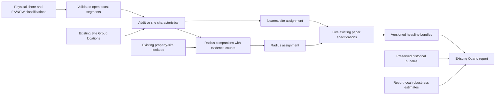
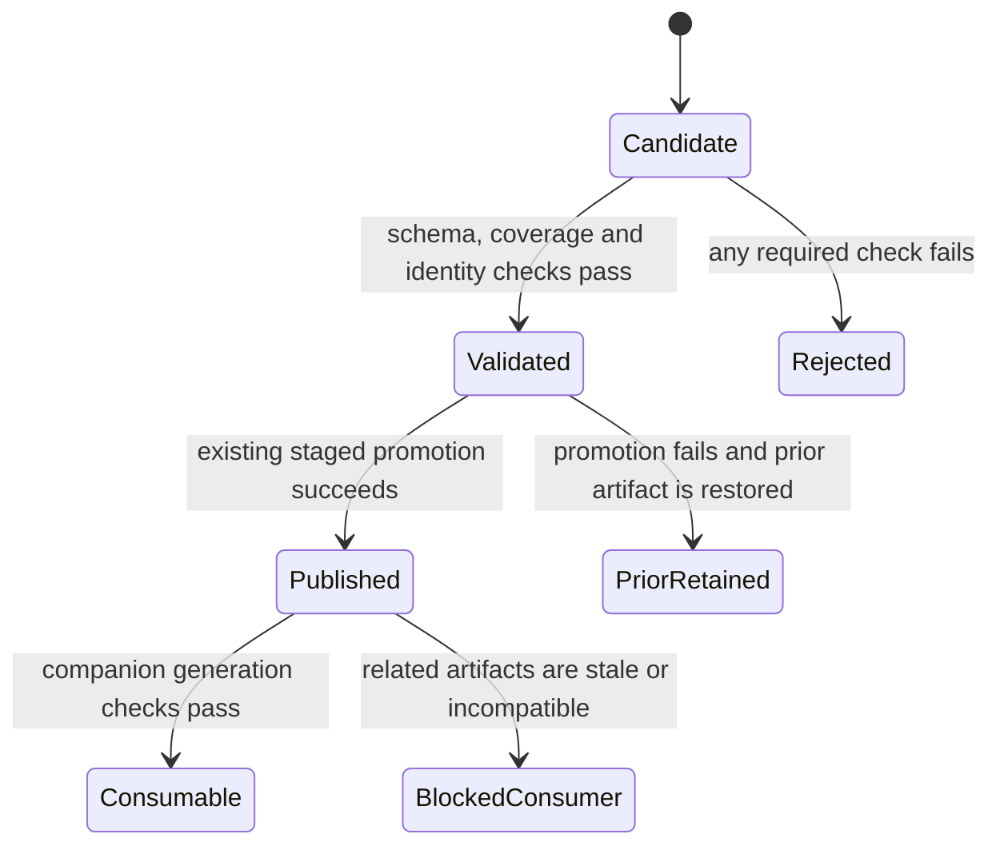
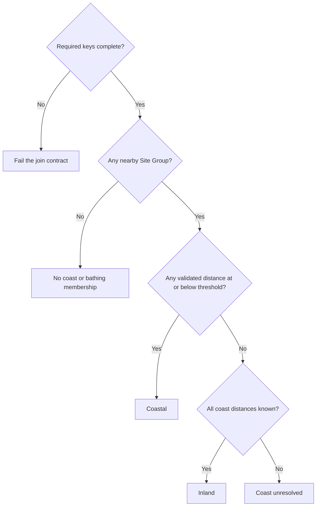

# Open-coast salience refinement - Plan

Superseded by [Restore original tidal-coast salience](2026-09-20-002-restore-tidal-coast-salience-plan.md).
Retained as historical planning context; its experimental artifacts have been removed.

## Goal Capsule

**Objective:** Make the coastal salience results interpretable as proximity to the open coast, with a reproducible account of how the refined geography and bathing evidence affect the findings.

**Means:** Add a validated open-coast measurement to the existing data pipeline and extend the existing salience report (KTD1–KTD6).

**Authority:** Requirements below own the research design. Technical decisions specify how to deliver it; implementation units cannot change either. The [interview record](2026-09-19-001-salience-dataset-refinement-discussion.md), [ADR 0003](../adr/0003-open-coast-salience.md), and `CONCEPTS.md` supply the domain context.

**Execution:** This is a plan for later implementation. One implementing owner coordinates the dependency-ordered units and final verification. Use the task worktree, R 4.6.0 and its `rv` environment. Commits, publishing and any PR follow the subsequent execution request; this plan does not authorize starting that work now.

**Stop conditions:** Stop promotion of revised data/results if physical-shoreline validity or relevant geographic coverage cannot be established, identities change unexpectedly, or compatible input generations cannot be verified. Preserve existing valid artifacts and report the concrete blocker. Coefficient signs or statistical significance are not stop conditions.

---

## Product Contract

### Summary

Refine the coastal dataset, update the five existing paper specifications, and extend the current Quarto report with classification diagnostics and the agreed robustness checks. Preserve historical results and measure how sample membership changes before interpreting revised coefficients.

### Problem Frame

The current coast distance follows a tidal Mean High Water boundary, including estuarine and tidal-river banks. It can classify overflows in London as coastal, which motivated the existing London exclusion. That geography does not match the intended open-coast interpretation.

Bathing membership also needs precise interpretation. The completed [bathing evidence audit](../reports/2026-09-19-001-bathing-evidence-audit.md) found 97 of 1,118 ever-associated Site Groups first reported positive evidence in 2024. Of those, 68 concern waters newly designated in 2024 and 29 concern waters already listed in 2021. First positive reporting therefore cannot serve as a designation date. The audit checked source normalization; it did not estimate the effect of changing membership.

### Key Decisions

- **Open coast is the target geography.** Governs R1–R2. (session-settled: user-directed — chosen over coastal-plus-estuary measures: retain one interpretable coastal category.)
- **Official coastal bays remain eligible.** Governs R1. (session-settled: user-approved — chosen over an exposed-sea-only definition: coastal proximity is not wave exposure.)
- **Keep overflow distance and the existing assignment rules.** Governs R2, R6. (session-settled: user-directed — chosen over property-to-coast distance; user-approved retention of nearest versus radius assignment avoids changing the underlying analysis design.)
- **Restore London under the corrected geography.** Governs R7. (session-settled: user-approved — chosen over permanent London exclusion: apply the same geographic rules to all observations.)
- **Use fixed reported bathing association.** Governs R5, R9. (session-settled: user-approved — chosen over transaction-date designation: retain the established place characteristic and examine earlier evidence separately.)
- **Continue the existing report.** Governs R9–R10. (session-settled: user-directed — chosen over another results report or additional paper entrypoints: keep exploratory evidence together in `docs/reports/`.)

### Requirements

#### Geography and dataset continuity

- R1. Reference actual high-water shoreline adjoining coastal water, including officially coastal bays and excluding estuarine and tidal-river banks; offshore boundaries, administrative seams and artificial mouth separators are not shoreline.
- R2. Measure straight-line distance from the existing representative Site Group overflow location in metres, using the inclusive 2,000 m coastal threshold; receiving-water type does not disqualify a nearby overflow.
- R3. Preserve the existing study universe, including Wales, and validate the shoreline coverage relevant to every measured Site Group, including cross-border nearest shores.
- R4. Preserve raw inputs, Site Group identity and membership, representative coordinates, property–Site Group lookups and unrelated exposure measures; retain the existing tidal-coast fields alongside explicitly named new measurements.

#### Membership and paper specifications

- R5. Headline All Bathing membership uses fixed positive reported association in any of 2021–2024, independently of coast evidence; describe it as association rather than direct discharge, continuous designation or designation at transaction date.
- R6. Extensive-margin and baseline hedonic models retain nearest-Site-Group assignment, while intensive-margin models retain any qualifying Site Group within 250 m; missing evidence must not establish a negative classification.
- R7. Include London in the refined headline specifications and retain London exclusion as a report robustness check.
- R8. Preserve the equations, exposure windows, distance bands, controls, fixed effects, inference and estimation grids of the five existing paper specifications in both markets, with overlapping All Coastal, All Inland and All Bathing groups.

#### Reporting and reproducibility

- R9. Extend `docs/reports/2026-09-03-003-heterogeneity-by-salience-report.qmd` with old/new classification comparisons, a common-property nearest-versus-any diagnostic, London-excluded estimates and fixed 2021-only bathing-association estimates; refresh its rendered HTML.
- R10. Keep all new result-testing, exploratory and robustness code, outputs and intermediates under `docs/reports/`; preserve dated memos and historical result definitions without introducing new main-analysis entrypoints.
- R11. Tie each dataset, model bundle and reported comparison to identifiable definitions and inputs, and report missing evidence, sample changes, fitted N, coefficients and 95% confidence intervals without selecting definitions to improve results.

### Acceptance Examples

- AE1. Covers R1–R2. A tidal Thames bank or an artificial line across an estuary mouth cannot be the nearest retained coast segment. A genuine retained shoreline in coastal Morecambe Bay can be; a Poole Harbour transitional bank cannot be.
- AE2. Covers R2. An estuary-discharging overflow 500 m from retained open coastline qualifies geographically. An overflow exactly 2,000 m away qualifies; one farther away does not.
- AE3. Covers R5–R6. Positive bathing evidence still establishes All Bathing when coast evidence is missing. Within a radius, one known coastal site establishes All Coastal even if another site's coast evidence is unknown; known inland sites plus an unknown site do not establish All Inland.
- AE4. Covers R6. If the nearest site is inland and a second site within 250 m is coastal, nearest assignment is inland and any-site assignment is coastal. The report records the disagreement on the same eligible property set.
- AE5. Covers R7–R8. A London observation passing the existing non-London eligibility conditions is retained in headline preparation and fitting; only the report's explicit London-excluded variant removes it.
- AE6. Covers R9–R11. Rendering from saved bundles fits no models and refuses a bundle with incompatible definitions. A missing historical bundle is reported as unavailable, never regenerated under refined defaults.

### Scope Boundaries

No new estuary-distance measure, hydrological transport model, property-to-coast measure, threshold search, Site Group rematching or legal designation-date reconstruction is included. The completed bathing audit supplies evidence; exhaustive matching of every reported water name is not a prerequisite for the fixed association measure.

#### Deferred to Follow-Up Work

Formal tests of differences between subgroup coefficients, alternative coastal thresholds, larger robustness grids and wider pipeline/report refactors require separate research decisions. Existing coefficients and confidence intervals support descriptive comparison here, not a claim that different significance levels establish different effects.

---

## Planning Contract

### Key Technical Decisions

- KTD1. **Select physical shoreline with official coastal/transitional evidence.** Use a consistent physical high-water shoreline, with OS OpenMap Local as the initial source candidate, and EA Cycle 3 coastal/transitional classifications plus compatible NRW evidence to identify retained shore segments (R1–R3). Do not compute distance to complete water-body polygon boundaries. Source geometry, alignment tolerances and ambiguous mouths require the U2 validation gate before use; classification year is recorded separately from cartographic vintage. [EA metadata](https://www.data.gov.uk/dataset/57fbe7c3-f4be-446b-96db-e23e9dc9f09f/water-framework-directive-wfd-transitional-and-coastal-water-bodies-cycle-3-classification-2022), [OS guide](https://www.ordnancesurvey.co.uk/documents/os-open-map-local-product-guide.pdf), and [NRW coastal layer](https://datamap.gov.wales/layers/geonode:nrw_wfd_coastal_c3_baseline_classification) justify this separation. Full polygon boundaries and filtering overflows by receiving water fail R1–R2, so they are not competing implementation mechanisms.
- KTD2. **Make the schema additive.** Introduce `distance_to_open_coast_m`, its evidence/coverage status, and `min_open_coast_dist_m` / `max_open_coast_dist_m` with known/missing Site Group counts in each radius companion (R4, R6). Preserve `distance_to_coast_m`, `min_coast_dist_m` and `max_coast_dist_m` with their tidal meaning. Evolve exact Arrow schemas and validators together; use existing annual bathing fields for report robustness instead of adding another production bathing definition.
- KTD3. **Carry enough evidence to distinguish inland from unknown.** Nearest assignment uses the selected site's finite validated distance. Radius Coastal is established by any observed qualifying site; radius Inland requires at least one site and complete coast evidence with every distance above the threshold. No-site, incomplete-coverage and missing-join cases remain distinct (R5–R6). Missing required joined rows are contract errors, not absent membership. Historical tidal aggregation retains its original behavior.
- KTD4. **Use explicit definition selection and generation checks.** Shared helpers support named historical tidal and refined open-coast profiles, with callers selecting their intended profile; no fallback maps an absent new field onto a tidal field (R4, R11). Embed provenance in each validated artifact or inside its staged dataset directory. Record source hashes/vintages, geometry version, identity/input generation and the applied profile. Existing publication helpers remain the promotion mechanism; consumers reject incompatible site/companion generations because publication is atomic per artifact, not across all markets.
- KTD5. **Separate historical rendering, headline publication and report estimation.** Default report rendering reads validated saved bundles. Preserve historical bundles before revised paper exports replace shared filenames, and retain explicit legacy classification for optional historical reproduction (R9–R11). New report-owned bundles, diagnostics, logs and figures live beneath `docs/reports/2026-09-03-003-heterogeneity-by-salience-report/`, separated into historical and refinement areas. Normal five-paper exports retain their existing production locations. Report estimation never invokes their publishing `main()` methods.
- KTD6. **Reuse model preparation and fitting, with report-local variants.** The QMD or adjacent report helper orchestrates the agreed variants and calls the five scripts' existing preparation/fitting functions (R8–R10). Compute fixed 2021-positive nearest and radius evidence there from `bath_status_21`, retaining unknown/no-positive distinctions. Vary one agreed definition at a time; a factorial combination of London exclusion and 2021-only bathing is unnecessary. All data-reading, fitting and publishing QMD chunks are excluded from `knitr::purl()` extraction used by fixture tests.

**Model publication contract (KTD4–KTD5):** An analysis generation identifies its immutable inputs, effective code/settings, group family, evidence-completeness policy, coast profile, assignment and London/bathing policies. Stage and validate each specification's RDS, table and counts/results exports before replacing canonical files. Finalise a compact completion manifest only after reconciling the expected specification–market–group keys and exact artifact hashes. Keep standalone paper entrypoints and standard export paths; use existing staging utilities and write the manifest last, without introducing a cross-storage transaction framework. Preserve the preceding validated manifest and the exact artifacts it references until the revised collection is complete.

Readers use the selected manifest, verify its artifact hashes and compatible generation, and reconcile table/CSV values to the saved bundle. Every expected cell is either a validated fit or explicitly unavailable with a fitting reason; interrupted/not-run cells make a collection incomplete. Neither state may reuse an older coefficient. Schema, identity, join and generation failures remain fatal data-contract errors, not unavailable-fit reasons. Apply the same checks to report-owned variants, with their manifests and artifacts under the report directory.

These completion checks govern newly generated headline and refinement collections. Missing historical bundles may render an explicit unavailable section under AE6; this does not require the optional historical reproduction to run.

### High-Level Technical Design

The data flow keeps the original identity and exposure products as inputs. U1 protects historical output before any revised consumer is run.

Generation validation precedes analysis. The report's execution modes have separate effects:

| Mode | Inputs | Permitted writes |
|---|---|---|
| Render only, default | Validated historical, headline and refinement bundles | Report HTML and presentation assets under `docs/reports/` |
| Historical reproduction, explicit | Frozen legacy profile and compatible historical inputs | Historical reproduction artifacts under the report directory |
| Refinement estimation, explicit | Compatible revised datasets and unchanged model functions | Refinement bundles, tables, figures and logs under the report directory |
| Normal paper execution | Revised datasets and explicit refined profile | Existing production exports, with new definition metadata |

The publication lifecycle is:

For radius evidence, apply KTD3 before sample filtering:

Bathing evidence is evaluated independently of the coast branch, per R5.

### System-Wide Impact and Preconditions

Both characteristic builders enforce exact schemas. The in-memory and Arrow radius reductions must agree; changing only fixture code would leave production behavior wrong. The shared group helper feeds both current paper scripts and historical report definitions, so replacing its default meaning would invalidate history.

This worktree currently has no `data/` or `output/` links. Before execution, establish the intended paths using the existing project storage arrangement and confirm input generations. Do not create substitute empty data trees, copy the full research storage tree, or treat unavailable cloud files as missing observations. Stage revised products and preserve the current outputs before any live replacement.

Use `here::here(...)`, snake_case and existing numeric pipeline directories. Preserve the safe Arrow collection boundary before any `data.table` joins, as documented in `docs/solutions/logic-errors/arrow-altrep-data-table-join-nondeterminism.md`; exact key checks are required in addition to row counts.

### Risks and Deferred Implementation Details

| Risk or unresolved detail | Required treatment and owner |
|---|---|
| EA/NRW geometry differs in cartographic source/vintage | U2 inspects Dee/Severn seams against the same physical shoreline, records tolerances and verifies ambiguous segments before promotion. |
| A layer omits small estuaries or relevant coastline | U2 validates coverage from actual Site Group locations and nearest candidate shores. Absence from a transitional layer is not proof of open coast; a finite distance alone is not proof of coverage. |
| Shores outside England/Wales could be relevant | U2 checks the full nearest-shore search extent, including any relevant Scottish shore, and obtains compatible official classification evidence where needed. Do not infer coverage from property country or water company. |
| Manual mouth decisions are necessary | U2 records segment identifiers, cited evidence and the decision in a reproducible geometry override input; no unrecorded map edits. Substantive ambiguity remains a promotion blocker. |
| A partial rebuild leaves mixed datasets | U3–U5 validate bundled provenance before consuming products and preserve previous valid generations for recovery. |
| More observations disappear through unresolved coast evidence | U6 reports unresolved counts and reasons separately from reclassification; no silent imputation or country restriction. |
| Model caches have the right filename but wrong meaning | U1/U6 validate group family, evidence policy, profile, source/input/code identity, market, model specification, assignment and London/bathing policy, plus complete result keys and matching export hashes, before rendering. |

Exact source download endpoints, geometry tolerances, override segment IDs and run hashes are execution-time facts. U2 resolves them from retrieved source geometry before downstream promotion; the research design is settled.

---

## Implementation Units

### U1. Protect historical results and isolate report execution

**Goal:** Make the existing report safe to render throughout the refinement.

**Requirements:** R9–R11; KTD4–KTD6.

**Dependencies:** None; complete before overwriting any salience outputs.

**Files:**

- Modify `docs/reports/2026-09-03-003-heterogeneity-by-salience-report.qmd`.
- Create report-local helper/manifest files under `docs/reports/2026-09-03-003-heterogeneity-by-salience-report/` as needed.
- Update `scripts/R/testing/salience_report_test_setup.R` and existing salience report contract tests where extraction boundaries change.

**Approach:**

1. Inventory the report's saved historical and headline bundles, verify their meaning against current code/settings, and preserve read-only snapshots with provenance. Distinguish the historical four-stratum/intensity families, exclusive three-way comparison, and pre-refinement overlapping paper `_groups` results. Only the last supplies the old overlapping headline comparator; do not pool historical exclusive coefficients to replace it. Preserve a recoverable pre-change set of the site artifact, both market companions and any other rewritten artifact, with exact key and legacy-column baselines; temporary publication backups are deleted after successful promotion and are insufficient for this purpose.
2. Replace implicit re-estimation on render with the modes in KTD5; separate computation from export so report estimation cannot write through a paper `main()`.
3. Keep historical helper behavior explicit and make incompatible or missing caches actionable errors without automatic re-fitting.
4. Keep large models and private row-level diagnostics ignored. Track compact manifests and aggregate evidence only, using narrow local ignore exceptions when needed.

Retain the targeted recovery set until every revised product and consumer passes verification. Place report snapshots under the report directory; data recovery copies remain in the existing managed data storage, outside the publication helper's temporary backup paths. Record the associated consumer revision, recoverable source snapshot for any uncommitted changes, configuration/profile and result-manifest identity. Recovery restores compatible code/profile and the complete prior artifact set, or keeps refined consumers disabled until the interrupted generation is completed. Never fall back automatically from refined to tidal fields. Test recovery after U5 has switched consumers, not only before it.

**Patterns to follow:** `docs/solutions/design-patterns/analysis-results-static-html-reports.md`; the QMD's existing definition-only extraction via `salience_report_test_setup.R`.

**Test scenarios:**

- Covers AE6. Rendering a valid saved bundle fits no model and leaves production output files unchanged.
- Missing, mismatched or unidentifiable historical inputs produce a clear unavailable/error state rather than relabelled results.
- Extracting QMD definitions for contract tests neither reads live data nor fits or publishes models. Check executed effects; a definition containing deferred fitting code is not itself a violation.
- An explicitly requested historical reproduction uses the original tidal/London rules and writes only beneath the report directory.

**Verification:** Historical sections retain their original numerical content and labels; a report render has no estimation side effects.

### U2. Build and validate the open-coast reference geometry

**Goal:** Establish a reproducible shoreline satisfying the intended coastal definition.

**Requirements:** R1–R3, R11; KTD1.

**Dependencies:** None for source inspection and geometry construction; U1 before any result comparison.

**Files:**

- Create `scripts/R/03_data_enrichment/build_open_coast_reference.R` and `scripts/R/testing/test_open_coast_reference_contracts.R`.
- Add pinned source assets under `data/raw/geography/open_coast/` and derived geometry/provenance under `data/processed/geography/open_coast/`.
- Put geometry diagnostics, review maps and compact audit tables beneath the existing report directory.

**Approach:**

1. Audit Site Group locations and candidate nearest shores to determine required geographic coverage before acquiring the relevant source layers.
2. Pin the physical shoreline and official classification assets, recording licenses, downloads, versions, hashes, CRS and separate classification/cartography dates.
3. Construct retained physical segments in EPSG:27700, distinguish exclusion from unresolved coverage, and record any reviewed overrides.
4. Validate mouths, border seams and near-threshold locations before publishing a nonempty valid reference through the existing staging pattern.

Classification-alignment tolerances select physical shoreline portions; they do not expand the coastal threshold. Preserve source shoreline coordinates where possible and document any displacement from snapping or simplification. Record the distance engine, units, high-water convention and positional limitations separately from coordinate precision. Identify and resolve cases where uncertain segment eligibility or documented displacement could change membership before promotion. A finite nearest distance is valid only when no omitted or unresolved potentially closer shore invalidates it.

**Execution note:** Prove the geometry operation on small fixtures before processing the full source layers. Geography is fixed before inspecting revised regression results.

**Patterns to follow:** Existing `sf` work in `build_site_group_characteristics.R`; staged publication utilities rather than a new publication framework.

**Test scenarios:**

- Covers AE1. Fixtures remove estuary banks, offshore edges and mouth separators while retaining physical coastal-bay shoreline.
- A single line feature crossing eligible coast and excluded estuarine bank retains only eligible portions. Distance can select a segment's interior, not just its vertices.
- Invalid CRS, empty outputs and absent required source coverage fail validation and leave the previous reference untouched.
- Dee/Severn and a site whose nearest coast lies across a country boundary retain the correct physical shore.
- Re-running pinned inputs and overrides produces equivalent retained segments and stable provenance.

**Verification:** A report-local map/evidence panel documents tidal Thames/Severn examples, Morecambe Bay, Poole Harbour and cross-border cases. Each included or excluded segment has an auditable basis; unresolved relevant gaps block promotion.

### U3. Add open-coast distance to Site Group characteristics

**Goal:** Publish the new measure without changing existing site characteristics.

**Requirements:** R2–R5, R11; KTD2–KTD4.

**Dependencies:** U2; U1 before replacing shared published products.

**Files:** `scripts/R/03_data_enrichment/build_site_group_characteristics.R`, `scripts/R/testing/test_site_group_characteristics_contracts.R`; reuse `scripts/R/utils/site_group_utils.R` and `scripts/R/utils/dataset_publication_utils.R`.

**Approach:** Extend the explicit site schema and staged validation with new distance, evidence and provenance. Use the existing representative coordinates and canonical Site Group register. Compare legacy columns and exact keys against the captured baseline before promotion; retain unknown geographic evidence with a reason.

**Patterns to follow:** `publish_validated_file()` and the existing site schema/contract fixtures.

**Test scenarios:**

- Covers AE2. Distances of 1,999.999, 2,000 and 2,000.001 m survive Arrow write/read-back and the actual classifier. Apply the inclusive threshold to full-precision values, without display rounding or an added geometry tolerance.
- Unusable location or unresolved shoreline coverage remains unknown; it does not become zero or a valid inland distance.
- Reject negative/non-finite valid distances and inconsistent evidence-status/distance combinations. Verify the existing representative-location selection with a newer unusable and older usable source row; do not substitute centroids or coast-nearest members.
- Raw rows, site IDs, membership, coordinates, tidal distances and annual/ever bathing fields remain unchanged.
- Failed staged validation or replacement retains the previous complete site artifact and a non-success outcome.

**Verification:** One row per original `site_id`, exact legacy-column equality, valid new physical types and a traceable geometry generation.

### U4. Propagate open-coast evidence to radius companions

**Goal:** Give property classification complete evidence about nearby Site Groups.

**Requirements:** R3–R6, R11; KTD2–KTD4.

**Dependencies:** U3.

**Files:** `scripts/R/06_analysis_datasets/build_prior_characteristics.R`, `scripts/R/testing/test_prior_characteristics_contracts.R`.

**Approach:** Extend both `summarise_property_pairs()` and `aggregate_pairs_arrow()` with the same additive distance summaries, evidence counts and source-generation contract. Rebuild sales/rental companions for existing 250/500/1000 m partitions while preserving transaction keys, legacy summaries, intensity bands and row universe. Reconcile the builder's rewritten `prior_intensity_cutoffs.parquet` too: values must remain unchanged for unchanged exposure inputs, and any new generation metadata brings it into the recovery inventory.

**Patterns to follow:** Existing partition validation and `publish_validated_dataset()`; safe Arrow collection and exact join-key checks.

**Test scenarios:**

- Covers AE3. Known coastal plus unknown, known inland plus unknown, all-known inland, all-unknown and no-site cases remain distinguishable.
- Execute the in-memory reducer and production `aggregate_pairs_arrow()` / `build_production_radius()` paths on fixture inputs for both markets and every radius; compare values, missingness and counts. Known plus missing counts equal contributing Site Group counts; all-unknown summaries cannot leak `Inf` or `-Inf`.
- A missing Site Group join, duplicate property–site pair, duplicate transaction/radius key or incomplete radius partition fails publication.
- Read-back retains expected types, exact keys, unchanged legacy values and matching site-generation provenance.

**Verification:** Both markets and all existing radius partitions publish complete compatible companions; failure preserves the previous valid artifact for the affected market.

### U5. Switch the five paper specifications to refined membership

**Goal:** Apply the corrected classification and London policy while preserving the models.

**Requirements:** R5–R8, R11; KTD3–KTD4.

**Dependencies:** U1, U3, U4.

**Files:**

- `scripts/R/utils/salience_group_utils.R` and `scripts/R/testing/test_salience_groups_contracts.R`.
- `scripts/R/09_analysis/05_news/did_trends_prior_extensive_salience.R`.
- `scripts/R/09_analysis/05_news/did_articles_prior_extensive_salience.R`.
- `scripts/R/09_analysis/05_news/did_trends_prior_salience.R`.
- `scripts/R/09_analysis/05_news/did_articles_prior_salience.R`.
- `scripts/R/09_analysis/02_hedonic/hedonic_continuous_prior_salience.R`.
- Existing `test_salience_extensive_contracts.R`, `test_salience_intensive_contracts.R` and `test_salience_hedonic_contracts.R` under `scripts/R/testing/` where affected.
- Create `scripts/R/testing/test_salience_paper_contracts.R` for the actual five paper implementations; retain the existing QMD-based suites as historical tests.

**Approach:**

1. Add explicit profile selection, compatible-input checks and complete-join validation to the shared helper while preserving nearest-site tie-breaking.
2. Apply the refined profile in the five entrypoints; remove the London restriction from both estimation masks and audit counts.
3. Update association wording and saved settings. Preserve full extensive-margin lookups for far controls; radius companions are not a substitute for that universe.
4. Verify model calls against the captured baseline, then run the existing headline exports only after data validation is complete.
5. Exercise each production script in its own environment without invoking `main()`, verifying that the called functions belong to that environment. Fixtures must reach actual `prepare_analysis_data()`, group audit/selection, fitting and result extraction; isolate data-reading/publication boundaries without substituting historical QMD implementations. Exercise exporters on isolated fixture paths. Apply the KTD4–KTD5 publication contract to the complete five-specification result set.

The model contracts to capture before edits and assert independently are:

| Specifications | Preparation and assignment | Equation and inference |
|---|---|---|
| Extensive Post and articles | Nearest site from full lookup; near [0, 500] m, far (1,000, 2,000] m; preserve attention-model availability restrictions and sales months 1–48 / rentals 1–36. | Log price on Near, Near × Attention and existing controls; LSOA + month FE; LSOA-clustered covariance. |
| Intensive Post and articles | Any qualifying site within 250 m; positive site count and observed weekly count, including zero; preserve attention-model preparation. Exposure still aggregates all sites in the radius, regardless of which establishes membership. | Log price on weekly count, count × Attention and existing controls; LSOA + month FE; LSOA-clustered covariance. |
| Baseline hedonic | Nearest site; positive 250 m site count and joint count/hours availability. Preserve its preparation without importing attention-model coordinate/month filters. | Log price on weekly count and existing controls; LSOA FE only; heteroskedasticity-robust covariance. |

Sales controls remain property type, old/new and duration; rentals retain property type, bedrooms and bathrooms, with existing factor coding. Post starts inclusively in August 2022; articles use the validated complete monthly log-cumulative series. Preserve existing exposure windows, estimator options and focal-term identification checks. Confidence intervals use the saved covariance and t degrees of freedom.

**Patterns to follow:** Existing preparation, fitting, group-audit and export separation; no new paper entrypoints.

**Test scenarios:**

- Covers AE2–AE5. Thresholds, mixed radius evidence, coast-independent bathing and London policy agree between audit masks and fitted input selection.
- Equidistant sites retain the lowest numeric Site Group ID; a missing companion row fails instead of silently losing group membership.
- Stale/mixed generations and absent refined fields fail before fitting; explicit legacy selection still reproduces its original classification.
- Formula, controls, FE, inference and exposure settings match baseline for all five specifications and both markets.
- Direct paper fixtures include a London-only support cell, `region = NA` retained under London exclusion, extensive far controls beyond 1 km, observed zero versus missing exposure, hedonic count/hours eligibility, missing required nearest/companion matches and same-count/different-key corruption. Assert exact selected observation identities as well as fitted counts.
- An interrupted exporter, missing fifth specification, duplicate model key or wrong group family cannot produce a completed current result manifest or silently reuse an old coefficient.

**Verification:** Model settings are unchanged except documented membership/labels and London policy; sample-accounting tables reconcile selected, estimation and fitted observations.

### U6. Extend the existing report with refinement evidence

**Goal:** Explain the classification and result changes, including the agreed robustness checks.

**Requirements:** R9–R11; KTD5–KTD6.

**Dependencies:** U1–U5.

**Files:** Existing salience QMD and adjacent report helper/artifact directory; behavioral report-mode checks use the existing report contract-test setup.

**Approach:**

1. Compare old/new site distances and memberships, with unknowns separate, then trace changes to properties by market, assignment rule and London status.
2. Compare nearest and any-site membership on the same exact prepared transaction IDs with at least one Site Group within 250 m. State the common preparation rule, use identical evidence/profile and separate observed disagreement from unresolved evidence. Do not compare separately fitted samples or include far controls in this denominator.
3. Separate coast refinement from London-policy effects: compare legacy and refined coast definitions under London exclusion, then refined definitions with London restored. Keep equations and bathing evidence fixed. The first comparison combines changed shoreline measurement with the new evidence-completeness rule; membership diagnostics distinguish distance changes, unresolved evidence and evidence-policy changes. Do not describe it as the effect of shoreline removal alone. No additional regression grid is required.
4. Estimate London-excluded variants of the refined headline analyses and the 2021-only All Bathing variants. For the latter, keep headline geography/London policy and use positive 2021 evidence under each specification's existing assignment rule; other group estimates need no duplicate fit.
5. Report site/property memberships, post-eligibility and fitted counts, focal coefficients, 95% CIs and sample turnover by specification and market. Explain that coefficient changes combine reclassification and composition effects.
6. Link the completed bathing audit, label historical/refined sections clearly, save compatible bundles and completion manifests, and refresh HTML from saved results. Enumerate headline 5 × 2 × 3, London-excluded 5 × 2 × 3 and 2021-only Bathing 5 × 2 cells; retain the compatible old overlapping baseline separately. Render only from validated manifests. Historical numerical prose stays attached to historical results; update refined interpretations from their own bundles.

**Patterns to follow:** Existing report coefficient extraction and formatting; N from fitted model objects rather than prepared-row counts. Use exact observation identities when tracing estimator removals; do not infer retained rows from positions alone.

**Test scenarios:**

- Covers AE4. A constructed two-site property gives the expected disagreement without changing the common denominator.
- A site first positive in 2022, 2023 or 2024 enters headline Bathing but not 2021-only Bathing; a positive 2021 member establishes association despite another unknown member. Keep present-row no-positive evidence distinct from absent/unknown evidence. Select the nearest site before evaluating its bathing status, never the nearest bathing-positive site.
- Under the same assignment rule, 2021-positive membership is a subset of ever-observed membership; with complete evidence, nearest-positive membership implies any-positive membership on the common property set.
- London-excluded estimates and their audit tables use the same exclusion, with no change to other fitting settings.
- With identical inputs, preparation, London policy and model settings, changing only coast definitions leaves overlapping All Bathing membership and estimates unchanged.
- Turnover follows exact observation identities after shuffling input order and after estimator removals other than fixed-effect singletons, including missing outcomes that reach the estimator.
- Failed or empty-group fits are labelled unavailable with the reason; they cannot reuse stale coefficients.
- Covers AE6. Saved-bundle rendering reproduces N and coefficient tables, detects mismatched variants and performs no production writes.

**Verification:** All agreed comparisons are present in the same report for both markets; every table is traceable to its exact model bundle and definition. Report no improvement claim based solely on significance.

### U7. Complete integration verification and pipeline documentation

**Goal:** Leave a reproducible rebuild and a documented interpretation of the revised results.

**Requirements:** R1–R11.

**Dependencies:** U1–U6.

**Files:** `docs/pipeline_documentation.md`, `CONCEPTS.md`, `docs/adr/0003-open-coast-salience.md`, existing salience QMD and report-local manifests; adjust `scripts/R/09_analysis/run_all_analysis.sh` only if its actual orchestration requires an update.

**Approach:** Document input acquisition, schema additions, ordered rebuild, compatible-generation checks and report modes. Reconcile legacy/final data and model artifacts, render the completed report, and inspect tables/maps for labels and missing results. Reuse existing analysis orchestration rather than adding an alternate runner.

**Patterns to follow:** Repository data contracts and the existing static-report reproducibility convention.

**Test scenarios:**

- A rebuild through geometry, site, both companion markets and the five consumers produces mutually compatible provenance and unchanged identity/exposure fields.
- Site publication succeeds and one companion publication fails after the U5 consumer switch: consumers reject the mixed set, and recovery restores U1's compatible prior code/profile, data and result set before use.
- One export file or the fifth specification fails after other artifacts have been replaced: the revised manifest remains incomplete, and the preserved prior manifest still renders its matching artifacts. A documented unavailable fit cannot inherit older coefficients.
- Historical report contract suites remain valid while the refined report renders from cached outputs.

**Verification:** The Verification Contract passes, documentation matches actual paths and modes, and abandoned exploratory implementation code is removed.

---

## Verification Contract

Use the rv-enabled project root with R 4.6.0 and the existing plain `Rscript` contract-test convention; do not bypass `.Rprofile` with `--vanilla`. Verify the actual R version and activated library rather than assuming startup succeeded. Run the new geometry contracts, site/prior characteristic contracts, group contracts, direct five-paper contract suite and affected historical report contracts. These are software/data-contract checks; statistical diagnostics and result testing remain in the report per R10. Record whether canonical read-back checks actually ran: existing tests can skip them when artifacts are absent, and fixture-only success cannot satisfy production validation.

Completion requires four evidence gates:

1. **Geography:** Pinned sources and reviewed physical segments satisfy R1–R3, including mouth, coastal-bay, cross-border and relevant coverage cases. Maps and compact diagnostics are saved with the report.
2. **Data:** Exact key/location/legacy-field comparisons pass, both radius implementations agree, staged publication is recoverable and consumers reject incompatible generations.
3. **Models:** All five actual paper implementations pass direct behavioral tests for both markets with unchanged model contracts. Audit counts reconcile to fitted N and estimator removals; unknown or unestimable groups are explicit. Complete manifests identify every expected cell and matching model/table/CSV artifacts; interrupted results cannot masquerade as complete.
4. **Report:** Historical values remain identified and reproducible, all R9 comparisons exist, and render-only mode reads the saved evidence without fitting or overwriting production exports. Inspect the refreshed HTML and the displayed geography maps.

Do not use a preferred coefficient sign, larger magnitude, smaller p-value or retained significance as an acceptance criterion. Resolve geographic ambiguity from source evidence before seeing its effect on regression estimates.

---

## Definition of Done

- U1–U7 meet their verification outcomes and all four evidence gates pass.
- New open-coast fields and their provenance are available to the existing five paper specifications; historical tidal fields retain their meaning.
- The existing QMD and refreshed HTML contain the classification evidence and agreed robustness results, with compact supporting artifacts under `docs/reports/`.
- No unresolved relevant shoreline-coverage problem, silent join loss or incompatible artifact generation remains in the published refined results.
- Documentation describes the final schema and workflow; no abandoned attempts, new exploratory paper entrypoints or unrecorded manual geometry edits remain.

---

## Appendix

### Research and Implementation References

- [GPT-6 Astra Pro Oracle review and disposition](2026-09-19-2209-open-coast-salience-oracle-review.md). Findings F1–F3 and the source-verified acceptance clarifications are incorporated here; spatial and empirical validation remain execution gates.
- [Original salience plan](2026-09-02-001-feat-heterogeneity-by-salience-regressions-plan.md), especially its temporary London policy; [report/paper separation plan](2026-09-03-001-refactor-salience-report-and-paper-scripts-plan.md).
- [Completed bathing audit](../reports/2026-09-19-001-bathing-evidence-audit.md) and its compact archive. The country audit identifies 115 Welsh sales and two Welsh rentals in prepared baseline/intensive samples before subgroup/estimator removals; it does not identify all associated overflow countries.
- [EA source metadata](https://environment.data.gov.uk/dataset/95ad1d9f-0775-4ee2-a599-eac22ac58fa3), [NRW transitional metadata](https://datamap.gov.wales/layers/geonode:nrw_wfd_transitional_c3_baseline_classification/metadata_detail), and [water-body delineation guidance](https://www.gov.uk/guidance/river-basin-planning-process-overview/3-defining-and-describing-the-water-environment) support the U2 coverage checks.
- [Morecambe Bay](https://environment.data.gov.uk/catchment-planning/WaterBody/GB641211171000) and [Poole Harbour](https://environment.data.gov.uk/catchment-planning/WaterBody/GB520804415800) anchor the coastal-bay/transitional distinction.
- [EA bathing-water permit guidance](https://www.gov.uk/government/publications/water-companies-environmental-permits-for-storm-overflows-and-emergency-overflows/water-companies-environmental-permits-for-storm-overflows-and-emergency-overflows#bathing-waters-water-quality-standards), [2024 designations](https://www.gov.uk/government/consultations/bathing-waters-proposed-designation-of-27-new-bathing-waters-in-england/outcome/summary-of-responses-and-government-response) and [2021 classifications](https://www.gov.uk/government/publications/bathing-waters-in-england-compliance-reports/bathing-water-classifications-2021) support R5 and the audit interpretation.
- `docs/solutions/conventions/annual-return-rows-are-monitor-level-not-works-level.md` supports R4's identity preservation.
- `docs/solutions/best-practices/edm-api-combine-hardening-20260310.md` supports validating candidates before publication; the current builders already provide staged replacement.
- `docs/solutions/developer-experience/exploratory-extensive-margin-news-notebook-render-stabilisation-20260319.md` supports compact projected inputs, full extensive-margin lookups and fitted rather than prepared N. Its older output paths are superseded for this work by R10.
