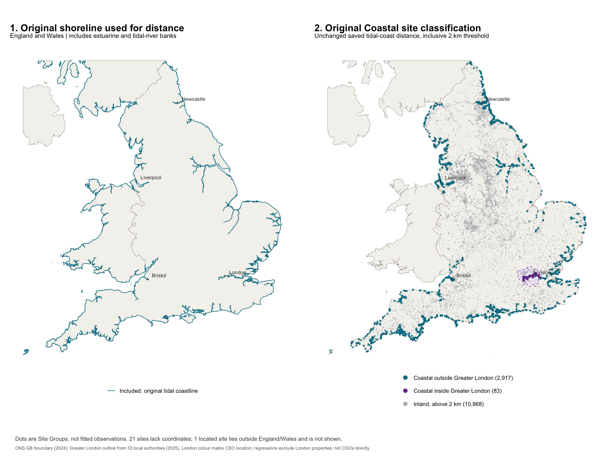

This report asks whether the relationship between sewage spills, public attention
and property values differs across bathing, coastal and inland locations.
The paper comparison uses **overlapping groups**. The later sections preserve
the full exploration: four coast/bathing strata, intensity splits, three
robustness checks, and the earlier exclusive three-way comparison.

By default, rendering loads the saved model bundles in `output/regs`. Explicit
`reestimate:true` reruns the analyses from the published inputs. The
five selected specifications also run independently as paper scripts. Their
output names end in `_groups`; the earlier output names retain their original
definitions. The dated Markdown memos remain historical snapshots.

**This rendering:** `r if (params$reestimate) "analyses re-estimated from published inputs." else "results loaded from the saved model bundles in output/regs."`

## Data and definitions

Sales cover 2021–2024; rentals cover 2021–2023. Outcomes are log sale price and
log weekly asking rent. Coefficients are in log units. All paper estimates
exclude properties with `region == "London"`.

| Paper group | Membership |
|:--|:--|
| All Bathing | Positive reported bathing-water association in any annual return from 2021 through 2024, coastal or inland. |
| All Coastal | Site coast distance at most 2 km, including bathing locations. |
| All Inland | Site coast distance above 2 km, including bathing locations. |

A coastal bathing observation enters both Bathing and Coastal; an inland bathing
observation enters both Bathing and Inland. **Group Ns must not be added together.**
Positive association evidence takes precedence over other unknown evidence.
Unresolved association evidence does not establish Bathing membership. Missing
coast prevents Coastal and Inland membership but does not negate an observed
bathing-water association.

Coast distance is the straight-line distance from the representative Site Group
location to the tidal Mean High Water coastline, including estuarine and
tidal-river banks. Coastal uses the inclusive 2,000 m threshold. Recreational use
and the value of nearby water are hypothesised mechanisms for local salience;
shoreline proximity and reported bathing-water association are proxies. Neither
establishes individual swimming, direct discharge into a bathing water,
continuous designation, or designation at the transaction date. The extensive
and hedonic analyses use the nearest Site Group, with ties broken by Site Group ID. The intensive analysis
uses any bathing site and the minimum site coast distance within 250 m.

| Specification | Exposure/sample | Fixed effects and inference |
|:--|:--|:--|
| Extensive attention | Near: 0–500 m inclusive; far: over 1,000 m and at most 2,000 m. Focal coefficient: Near × Attention. | LSOA and month FE; SEs clustered by LSOA. |
| Intensive attention | Properties within 250 m; average weekly spill count × Attention. | LSOA and month FE; SEs clustered by LSOA. |
| Baseline hedonic | Properties within 250 m; average weekly spill count. | LSOA FE, no time FE; heteroskedasticity-robust SEs. |

Attention is either Post (August 2022 onward, including August) or log cumulative
UK media articles. Sales controls are property type, new-build status and tenure;
rental controls are property type, bedrooms and bathrooms. The hedonic retains
the parent's joint count/hours availability restriction. Missing spill evidence
is excluded, never converted to zero.

All confidence intervals below are pointwise 95% intervals using each model's
stored covariance and t degrees of freedom. Separate group estimates do not
test between-group differences.

### Original coastal classification and Greater London



[Open the zoomable PDF map](2026-09-03-003-heterogeneity-by-salience-report/original-coastal-eligibility/england-wales-coastal-eligibility.pdf).
The left panel shows the boundary of dissolved England, Wales and Scotland,
with country seams removed. The right panel shows **2,917 Coastal Site Groups
outside Greater London** (blue), **83 inside** (purple), and **10,968 Inland**
sites (grey). The two Coastal categories sum to 3,000. Greater London is the
union of the 33 ONS May 2025 local authorities with E090 codes. Twenty-one sites
lack representative coordinates; one located Scottish site lies outside the
England/Wales map.

The colours describe CSO location. The paper regression exclusion acts on
property `region`, so a property and its assigned site can lie on opposite sides
of London's boundary. This is a map of Site Groups, not fitted property
observations. Rendering reads the saved map assets; regeneration is a separate
command documented below.

```{r}
#| label: setup
#| include: false

source(here::here("scripts", "R", "utils", "script_setup.R"), local = TRUE)
check_required_packages(c("arrow", "dplyr", "fixest", "forcats", "ggplot2", "here",
                          "knitr", "modelsummary", "readxl", "rio", "tibble", "tidyr"))
source(here::here("scripts", "R", "utils", "salience_group_utils.R"), local = TRUE)
source(here::here("scripts", "R", "09_analysis", "utils_table_formatting.R"), local = TRUE)
knitr::opts_knit$set(root.dir = here::here())
```

```{r}
#| label: check-saved-results
#| include: false
#| purl: false

if (!isTRUE(params$reestimate)) {
  prefixes <- c("did_trends_prior_extensive_salience", "did_articles_prior_extensive_salience",
    "did_trends_prior_salience", "did_articles_prior_salience",
    "hedonic_count_continuous_prior_salience")
  required <- here::here("output", "regs",
    paste0(c(prefixes, paste0(prefixes, "_groups"), "salience_three_way"), ".rds"))
  missing <- required[!file.exists(required)]
  if (length(missing)) stop("Saved salience results missing: ", paste(missing, collapse = ", "),
    ". Restore the saved bundles or explicitly request reestimate:true.", call. = FALSE)
}
```


```{r}
#| label: exploratory-strata
#| include: false

#' Classify coast/bathing evidence without dropping transaction rows
#'
#' @param data Transactions with nearest-site or radius-companion evidence.
#' @param coast_rule_m Coast threshold in metres: 2000 (headline) or 10000.
#' @param unknown_policy `not_designated` (headline) retains uncertain evidence;
#'   `exclude` removes only unresolved designation: unknown evidence with no
#'   observed positive. Ever-designated sites and radius companions with any
#'   positively designated site remain eligible despite other unknown evidence.
#' @param source `nearest` uses `distance_to_coast_m` and `bath_ever_2124`;
#'   `radius` uses `min_coast_dist_m` and `any_bath_2124`.
#' @return Input rows with independent `coastal` and `bathing` flags, the four
#'   coast x bathing `salience_class` values, `coast_rule_m`, `bath_unknown`,
#'   `bath_unresolved` and `unknown_policy`. Source evidence is preserved;
#'   `bath_unknown` also flags missing evidence, while `bath_unresolved` requires
#'   no observed positive. Coastal depends only on distance; designation beyond
#'   the threshold is inland bathing. Missing coast distance gives an NA class.
classify_salience_coast <- function(
  data, coast_rule_m = 2000, unknown_policy = c("not_designated", "exclude"),
  source = c("nearest", "radius")
) {
  unknown_policy <- match.arg(unknown_policy)
  source <- match.arg(source)
  if (length(coast_rule_m) != 1L || !coast_rule_m %in% c(2000, 10000)) {
    stop("coast_rule_m must be 2000 or 10000.", call. = FALSE)
  }
  coast_col <- if (source == "nearest") "distance_to_coast_m" else "min_coast_dist_m"
  bath_col <- if (source == "nearest") "bath_ever_2124" else "any_bath_2124"
  data |>
    dplyr::mutate(
      coast_rule_m = .env$coast_rule_m,
      unknown_policy = .env$unknown_policy,
      coastal = .data[[coast_col]] <= .env$coast_rule_m,
      bathing = .data[[bath_col]] %in% TRUE,
      bath_unknown = dplyr::coalesce(.data$bath_unknown_2124, TRUE) | is.na(.data[[bath_col]]),
      bath_unresolved = .data$bath_unknown & !.data$bathing,
      salience_class = dplyr::case_when(
        is.na(.data[[coast_col]]) ~ NA_character_,
        .env$unknown_policy == "exclude" & .data$bath_unresolved ~ NA_character_,
        .data$coastal & .data$bathing ~ "coastal_bathing",
        .data$coastal ~ "coastal_not_bathing",
        .data$bathing ~ "inland_bathing",
        TRUE ~ "inland_not_bathing"
      )
    )
}

#' Flag Greater London in either market using the transaction region
#' @param transactions Transaction data with `region`; an absent region value
#'   is not evidence of London and is retained.
#' @return Input rows with a nonmissing logical `london` column.
flag_salience_london <- function(transactions) {
  transactions |>
    dplyr::mutate(london = .data$region %in% "London")
}

#' Join nearest-site evidence and classify transactions
#' @param transactions Transactions with property identifier and `region`.
#' @param nearest Output of `nearest_salience_sites()`.
#' @param id_col Property identifier column.
#' @param coast_rule_m Coast threshold in metres.
#' @param unknown_policy Unknown-evidence policy passed to the classifier.
#' @return All input transactions, in order, with London and coast/bathing flags.
#'   Unmatched properties have an NA class and are excluded by the enumerator.
join_nearest_salience <- function(
  transactions, nearest, id_col, coast_rule_m = 2000,
  unknown_policy = "not_designated"
) {
  transactions |>
    dplyr::left_join(dplyr::select(nearest, -"min_distance"), by = id_col,
                     relationship = "many-to-one") |>
    flag_salience_london() |>
    classify_salience_coast(coast_rule_m, unknown_policy)
}

#' Join a published property-radius companion and optionally classify its coast
#' @param transactions Transactions with property identifier and `region`.
#' @param companion Published property-radius data frame or Arrow dataset.
#' @param id_col Property identifier column.
#' @param radius Radius in metres (250 or 500); cutoffs are never recalculated.
#' @param coast_rule_m Coast threshold in metres.
#' @param unknown_policy Unknown-evidence policy passed to the classifier.
#' @param classify_coast FALSE attaches only the radius and spill-count band,
#'   preserving nearest-site classification for extensive-margin intensity.
#' @return Input transactions with radius-specific evidence. Missing companion
#'   rows retain an NA band; they are never silently labelled as `no_site`.
join_radius_salience <- function(
  transactions, companion, id_col, radius, coast_rule_m = 2000,
  unknown_policy = "not_designated", classify_coast = TRUE
) {
  fields <- c(id_col, "radius", "spill_count_band")
  if (classify_coast) {
    fields <- c(fields, "min_coast_dist_m", "any_bath_2124", "bath_unknown_2124")
  }
  evidence <- companion |>
    dplyr::filter(.data$radius == .env$radius) |>
    dplyr::select(dplyr::all_of(fields)) |>
    dplyr::collect()
  if (anyNA(evidence[[id_col]]) || anyDuplicated(evidence[[id_col]])) {
    stop("Radius companion must have unique, nonmissing property keys.", call. = FALSE)
  }
  out <- transactions |>
    dplyr::left_join(evidence, by = id_col, relationship = "many-to-one") |>
    flag_salience_london()
  if (classify_coast) {
    out <- classify_salience_coast(out, coast_rule_m, unknown_policy, "radius")
  }
  out
}

#' Enumerate ordered named Salience Stratum filters
#' @param family `coast_bathing` or `intensity`.
#' @param include_far For extensive-margin intensity only, include the entire
#'   far group in each comparison. A nonmissing far band other than `no_site`
#'   is an error. Unknown and zero near bands enter neither intensity stratum.
#' @return Named list of functions taking a classified data frame and returning
#'   logical row masks without NA. The four coast x bathing classes are disjoint
#'   and exhaustive among eligible rows. Intensity masks are disjoint
#'   among near rows, with shared far controls when requested.
salience_strata <- function(family = c("coast_bathing", "intensity"), include_far = FALSE) {
  family <- match.arg(family)
  if (family == "coast_bathing") {
    return(list(
      coastal_bathing = function(data) data$salience_class %in% "coastal_bathing",
      coastal_not_bathing = function(data) data$salience_class %in% "coastal_not_bathing",
      inland_bathing = function(data) data$salience_class %in% "inland_bathing",
      inland_not_bathing = function(data) data$salience_class %in% "inland_not_bathing"
    ))
  }
  levels <- c("spill_le_p50", "spill_gt_p50")
  stats::setNames(lapply(levels, function(level) {
    force(level)
    function(data) {
      band <- data$spill_count_band
      if (any(!is.na(band) & !band %in% c("no_site", "unknown", "zero", levels))) {
        stop("Unrecognised published spill_count_band.", call. = FALSE)
      }
      selected <- band %in% level
      if (include_far) {
        if (!"near_bin" %in% names(data) || anyNA(data$near_bin) ||
            any(!data$near_bin %in% c(0L, 1L))) {
          stop("Extensive intensity requires a complete binary near_bin.", call. = FALSE)
        }
        far <- data$near_bin == 0L
        if (any(far & !is.na(band) & band != "no_site")) {
          stop("Far-group properties must have no_site or an absent band.", call. = FALSE)
        }
        selected <- selected | far
      }
      selected
    }
  }), levels)
}

#' Log transaction counts and missing nearest-site coast evidence
#' @param data Classified transaction sample before the London drop, including
#'   `site_id`, `london`, `coast_rule_m`, and `unknown_policy`.
#' @param nearest Nearest-site lookup returned by `nearest_salience_sites()`.
#' @param market Market name for the audit and any empty-cell error.
#' @param family Family passed to `salience_strata()`.
#' @param include_far Include shared far controls for extensive intensity.
#' @param drop_london FALSE validates the London-retained robustness sample.
#' @return One row per stratum with transaction counts before/after the London
#'   drop, input/exclusion counts, and the missing-coast share over distinct
#'   nearest Site Groups represented in this sample (before the London drop).
#'   Prints cell counts; callers can bind and write the returned audit as CSV.
#'   Empty cells fail by market/stratum, including no treated rows for intensity.
#'   Both distance groups (and all four near/far x pre/post cells for Post)
#'   must survive the selected London policy. Estimation counts and counts after
#'   the London drop are reported separately, even when London is retained.
log_salience_cells <- function(
  data, nearest, market, family, include_far = FALSE, drop_london = TRUE
) {
  sites <- nearest |>
    dplyr::filter(.data$site_id %in% data$site_id) |>
    dplyr::distinct(.data$site_id, .data$distance_to_coast_m)
  settings <- dplyr::distinct(data, .data$coast_rule_m, .data$unknown_policy)
  if (nrow(settings) != 1L) {
    stop("Cell logging requires one coast rule and unknown policy.", call. = FALSE)
  }
  filters <- salience_strata(family, include_far)
  masks <- lapply(filters, function(select_stratum) select_stratum(data))
  n_unclassified <- sum(!Reduce(`|`, masks))
  counts <- dplyr::bind_rows(lapply(names(filters), function(stratum) {
    selected <- masks[[stratum]]
    retained <- selected & !data$london
    estimation <- if (drop_london) retained else selected
    london_policy <- if (drop_london) "after London drop" else "London retained"
    n_before <- sum(selected)
    n_after <- sum(retained)
    if (!any(estimation) ||
        (include_far && !any(estimation & data$near_bin == 1L))) {
      stop("Empty salience stratum: ", market, " / ", stratum,
           " (", london_policy, ").", call. = FALSE)
    }
    period_counts <- function(mask) {
      if (!all(c("near_bin", "post") %in% names(data))) {
        return(c(near_pre = NA_integer_, near_post = NA_integer_,
                 far_pre = NA_integer_, far_post = NA_integer_))
      }
      c(near_pre = sum(mask & data$near_bin == 1L & data$post == 0L),
        near_post = sum(mask & data$near_bin == 1L & data$post == 1L),
        far_pre = sum(mask & data$near_bin == 0L & data$post == 0L),
        far_post = sum(mask & data$near_bin == 0L & data$post == 1L))
    }
    after_periods <- period_counts(retained)
    estimation_periods <- period_counts(estimation)
    if ("near_bin" %in% names(data)) {
      support <- c(near = sum(estimation & data$near_bin == 1L),
                   far = sum(estimation & data$near_bin == 0L))
      if ("post" %in% names(data)) {
        support <- estimation_periods
      }
      if (any(support == 0L)) {
        stop("Insufficient near/far support: ", market, " / ", stratum,
             " (", paste(names(support)[support == 0L], collapse = ", "),
             "; ", london_policy, ").", call. = FALSE)
      }
    }
    tibble::tibble(
      market = market, family = family, stratum = stratum,
      coast_rule_m = settings$coast_rule_m, unknown_policy = settings$unknown_policy,
      n_before_london_drop = n_before, n_after_london_drop = n_after,
      drop_london = drop_london, n_estimation = sum(estimation),
      n_near_estimation = if ("near_bin" %in% names(data)) sum(estimation & data$near_bin == 1L) else NA_integer_,
      n_far_estimation = if ("near_bin" %in% names(data)) sum(estimation & data$near_bin == 0L) else NA_integer_,
      n_near_before = if ("near_bin" %in% names(data)) sum(selected & data$near_bin == 1L) else NA_integer_,
      n_near_after = if ("near_bin" %in% names(data)) sum(retained & data$near_bin == 1L) else NA_integer_,
      n_far_before = if ("near_bin" %in% names(data)) sum(selected & data$near_bin == 0L) else NA_integer_,
      n_far_after = if ("near_bin" %in% names(data)) sum(retained & data$near_bin == 0L) else NA_integer_,
      n_near_pre_after = unname(after_periods["near_pre"]),
      n_near_post_after = unname(after_periods["near_post"]),
      n_far_pre_after = unname(after_periods["far_pre"]),
      n_far_post_after = unname(after_periods["far_post"]),
      n_near_pre_estimation = unname(estimation_periods["near_pre"]),
      n_near_post_estimation = unname(estimation_periods["near_post"]),
      n_far_pre_estimation = unname(estimation_periods["far_pre"]),
      n_far_post_estimation = unname(estimation_periods["far_post"]),
      n_input = nrow(data), n_unclassified = n_unclassified,
      n_without_nearest = sum(is.na(data$site_id)),
      n_nearest_sites = nrow(sites),
      n_nearest_sites_missing_coast = sum(is.na(sites$distance_to_coast_m)),
      nearest_site_missing_coast_share = if (nrow(sites)) mean(is.na(sites$distance_to_coast_m)) else NA_real_
    )
  }))
  cat(sprintf("%s / %s / coast %sm / %s:\n", market, family,
              settings$coast_rule_m, settings$unknown_policy))
  for (i in seq_len(nrow(counts))) {
    cat(sprintf("  %s: %d before, %d after London drop; %d for estimation\n", counts$stratum[i],
                counts$n_before_london_drop[i], counts$n_after_london_drop[i],
                counts$n_estimation[i]))
  }
  counts
}
```


```{r}
#| label: exploratory-table-export
#| include: false

#' Compare the unrestricted model with the published parent's saturated column
#' @param model Unrestricted model retaining Greater London.
#' @param reference_path Existing parent LaTeX table; never overwritten here.
#' @param market Sales uses column 6; rentals uses column 12.
#' @param attention Attention regressor name.
#' @param exposure Parent regressor: near_bin or spill_count_weekly_avg.
#' @return Audit rows for exposure and its attention interaction. Coefficients and
#'   standard errors must match at published precision and N must match exactly.
verify_salience_reproduction <- function(
  model, reference_path, market, attention, exposure = "near_bin"
) {
  reference <- readLines(reference_path, warn = FALSE)
  column <- if (market == "sales") 7L else 13L # includes the row label
  printed_cell <- function(prefix, offset = 0L) {
    row <- which(startsWith(reference, prefix))
    if (length(row) != 1L) stop("Cannot identify reference row: ", prefix, call. = FALSE)
    cells <- trimws(strsplit(reference[row + offset], "&", fixed = TRUE)[[1L]])
    if (length(cells) < column) stop("Missing saturated reference column.", call. = FALSE)
    cell <- cells[[column]]
    value <- sub(".*\\\\num\\{([^}]+)\\}.*", "\\1", cell)
    if (identical(value, cell)) stop("Cannot parse reference cell.", call. = FALSE)
    value
  }
  expected_n <- as.integer(printed_cell("Observations &"))
  terms <- c(exposure, paste0(exposure, ":", attention))
  exposure_label <- if (exposure == "near_bin") "Near bin" else "Spills per week (avg.)"
  prefixes <- c(paste0(exposure_label, " &"), paste0("{", exposure_label))
  rows <- lapply(seq_along(terms), function(i) {
    term <- terms[i]
    estimate <- unname(stats::coef(model)[term])
    std_error <- unname(fixest::se(model)[term])
    observed <- sub("^-0\\.000$", "0.000", fmt_table(estimate))
    observed_se <- fmt_table(std_error)
    expected <- printed_cell(prefixes[i])
    expected_se <- printed_cell(prefixes[i], 1L)
    if (!is.finite(estimate) || observed != expected || observed_se != expected_se ||
        is.na(expected_n) || stats::nobs(model) != expected_n) {
      stop("Reproduction failed: ", market, " / ", term, " = ", observed,
           " (SE ", observed_se, ", N ", stats::nobs(model), ") vs ",
           expected, " (SE ", expected_se, ", N ", expected_n, ").", call. = FALSE)
    }
    tibble::tibble(
      market = market, attention = attention, stratum_filter = "disabled",
      london = "retained", term = term, estimate = estimate, std_error = std_error,
      printed_estimate = observed, reference_estimate = expected,
      printed_std_error = observed_se, reference_std_error = expected_se,
      nobs = stats::nobs(model), reference_nobs = expected_n,
      reference_path = reference_path, passed = TRUE
    )
  })
  cat("Reproduction passed: ", market, " / ", attention,
      ", N = ", stats::nobs(model), " (London retained).\n", sep = "")
  dplyr::bind_rows(rows)
}

#' Export one stratum family for both markets in the parent's table format
#' @param models Named sales/rentals lists of stratum models in utility order.
#' @param variant One row of the requested family/robustness settings.
#' @param attention Attention regressor name.
#' @param path Output LaTeX path.
#' @param margin Extensive (nearest-site strata) or intensive (250m radius strata).
#' @return Output path, invisibly.
export_salience_attention <- function(
  models, variant, attention, path, margin = c("extensive", "intensive")
) {
  margin <- match.arg(margin)
  intensive <- margin == "intensive"
  exposure <- if (intensive) "spill_count_weekly_avg" else "near_bin"
  exposure_label <- if (intensive) "Spills/week (avg.)" else "Near bin"
  labels <- c(
    coastal_bathing = "{Coastal \\\\ bathing}",
    coastal_not_bathing = "{Coastal \\\\ not bathing}",
    inland_bathing = "{Inland \\\\ bathing}",
    inland_not_bathing = "{Inland \\\\ not bathing}",
    spill_le_p50 = "{Spill count \\\\ $\\leq$ median}",
    spill_gt_p50 = "{Spill count \\\\ $>$ median}"
  )
  panels <- lapply(models, function(market_models) {
    stats::setNames(market_models, unname(labels[names(market_models)]))
  })
  names(panels) <- c("House Sales", "House Rentals")
  # Unique positional names avoid duplicate stratum labels across market panels.
  extra <- tibble::tibble(term = c("Property controls", "Location FE", "Time FE"))
  for (i in seq_len(sum(lengths(models)))) extra[[paste0("(", i, ")")]] <- c("Yes", "LSOA", "Month")
  attr(extra, "position") <- "coef_end"
  interaction_label <- paste0(
    "{", exposure_label, " \\\\ $\\times$ ",
    if (attention == "post") "Post}" else "$\\log (\\text{Articles})$}"
  )
  latex <- modelsummary::modelsummary(
    panels, shape = "cbind", output = "latex",
    escape = FALSE, estimate = "{estimate}{stars}", statistic = "({std.error})",
    stars = c("*" = 0.1, "**" = 0.05, "***" = 0.01), fmt = fmt_table,
    coef_map = stats::setNames(c(exposure_label, interaction_label),
                              c(exposure, paste0(exposure, ":", attention))),
    gof_map = tibble::tribble(~raw, ~clean, ~fmt,
                            "nobs", "Observations", 0,
                            "adj.r.squared", "Adj. R-squared", 3),
    add_rows = extra, notes = " ",
    title = paste0("Public Attention and Property Values by Local Salience: ",
                   if (attention == "post") "Post August 2022" else "Cumulative Articles")
  )
  family_notes <- if (variant$family == "intensity" && intensive) {
    paste0(
      "Properties are split by their published market-specific 250m spill-count ",
      "band: positive exposure at or below its positive-exposure median, or above ",
      "it. Unknown, zero, no-site and missing bands are excluded. Coast and ",
      "bathing evidence do not restrict this family. "
    )
  } else if (variant$family == "intensity") {
    paste0(
      "Near properties are split by the published market-specific 500m spill-count ",
      "band: positive exposure at or below its positive-exposure median, or above ",
      "it. Unknown, zero, no-site and missing near bands are excluded. Each stratum ",
      "uses the full far group under the stated London policy; far controls are ",
      "shared between columns. Coast and bathing evidence do not restrict this family. "
    )
  } else {
    paste0(
      if (intensive) {
        paste0("Each column re-estimates the saturated model within its 250m ",
               "property-radius stratum. Coastal means minimum nearby-site coast distance at most ")
      } else {
        paste0("Each column re-estimates the saturated model within its nearest-Site-Group ",
               "stratum. Coastal means coast distance at most ")
      }, variant$coast_rule_m,
      "m; inland means greater than ", variant$coast_rule_m,
      "m, independently of bathing designation. ",
      if (intensive) {
        paste0("Bathing means any Site Group within 250m was ever designated in 2021--2024. ",
               "Positive designation takes precedence over unknown evidence at other sites or in other years. ")
      } else {
        paste0("Bathing means ever designated in 2021--2024. Positive designation takes precedence ",
               "over unknown evidence in other years. ")
      },
      "The four strata are mutually exclusive within each market. ",
      if (variant$unknown_policy == "exclude") {
        "Unresolved designation (unknown or missing evidence without an observed positive) is excluded. "
      } else {
        "Not bathing includes unresolved designation evidence. "
      },
      "Missing coast distances are excluded. "
    )
  }
  notes <- paste0(
    "note{}={\\\\footnotesize{\\\\textbf{Notes:} Sales in England, 2021--2024, ",
    "and rentals, 2021--2023, ",
    if (variant$drop_london) "excluding Greater London. " else "including Greater London. ",
    if (intensive) {
      paste0("All properties are within 250m of an overflow. Spill exposure is average ",
             "weekly spill count (12/24 count) across all overflows within 250m from ",
             "January 2021 to the transaction date. Missing exposure is excluded. ")
    } else {
      paste0("Near denotes a nearest overflow within 0--500m; far is over 1000m and at most ",
             "2000m away. ")
    },
    "The dependent variable is log sale price or log weekly asking rent. ",
    if (attention == "post") "Post starts in August 2022. " else
      "Articles is cumulative UK news coverage from January 2021 through the transaction month, in natural logs. ",
    family_notes,
    "Controls are property type, new-build status and tenure for sales, and property ",
    "type, bedrooms and bathrooms for rentals, with LSOA and month fixed effects. ",
    "LSOA-clustered standard errors appear in parentheses. ",
    "*** $p<0.01$, ** $p<0.05$, * $p<0.1$.}},"
  )
  latex <- fit_tblr_latex(
    latex, label = paste0("tbl:", gsub("_", "-", tools::file_path_sans_ext(basename(path)))),
    notes = notes
  )
  dir.create(dirname(path), recursive = TRUE, showWarnings = FALSE)
  writeLines(latex, path)
  invisible(path)
}
```


```{r}
#| label: exploratory-extensive-models
#| include: false

#' Fit the parent's saturated specification on a supplied subsample
#' @param data Prepared transactions, optionally restricted to a stratum.
#' @param market Sales or rentals.
#' @param attention Post or log cumulative articles, as prepared by the parent.
#' @return Compact fixest model with LSOA-clustered inference already computed.
fit_salience_extensive <- function(
  data, market = c("sales", "rentals"),
  attention = c("post", "log_cumulative_articles")
) {
  market <- match.arg(market)
  attention <- match.arg(attention)
  controls <- if (market == "sales") "property_type + old_new + duration" else
    "property_type + bedrooms + bathrooms"
  term <- paste0("near_bin:", attention)
  formula <- stats::as.formula(paste(
    "log_price ~ near_bin +", term, "+", controls, "| lsoa + month_id"
  ))
  model <- fixest::feols(formula, data = data, vcov = ~lsoa, lean = TRUE)
  if (!is.finite(stats::coef(model)[term]) || !is.finite(fixest::se(model)[term])) {
    stop("Unidentified attention effect: ", market, " / ", term, call. = FALSE)
  }
  model
}

#' Run the five extensive-margin salience tables or only the reproduction gate
#' @param measure Trends (Post) or articles (log cumulative coverage).
#' @param reproduce_only Disable strata and retain London for both markets.
#' @return Paths to the tables, compact model bundle and measure-specific audits.
run_salience_extensive <- function(measure = c("trends", "articles"), reproduce_only = FALSE) {
  measure <- match.arg(measure)
  attention <- if (measure == "trends") "post" else "log_cumulative_articles"
  # Sourcing does not invoke the parent's main(), radius sweep or publication.
  parent <- new.env(parent = environment())
  sys.source(here::here("scripts", "R", "09_analysis", "05_news",
                       paste0("did_", measure, "_prior_extensive.R")), envir = parent)
  parent$initialise_environment()
  comparison <- parent$validate_comparison_config(parent$CONFIG$comparison)
  attention_data <- if (measure == "trends") {
    peak <- parent$load_google_trends_peak(
      parent$CONFIG$google_trends_path, parent$CONFIG$google_trends_sheet,
      parent$CONFIG$base_year
    )
    if (peak$peak_month_id != 20L) stop("Expected the August 2022 attention peak.", call. = FALSE)
    peak
  } else {
    parent$load_articles_data(parent$CONFIG$article_path,
                             parent$CONFIG$analysis_start_month_id, parent$CONFIG$sales_end_month_id)
  }
  prefix <- paste0("did_", measure, "_prior_extensive_salience")
  variants <- tibble::tribble(
    ~variant, ~family, ~coast_rule_m, ~unknown_policy, ~drop_london,
    "coast_bathing", "coast_bathing", 2000, "not_designated", TRUE,
    "intensity", "intensity", 2000, "not_designated", TRUE,
    "robust_coast10km", "coast_bathing", 10000, "not_designated", TRUE,
    "robust_london", "coast_bathing", 2000, "not_designated", FALSE,
    "robust_dropunknown", "coast_bathing", 2000, "exclude", TRUE
  )
  paths <- list(
    tables = stats::setNames(here::here("output", "tables",
      paste0(prefix, "_", variants$variant, ".tex")), variants$variant),
    models = here::here("output", "regs", paste0(prefix, if (reproduce_only) "_reproduction", ".rds")),
    counts = here::here("output", "logs", paste0(prefix, "_cell_counts.csv")),
    coverage = here::here("output", "logs", paste0(prefix, "_nearest_site_coverage.csv")),
    reproduction = here::here("output", "logs", paste0(prefix, "_reproduction.csv"))
  )
  models <- stats::setNames(vector("list", nrow(variants)), variants$variant)
  unrestricted <- reproduction <- counts <- coverage <- list()
  if (!reproduce_only) {
    characteristics <- arrow::read_parquet(here::here(
      "data", "processed", "site_characteristics", "site_group_characteristics.parquet"
    ))
  }
  for (market in c("sales", "rentals")) {
    data <- if (market == "sales") parent$prepare_sales_analysis_data(comparison, attention_data) else
      parent$prepare_rental_analysis_data(comparison, attention_data)
    unrestricted[[market]] <- fit_salience_extensive(data, market, attention)
    reproduction[[market]] <- verify_salience_reproduction(
      unrestricted[[market]], parent$CONFIG$output_path, market, attention
    )
    if (reproduce_only) next
    id_col <- if (market == "sales") "house_id" else "rental_id"
    lookup_path <- if (market == "sales") parent$CONFIG$sales_lookup_path else parent$CONFIG$rental_lookup_path
    nearest <- nearest_salience_sites(arrow::open_dataset(lookup_path), characteristics, id_col)
    coverage[[market]] <- dplyr::mutate(attr(nearest, "coverage"), market = market, .before = 1L)
    data <- join_nearest_salience(data, nearest, id_col)
    data <- join_radius_salience(
      data, arrow::open_dataset(here::here("data", "processed", "cross_section",
                                          market, "prior_characteristics")),
      id_col, radius = 500L, classify_coast = FALSE
    )
    for (i in seq_len(nrow(variants))) {
      variant <- variants[i, ]
      classified <- classify_salience_coast(data, variant$coast_rule_m, variant$unknown_policy)
      include_far <- variant$family == "intensity"
      cat("\n", prefix, " / ", variant$variant, "\n", sep = "")
      audit <- log_salience_cells(classified, nearest, market, variant$family,
                                  include_far, drop_london = variant$drop_london)
      filters <- salience_strata(variant$family, include_far)
      fitted <- lapply(names(filters), function(stratum) {
        selected <- filters[[stratum]](classified)
        if (variant$drop_london) selected <- selected & !classified$london
        tryCatch(
          fit_salience_extensive(classified[selected, ], market, attention),
          error = function(e) stop(market, " / ", variant$variant, " / ", stratum,
                                    ": ", conditionMessage(e), call. = FALSE)
        )
      })
      names(fitted) <- names(filters)
      models[[variant$variant]][[market]] <- fitted
      audit$attention <- attention
      audit$variant <- variant$variant
      audit$table_path <- paths$tables[[variant$variant]]
      audit$nobs <- vapply(fitted, stats::nobs, numeric(1))
      audit$n_removed_by_estimator <- audit$n_estimation - audit$nobs
      counts[[paste(market, variant$variant, sep = "_")]] <- audit
    }
    rm(data, classified, nearest)
    invisible(gc())
  }
  reproduction <- dplyr::bind_rows(reproduction)
  dir.create(dirname(paths$reproduction), recursive = TRUE, showWarnings = FALSE)
  utils::write.csv(reproduction, paths$reproduction, row.names = FALSE)
  if (!reproduce_only) {
    counts <- dplyr::bind_rows(counts)
    utils::write.csv(counts, paths$counts, row.names = FALSE)
    utils::write.csv(dplyr::bind_rows(coverage), paths$coverage, row.names = FALSE)
    for (i in seq_len(nrow(variants))) {
      variant <- variants[i, ]
      export_salience_attention(models[[variant$variant]], variant, attention,
                                 paths$tables[[variant$variant]])
    }
  }
  dir.create(dirname(paths$models), recursive = TRUE, showWarnings = FALSE)
  saveRDS(list(models = models, unrestricted = unrestricted,
               reproduction = reproduction, counts = counts, variants = variants), paths$models)
  cat("\n", prefix, ": ", if (reproduce_only) "reproduction passed" else "five tables and audits published",
      ".\n", sep = "")
  invisible(paths)
}
```


```{r}
#| label: exploratory-intensive-models
#| include: false

#' Prepare the unchanged parent sample before any salience or London filter
#' @param transactions Published transaction data, including region and controls.
#' @param exposure Published prior exposure (data frame or Arrow dataset).
#' @param attention_data Monthly post or log_cumulative_articles data.
#' @param market Sales (2021--2024) or rentals (2021--2023).
#' @param attention Parent attention regressor name.
#' @return Complete-case transactions within 250m; missing exposure stays excluded.
prepare_salience_intensive <- function(
  transactions, exposure, attention_data, market = c("sales", "rentals"),
  attention = c("post", "log_cumulative_articles")
) {
  market <- match.arg(market)
  attention <- match.arg(attention)
  id_col <- if (market == "sales") "house_id" else "rental_id"
  price_col <- if (market == "sales") "price" else "listing_price"
  end_month <- if (market == "sales") 48L else 36L
  controls <- if (market == "sales") c("property_type", "old_new", "duration") else
    c("property_type", "bedrooms", "bathrooms")
  factors <- if (market == "sales") controls else "property_type"
  transactions <- transactions |>
    dplyr::select(dplyr::all_of(c(id_col, price_col, "region", "month_id", "lsoa",
                                  "latitude", "longitude", controls))) |>
    dplyr::mutate(dplyr::across(dplyr::all_of(factors), forcats::as_factor))
  exposure |>
    dplyr::filter(.data$radius == 250L) |>
    dplyr::select(dplyr::all_of(c(id_col, "spill_count_weekly_avg", "n_spill_sites"))) |>
    dplyr::collect() |>
    dplyr::filter(.data$n_spill_sites > 0L) |>
    dplyr::inner_join(transactions, by = id_col, relationship = "one-to-one") |>
    dplyr::inner_join(attention_data, by = "month_id", relationship = "many-to-one") |>
    dplyr::mutate(log_price = log(.data[[price_col]])) |>
    dplyr::filter(
      .data$month_id >= 1L, .data$month_id <= .env$end_month,
      !is.na(.data$spill_count_weekly_avg), is.finite(.data[[attention]]),
      is.finite(.data$log_price),
      dplyr::if_all(dplyr::all_of(c("lsoa", "month_id", "latitude", "longitude", controls)),
                    ~ !is.na(.x))
    ) |>
    dplyr::mutate(
      lsoa = forcats::fct_drop(forcats::as_factor(.data$lsoa)),
      dplyr::across(dplyr::all_of(factors), forcats::fct_drop)
    )
}

#' Fit the parent's saturated intensive-margin specification
#' @param data Prepared transactions, optionally restricted to a salience stratum.
#' @param market Sales or rentals.
#' @param attention Post or log cumulative articles.
#' @return Compact fixest model with LSOA-clustered inference already computed.
fit_salience_intensive <- function(
  data, market = c("sales", "rentals"),
  attention = c("post", "log_cumulative_articles")
) {
  market <- match.arg(market)
  attention <- match.arg(attention)
  controls <- if (market == "sales") "property_type + old_new + duration" else
    "property_type + bedrooms + bathrooms"
  terms <- c("spill_count_weekly_avg", paste0("spill_count_weekly_avg:", attention))
  formula <- stats::as.formula(paste(
    "log_price ~", paste(terms, collapse = " + "), "+", controls, "| lsoa + month_id"
  ))
  model <- fixest::feols(formula, data = data, vcov = ~lsoa, lean = TRUE)
  if (any(!is.finite(stats::coef(model)[terms])) || any(!is.finite(fixest::se(model)[terms]))) {
    stop("Unidentified spill/attention effect: ", market, " / ", attention, call. = FALSE)
  }
  model
}

#' Run the five intensive-margin salience tables or only the reproduction gate
#' @param measure Trends (Post) or articles (log cumulative coverage).
#' @param reproduce_only Disable strata and retain London for both markets.
#' @return Paths to tables, compact model bundle and measure-specific audits.
run_salience_intensive <- function(measure = c("trends", "articles"), reproduce_only = FALSE) {
  measure <- match.arg(measure)
  attention <- if (measure == "trends") "post" else "log_cumulative_articles"
  attention_data <- if (measure == "trends") {
    peak <- readxl::read_excel(
      here::here("data", "raw", "google_trends", "google_trends_uk.xlsx"),
      sheet = "united_kingdom"
    ) |>
      dplyr::filter(.data$Year >= 2021, .data$Year <= 2024) |>
      dplyr::slice_max(.data[["'Sewage Spill' Google Searches"]], n = 1, with_ties = FALSE)
    peak_month <- (peak$Year - 2021) * 12 + as.integer(substr(peak$Date, 6, 7))
    if (length(peak_month) != 1L || is.na(peak_month) || peak_month != 20L) {
      stop("Expected the August 2022 attention peak.", call. = FALSE)
    }
    tibble::tibble(month_id = 1:48, post = as.integer(month_id >= peak_month))
  } else {
    arrow::read_parquet(here::here("data", "processed", "lexis_nexis", "search1_monthly.parquet")) |>
      dplyr::filter(.data$month_id >= 1L, .data$month_id <= 48L) |>
      dplyr::arrange(.data$month_id) |>
      dplyr::transmute(month_id = .data$month_id,
                       log_cumulative_articles = log(cumsum(.data$article_count)))
  }
  prefix <- paste0("did_", measure, "_prior_salience")
  variants <- tibble::tribble(
    ~variant, ~family, ~coast_rule_m, ~unknown_policy, ~drop_london,
    "coast_bathing", "coast_bathing", 2000, "not_designated", TRUE,
    "intensity", "intensity", 2000, "not_designated", TRUE,
    "robust_coast10km", "coast_bathing", 10000, "not_designated", TRUE,
    "robust_london", "coast_bathing", 2000, "not_designated", FALSE,
    "robust_dropunknown", "coast_bathing", 2000, "exclude", TRUE
  )
  paths <- list(
    tables = stats::setNames(here::here("output", "tables",
      paste0(prefix, "_", variants$variant, ".tex")), variants$variant),
    models = here::here("output", "regs", paste0(prefix, if (reproduce_only) "_reproduction", ".rds")),
    counts = here::here("output", "logs", paste0(prefix, "_cell_counts.csv")),
    coverage = here::here("output", "logs", paste0(prefix, "_nearest_site_coverage.csv")),
    reproduction = here::here("output", "logs", paste0(prefix, "_reproduction.csv"))
  )
  models <- stats::setNames(vector("list", nrow(variants)), variants$variant)
  unrestricted <- reproduction <- counts <- coverage <- list()
  if (!reproduce_only) {
    characteristics <- arrow::read_parquet(here::here(
      "data", "processed", "site_characteristics", "site_group_characteristics.parquet"
    ))
  }
  for (market in c("sales", "rentals")) {
    id_col <- if (market == "sales") "house_id" else "rental_id"
    transaction_path <- if (market == "sales") here::here("data", "processed", "house_price.parquet") else
      here::here("data", "processed", "zoopla", "zoopla_rentals.parquet")
    prior_dir <- if (market == "sales") "prior_to_sale" else "prior_to_rental"
    data <- prepare_salience_intensive(
      arrow::read_parquet(transaction_path),
      arrow::open_dataset(here::here("data", "processed", "cross_section", market, prior_dir)),
      attention_data, market, attention
    )
    unrestricted[[market]] <- fit_salience_intensive(data, market, attention)
    reproduction[[market]] <- verify_salience_reproduction(
      unrestricted[[market]],
      here::here("output", "tables", paste0("did_", measure, "_prior_250m.tex")),
      market, attention, exposure = "spill_count_weekly_avg"
    )
    if (reproduce_only) next
    lookup_path <- if (market == "sales") here::here("data", "processed", "spill_house_lookup.parquet") else
      here::here("data", "processed", "zoopla", "spill_rental_lookup.parquet")
    nearest <- nearest_salience_sites(arrow::open_dataset(lookup_path), characteristics, id_col)
    coverage[[market]] <- dplyr::mutate(attr(nearest, "coverage"), market = market, .before = 1L)
    # Nearest Site Group is attached only for the missing-coast audit; every
    # regression stratum below uses the 250m property-radius companion.
    data <- data |>
      dplyr::left_join(dplyr::select(nearest, dplyr::all_of(c(id_col, "site_id"))),
                       by = id_col, relationship = "many-to-one") |>
      join_radius_salience(
        arrow::open_dataset(here::here("data", "processed", "cross_section",
                                       market, "prior_characteristics")),
        id_col, radius = 250L
      )
    for (i in seq_len(nrow(variants))) {
      variant <- variants[i, ]
      classified <- classify_salience_coast(
        data, variant$coast_rule_m, variant$unknown_policy, source = "radius"
      )
      cat("\n", prefix, " / ", variant$variant, "\n", sep = "")
      audit <- log_salience_cells(classified, nearest, market, variant$family,
                                  drop_london = variant$drop_london)
      filters <- salience_strata(variant$family)
      fitted <- lapply(names(filters), function(stratum) {
        selected <- filters[[stratum]](classified)
        if (variant$drop_london) selected <- selected & !classified$london
        tryCatch(
          fit_salience_intensive(classified[selected, ], market, attention),
          error = function(e) stop(market, " / ", variant$variant, " / ", stratum,
                                    ": ", conditionMessage(e), call. = FALSE)
        )
      })
      names(fitted) <- names(filters)
      models[[variant$variant]][[market]] <- fitted
      audit$attention <- attention
      audit$variant <- variant$variant
      audit$table_path <- paths$tables[[variant$variant]]
      audit$nobs <- vapply(fitted, stats::nobs, numeric(1))
      audit$n_removed_by_estimator <- audit$n_estimation - audit$nobs
      audit$n_missing_radius_companion <- sum(is.na(classified$radius))
      audit$n_missing_radius_coast <- sum(is.na(classified$min_coast_dist_m))
      audit$n_unresolved_bathing <- sum(classified$bath_unresolved)
      audit$n_unknown_band <- sum(classified$spill_count_band %in% "unknown")
      audit$n_zero_band <- sum(classified$spill_count_band %in% "zero")
      audit$n_no_site_band <- sum(classified$spill_count_band %in% "no_site")
      audit$n_missing_band <- sum(is.na(classified$spill_count_band))
      counts[[paste(market, variant$variant, sep = "_")]] <- audit
    }
    rm(data, classified, nearest)
    invisible(gc())
  }
  reproduction <- dplyr::bind_rows(reproduction)
  dir.create(dirname(paths$reproduction), recursive = TRUE, showWarnings = FALSE)
  utils::write.csv(reproduction, paths$reproduction, row.names = FALSE)
  if (!reproduce_only) {
    counts <- dplyr::bind_rows(counts)
    utils::write.csv(counts, paths$counts, row.names = FALSE)
    utils::write.csv(dplyr::bind_rows(coverage), paths$coverage, row.names = FALSE)
    for (i in seq_len(nrow(variants))) {
      variant <- variants[i, ]
      export_salience_attention(models[[variant$variant]], variant, attention,
                                 paths$tables[[variant$variant]], margin = "intensive")
    }
  }
  dir.create(dirname(paths$models), recursive = TRUE, showWarnings = FALSE)
  saveRDS(list(models = models, unrestricted = unrestricted,
               reproduction = reproduction, counts = counts, variants = variants), paths$models)
  cat("\n", prefix, ": ", if (reproduce_only) "reproduction passed" else "five tables and audits published",
      ".\n", sep = "")
  invisible(paths)
}
```


```{r}
#| label: exploratory-hedonic-models
#| include: false

#' Prepare the unchanged baseline sample before salience or London exclusions
#' @param transactions Published sales or rental transactions, including region.
#' @param exposure Published prior exposure (data frame or Arrow dataset).
#' @param market Sales or rentals.
#' @return Complete-case 250m sample using transaction prices and parent filters.
prepare_salience_hedonic <- function(transactions, exposure, market = c("sales", "rentals")) {
  market <- match.arg(market)
  id_col <- if (market == "sales") "house_id" else "rental_id"
  price_col <- if (market == "sales") "price" else "listing_price"
  controls <- if (market == "sales") c("property_type", "old_new", "duration") else
    c("property_type", "bedrooms", "bathrooms")
  factors <- if (market == "sales") controls else "property_type"
  transactions <- transactions |>
    dplyr::select(dplyr::all_of(c(id_col, price_col, "region", "lsoa", controls))) |>
    dplyr::mutate(dplyr::across(dplyr::all_of(factors), forcats::as_factor))
  exposure |>
    dplyr::filter(.data$radius == 250L, .data$n_spill_sites > 0L) |>
    dplyr::select(dplyr::all_of(c(id_col, "spill_count_weekly_avg", "spill_hrs_weekly_avg"))) |>
    dplyr::collect() |>
    dplyr::inner_join(transactions, by = id_col, relationship = "one-to-one") |>
    dplyr::mutate(log_price = log(.data[[price_col]])) |>
    # Preserve the parent's joint count/hours availability restriction. Its
    # published inputs already cover sales 2021--2024 and rentals 2021--2023;
    # the baseline does not impose the attention models' coordinate/month filters.
    dplyr::filter(dplyr::if_all(
      dplyr::all_of(c("spill_count_weekly_avg", "spill_hrs_weekly_avg", "lsoa", controls)),
      ~ !is.na(.x)
    )) |>
    dplyr::mutate(
      lsoa = forcats::fct_drop(forcats::as_factor(.data$lsoa)),
      dplyr::across(dplyr::all_of(factors), forcats::fct_drop)
    )
}

#' Fit the parent's saturated hedonic with heteroskedasticity-robust inference
#' @param data Prepared transactions, optionally restricted to one stratum.
#' @param market Sales or rentals.
#' @return Compact fixest model; unidentified spill effects fail explicitly.
fit_salience_hedonic <- function(data, market = c("sales", "rentals")) {
  market <- match.arg(market)
  formula <- if (market == "sales") {
    log_price ~ spill_count_weekly_avg + property_type + old_new + duration | lsoa
  } else log_price ~ spill_count_weekly_avg + property_type + bedrooms + bathrooms | lsoa
  model <- fixest::feols(formula, data = data, vcov = "hetero", lean = TRUE)
  term <- "spill_count_weekly_avg"
  if (!is.finite(stats::coef(model)[term]) || !is.finite(fixest::se(model)[term])) {
    stop("Unidentified spill effect: ", market, call. = FALSE)
  }
  model
}

#' Check coefficient/SE at published precision and N against the parent table
#' @param model Unrestricted model with London retained.
#' @param reference_path Parent 250m LaTeX table (read-only).
#' @param market Sales uses column 6; rentals uses column 12.
#' @return One audit row; mismatch is a hard failure before publication.
verify_hedonic_reproduction <- function(model, reference_path, market) {
  reference <- readLines(reference_path, warn = FALSE)
  column <- if (market == "sales") 7L else 13L
  printed_cell <- function(prefix, offset = 0L) {
    row <- which(startsWith(reference, prefix))
    if (length(row) != 1L) stop("Cannot identify reference row: ", prefix, call. = FALSE)
    cells <- trimws(strsplit(reference[row + offset], "&", fixed = TRUE)[[1L]])
    if (length(cells) < column) stop("Missing saturated reference column.", call. = FALSE)
    cell <- cells[[column]]
    value <- sub(".*\\\\num\\{([^}]+)\\}.*", "\\1", cell)
    if (identical(value, cell)) stop("Cannot parse reference cell.", call. = FALSE)
    value
  }
  term <- "spill_count_weekly_avg"
  estimate <- unname(stats::coef(model)[term])
  std_error <- unname(fixest::se(model)[term])
  observed <- sub("^-0\\.000$", "0.000", fmt_table(estimate))
  observed_se <- fmt_table(std_error)
  expected <- printed_cell("Spills per week (avg.) &")
  expected_se <- printed_cell("Spills per week (avg.) &", 1L)
  expected_n <- as.integer(printed_cell("Observations &"))
  if (!is.finite(estimate) || !is.finite(std_error) || observed != expected ||
      observed_se != expected_se || is.na(expected_n) || stats::nobs(model) != expected_n) {
    stop("Reproduction failed: ", market, " = ", observed, " (SE ", observed_se,
         ", N ", stats::nobs(model), ") vs ", expected, " (SE ", expected_se,
         ", N ", expected_n, ").", call. = FALSE)
  }
  cat("Reproduction passed: ", market, ", N = ", stats::nobs(model), " (London retained).\n", sep = "")
  tibble::tibble(
    market = market, stratum_filter = "disabled", london = "retained", term = term,
    estimate = estimate, std_error = std_error,
    printed_estimate = observed, reference_estimate = expected,
    printed_std_error = observed_se, reference_std_error = expected_se,
    nobs = stats::nobs(model), reference_nobs = expected_n,
    reference_path = reference_path, passed = TRUE
  )
}

# === 3. Table publication ====================================================
#' Export the four stratum columns per market in the parent hedonic format
#' @param models Named sales/rentals lists of models in shared-utility order.
#' @param variant One row of coast, unknown-evidence and London settings.
#' @param path Output LaTeX path.
#' @return Output path, invisibly.
export_salience_hedonic <- function(models, variant, path) {
  labels <- c(coastal_bathing = "{Coastal \\\\ bathing}",
              coastal_not_bathing = "{Coastal \\\\ not bathing}",
              inland_bathing = "{Inland \\\\ bathing}",
              inland_not_bathing = "{Inland \\\\ not bathing}")
  panels <- lapply(models, function(fitted) stats::setNames(fitted, unname(labels[names(fitted)])))
  names(panels) <- c("House Sales", "House Rentals")
  extra <- tibble::tibble(term = c("Property controls", "Location FE", "Time FE"))
  for (i in seq_len(sum(lengths(models)))) extra[[paste0("(", i, ")")]] <- c("Yes", "LSOA", "No")
  attr(extra, "position") <- "coef_end"
  latex <- modelsummary::modelsummary(
    panels, shape = "cbind", output = "latex", escape = FALSE,
    estimate = "{estimate}{stars}", statistic = "({std.error})",
    stars = c("*" = 0.1, "**" = 0.05, "***" = 0.01), fmt = fmt_table,
    coef_map = c(spill_count_weekly_avg = "{Spills per week \\\\ (avg.)}"),
    gof_map = tibble::tribble(~raw, ~clean, ~fmt,
                            "nobs", "Observations", 0, "adj.r.squared", "Adj. R-squared", 3),
    add_rows = extra, notes = " ",
    title = "Effect of Sewage Spills (Count) on Property Values by Local Salience"
  )
  notes <- paste0(
    "note{}={\\\\footnotesize{\\\\textbf{Notes:} Sales in England, 2021--2024, ",
    "and rentals, 2021--2023, ",
    if (variant$drop_london) "excluding Greater London. " else "including Greater London. ",
    "All properties are within 250m of an overflow. The dependent variable is log sale ",
    "price or log weekly asking rent. Spill exposure is average weekly spill count ",
    "(12/24 count) across all overflows within 250m from January 2021 to the transaction date. ",
    "The parent's joint count/hours availability restriction is retained. ",
    "Each column re-estimates the saturated LSOA model within its nearest-Site-Group ",
    "stratum. The nearest Site Group is selected within 2000m, with ties broken by Site Group ID. ",
    "Coastal means coast distance at most ", variant$coast_rule_m, "m; inland means greater than ",
    variant$coast_rule_m, "m, independently of bathing designation. Bathing means ever designated ",
    "in 2021--2024. Positive designation takes precedence over unknown evidence in other years. ",
    "The four strata are mutually exclusive within each market. ",
    if (variant$unknown_policy == "exclude") {
      "Unresolved designation (unknown or missing evidence without an observed positive) is excluded. "
    } else "Not bathing includes unresolved designation evidence. ",
    "Properties without a Site Group within 2000m or with missing nearest coast distance are excluded. ",
    "Controls are property type, new-build status and tenure for sales, and property type, bedrooms ",
    "and bathrooms for rentals. All columns include LSOA fixed effects and no time fixed effects. ",
    "Heteroskedasticity-robust standard errors appear in parentheses. ",
    "*** $p<0.01$, ** $p<0.05$, * $p<0.1$.}},"
  )
  latex <- fit_tblr_latex(latex,
    label = paste0("tbl:", gsub("_", "-", tools::file_path_sans_ext(basename(path)))), notes = notes)
  dir.create(dirname(path), recursive = TRUE, showWarnings = FALSE)
  writeLines(latex, path)
  invisible(path)
}

# === 4. Estimation and audits ================================================
#' Run the four baseline hedonic tables, or only the unrestricted reproduction
#' @param reproduce_only Disable salience filters and retain London.
#' @return Paths to tables, compact models and audit CSVs, invisibly.
run_salience_hedonic <- function(reproduce_only = FALSE) {
  prefix <- "hedonic_count_continuous_prior_salience"
  variants <- tibble::tribble(
    ~variant, ~coast_rule_m, ~unknown_policy, ~drop_london,
    "coast_bathing", 2000, "not_designated", TRUE,
    "robust_coast10km", 10000, "not_designated", TRUE,
    "robust_london", 2000, "not_designated", FALSE,
    "robust_dropunknown", 2000, "exclude", TRUE
  )
  paths <- list(
    tables = stats::setNames(here::here("output", "tables",
      paste0(prefix, "_", variants$variant, ".tex")), variants$variant),
    models = here::here("output", "regs", paste0(prefix, if (reproduce_only) "_reproduction", ".rds")),
    counts = here::here("output", "logs", paste0(prefix, "_cell_counts.csv")),
    coverage = here::here("output", "logs", paste0(prefix, "_nearest_site_coverage.csv")),
    reproduction = here::here("output", "logs", paste0(prefix, "_reproduction.csv"))
  )
  models <- stats::setNames(vector("list", nrow(variants)), variants$variant)
  unrestricted <- reproduction <- counts <- coverage <- list()
  if (!reproduce_only) {
    characteristics <- arrow::read_parquet(here::here(
      "data", "processed", "site_characteristics", "site_group_characteristics.parquet"
    ))
  }
  for (market in c("sales", "rentals")) {
    id_col <- if (market == "sales") "house_id" else "rental_id"
    transaction_path <- if (market == "sales") here::here("data", "processed", "house_price.parquet") else
      here::here("data", "processed", "zoopla", "zoopla_rentals.parquet")
    prior_dir <- if (market == "sales") "prior_to_sale" else "prior_to_rental"
    data <- prepare_salience_hedonic(arrow::read_parquet(transaction_path),
      arrow::open_dataset(here::here("data", "processed", "cross_section", market, prior_dir)), market)
    unrestricted[[market]] <- fit_salience_hedonic(data, market)
    reproduction[[market]] <- verify_hedonic_reproduction(unrestricted[[market]],
      here::here("output", "tables", "hedonic_count_continuous_prior_250m.tex"), market)
    if (reproduce_only) next
    lookup_path <- if (market == "sales") here::here("data", "processed", "spill_house_lookup.parquet") else
      here::here("data", "processed", "zoopla", "spill_rental_lookup.parquet")
    nearest <- nearest_salience_sites(arrow::open_dataset(lookup_path), characteristics, id_col)
    coverage[[market]] <- dplyr::mutate(attr(nearest, "coverage"), market = market, .before = 1L)
    data <- join_nearest_salience(data, nearest, id_col)
    for (i in seq_len(nrow(variants))) {
      variant <- variants[i, ]
      classified <- classify_salience_coast(data, variant$coast_rule_m, variant$unknown_policy)
      cat("\n", prefix, " / ", variant$variant, "\n", sep = "")
      audit <- log_salience_cells(classified, nearest, market, "coast_bathing",
                                  drop_london = variant$drop_london)
      filters <- salience_strata("coast_bathing")
      fitted <- lapply(names(filters), function(stratum) {
        selected <- filters[[stratum]](classified)
        if (variant$drop_london) selected <- selected & !classified$london
        tryCatch(fit_salience_hedonic(classified[selected, ], market),
          error = function(e) stop(market, " / ", variant$variant, " / ", stratum,
                                    ": ", conditionMessage(e), call. = FALSE))
      })
      names(fitted) <- names(filters)
      models[[variant$variant]][[market]] <- fitted
      audit$variant <- variant$variant
      audit$table_path <- paths$tables[[variant$variant]]
      audit$nobs <- vapply(fitted, stats::nobs, numeric(1))
      audit$n_removed_by_estimator <- audit$n_estimation - audit$nobs
      audit$n_missing_nearest_coast <- sum(!is.na(classified$site_id) & is.na(classified$distance_to_coast_m))
      audit$n_unresolved_bathing <- sum(!is.na(classified$site_id) & classified$bath_unresolved)
      cat("  Exclusions: no Site Group within 2km =", audit$n_without_nearest[1L],
          "; missing nearest coast =", audit$n_missing_nearest_coast[1L],
          "; all unclassified =", audit$n_unclassified[1L], "\n")
      counts[[paste(market, variant$variant, sep = "_")]] <- audit
    }
    rm(data, classified, nearest)
    invisible(gc())
  }
  reproduction <- dplyr::bind_rows(reproduction)
  dir.create(dirname(paths$reproduction), recursive = TRUE, showWarnings = FALSE)
  utils::write.csv(reproduction, paths$reproduction, row.names = FALSE)
  if (!reproduce_only) {
    counts <- dplyr::bind_rows(counts)
    utils::write.csv(counts, paths$counts, row.names = FALSE)
    utils::write.csv(dplyr::bind_rows(coverage), paths$coverage, row.names = FALSE)
    for (i in seq_len(nrow(variants))) {
      variant <- variants[i, ]
      export_salience_hedonic(models[[variant$variant]], variant, paths$tables[[variant$variant]])
    }
  }
  dir.create(dirname(paths$models), recursive = TRUE, showWarnings = FALSE)
  saveRDS(list(models = models, unrestricted = unrestricted, reproduction = reproduction,
               counts = counts, variants = variants), paths$models)
  cat("\n", prefix, ": ", if (reproduce_only) "reproduction passed" else "four tables and audits published",
      ".\n", sep = "")
  invisible(paths)
}
```


```{r}
#| label: exploratory-exclusive-three-way-models
#| include: false

# These aliases expose this report's historical definitions to the preserved
# exclusive three-way exercise. They never source the paper group scripts.
extensive <- environment()
intensive <- environment()
hedonic <- environment()
parent_extensive <- new.env(parent = environment())
sys.source(here::here("scripts", "R", "09_analysis", "05_news",
                      "did_trends_prior_extensive.R"), parent_extensive)

STRATA <- c("coastal", "bathing", "inland")
REFERENCE_PREFIXES <- c(
  extensive_post = "did_trends_prior_extensive_salience",
  extensive_articles = "did_articles_prior_extensive_salience",
  intensive_post = "did_trends_prior_salience",
  intensive_articles = "did_articles_prior_salience",
  hedonic = "hedonic_count_continuous_prior_salience"
)

#' Collapse the existing classification, preserving its missing-coast exclusions
classify_three_way <- function(data) {
  data |>
    dplyr::mutate(three_way = dplyr::case_when(
      .data$salience_class == "coastal_not_bathing" ~ "coastal",
      .data$salience_class %in% c("coastal_bathing", "inland_bathing") ~ "bathing",
      .data$salience_class == "inland_not_bathing" ~ "inland",
      TRUE ~ NA_character_
    ))
}

#' Extract uncertainty using the fitted model's own covariance and t degrees of freedom
model_results <- function(model) {
  table <- model$coeftable
  df <- attr(model$cov.scaled, "df.t")
  if (is.null(df) || !is.finite(df) || df <= 0) {
    stop("Saved inference must include positive t degrees of freedom.", call. = FALSE)
  }
  critical <- stats::qt(0.975, df)
  tibble::tibble(
    term = rownames(table), estimate = table[, 1L], std.error = table[, 2L],
    statistic = table[, 3L], p.value = table[, 4L],
    conf.low = table[, 1L] - critical * table[, 2L],
    conf.high = table[, 1L] + critical * table[, 2L]
  )
}

#' Fit three disjoint subsamples and verify the unchanged non-bathing estimates
fit_three_way <- function(data, market, analysis, attention = NULL) {
  data <- classify_three_way(data)
  reference <- readRDS(here::here("output", "regs",
                                 paste0(REFERENCE_PREFIXES[[analysis]], ".rds")))
  fitted <- counts <- reproduction <- results <- list()
  for (stratum in STRATA) {
    original <- switch(stratum,
      coastal = "coastal_not_bathing", inland = "inland_not_bathing",
      bathing = c("coastal_bathing", "inland_bathing"))
    selected <- data$three_way %in% stratum
    estimation <- selected & !data$london
    sample <- data[estimation, ]
    if (!nrow(sample)) stop("Empty stratum: ", analysis, "/", market, "/", stratum)
    prior_counts <- reference$counts |>
      dplyr::filter(.data$variant == "coast_bathing", .data$market == .env$market,
                    .data$stratum %in% original)
    stopifnot(nrow(prior_counts) == length(original),
              sum(selected) == sum(prior_counts$n_before_london_drop),
              nrow(sample) == sum(prior_counts$n_after_london_drop))
    support <- c(near_pre = NA_integer_, near_post = NA_integer_,
                 far_pre = NA_integer_, far_post = NA_integer_)
    if (startsWith(analysis, "extensive")) {
      support <- c(
        near_pre = sum(sample$near_bin == 1L & sample$post == 0L),
        near_post = sum(sample$near_bin == 1L & sample$post == 1L),
        far_pre = sum(sample$near_bin == 0L & sample$post == 0L),
        far_post = sum(sample$near_bin == 0L & sample$post == 1L)
      )
      if (any(support == 0L)) stop("Missing near/far x pre/post support.", call. = FALSE)
      model <- extensive$fit_salience_extensive(sample, market, attention)
      term <- paste0("near_bin:", attention)
    } else if (startsWith(analysis, "intensive")) {
      model <- intensive$fit_salience_intensive(sample, market, attention)
      term <- paste0("spill_count_weekly_avg:", attention)
    } else {
      model <- hedonic$fit_salience_hedonic(sample, market)
      term <- "spill_count_weekly_avg"
    }
    if (stratum != "bathing") {
      prior <- reference$models$coast_bathing[[market]][[original]]
      same_coef <- isTRUE(all.equal(model$coefficients, prior$coefficients, tolerance = 1e-10))
      same_se <- isTRUE(all.equal(model$se, prior$se, tolerance = 1e-10))
      same_n <- model$nobs == prior$nobs
      if (!all(same_coef, same_se, same_n)) {
        stop("Unchanged-stratum reproduction failed: ", analysis, "/", market, "/", stratum)
      }
      reproduction[[stratum]] <- tibble::tibble(
        analysis, market, stratum, same_coef, same_se, same_n, passed = TRUE
      )
    }
    counts[[stratum]] <- tibble::tibble(
      analysis, market, stratum, n_input = nrow(data),
      n_unclassified = sum(is.na(data$three_way)),
      n_before_london_drop = sum(selected), n_after_london_drop = nrow(sample),
      nobs = model$nobs, n_removed_by_estimator = nrow(sample) - model$nobs,
      n_lsoas = unname(model$fixef_sizes["lsoa"]),
      near_pre = support[["near_pre"]], near_post = support[["near_post"]],
      far_pre = support[["far_pre"]], far_post = support[["far_post"]]
    )
    results[[stratum]] <- model_results(model) |>
      dplyr::filter(.data$term == .env$term) |>
      dplyr::mutate(analysis, market, stratum, nobs = model$nobs, .before = 1L)
    fitted[[stratum]] <- model
  }
  list(models = fitted, counts = dplyr::bind_rows(counts),
       reproduction = dplyr::bind_rows(reproduction), results = dplyr::bind_rows(results))
}

# === 2. Publication with 95% confidence intervals ==============================
#' Publish model coefficients and confidence intervals, retaining the exact inference
export_three_way <- function(models, analysis) {
  panels <- lapply(models, function(market_models) {
    lapply(market_models, function(model) {
      structure(list(tidy = model_results(model), glance = data.frame(nobs = model$nobs)),
                class = "modelsummary_list")
    })
  })
  names(panels) <- c("House Sales", "House Rentals")
  panels <- lapply(panels, function(panel) {
    stats::setNames(panel, c("Coastal non-bathing", "Bathing", "Inland non-bathing"))
  })
  is_extensive <- startsWith(analysis, "extensive")
  is_hedonic <- analysis == "hedonic"
  is_post <- endsWith(analysis, "post")
  exposure <- if (is_extensive) "near_bin" else "spill_count_weekly_avg"
  exposure_label <- if (is_extensive) "Near" else "Spills per week (avg.)"
  coefficient_map <- stats::setNames(exposure_label, exposure)
  if (!is_hedonic) {
    attention <- if (is_post) "post" else "log_cumulative_articles"
    coefficient_map[paste0(exposure, ":", attention)] <- paste0(
      exposure_label, if (is_post) " x Post" else " x log(Articles)"
    )
  }
  notes <- paste0(
    "note{}={\\\\footnotesize{\\\\textbf{Notes:} Sales 2021--2024 and rentals 2021--2023; ",
    "Greater London excluded. Outcomes are log sale price and log weekly asking rent. ",
    "Bathing pools coastal and inland ever-designated bathing locations (2021--2024); ",
    "coastal and inland contain non-bathing locations only, using a 2000m coast threshold. ",
    "Positive bathing evidence takes precedence; unresolved evidence counts as non-bathing. ",
    "Missing coast distances are excluded. ",
    if (is_extensive || is_hedonic) "Classification uses the nearest Site Group. " else
      "Classification uses any bathing site and minimum site coast distance within 250m. ",
    if (is_extensive) "Near is 0--500m; far is over 1000m and at most 2000m. " else
      "Properties are within 250m; exposure is average weekly spill count from January 2021 to the transaction. ",
    "All models include property controls and LSOA fixed effects. ",
    if (is_hedonic) "No time fixed effects; heteroskedasticity-robust inference. " else
      "Month fixed effects and LSOA-clustered inference. Post starts in August 2022; Articles is log cumulative UK coverage. ",
    "Brackets report pointwise 95 percent confidence intervals using model-specific t degrees of freedom. ",
    "Coefficients are in original log units.}},"
  )
  latex <- modelsummary::modelsummary(
    panels, shape = "cbind", output = "latex", escape = FALSE,
    estimate = "{estimate}", statistic = "[{conf.low}, {conf.high}]", stars = FALSE,
    fmt = 5, coef_map = coefficient_map,
    gof_map = tibble::tribble(~raw, ~clean, ~fmt, "nobs", "Observations", 0),
    notes = " ", title = paste("Three-Way Local Salience:", gsub("_", " ", analysis))
  )
  path <- here::here("output", "tables", paste0("salience_three_way_", analysis, ".tex"))
  latex <- extensive$fit_tblr_latex(latex,
    label = paste0("tbl:salience-three-way-", gsub("_", "-", analysis)), notes = notes)
  writeLines(latex, path)
  path
}

# === 3. Load published inputs, estimate, and save ==============================
run_exclusive_three_way <- function() {
  parent_extensive$initialise_environment()
  comparison <- parent_extensive$validate_comparison_config(parent_extensive$CONFIG$comparison)
  peak <- parent_extensive$load_google_trends_peak(
    parent_extensive$CONFIG$google_trends_path,
    parent_extensive$CONFIG$google_trends_sheet, parent_extensive$CONFIG$base_year)
  stopifnot(peak$peak_month_id == 20L)
  articles <- parent_extensive$load_articles_data(
    here::here("data", "processed", "lexis_nexis", "search1_monthly.parquet"), 1L, 48L)
  attention <- tibble::tibble(month_id = 1:48, post = as.integer(month_id >= 20L)) |>
    dplyr::left_join(dplyr::select(articles, "month_id", "log_cumulative_articles"),
                     by = "month_id", relationship = "one-to-one")
  stopifnot(all(is.finite(attention$log_cumulative_articles)))
  characteristics <- arrow::read_parquet(here::here(
    "data", "processed", "site_characteristics", "site_group_characteristics.parquet"))
  output <- stats::setNames(vector("list", length(REFERENCE_PREFIXES)), names(REFERENCE_PREFIXES))
  for (market in c("sales", "rentals")) {
    id_col <- if (market == "sales") "house_id" else "rental_id"
    lookup_path <- if (market == "sales") parent_extensive$CONFIG$sales_lookup_path else
      parent_extensive$CONFIG$rental_lookup_path
    nearest <- extensive$nearest_salience_sites(arrow::open_dataset(lookup_path), characteristics, id_col)
    data <- if (market == "sales") parent_extensive$prepare_sales_analysis_data(comparison, peak) else
      parent_extensive$prepare_rental_analysis_data(comparison, peak)
    data <- extensive$join_nearest_salience(data, nearest, id_col) |>
      dplyr::left_join(dplyr::select(attention, "month_id", "log_cumulative_articles"),
                       by = "month_id", relationship = "many-to-one")
    stopifnot(all(is.finite(data$log_cumulative_articles)))
    for (measure in c("post", "articles")) {
      analysis <- paste0("extensive_", measure)
      message("Estimating ", analysis, " / ", market)
      output[[analysis]][[market]] <- fit_three_way(data, market, analysis,
        if (measure == "post") "post" else "log_cumulative_articles")
    }
    rm(data)
    invisible(gc())
    transaction_path <- if (market == "sales") parent_extensive$CONFIG$sales_path else
      parent_extensive$CONFIG$rental_path
    transactions <- arrow::read_parquet(transaction_path)
    exposure <- arrow::open_dataset(here::here("data", "processed", "cross_section", market,
      if (market == "sales") "prior_to_sale" else "prior_to_rental"))
    data <- intensive$prepare_salience_intensive(transactions, exposure, attention, market, "post")
    data <- extensive$join_radius_salience(data, arrow::open_dataset(here::here(
      "data", "processed", "cross_section", market, "prior_characteristics")), id_col, 250L)
    stopifnot(all(is.finite(data$log_cumulative_articles)))
    for (measure in c("post", "articles")) {
      analysis <- paste0("intensive_", measure)
      message("Estimating ", analysis, " / ", market)
      output[[analysis]][[market]] <- fit_three_way(data, market, analysis,
        if (measure == "post") "post" else "log_cumulative_articles")
    }
    data <- hedonic$prepare_salience_hedonic(transactions, exposure, market)
    data <- extensive$join_nearest_salience(data, nearest, id_col)
    message("Estimating hedonic / ", market)
    output$hedonic[[market]] <- fit_three_way(data, market, "hedonic")
    rm(data, transactions, exposure, nearest)
    invisible(gc())
  }
  models <- lapply(output, function(markets) lapply(markets, `[[`, "models"))
  collect <- function(field) dplyr::bind_rows(lapply(output, function(markets) {
    dplyr::bind_rows(lapply(markets, `[[`, field))
  }))
  counts <- collect("counts")
  results <- collect("results")
  reproduction <- collect("reproduction")
  stopifnot(nrow(results) == 30L, nrow(reproduction) == 20L, all(reproduction$passed))
  for (folder in c("regs", "tables", "logs")) {
    dir.create(here::here("output", folder), recursive = TRUE, showWarnings = FALSE)
  }
  saveRDS(list(models = models, results = results, counts = counts, reproduction = reproduction,
    settings = list(coast_rule_m = 2000L, drop_london = TRUE, unknown_policy = "not_designated",
      classification = "Bathing takes precedence; coastal and inland are non-bathing only",
      created_at = Sys.time(), r_version = R.version.string)),
    here::here("output", "regs", "salience_three_way.rds"))
  for (field in c("results", "counts", "reproduction")) {
    suffix <- if (field == "counts") "cell_counts" else field
    utils::write.csv(get(field), here::here("output", "logs",
      paste0("salience_three_way_", suffix, ".csv")), row.names = FALSE)
  }
  for (analysis in names(models)) export_three_way(models[[analysis]], analysis)
  message("Published 30 models, five tables, results with 95% CIs and audit logs.")
  invisible(results)
}
```


```{r}
#| label: report-display-functions
#| include: false

PAPER_SCRIPTS <- c(
  extensive_post = "05_news/did_trends_prior_extensive_salience.R",
  extensive_articles = "05_news/did_articles_prior_extensive_salience.R",
  intensive_post = "05_news/did_trends_prior_salience.R",
  intensive_articles = "05_news/did_articles_prior_salience.R",
  hedonic = "02_hedonic/hedonic_continuous_prior_salience.R"
)
GROUP_LABELS <- c(bathing = "All Bathing", coastal = "All Coastal", inland = "All Inland")
VARIANT_LABELS <- c(coast_bathing = "2 km", intensity = "Intensity",
                    robust_coast10km = "10 km", robust_london = "London retained",
                    robust_dropunknown = "Drop unresolved")
STRATUM_LABELS <- c(
  coastal_bathing = "Coastal bathing", coastal_not_bathing = "Coastal not bathing",
  inland_bathing = "Inland bathing", inland_not_bathing = "Inland not bathing",
  spill_le_p50 = "Positive ≤ median", spill_gt_p50 = "Positive > median"
)

format_interval <- function(estimate, lower, upper) {
  value <- sprintf("%.5f [%.5f, %.5f]", estimate, lower, upper)
  gsub("-(0\\.0+)(?![0-9])", "\\1", value, perl = TRUE)
}

plot_groups <- function(results, family) {
  data <- dplyr::filter(results,
    if (family == "hedonic") .data$analysis == "hedonic" else
      startsWith(.data$analysis, paste0(.env$family, "_")),
    if (family == "hedonic") .data$term == "spill_count_weekly_avg" else grepl(":", .data$term)) |>
    dplyr::mutate(
      group_label = factor(GROUP_LABELS[.data$group], levels = rev(unname(GROUP_LABELS))),
      market = factor(.data$market, levels = c("sales", "rentals"), labels = c("Sales", "Rentals")),
      attention = factor(
        ifelse(endsWith(.data$analysis, "post"), "Post August 2022",
          ifelse(.data$analysis == "hedonic", "Weekly spill count", "Log cumulative articles")),
        levels = c("Post August 2022", "Log cumulative articles", "Weekly spill count")
      )
    )
  ggplot2::ggplot(data, ggplot2::aes(x = .data$estimate, y = .data$group_label)) +
    ggplot2::geom_vline(xintercept = 0, colour = "grey65", linetype = "dashed") +
    ggplot2::geom_errorbar(ggplot2::aes(xmin = .data$conf_low, xmax = .data$conf_high),
                          orientation = "y", width = 0.12, colour = "#24637A") +
    ggplot2::geom_point(size = 2.3, colour = "#24637A") +
    ggplot2::facet_grid(attention ~ market, scales = "free_x") +
    ggplot2::labs(x = "Coefficient and 95% confidence interval (log units)", y = NULL) +
    ggplot2::theme_minimal(base_size = 11) +
    ggplot2::theme(panel.grid.minor = ggplot2::element_blank())
}

show_paper_table <- function(results, family) {
  data <- dplyr::filter(results,
    if (family == "hedonic") .data$analysis == "hedonic" else
      startsWith(.data$analysis, paste0(.env$family, "_")),
    if (family == "hedonic") .data$term == "spill_count_weekly_avg" else grepl(":", .data$term)) |>
    dplyr::mutate(
      Group = unname(GROUP_LABELS[.data$group]),
      measure = ifelse(endsWith(.data$analysis, "post"), "Post", "Articles"),
      coefficient = format_interval(.data$estimate, .data$conf_low, .data$conf_high)
    )
  if (family == "hedonic") {
    table <- dplyr::select(data, Market = "market", Group = "Group", N = "nobs",
                           `Coefficient [95% CI]` = "coefficient")
  } else {
    table <- data |>
      dplyr::select(Market = "market", Group = "Group", N = "nobs", "measure", "coefficient") |>
      tidyr::pivot_wider(names_from = "measure", values_from = "coefficient")
  }
  print(knitr::kable(table, format = "html", format.args = list(big.mark = ","), escape = TRUE))
}

historical_results <- function(prefix, analysis) {
  bundle <- readRDS(here::here("output", "regs", paste0(prefix, ".rds")))
  dplyr::bind_rows(lapply(names(bundle$models), function(variant) {
    dplyr::bind_rows(lapply(names(bundle$models[[variant]]), function(market) {
      dplyr::bind_rows(lapply(names(bundle$models[[variant]][[market]]), function(stratum) {
        model <- bundle$models[[variant]][[market]][[stratum]]
        salience_group_results(model) |>
          dplyr::filter(if (analysis == "hedonic") .data$term == "spill_count_weekly_avg" else
                          grepl(":", .data$term)) |>
          dplyr::mutate(analysis, variant, market, stratum, .before = 1L)
      }))
    }))
  })) |>
    dplyr::left_join(dplyr::select(bundle$counts, "variant", "market", "stratum",
                                  "n_before_london_drop", "n_after_london_drop"),
                     by = c("variant", "market", "stratum"), relationship = "one-to-one")
}

show_historical_table <- function(results) {
  data <- results |>
    dplyr::mutate(Variant = unname(VARIANT_LABELS[.data$variant]),
                  Stratum = unname(STRATUM_LABELS[.data$stratum]),
                  measure = ifelse(endsWith(.data$analysis, "post"), "Post",
                             ifelse(.data$analysis == "hedonic", "Coefficient", "Articles")),
                  coefficient = format_interval(.data$estimate, .data$conf_low, .data$conf_high)) |>
    dplyr::select("market", "Variant", "Stratum", Before = "n_before_london_drop",
                   After = "n_after_london_drop", N = "nobs", "measure", "coefficient") |>
    tidyr::pivot_wider(names_from = "measure", values_from = "coefficient")
  for (market in c("sales", "rentals")) {
    cat("\n### ", tools::toTitleCase(market), "\n\n", sep = "")
    table <- data |> dplyr::filter(.data$market == .env$market) |> dplyr::select(-"market")
    print(knitr::kable(table, format = "html", format.args = list(big.mark = ","), escape = TRUE))
    cat("\n\n")
  }
}
```

# Paper comparison: overlapping groups

These are the five specifications selected for the paper. Each script estimates
the three groups for both markets, saves compact models and sample audits, and
exports a six-column LaTeX table. The report runs those same entry points so its
paper results and the standalone scripts share one implementation when
re-estimation is explicitly enabled.

The exported paper tables follow `did_trends_prior_extensive.tex`: three decimal
places, significance stars, standard errors in parentheses, controls and fixed
effects, observations and adjusted R-squared. Columns are Inland, Coastal and
Bathing water within each market, using the overlapping group definitions above.
This report retains the more detailed coefficients and 95% confidence intervals.

```{r}
#| label: estimate-paper-specifications
#| include: false
#| purl: false

paper <- lapply(PAPER_SCRIPTS, function(path) {
  script <- new.env(parent = globalenv())
  sys.source(here::here("scripts", "R", "09_analysis", path), script)
  result <- if (params$reestimate) script$main() else readRDS(here::here(
    "output", "regs", paste0(script$CONFIG$output_prefix, ".rds")
  ))
  invisible(gc())
  result
})
paper_results <- dplyr::bind_rows(lapply(names(paper), function(analysis) {
  dplyr::mutate(paper[[analysis]]$results, analysis = .env$analysis, .before = 1L)
}))
paper_counts <- dplyr::bind_rows(lapply(names(paper), function(analysis) {
  dplyr::mutate(paper[[analysis]]$counts, analysis = .env$analysis, .before = 1L)
}))
stopifnot(nrow(paper_counts) == 30L, all(paper_counts$nobs > 0))
```

## Extensive margin

These coefficients measure how the near–far price gap changes with attention. Negative values indicate a more negative gap.

For sales, the All Coastal interaction is negative under both attention measures,
with both confidence intervals below zero. All Bathing estimates are less precise.
For rentals, the All Inland articles interaction is positive, while the three
Post intervals all include zero.


```{r}
#| label: fig-paper-extensive
#| purl: false
#| fig-width: 9
#| fig-height: 5.4
#| fig-cap: "Extensive margin: overlapping groups, coefficients and pointwise 95% confidence intervals."
#| fig-alt: "Near-by-attention coefficients for Bathing, Coastal and Inland, with separate sales and rental panels and pointwise 95% confidence intervals. Exact values follow in the table."

plot_groups(paper_results, "extensive")
```


```{r}
#| label: paper-extensive-table
#| purl: false
#| results: asis

show_paper_table(paper_results, "extensive")
```

## Intensive margin

These coefficients measure how attention changes the relationship between average weekly spill count and prices within 250 m.

For rentals, All Inland has a positive interaction under both attention measures,
with both intervals above zero. The Bathing and Coastal intervals include zero.
All six sales interaction intervals include zero.


```{r}
#| label: fig-paper-intensive
#| purl: false
#| fig-width: 9
#| fig-height: 5.4
#| fig-cap: "Intensive margin: overlapping groups, coefficients and pointwise 95% confidence intervals."
#| fig-alt: "Spill-by-attention coefficients for Bathing, Coastal and Inland, with separate sales and rental panels and pointwise 95% confidence intervals. Exact values follow in the table."

plot_groups(paper_results, "intensive")
```


```{r}
#| label: paper-intensive-table
#| purl: false
#| results: asis

show_paper_table(paper_results, "intensive")
```

## Baseline hedonic

These coefficients measure the association between average weekly spill count and prices within 250 m, conditional on property controls and LSOA fixed effects.

All six point estimates are negative. The intervals exclude zero for inland
sales, coastal rentals and inland rentals. These baseline associations do not
isolate the effect of public attention.


```{r}
#| label: fig-paper-hedonic
#| purl: false
#| fig-width: 9
#| fig-height: 3.4
#| fig-cap: "Baseline hedonic: overlapping groups, coefficients and pointwise 95% confidence intervals."
#| fig-alt: "Weekly spill count coefficients for Bathing, Coastal and Inland, with separate sales and rental panels and pointwise 95% confidence intervals. Exact values follow in the table."

plot_groups(paper_results, "hedonic")
```


```{r}
#| label: paper-hedonic-table
#| purl: false
#| results: asis

show_paper_table(paper_results, "hedonic")
```

## Reading the paper comparison

Bathing is a subset of Coastal or Inland wherever coast evidence is available.
Differences across these columns describe overlapping samples, not a gradient
across three exclusive types of place. Pooling the old strata requires refitting
the models: coefficients cannot be recovered by averaging the earlier estimates,
and final Ns can differ from sums of earlier Ns because fixed-effect singleton
removals can change. Confidence intervals overlapping zero describe uncertainty
within a group; they are not evidence that two groups have equal effects.

# Full exploration

The following sections retain the original **exclusive** coast/bathing strata.
They answer a different descriptive question from the overlapping paper groups.
Code for every exploratory estimate is embedded in this QMD.

| Variant | Change from the 2 km, London-excluded baseline |
|:--|:--|
| 2 km | Four strata: coastal bathing, coastal not bathing, inland bathing, inland not bathing. |
| Intensity | Positive exposure at/below versus above the published market/radius median; zero and unknown exposure excluded. |
| 10 km | Coast threshold changes to 10 km. |
| London retained | Greater London remains in the sample. |
| Drop unresolved | Unknown or missing association evidence without an observed positive is excluded. |

Before and After count observations before and after the London exclusion,
before estimator removals. The London-retained variant estimates from Before;
other variants estimate from After. N is the final regression sample. The
original four-way and exclusive three-way comparisons retain their original
common missing-coast exclusion, including for bathing strata.

## Extensive-margin exploration

The coast/bathing strata use the nearest Site Group. The intensity split uses
the near property's 500 m companion and the **full far group in both intensity
comparisons**; those rows must not be added together. Published median cutoffs
are not recomputed after dropping London.

```{r}
#| label: estimate-extensive-exploration
#| include: false
#| purl: false

if (params$reestimate) {
  run_salience_extensive("trends")
  run_salience_extensive("articles")
}
extensive_results <- dplyr::bind_rows(
  historical_results("did_trends_prior_extensive_salience", "extensive_post"),
  historical_results("did_articles_prior_extensive_salience", "extensive_articles")
)
```


```{r}
#| label: show-extensive-exploration
#| purl: false
#| results: asis

show_historical_table(extensive_results)
```

## Intensive-margin exploration

Both classifications use the 250 m companion. The baseline includes observed
zero spill counts; only the intensity-band comparison excludes zero and unknown
bands. Positive bathing evidence remains valid even when other nearby sites
have unknown association evidence.

```{r}
#| label: estimate-intensive-exploration
#| include: false
#| purl: false

if (params$reestimate) {
  run_salience_intensive("trends")
  run_salience_intensive("articles")
}
intensive_results <- dplyr::bind_rows(
  historical_results("did_trends_prior_salience", "intensive_post"),
  historical_results("did_articles_prior_salience", "intensive_articles")
)
```


```{r}
#| label: show-intensive-exploration
#| purl: false
#| results: asis

show_historical_table(intensive_results)
```

## Hedonic exploration

The baseline hedonic uses nearest-site classification at 250 m. It has four
coast/bathing variants and no intensity split. It retains the parent model's
sample restrictions and heteroskedasticity-robust inference.

```{r}
#| label: estimate-hedonic-exploration
#| include: false
#| purl: false

if (params$reestimate) run_salience_hedonic()
hedonic_results <- historical_results("hedonic_count_continuous_prior_salience", "hedonic")
```


```{r}
#| label: show-hedonic-exploration
#| purl: false
#| results: asis

show_historical_table(hedonic_results)
```

# Earlier exclusive three-way comparison

This historical exercise pools coastal and inland bathing locations into one
Bathing stratum, then leaves **non-bathing** locations in Coastal and Inland.
It is preserved for comparison; it is **not** the paper's All Coastal/All Inland
definition. Its output prefix remains `salience_three_way`.

```{r}
#| label: estimate-exclusive-three-way
#| include: false
#| purl: false

if (params$reestimate) run_exclusive_three_way()
exclusive <- readRDS(here::here("output", "regs", "salience_three_way.rds"))
```


```{r}
#| label: show-exclusive-three-way
#| purl: false
#| results: asis

exclusive_table <- exclusive$results |>
  dplyr::transmute(
    Analysis = .data$analysis, Market = .data$market,
    Stratum = dplyr::recode(.data$stratum, bathing = "Bathing (coastal + inland)",
                           coastal = "Coastal non-bathing", inland = "Inland non-bathing"),
    N = .data$nobs,
    `Coefficient [95% CI]` = format_interval(.data$estimate, .data$conf.low, .data$conf.high)
  )
knitr::kable(exclusive_table, format = "html", format.args = list(big.mark = ","))
```

# Sample and reproduction audits

All extensive models require both near and far observations; Post models require
all four near/far × pre/post cells. Every saved model records its final N, and
the CSV audits record input counts and estimator removals. The original
unrestricted reproductions check the parent tables with London retained.

```{r}
#| label: audit-models
#| purl: false
#| results: asis

historical <- dplyr::bind_rows(extensive_results, intensive_results, hedonic_results)
stopifnot(nrow(historical) == 176L, nrow(exclusive$results) == 30L)
reproduction <- dplyr::bind_rows(lapply(names(REFERENCE_PREFIXES), function(analysis) {
  bundle <- readRDS(here::here("output", "regs", paste0(REFERENCE_PREFIXES[[analysis]], ".rds")))
  stopifnot(all(bundle$reproduction$passed))
  for (i in seq_len(nrow(bundle$counts))) {
    row <- bundle$counts[i, ]
    stopifnot(bundle$models[[row$variant]][[row$market]][[row$stratum]]$nobs == row$nobs)
  }
  tibble::tibble(Analysis = analysis, Models = nrow(bundle$counts),
                 `Parent reproduction checks` = nrow(bundle$reproduction), Passed = TRUE)
}))
knitr::kable(reproduction, format = "html")
```


```{r}
#| label: paper-sample-audit
#| purl: false
#| results: asis

knitr::kable(
  paper_counts |>
    dplyr::transmute(Analysis = .data$analysis, Market = .data$market,
      Group = unname(GROUP_LABELS[.data$group]), Before = .data$n_before_london_drop,
      After = .data$n_after_london_drop, N = .data$nobs,
      `Estimator removals` = .data$n_removed_by_estimator),
  format = "html", format.args = list(big.mark = ",")
)
```

## Reproduce and locate outputs

From the project root, use the R 4.6.0 `rv` environment:

```bash
quarto render docs/reports/2026-09-03-003-heterogeneity-by-salience-report.qmd --to html
```

To explicitly re-estimate the analyses from the published inputs:

```bash
quarto render docs/reports/2026-09-03-003-heterogeneity-by-salience-report.qmd --to html -P reestimate:true
```

To regenerate the map from the site distances, crosswalk and ONS boundaries:

```bash
Rscript docs/reports/2026-09-03-003-heterogeneity-by-salience-report/map_coastal_eligibility.R
```

With re-estimation enabled, the report writes the original five model bundles and 24 exploratory tables,
the historical exclusive-three-way bundle and five tables, and the five new
paper-group bundles and tables. Paper output prefixes are the five historical
analysis prefixes with `_groups` appended. Model bundles are in `output/regs`,
LaTeX tables in `output/tables`, and audit/result CSVs in `output/logs`.

The data builders remain in the pipeline: `build_site_group_characteristics.R`
publishes site coast/bathing-association evidence and `build_prior_characteristics.R`
publishes property-radius companions and intensity cutoffs. This report consumes
those products without rebuilding them.

The [pipeline documentation](../pipeline_documentation.md#heterogeneity-by-local-salience)
lists the runnable paper scripts. The [four-way memo](2026-09-03-001-heterogeneity-by-salience-results-memo.md)
and [exclusive three-way memo](2026-09-03-002-salience-three-way-results.md)
record the earlier results and definitions.
